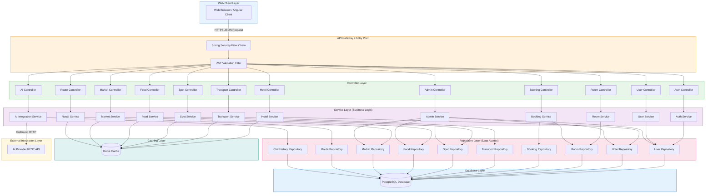
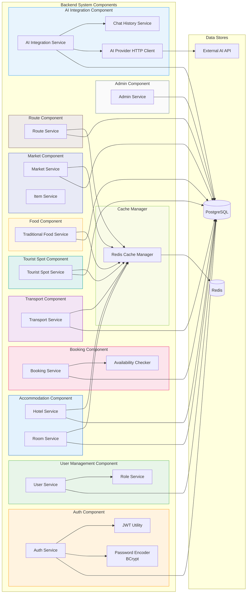
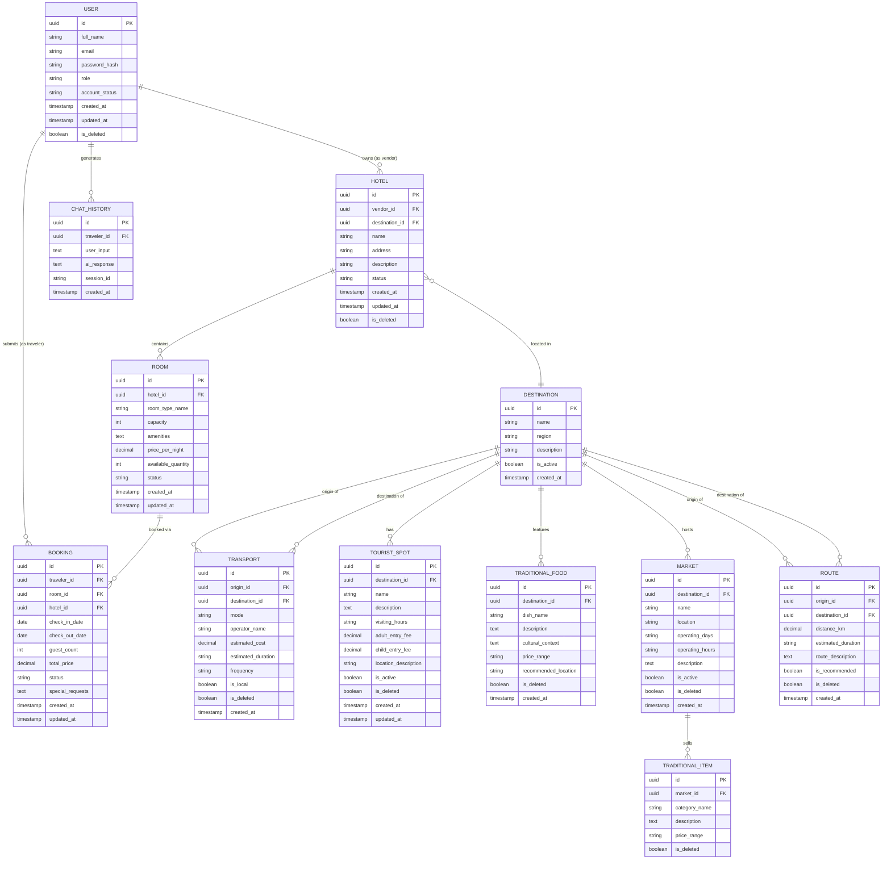
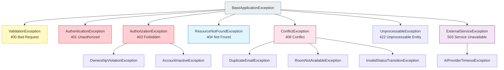
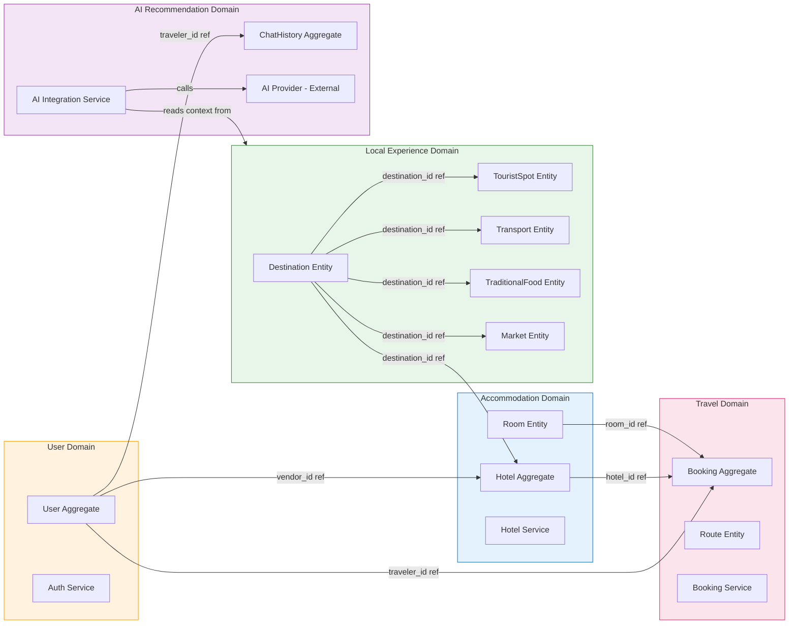

# Backend Software Requirements Specification (SRS)
# AI Powered Traveling Management System

---

| **Document Information**        |                                                             |
|--------------------------------|-------------------------------------------------------------|
| **Project Title**              | AI Powered Traveling Management System                      |
| **Document Type**              | Backend Software Requirements Specification (SRS)           |
| **Standard**                   | IEEE 830 / ISO 29148                                        |
| **Version**                    | 1.0                                                         |
| **Prepared By**                | Software Architecture & Backend Analysis Team               |
| **Document Status**            | Final                                                       |
| **Date**                       | February 28, 2026                                           |
| **Technology Stack**           | Java 25 · Spring Boot · Spring Security · JPA/Hibernate · PostgreSQL · Redis · JWT |

---

## Table of Contents

1. [Introduction](#1-introduction)
2. [Overall Description](#2-overall-description)
3. [System Architecture](#3-system-architecture)
4. [Functional Requirements](#4-functional-requirements)
5. [External Interface Requirements](#5-external-interface-requirements)
6. [Database Requirements](#6-database-requirements)
7. [Non-Functional Requirements](#7-non-functional-requirements)
8. [Security Requirements](#8-security-requirements)
9. [Error Handling](#9-error-handling)
10. [Use Case Model](#10-use-case-model)
11. [Domain Model (DDD)](#11-domain-model-ddd)
12. [Future Backend Enhancements](#12-future-backend-enhancements)

---

## 1. Introduction

### 1.1 Purpose

This Software Requirements Specification (SRS) document defines the complete backend system requirements for the **AI Powered Traveling Management System**. It is prepared in accordance with the IEEE 830 standard and ISO/IEC/IEEE 29148:2018 guidelines for systems and software engineering requirements.

The purpose of this document is to provide a clear, complete, and unambiguous specification of the backend system's functional behavior, data architecture, security model, performance expectations, and integration interfaces. This document serves as the authoritative technical reference for backend architects, software engineers, database administrators, quality assurance engineers, and academic reviewers involved with this project.

The document focuses exclusively on backend system design and implementation requirements. It does not address frontend presentation, UI/UX design, or client-side behavior.

### 1.2 Scope

The **AI Powered Traveling Management System** is a web-based travel planning platform whose backend system is responsible for all data processing, business logic execution, secure API service delivery, and external service integration. The backend serves three classes of users — Traveler, Vendor, and Admin — each with distinct roles and access permissions.

The backend system encompasses the following capability domains:

- Secure user authentication and role-based authorization using JWT
- User account lifecycle management for all roles
- Hotel and room listing management with vendor ownership enforcement
- Booking lifecycle management from request through confirmation or cancellation
- Transport information storage and retrieval
- Tourist spot directory management
- Traditional food and cultural market data management
- Route and travel time information management
- AI chatbot integration for personalized travel planning
- Comprehensive administrative management across all platform entities

The system is built on Java 25, Spring Boot, Spring Security, JPA/Hibernate, PostgreSQL, and Redis, and exposes all functionality through a RESTful API layer consumed by the web-based frontend client.

### 1.3 Definitions and Acronyms

| **Term / Acronym** | **Definition** |
|---|---|
| SRS | Software Requirements Specification |
| API | Application Programming Interface |
| REST | Representational State Transfer |
| JWT | JSON Web Token — a compact, URL-safe token format used for stateless authentication |
| RBAC | Role-Based Access Control — access control model based on assigned user roles |
| JPA | Java Persistence API — specification for ORM in Java |
| ORM | Object-Relational Mapping — technique for mapping Java objects to relational database tables |
| CRUD | Create, Read, Update, Delete — the four basic database operations |
| DTOs | Data Transfer Objects — objects used to transfer data between layers without exposing entities |
| BCrypt | Adaptive hashing function used for secure password storage |
| Redis | Remote Dictionary Server — an in-memory data structure store used as a caching layer |
| TTL | Time-To-Live — the duration for which a cached entry remains valid |
| FR | Functional Requirement |
| NFR | Non-Functional Requirement |
| DDD | Domain-Driven Design — software design approach organizing code around business domains |
| HTTP | HyperText Transfer Protocol |
| JSON | JavaScript Object Notation — lightweight data-interchange format |
| UUID | Universally Unique Identifier |
| AI | Artificial Intelligence |
| SLA | Service Level Agreement |
| WCAG | Web Content Accessibility Guidelines |

### 1.4 Document Overview

This document is organized into twelve major sections following the IEEE 830 structure. Section 1 introduces the document and its purpose. Section 2 provides an overall description of the backend system. Section 3 defines the system architecture including Mermaid diagrams. Section 4 specifies detailed functional requirements per module. Section 5 describes external interface requirements including REST API groups. Section 6 defines database requirements and the ER diagram. Section 7 details non-functional requirements. Section 8 addresses security requirements. Section 9 covers error handling standards. Section 10 presents the use case model. Section 11 defines the Domain-Driven Design model. Section 12 outlines future backend enhancements.

---

## 2. Overall Description

### 2.1 Product Perspective

The backend system of the AI Powered Traveling Management System is an independent, RESTful API server that constitutes the authoritative processing and data layer of the overall platform. It operates as the middle tier in a three-tier web application architecture: the web client (frontend) communicates with the backend through HTTP requests; the backend processes business logic and communicates with its data stores (PostgreSQL and Redis) and external services (AI provider).

The backend is a stateless service — it maintains no server-side session state between requests. All authentication context is carried within the signed JWT token submitted by the client on each protected request. This stateless design makes the backend horizontally scalable and simplifies load distribution as user volume grows.

The backend's responsibilities include enforcing all business rules, validating all incoming data, managing all database interactions, orchestrating the AI service integration, and returning structured JSON responses to the consuming client. It has no awareness of or dependency on how the client renders the data it receives.

### 2.2 Product Functions

The backend system delivers the following high-level functional capabilities.

- **Authentication and Authorization:** Secure user registration, login, JWT generation, token validation, and role-based access enforcement across all protected endpoints.
- **User Management:** Profile management, account status control, and role administration for Traveler, Vendor, and Admin accounts.
- **Hotel and Room Management:** Full CRUD operations for hotel listings and room types, including vendor ownership validation, availability tracking, and pricing management.
- **Booking Management:** Real-time availability checking, booking record lifecycle management (Pending → Confirmed / Declined / Cancelled), and booking history retrieval.
- **Transport Information:** Storage and retrieval of intercity and local transport data including cost, schedule, and mode information.
- **Tourist Spot Management:** Admin-managed directory of tourist attractions with entry fees and visiting information.
- **Traditional Food Management:** Location-based food records with cultural context and pricing information.
- **Market and Cultural Items Management:** Cultural market directories and traditional item records by destination.
- **Route Management:** Distance and travel time data between destinations.
- **AI Chat Integration:** Receiving travel planning inputs, communicating with the external AI provider, persisting chat history, and returning personalized recommendations.
- **Admin Management:** Centralized control over all platform entities, vendor approvals, content moderation, and platform activity oversight.

### 2.3 User Classes and Characteristics

From a backend interaction perspective, the three user classes interact with the system through authenticated API requests as follows.

**Traveler:** A registered end-user who consumes travel information and planning services. Travelers authenticate to access personalized features — AI chat, hotel search, booking submission, and content browsing. They have read access to all public content and write access limited to their own profile, bookings, and AI chat interactions. Travelers are the highest-volume users and generate the majority of read requests to the system.

**Vendor:** A registered business entity representing a hotel or service provider. Vendors are subject to admin approval before gaining full access. Upon approval, vendors have write access to their own hotel and room records, and read/write access to booking requests associated with their properties. Vendors generate moderate volumes of write requests during listing management and booking management activities.

**Admin:** A platform operator with unrestricted access across all system entities. Admins manage user and vendor accounts, approve vendor registrations, manage all content categories, and monitor platform activity. Admins generate lower volumes of requests but require access to the broadest range of data and operations.

### 2.4 Operating Environment

The backend system operates within the following technical environment.

| **Component** | **Technology / Version** | **Role** |
|---|---|---|
| Programming Language | Java 25 (JDK 25) | Core application language |
| Application Framework | Spring Boot 3.x | Application configuration, embedded server, auto-configuration |
| Security Framework | Spring Security 6.x | Authentication filter chain, authorization enforcement |
| ORM Framework | JPA 3.x with Hibernate 6.x | Object-relational mapping and database interaction |
| Primary Database | PostgreSQL 16.x | Persistent relational data storage |
| Caching Layer | Redis 7.x | In-memory caching for high-frequency read data |
| Authentication | JWT (JSON Web Tokens) | Stateless, token-based authentication |
| Build Tool | Apache Maven or Gradle | Dependency management and build lifecycle |
| API Style | RESTful HTTP/HTTPS | Client-server communication protocol |
| Data Exchange Format | JSON | Request and response payload format |

### 2.5 Assumptions and Dependencies

**Assumptions:**

1. All API consumers are web-based clients that communicate with the backend over HTTPS.
2. The external AI provider exposes a stable, documented REST API endpoint that the backend calls to fulfill travel planning requests.
3. The PostgreSQL database instance is pre-configured with the required schemas before application startup.
4. Redis is available as a networked cache service accessible by the backend application.
5. The JWT signing secret is stored securely in environment-specific configuration and is not committed to version control.
6. Vendors are assumed to maintain the accuracy of their own listing data; the backend enforces business rules but cannot automatically verify the truthfulness of vendor-submitted content.
7. The system operates with a single AI provider in this phase; no failover to an alternative provider is implemented.

**Dependencies:**

1. The backend system depends on the availability of the PostgreSQL database for all persistent data operations.
2. The AI integration service depends on the external AI provider's API being available and responsive within the defined timeout window.
3. The Redis caching layer is a non-critical dependency — the system must degrade gracefully to direct database reads if Redis is temporarily unavailable.
4. JWT token validation depends on the consistency of the signing key across all backend instances.

---

## 3. System Architecture

### 3.1 Layered Architecture Description

The backend system is organized into five horizontal layers, each with clearly defined responsibilities and boundaries. No layer should bypass its adjacent layer to access functionality from a non-adjacent layer.

#### Controller Layer (Presentation / API Layer)
The Controller Layer is the topmost backend layer. It receives all incoming HTTP requests, extracts request parameters and body payloads, delegates processing to the appropriate Service Layer component, and formats the service response into a structured JSON HTTP response. Controllers are responsible for request routing, initial DTO validation (via Spring Validation annotations), and HTTP status code selection. Controllers contain no business logic.

#### Service Layer (Business Logic Layer)
The Service Layer owns all business logic and orchestration. It receives validated inputs from the Controller Layer, applies business rules, invokes one or more Repository Layer components for data access, and returns processed results to the controller. The Service Layer is also responsible for transaction management, cache interaction (Redis), and external service calls (AI provider). This layer is where all domain rules — such as vendor ownership validation, booking availability checks, and role permission enforcement — are implemented.

#### Repository Layer (Data Access Layer)
The Repository Layer abstracts all database interaction. It is implemented using Spring Data JPA repositories which extend standard CRUD interfaces and support custom JPQL queries. The Repository Layer is the only layer that communicates with the database. It returns JPA entity objects to the Service Layer, which maps them to DTOs before returning them to the Controller Layer.

#### Database Layer
The Database Layer consists of the PostgreSQL relational database and the Redis in-memory cache. PostgreSQL is the authoritative data store for all persistent platform data. Redis is used as a read-through cache for frequently accessed, infrequently changing data. The database schema is managed through Hibernate's schema validation or a migration tool such as Flyway.

#### External Integration Layer
The External Integration Layer encapsulates all outbound communication with external services — specifically the AI provider REST API. This layer is implemented as a dedicated integration component within the Service Layer, using Spring's `RestTemplate` or `WebClient` for HTTP communication. It handles request formatting, response parsing, timeout enforcement, and error handling for all external service calls.

---

### 3.2 Backend Architecture Diagram



---

### 3.3 Component Diagram



---

## 4. Functional Requirements

Each functional requirement follows the format: **ID, Description, Actors, Preconditions, Main Flow, Alternative Flow, Postconditions**.

---

### 4.1 Authentication Module

---

**FR-BE-01: User Registration**

| Field | Detail |
|---|---|
| **ID** | FR-BE-01 |
| **Description** | The system shall allow new users to self-register by providing their full name, email address, password, and intended role. |
| **Actors** | Unregistered User (Traveler or Vendor applicant) |
| **Preconditions** | The user does not have an existing account with the provided email address. |
| **Main Flow** | 1. User submits a registration request with name, email, password, and role. 2. System validates all fields for completeness and format. 3. System verifies the email is not already registered. 4. System hashes the password using BCrypt. 5. System persists the new user record. Vendor accounts are assigned Pending Approval status. 6. System returns a 201 Created response. |
| **Alternative Flow** | If the email already exists, the system returns a 409 Conflict response. If any required field is missing or invalid, the system returns a 400 Bad Request response. |
| **Postconditions** | A new user record exists in the database. Vendor accounts remain inactive pending admin approval. |

---

**FR-BE-02: User Login and JWT Generation**

| Field | Detail |
|---|---|
| **ID** | FR-BE-02 |
| **Description** | The system shall authenticate users via email and password and return a signed JWT access token upon success. |
| **Actors** | Registered User (Traveler, Vendor, Admin) |
| **Preconditions** | The user has an active registered account. |
| **Main Flow** | 1. User submits login request with email and password. 2. System retrieves user record by email. 3. System verifies the submitted password against the stored BCrypt hash. 4. System checks that the account status is Active or Approved. 5. System generates a signed JWT containing user ID, role, and expiry. 6. System returns the JWT access token and user role in the response body. |
| **Alternative Flow** | If the email does not exist or the password does not match, the system returns 401 Unauthorized. If the account is Suspended or Pending, the system returns 403 Forbidden with an appropriate message. |
| **Postconditions** | The client holds a valid JWT for use in subsequent authenticated requests. |

---

**FR-BE-03: JWT Token Validation**

| Field | Detail |
|---|---|
| **ID** | FR-BE-03 |
| **Description** | The system shall validate the JWT token on every request to a protected endpoint before any service logic is executed. |
| **Actors** | System (Spring Security Filter) |
| **Preconditions** | A request to a protected endpoint has been received. |
| **Main Flow** | 1. The JWT filter intercepts the incoming request. 2. The filter extracts the token from the Authorization: Bearer header. 3. The filter verifies the token signature using the configured signing secret. 4. The filter checks the token's expiry timestamp. 5. The filter extracts the user ID and role and populates the Spring Security context. 6. The request proceeds to the controller. |
| **Alternative Flow** | If the header is absent, the token is malformed, the signature is invalid, or the token is expired, the filter returns 401 Unauthorized and the request does not reach the controller. |
| **Postconditions** | The Security Context holds the authenticated user's identity and role for use by the service layer. |

---

### 4.2 User Management Module

---

**FR-BE-04: Retrieve Own Profile**

| Field | Detail |
|---|---|
| **ID** | FR-BE-04 |
| **Description** | The system shall allow any authenticated user to retrieve their own profile information. |
| **Actors** | Traveler, Vendor, Admin |
| **Preconditions** | User is authenticated with a valid JWT. |
| **Main Flow** | 1. User sends GET request to `/users/me`. 2. System extracts user ID from JWT Security Context. 3. System retrieves the user entity from the database. 4. System maps the entity to a Profile DTO (excluding password). 5. System returns 200 OK with the profile DTO. |
| **Alternative Flow** | If the user ID in the token does not match any user record, the system returns 404 Not Found. |
| **Postconditions** | User profile data (excluding password hash) is returned. |

---

**FR-BE-05: Update Own Profile**

| Field | Detail |
|---|---|
| **ID** | FR-BE-05 |
| **Description** | The system shall allow authenticated users to update their own profile fields (name, contact). Users shall not be able to change their role or email through this endpoint. |
| **Actors** | Traveler, Vendor, Admin |
| **Preconditions** | User is authenticated. |
| **Main Flow** | 1. User submits PUT request to `/users/me` with updated fields. 2. System validates the request body. 3. System updates only permitted fields on the user entity. 4. System persists the updated record with an updated `updated_at` timestamp. 5. System returns 200 OK with the updated profile DTO. |
| **Alternative Flow** | If validation fails, system returns 400 Bad Request. |
| **Postconditions** | User record is updated in the database. |

---

**FR-BE-06: Admin — Manage User Accounts**

| Field | Detail |
|---|---|
| **ID** | FR-BE-06 |
| **Description** | The system shall allow Admin users to list, view, and change the status of any user account. |
| **Actors** | Admin |
| **Preconditions** | Requester is authenticated with ADMIN role. |
| **Main Flow** | 1. Admin sends GET `/users` with optional filters (role, status). 2. System returns paginated list of user profiles. 3. Admin sends PATCH `/users/{id}/status` with new status value. 4. System validates the target account exists. 5. System updates the account status and persists the change. 6. System returns 200 OK. |
| **Alternative Flow** | If the target user ID does not exist, the system returns 404 Not Found. Non-admin requests are rejected with 403 Forbidden. |
| **Postconditions** | Target user account status is updated. If status is Suspended or Deactivated, subsequent login attempts by that user are rejected. |

---

### 4.3 Hotel and Room Management Module

---

**FR-BE-07: Create Hotel Listing**

| Field | Detail |
|---|---|
| **ID** | FR-BE-07 |
| **Description** | The system shall allow an approved Vendor to create a hotel listing associated with their account. |
| **Actors** | Vendor |
| **Preconditions** | Requesting Vendor account is authenticated and has Approved status. |
| **Main Flow** | 1. Vendor submits POST `/hotels` with hotel data. 2. System validates all required fields. 3. System links the hotel record to the authenticated vendor's ID. 4. System sets the hotel status to Active. 5. System persists the record and invalidates any affected hotel-search cache entries. 6. System returns 201 Created with the hotel ID. |
| **Alternative Flow** | If the vendor account is Pending or Suspended, the system returns 403 Forbidden. |
| **Postconditions** | Hotel record exists in the database, linked to the vendor. |

---

**FR-BE-08: Vendor Ownership Validation**

| Field | Detail |
|---|---|
| **ID** | FR-BE-08 |
| **Description** | The system shall enforce that all write operations on a hotel or room record can only be performed by the vendor who owns that record, or by an Admin. |
| **Actors** | Vendor, Admin |
| **Preconditions** | An update or delete request has been received for a hotel or room entity. |
| **Main Flow** | 1. System extracts the requesting user's ID and role from the JWT. 2. System retrieves the target hotel or room record. 3. System compares the record's `vendor_id` field with the requesting user's ID. 4. If they match (or if the requester is Admin), the operation proceeds. |
| **Alternative Flow** | If the IDs do not match and the requester is not Admin, the system returns 403 Forbidden. |
| **Postconditions** | The requested operation is either executed or rejected based on ownership validation. |

---

**FR-BE-09: Search Hotels**

| Field | Detail |
|---|---|
| **ID** | FR-BE-09 |
| **Description** | The system shall allow any authenticated user to search for hotels by destination and price range, returning only Active hotels belonging to Approved vendors. |
| **Actors** | Traveler, Vendor, Admin |
| **Preconditions** | User is authenticated. |
| **Main Flow** | 1. User sends GET `/hotels` with query parameters (destination, minPrice, maxPrice). 2. System checks Redis cache for a matching cached result. 3. If cache miss: System queries the database with Active status and Approved vendor filters applied. 4. System caches the result in Redis with a defined TTL. 5. System returns the hotel list. |
| **Alternative Flow** | If no hotels match the filters, an empty list is returned with 200 OK. |
| **Postconditions** | Hotel search results are returned from cache or database. |

---

**FR-BE-10: Room Management**

| Field | Detail |
|---|---|
| **ID** | FR-BE-10 |
| **Description** | The system shall allow vendors to create, update, and deactivate room type records under their hotel listings, with validation of all pricing and capacity values. |
| **Actors** | Vendor |
| **Preconditions** | Vendor is authenticated and approved; the target hotel belongs to the vendor. |
| **Main Flow** | 1. Vendor submits POST `/rooms` or PUT `/rooms/{id}` with room data. 2. System validates ownership of the parent hotel. 3. System validates pricing is positive and non-zero. 4. System persists or updates the room record. 5. System returns 201 Created or 200 OK. |
| **Alternative Flow** | Ownership validation failure returns 403 Forbidden. Invalid pricing returns 400 Bad Request. |
| **Postconditions** | Room record is created or updated in the database. |

---

### 4.4 Booking Module

---

**FR-BE-11: Submit Booking Request**

| Field | Detail |
|---|---|
| **ID** | FR-BE-11 |
| **Description** | The system shall allow an authenticated Traveler to submit a booking request for a room, subject to real-time availability verification. |
| **Actors** | Traveler |
| **Preconditions** | Traveler is authenticated. The target hotel is Active and belongs to an Approved vendor. |
| **Main Flow** | 1. Traveler submits POST `/bookings` with room ID, check-in date, check-out date, and guest count. 2. System validates date logic (check-out > check-in; check-in ≥ today). 3. System checks available quantity of the room type for the requested dates within a database transaction. 4. System calculates total price (room price × number of nights). 5. System creates booking record with status PENDING. 6. System returns 201 Created with booking ID and summary. |
| **Alternative Flow** | If the room has insufficient availability, the system returns 409 Conflict with a "Room Not Available" message. If date validation fails, system returns 400 Bad Request. |
| **Postconditions** | A PENDING booking record exists in the database. Room availability is not yet decremented. |

---

**FR-BE-12: Vendor Booking Confirmation**

| Field | Detail |
|---|---|
| **ID** | FR-BE-12 |
| **Description** | The system shall allow a Vendor to confirm or decline a PENDING booking request for their property within a transactional operation. |
| **Actors** | Vendor |
| **Preconditions** | Vendor is authenticated. The booking is in PENDING status and belongs to the vendor's property. |
| **Main Flow** | 1. Vendor sends PATCH `/bookings/{id}/confirm` or `/bookings/{id}/decline`. 2. System validates the booking belongs to the vendor's property. 3. On Confirm: System sets booking status to CONFIRMED and decrements the room's available quantity within a single transaction. 4. On Decline: System sets booking status to DECLINED. No availability change. 5. System records the status change with a timestamp. 6. System returns 200 OK. |
| **Alternative Flow** | If the booking ID does not belong to the vendor's property, 403 Forbidden is returned. If the booking is not in PENDING status, 409 Conflict is returned. |
| **Postconditions** | Booking status is updated to CONFIRMED or DECLINED. Room availability is decremented only on CONFIRMED transition. |

---

**FR-BE-13: Booking Cancellation**

| Field | Detail |
|---|---|
| **ID** | FR-BE-13 |
| **Description** | The system shall allow a Traveler to cancel a CONFIRMED booking, restoring the room availability upon successful cancellation. |
| **Actors** | Traveler |
| **Preconditions** | Traveler is authenticated. The booking is in CONFIRMED status and belongs to the requesting traveler. |
| **Main Flow** | 1. Traveler sends PATCH `/bookings/{id}/cancel`. 2. System validates the booking belongs to the traveler. 3. System validates the cancellation is within the defined cancellation window. 4. System sets booking status to CANCELLED and restores the room's available quantity within a single transaction. 5. System returns 200 OK. |
| **Alternative Flow** | If the cancellation window has passed, the system returns 422 Unprocessable Entity with a cancellation policy message. |
| **Postconditions** | Booking status is CANCELLED. Room available quantity is restored. |

---

### 4.5 Transport Module

**FR-BE-14: Retrieve Transport Options**

| Field | Detail |
|---|---|
| **ID** | FR-BE-14 |
| **Description** | The system shall allow authenticated users to retrieve available transport options for a given origin-destination pair, with optional filtering by transport mode. |
| **Actors** | Traveler, Vendor, Admin |
| **Preconditions** | User is authenticated. |
| **Main Flow** | 1. User sends GET `/transport?origin={id}&destination={id}&mode={mode}`. 2. System checks Redis cache for matching transport data. 3. On cache miss: System queries the database with provided filters. 4. System caches the result. 5. System returns the list of transport records. |
| **Alternative Flow** | If no records match, an empty list is returned. Admin write operations (POST, PUT, DELETE) bypass cache and invalidate cached entries on execution. |
| **Postconditions** | Transport data is returned from cache or database. |

---

### 4.6 Tourist Spot Module

**FR-BE-15: Tourist Spot Management**

| Field | Detail |
|---|---|
| **ID** | FR-BE-15 |
| **Description** | The system shall allow Admin users to create, update, and soft-delete tourist spot records. All users may retrieve Active spots filtered by destination. |
| **Actors** | Admin (write); Traveler, Vendor (read) |
| **Preconditions** | For write operations: requester is authenticated with ADMIN role. |
| **Main Flow** | 1. Admin sends POST/PUT `/spots` with spot data. 2. System validates all required fields including entry fee structure. 3. System persists the record (or updates with audit timestamp). 4. For soft-delete: System sets `is_deleted = true` and records `deleted_at`. 5. Read requests return only Active, non-deleted spots filtered by destination. 6. Cache is invalidated on any admin write operation. |
| **Alternative Flow** | Non-admin write requests return 403 Forbidden. |
| **Postconditions** | Spot record is created, updated, or soft-deleted. Read responses exclude inactive records. |

---

### 4.7 Traditional Food Module

**FR-BE-16: Food Data Management**

| Field | Detail |
|---|---|
| **ID** | FR-BE-16 |
| **Description** | The system shall allow Admin users to manage traditional food records by destination. All authenticated users may retrieve food records filtered by destination. |
| **Actors** | Admin (write); Traveler, Vendor (read) |
| **Preconditions** | Authentication required for all operations. Admin role required for write operations. |
| **Main Flow** | 1. Admin submits POST/PUT `/foods` with food record data including destination ID, dish name, description, cultural context, price range, and recommended location. 2. System validates all fields and the destination reference. 3. System persists the record. 4. Read requests return food records filtered by destination ID, excluding soft-deleted records. |
| **Alternative Flow** | Invalid destination reference returns 400 Bad Request. Non-admin write requests return 403 Forbidden. |
| **Postconditions** | Food record is persisted. Read responses are destination-scoped and exclude deleted records. |

---

### 4.8 Markets and Items Module

**FR-BE-17: Market and Cultural Item Management**

| Field | Detail |
|---|---|
| **ID** | FR-BE-17 |
| **Description** | The system shall allow Admin users to manage cultural market records and associated traditional item data. Authenticated users may retrieve market data by destination. |
| **Actors** | Admin (write); Traveler, Vendor (read) |
| **Preconditions** | Authentication required. Admin role for write operations. |
| **Main Flow** | 1. Admin submits POST `/markets` with market details (name, destination, location, schedule, description). 2. Admin submits POST `/markets/{id}/items` with item category data. 3. System validates inputs and destination reference. 4. System persists records. 5. Read requests return all Active markets and their items filtered by destination. |
| **Alternative Flow** | Non-admin write attempts return 403 Forbidden. |
| **Postconditions** | Market and item records are created or updated in the database. |

---

### 4.9 Route Management Module

**FR-BE-18: Route Data Management**

| Field | Detail |
|---|---|
| **ID** | FR-BE-18 |
| **Description** | The system shall store route records defining origin, destination, distance, estimated travel time, and route description. All authenticated users may query route data by origin-destination pair. |
| **Actors** | Admin (write); Traveler, Vendor (read) |
| **Preconditions** | Authentication required. Both origin and destination must reference valid, active destination records. |
| **Main Flow** | 1. Admin submits POST `/routes` with origin, destination, distance, travel time, and description. 2. System validates that both origin and destination exist as active records. 3. System persists the route record. 4. Read requests accept `origin` and `destination` query parameters and return all matching route options. 5. If multiple routes exist, all are returned with the recommended option flagged. |
| **Alternative Flow** | Invalid destination references return 400 Bad Request. |
| **Postconditions** | Route record is persisted. Read responses return all applicable route options for the query pair. |

---

### 4.10 AI Chat Service Module

**FR-BE-19: Submit AI Travel Planning Request**

| Field | Detail |
|---|---|
| **ID** | FR-BE-19 |
| **Description** | The system shall accept a travel planning request from an authenticated Traveler, enrich it with platform content, forward it to the external AI provider, persist the interaction, and return the AI-generated travel plan. |
| **Actors** | Traveler |
| **Preconditions** | Traveler is authenticated. |
| **Main Flow** | 1. Traveler submits POST `/ai/chat` with budget, destination preference, duration, group size, and interests. 2. System validates all required fields. 3. System retrieves relevant contextual data from the content library (destinations, spots, transport). 4. System formats the enriched payload for the AI provider API. 5. System sends the request to the AI provider with a configured timeout. 6. System receives and parses the AI response. 7. System persists the interaction (input + response) as a ChatHistory record linked to the traveler. 8. System returns the AI response in the standard response format. |
| **Alternative Flow** | If the AI provider does not respond within the timeout, the system returns 503 Service Unavailable. If validation fails, system returns 400 Bad Request. |
| **Postconditions** | ChatHistory record is persisted. AI response is returned to the traveler. |

---

**FR-BE-20: Retrieve AI Chat History**

| Field | Detail |
|---|---|
| **ID** | FR-BE-20 |
| **Description** | The system shall allow authenticated Travelers to retrieve their own AI chat interaction history. Admins may access the full interaction log. |
| **Actors** | Traveler (own history); Admin (all) |
| **Preconditions** | User is authenticated. |
| **Main Flow** | 1. User sends GET `/ai/history`. 2. For Traveler: System returns all ChatHistory records linked to the traveler's ID, ordered by timestamp descending. 3. For Admin: System returns paginated ChatHistory records across all users. |
| **Postconditions** | Chat history records are returned. |

---

### 4.11 Admin Management Module

**FR-BE-21: Vendor Approval**

| Field | Detail |
|---|---|
| **ID** | FR-BE-21 |
| **Description** | The system shall allow Admin users to approve or reject pending vendor registration applications. |
| **Actors** | Admin |
| **Preconditions** | Admin is authenticated. Target vendor account is in Pending status. |
| **Main Flow** | 1. Admin sends PATCH `/admin/vendors/{id}/approve` or `/admin/vendors/{id}/reject`. 2. For Approve: System sets vendor account status to Approved and records approval timestamp. 3. For Reject: System sets vendor account status to Rejected, records rejection timestamp, and stores the rejection reason. 4. System returns 200 OK. |
| **Alternative Flow** | If the vendor ID does not exist, 404 Not Found is returned. If the account is not in Pending status, 409 Conflict is returned. |
| **Postconditions** | Vendor account status is updated to Approved or Rejected. Approved vendors gain full access to vendor-scoped endpoints. |

---

## 5. External Interface Requirements

### 5.1 REST API Groups

All API endpoints return responses in JSON format. All protected endpoints require a valid JWT in the `Authorization: Bearer {token}` header.

---

#### `/auth` — Authentication Endpoints

| **Method** | **Endpoint** | **Description** | **Access** |
|---|---|---|---|
| POST | `/auth/register` | Register a new Traveler or Vendor account | Public |
| POST | `/auth/login` | Authenticate and receive JWT token | Public |
| POST | `/auth/refresh` | Refresh an existing valid JWT token | Authenticated |

**Sample Registration Request:**
```json
POST /auth/register
{
  "fullName": "Arif Rahman",
  "email": "arif@example.com",
  "password": "SecurePass123",
  "role": "TRAVELER"
}
```
**Sample Registration Response:**
```json
HTTP 201 Created
{
  "message": "Registration successful.",
  "userId": "a1b2c3d4-e5f6-7890-abcd-ef1234567890",
  "role": "TRAVELER"
}
```

**Sample Login Request:**
```json
POST /auth/login
{
  "email": "arif@example.com",
  "password": "SecurePass123"
}
```
**Sample Login Response:**
```json
HTTP 200 OK
{
  "accessToken": "eyJhbGciOiJIUzI1NiIsInR5cCI6IkpXVCJ9...",
  "tokenType": "Bearer",
  "expiresIn": 3600,
  "role": "TRAVELER"
}
```

---

#### `/users` — User Management Endpoints

| **Method** | **Endpoint** | **Description** | **Access** |
|---|---|---|---|
| GET | `/users/me` | Retrieve own profile | Authenticated |
| PUT | `/users/me` | Update own profile | Authenticated |
| GET | `/users` | List all users with filters | Admin |
| PATCH | `/users/{id}/status` | Change user account status | Admin |

---

#### `/hotels` — Hotel Endpoints

| **Method** | **Endpoint** | **Description** | **Access** |
|---|---|---|---|
| GET | `/hotels` | Search hotels by destination and price | Authenticated |
| POST | `/hotels` | Create a new hotel listing | Vendor (Approved) |
| GET | `/hotels/{id}` | Get hotel details | Authenticated |
| PUT | `/hotels/{id}` | Update hotel details | Vendor (owner), Admin |
| PATCH | `/hotels/{id}/status` | Activate or deactivate a hotel | Vendor (owner), Admin |

**Sample Hotel Search Response:**
```json
HTTP 200 OK
{
  "totalResults": 3,
  "hotels": [
    {
      "hotelId": "uuid-here",
      "name": "Hotel Sunrise",
      "destination": "Dhaka",
      "startingPrice": 2500.00,
      "currency": "BDT",
      "status": "ACTIVE"
    }
  ]
}
```

---

#### `/rooms` — Room Endpoints

| **Method** | **Endpoint** | **Description** | **Access** |
|---|---|---|---|
| GET | `/rooms?hotelId={id}` | List rooms for a hotel | Authenticated |
| POST | `/rooms` | Add a room type to a hotel | Vendor (owner) |
| PUT | `/rooms/{id}` | Update room type details | Vendor (owner), Admin |
| PATCH | `/rooms/{id}/price` | Update room price | Vendor (owner) |
| PATCH | `/rooms/{id}/status` | Activate or deactivate a room | Vendor (owner), Admin |

---

#### `/bookings` — Booking Endpoints

| **Method** | **Endpoint** | **Description** | **Access** |
|---|---|---|---|
| POST | `/bookings` | Submit a new booking request | Traveler |
| GET | `/bookings/my` | Retrieve own booking history | Traveler |
| GET | `/bookings/vendor` | Retrieve bookings for vendor's properties | Vendor |
| PATCH | `/bookings/{id}/confirm` | Confirm a booking request | Vendor (property owner) |
| PATCH | `/bookings/{id}/decline` | Decline a booking request | Vendor (property owner) |
| PATCH | `/bookings/{id}/cancel` | Cancel a confirmed booking | Traveler (booking owner) |
| GET | `/bookings` | Retrieve all bookings | Admin |

**Sample Booking Request:**
```json
POST /bookings
{
  "roomId": "room-uuid-here",
  "checkInDate": "2026-04-10",
  "checkOutDate": "2026-04-14",
  "guestCount": 2,
  "specialRequests": "Late check-in requested."
}
```
**Sample Booking Response:**
```json
HTTP 201 Created
{
  "bookingId": "booking-uuid",
  "status": "PENDING",
  "hotelName": "Hotel Sunrise",
  "roomType": "Deluxe Double",
  "checkIn": "2026-04-10",
  "checkOut": "2026-04-14",
  "nights": 4,
  "totalPrice": 10000.00,
  "currency": "BDT"
}
```

---

#### `/transport` — Transport Endpoints

| **Method** | **Endpoint** | **Description** | **Access** |
|---|---|---|---|
| GET | `/transport` | Get transport options by origin and destination | Authenticated |
| POST | `/transport` | Create transport record | Admin |
| PUT | `/transport/{id}` | Update transport record | Admin |
| DELETE | `/transport/{id}` | Soft-delete transport record | Admin |

---

#### `/spots` — Tourist Spot Endpoints

| **Method** | **Endpoint** | **Description** | **Access** |
|---|---|---|---|
| GET | `/spots?destinationId={id}` | Get tourist spots by destination | Authenticated |
| GET | `/spots/{id}` | Get tourist spot details | Authenticated |
| POST | `/spots` | Create tourist spot | Admin |
| PUT | `/spots/{id}` | Update tourist spot | Admin |
| DELETE | `/spots/{id}` | Soft-delete tourist spot | Admin |

---

#### `/foods` — Traditional Food Endpoints

| **Method** | **Endpoint** | **Description** | **Access** |
|---|---|---|---|
| GET | `/foods?destinationId={id}` | Get food records by destination | Authenticated |
| POST | `/foods` | Create food record | Admin |
| PUT | `/foods/{id}` | Update food record | Admin |
| DELETE | `/foods/{id}` | Soft-delete food record | Admin |

---

#### `/markets` — Market and Item Endpoints

| **Method** | **Endpoint** | **Description** | **Access** |
|---|---|---|---|
| GET | `/markets?destinationId={id}` | Get markets by destination | Authenticated |
| POST | `/markets` | Create market record | Admin |
| PUT | `/markets/{id}` | Update market record | Admin |
| POST | `/markets/{id}/items` | Add traditional item to market | Admin |
| PUT | `/markets/{id}/items/{itemId}` | Update traditional item | Admin |

---

#### `/routes` — Route Endpoints

| **Method** | **Endpoint** | **Description** | **Access** |
|---|---|---|---|
| GET | `/routes?origin={id}&destination={id}` | Get routes between two destinations | Authenticated |
| POST | `/routes` | Create route record | Admin |
| PUT | `/routes/{id}` | Update route record | Admin |
| DELETE | `/routes/{id}` | Soft-delete route record | Admin |

---

#### `/ai` — AI Chat Endpoints

| **Method** | **Endpoint** | **Description** | **Access** |
|---|---|---|---|
| POST | `/ai/chat` | Submit travel planning request to AI | Traveler |
| GET | `/ai/history` | Retrieve own AI chat history | Traveler |
| GET | `/ai/history/all` | Retrieve all AI chat interactions | Admin |

**Sample AI Chat Request:**
```json
POST /ai/chat
{
  "budget": 15000,
  "currency": "BDT",
  "destinationPreference": "Cox's Bazar",
  "tripDurationDays": 3,
  "groupSize": 2,
  "interests": ["beach", "seafood", "cultural markets"]
}
```
**Sample AI Chat Response:**
```json
HTTP 200 OK
{
  "sessionId": "chat-session-uuid",
  "recommendation": {
    "destination": "Cox's Bazar",
    "summary": "A 3-day coastal retreat ideal for two travelers...",
    "suggestedHotels": ["Hotel Sea Pearl", "Long Beach Hotel"],
    "suggestedSpots": ["Laboni Beach", "Himchari National Park"],
    "estimatedDailyCost": 4500,
    "transportNote": "Direct AC bus from Dhaka — approximately 10 hours, BDT 900 per person."
  },
  "timestamp": "2026-02-28T10:30:00Z"
}
```

---

## 6. Database Requirements

### 6.1 Entity List

| **Entity** | **Primary Responsibility** |
|---|---|
| `User` | Stores all registered user accounts including travelers, vendors, and admins |
| `Role` | Defines the available roles (TRAVELER, VENDOR, ADMIN) |
| `Destination` | Reference entity for destinations used across content modules |
| `Hotel` | Stores hotel property records managed by vendors |
| `Room` | Stores room type records under each hotel |
| `Booking` | Stores all booking request records and their lifecycle status |
| `Transport` | Stores intercity and local transport information |
| `TouristSpot` | Stores tourist attraction records |
| `TraditionalFood` | Stores traditional food records per destination |
| `Market` | Stores cultural market records per destination |
| `TraditionalItem` | Stores traditional item categories within markets |
| `Route` | Stores route records between destinations |
| `ChatHistory` | Stores AI chat interaction records per traveler |

### 6.2 Key Entity Attributes

**User:** `id (UUID PK)`, `full_name`, `email (UNIQUE)`, `password_hash`, `role`, `account_status`, `created_at`, `updated_at`, `is_deleted`

**Hotel:** `id (UUID PK)`, `vendor_id (FK → User)`, `destination_id (FK → Destination)`, `name`, `address`, `description`, `status`, `created_at`, `updated_at`, `is_deleted`

**Room:** `id (UUID PK)`, `hotel_id (FK → Hotel)`, `room_type_name`, `capacity`, `amenities`, `price_per_night`, `available_quantity`, `status`, `created_at`, `updated_at`

**Booking:** `id (UUID PK)`, `traveler_id (FK → User)`, `room_id (FK → Room)`, `hotel_id (FK → Hotel)`, `check_in_date`, `check_out_date`, `guest_count`, `total_price`, `status`, `special_requests`, `created_at`, `updated_at`

**ChatHistory:** `id (UUID PK)`, `traveler_id (FK → User)`, `user_input (TEXT)`, `ai_response (TEXT)`, `session_id`, `created_at`

---

### 6.3 Entity Relationship Diagram



---

## 7. Non-Functional Requirements

### 7.1 Performance Requirements

| **Requirement ID** | **Description** | **Measurable Target** |
|---|---|---|
| NFR-PERF-01 | API response time for cached read endpoints | ≤ 100ms at the 95th percentile under normal load |
| NFR-PERF-02 | API response time for non-cached database read endpoints | ≤ 500ms at the 95th percentile |
| NFR-PERF-03 | Booking creation (write operation with transaction) | ≤ 1 second at the 95th percentile |
| NFR-PERF-04 | AI chat request end-to-end response time (including AI provider round-trip) | ≤ 10 seconds; AI provider timeout enforced at 8 seconds |
| NFR-PERF-05 | Concurrent user support without performance degradation | Minimum 500 concurrent users |
| NFR-PERF-06 | Database query optimization | All frequently executed queries must have defined indices on join columns and WHERE-clause fields |

### 7.2 Scalability Requirements

| **Requirement ID** | **Description** | **Target** |
|---|---|---|
| NFR-SCALE-01 | The application must be stateless to support horizontal scaling | JWT-based stateless auth; no server-side session storage |
| NFR-SCALE-02 | Database connection pooling must be configured | HikariCP pool with minimum 10, maximum 50 connections |
| NFR-SCALE-03 | Redis cache must reduce primary database read load | Cache hit rate ≥ 70% for hotel search and destination queries under steady-state load |

### 7.3 Reliability Requirements

| **Requirement ID** | **Description** | **Target** |
|---|---|---|
| NFR-REL-01 | The system must handle AI provider unavailability gracefully | Return 503 response within the timeout window; no system crash |
| NFR-REL-02 | Transactional operations must be atomic | No partial updates: booking + availability decrement must either both succeed or both roll back |
| NFR-REL-03 | Redis failure must not crash the application | System degrades to direct database reads; Redis failure is logged as a warning |

### 7.4 Availability Requirements

| **Requirement ID** | **Description** | **Target** |
|---|---|---|
| NFR-AVAIL-01 | Backend API availability target | 99.5% monthly uptime |
| NFR-AVAIL-02 | Scheduled maintenance window | Communicated at least 24 hours in advance; maximum 2 hours per month |

### 7.5 Logging and Monitoring Requirements

| **Requirement ID** | **Description** |
|---|---|
| NFR-LOG-01 | All incoming API requests must be logged with timestamp, endpoint, HTTP method, and response status code |
| NFR-LOG-02 | All authentication events (register, login, failed login, token rejection) must be logged |
| NFR-LOG-03 | All admin actions (user status changes, vendor approvals, content modifications) must generate audit log entries |
| NFR-LOG-04 | All booking status transitions must be logged with timestamps |
| NFR-LOG-05 | All AI provider requests and responses must be logged (excluding sensitive traveler financial data) |
| NFR-LOG-06 | Log levels must follow standard severity hierarchy: DEBUG, INFO, WARN, ERROR |
| NFR-LOG-07 | Logs must not contain user passwords, full JWT tokens, or other sensitive credential data |

### 7.6 Caching Strategy

| **Data Category** | **Cache Strategy** | **TTL** | **Invalidation Trigger** |
|---|---|---|---|
| Hotel search results | Read-through cache by destination + price range key | 15 minutes | Vendor updates any hotel or room in the cache key's scope |
| Destination reference data | Cache on first read; refresh on admin update | 60 minutes | Admin updates any destination record |
| Tourist spot listings by destination | Cache per destination ID | 30 minutes | Admin creates, updates, or soft-deletes a spot |
| Transport options by origin-destination | Cache per origin+destination+mode key | 30 minutes | Admin updates any transport record |
| Traditional food by destination | Cache per destination ID | 30 minutes | Admin creates, updates, or deletes a food record |
| Market listings by destination | Cache per destination ID | 30 minutes | Admin creates, updates, or deletes a market record |
| AI chat responses | **Not cached** | N/A | AI responses are personalized; caching is prohibited |
| Booking data | **Not cached** | N/A | Booking status changes require real-time accuracy |

---

## 8. Security Requirements

### 8.1 JWT Validation Requirements

- Every protected endpoint must be guarded by the JWT validation filter before any service logic executes.
- The JWT must be signed with HMAC-SHA256 (HS256) using a minimum 256-bit secret key stored in environment configuration.
- Tokens have a maximum expiry of 1 hour for access tokens and 7 days for refresh tokens.
- The user role embedded in the JWT must match the user's role in the database at the time of request processing.
- Any JWT with a missing, invalid, or expired signature must result in an immediate 401 Unauthorized response.

### 8.2 Role-Based Access Control (RBAC)

```mermaid
graph TD
    subgraph ROLES["Role Hierarchy"]
        ADMIN[ADMIN Role]
        VENDOR[VENDOR Role]
        TRAVELER[TRAVELER Role]
    end

    subgraph PERMISSIONS["Endpoint Access Matrix"]
        P1["/auth/** — Public"]
        P2["/users/me — All Authenticated"]
        P3["/hotels — GET: All | POST/PUT: Vendor+Admin"]
        P4["/rooms — GET: All | POST/PUT: Vendor+Admin"]
        P5["/bookings — Traveler: own | Vendor: property | Admin: all"]
        P6["/transport — GET: All | POST/PUT/DELETE: Admin"]
        P7["/spots — GET: All | POST/PUT/DELETE: Admin"]
        P8["/foods — GET: All | POST/PUT/DELETE: Admin"]
        P9["/markets — GET: All | POST/PUT/DELETE: Admin"]
        P10["/routes — GET: All | POST/PUT/DELETE: Admin"]
        P11["/ai/chat — Traveler | /ai/history/all — Admin"]
        P12["/admin/** — Admin Only"]
    end

    ADMIN --> P1 & P2 & P3 & P4 & P5 & P6 & P7 & P8 & P9 & P10 & P11 & P12
    VENDOR --> P1 & P2 & P3 & P4 & P5
    TRAVELER --> P1 & P2 & P3 & P4 & P5 & P6 & P7 & P8 & P9 & P10 & P11

    style ADMIN fill:#FFCDD2,stroke:#C62828
    style VENDOR fill:#C8E6C9,stroke:#2E7D32
    style TRAVELER fill:#BBDEFB,stroke:#1565C0
```



### 8.3 Input Validation Requirements

- All incoming request bodies are validated using Bean Validation (Jakarta Validation 3.x) annotations on DTO classes.
- String fields are validated for maximum length, format constraints, and non-blank requirements.
- Numeric fields are validated for positive values and defined range limits.
- Date fields are validated for correct format and logical ordering (check-out > check-in).
- All database queries use parameterized JPA queries; no raw SQL string concatenation is permitted.
- File upload requests (photos) validate file type and maximum size at the service layer.

### 8.4 Password Security

- All passwords are hashed using BCrypt with a minimum cost factor of 12 before database persistence.
- Password hashes are never returned in any API response.
- Password reset flows are managed through time-limited, single-use tokens delivered via email (email integration is a future enhancement).

### 8.5 Sensitive Data Handling

- JWT tokens are never written to application logs.
- Password fields are excluded from all DTO mappings that produce API responses.
- Internal database IDs (UUIDs) are used in API responses; sequential integer IDs are not exposed.

---

## 9. Error Handling

### 9.1 Standard Error Response Format

All error responses from the backend must conform to the following JSON structure, ensuring consistency across all endpoints and enabling client-side error handling to be uniform.

```json
{
  "timestamp": "2026-02-28T10:45:00Z",
  "status": 400,
  "errorCode": "VALIDATION_FAILED",
  "message": "One or more fields failed validation.",
  "details": [
    {
      "field": "checkOutDate",
      "issue": "Check-out date must be after check-in date."
    }
  ],
  "path": "/bookings"
}
```

### 9.2 HTTP Status Code Standards

| **HTTP Status** | **Error Code** | **Business Scenario** |
|---|---|---|
| 400 | `VALIDATION_FAILED` | Request body fails field-level validation |
| 400 | `INVALID_REFERENCE` | A foreign key field references a non-existent entity |
| 401 | `TOKEN_MISSING` | Authorization header absent on protected endpoint |
| 401 | `TOKEN_EXPIRED` | JWT token has passed its expiry timestamp |
| 401 | `TOKEN_INVALID` | JWT signature validation failed |
| 401 | `INVALID_CREDENTIALS` | Login email/password combination is incorrect |
| 403 | `ACCESS_DENIED` | Authenticated user's role does not permit the requested operation |
| 403 | `OWNERSHIP_VIOLATION` | Vendor attempts to modify another vendor's resource |
| 403 | `ACCOUNT_INACTIVE` | Account is Suspended, Pending, or Deactivated |
| 404 | `RESOURCE_NOT_FOUND` | Requested entity does not exist |
| 409 | `DUPLICATE_EMAIL` | Registration attempt with an already registered email |
| 409 | `ROOM_NOT_AVAILABLE` | Room has insufficient availability for the requested dates |
| 409 | `INVALID_STATUS_TRANSITION` | Booking status change is not permitted from current status |
| 422 | `CANCELLATION_WINDOW_EXPIRED` | Cancellation request received after the allowed window |
| 500 | `INTERNAL_ERROR` | Unhandled server-side exception |
| 503 | `AI_PROVIDER_UNAVAILABLE` | External AI provider did not respond within the timeout |

### 9.3 Business Exception Hierarchy

The backend defines a structured exception hierarchy that maps cleanly to HTTP responses through a centralized `@ControllerAdvice` exception handler. No raw exceptions or stack traces are ever exposed to the API consumer.



---

## 10. Use Case Model

### 10.1 Actor List

| **Actor** | **Description** |
|---|---|
| **Traveler** | An authenticated platform user who plans trips, searches for hotels, submits bookings, and interacts with the AI chatbot |
| **Vendor** | An approved business entity that manages hotel listings, room inventory, and booking requests for their properties |
| **Admin** | A platform administrator with full access to manage all users, vendors, content, and platform configuration |
| **AI Provider** | An external system actor that receives structured requests from the backend and returns travel recommendation content |
| **Redis Cache** | An internal system actor that stores and serves cached data to reduce database load |

---

### 10.2 Use Case Diagram

```mermaid
graph TB
    subgraph ACTORS["Actors"]
        T((Traveler))
        V((Vendor))
        A((Admin))
        AI((AI Provider\nExternal))
    end

    subgraph TRAVELER_UC["Traveler Use Cases"]
        UC1[Register Account]
        UC2[Login & Get JWT]
        UC3[Interact with AI Chatbot]
        UC4[Browse Destinations]
        UC5[Search Hotels]
        UC6[View Hotel Details]
        UC7[Submit Booking Request]
        UC8[View Booking History]
        UC9[Cancel Booking]
        UC10[View Tourist Spots]
        UC11[View Transport Options]
        UC12[View Traditional Food]
        UC13[View Cultural Markets]
        UC14[View Route Information]
        UC15[View / Update Profile]
    end

    subgraph VENDOR_UC["Vendor Use Cases"]
        UC16[Register as Vendor]
        UC17[Manage Hotel Listings]
        UC18[Manage Room Types]
        UC19[Update Room Pricing]
        UC20[View Booking Requests]
        UC21[Confirm Booking]
        UC22[Decline Booking]
    end

    subgraph ADMIN_UC["Admin Use Cases"]
        UC23[Manage User Accounts]
        UC24[Approve / Reject Vendors]
        UC25[Manage Tourist Spots]
        UC26[Manage Transport Data]
        UC27[Manage Food Records]
        UC28[Manage Market Records]
        UC29[Manage Route Records]
        UC30[View AI Chat Logs]
        UC31[Monitor Platform Activity]
    end

    subgraph SYSTEM_UC["System Use Cases"]
        UC32[Validate JWT Token]
        UC33[Enforce RBAC]
        UC34[Cache Read Results]
        UC35[Invalidate Cache on Write]
    end

    T --> UC1 & UC2 & UC3 & UC4 & UC5 & UC6 & UC7 & UC8 & UC9 & UC10 & UC11 & UC12 & UC13 & UC14 & UC15
    V --> UC16 & UC2 & UC17 & UC18 & UC19 & UC20 & UC21 & UC22 & UC15
    A --> UC2 & UC23 & UC24 & UC25 & UC26 & UC27 & UC28 & UC29 & UC30 & UC31
    UC3 -.->|calls| AI
    UC2 -.->|triggers| UC32
    UC32 -.->|enforces| UC33
    UC5 & UC10 & UC11 & UC12 & UC13 & UC14 -.->|uses| UC34
    UC17 & UC25 & UC26 & UC27 & UC28 & UC29 -.->|triggers| UC35

    style T fill:#BBDEFB,stroke:#1565C0
    style V fill:#C8E6C9,stroke:#2E7D32
    style A fill:#FFCDD2,stroke:#C62828
    style AI fill:#FFF9C4,stroke:#F9A825
```



---

## 11. Domain Model (DDD)

The backend system is organized around five bounded contexts, each representing a cohesive business domain with its own entities, value objects, and service responsibilities. Inter-domain communication occurs through shared identifiers (UUIDs) and well-defined service interfaces.

---

### 11.1 User Domain

**Bounded Context:** Identity and Access Management

**Entities:**
- `User` — The root aggregate. Represents any registered account on the platform (Traveler, Vendor, or Admin).

**Value Objects:**
- `Email` — A validated email address string associated with a User.
- `PasswordHash` — The BCrypt-hashed representation of a user's password; never exposed outside the domain.
- `AccountStatus` — An enumerated value representing the lifecycle state of an account: PENDING, ACTIVE, APPROVED, SUSPENDED, DEACTIVATED, REJECTED.
- `UserRole` — An enumerated value: TRAVELER, VENDOR, ADMIN.

**Domain Services:**
- `AuthService` — Handles registration, login, JWT generation, and credential validation.
- `UserService` — Handles profile retrieval, profile updates, and account status management.

**Domain Rules:**
- A User may not change their own role.
- A User in SUSPENDED or DEACTIVATED status cannot authenticate.
- A VENDOR user in PENDING status cannot access vendor-specific endpoints.
- Password hashes are the only permitted representation of user credentials in the domain.

---

### 11.2 Accommodation Domain

**Bounded Context:** Hotel and Room Management

**Entities:**
- `Hotel` — Root aggregate representing a lodging property. Owned by a Vendor user.
- `Room` — A room type entity within a Hotel, containing pricing, capacity, and availability data.

**Value Objects:**
- `HotelStatus` — ACTIVE or INACTIVE.
- `RoomStatus` — ACTIVE or INACTIVE.
- `Price` — A positive decimal value with an associated currency code.
- `AvailableQuantity` — A non-negative integer representing the number of available rooms of a given type.

**Domain Services:**
- `HotelService` — Manages Hotel CRUD operations, vendor ownership validation, and listing visibility filtering.
- `RoomService` — Manages Room CRUD operations, pricing validation, and availability tracking.

**Domain Rules:**
- A Hotel is only visible to travelers when its status is ACTIVE and its owning Vendor's status is APPROVED.
- A Vendor may only modify Hotels and Rooms that they own.
- Room pricing must be a positive, non-zero value.
- Available quantity may never fall below zero.

---

### 11.3 Travel Domain

**Bounded Context:** Booking and Route Management

**Entities:**
- `Booking` — Root aggregate representing a room booking request and its complete lifecycle.
- `Route` — An entity representing the travel path between two destinations.

**Value Objects:**
- `BookingStatus` — PENDING, CONFIRMED, DECLINED, CANCELLED.
- `DateRange` — A pair of check-in and check-out dates with built-in invariant validation (check-out > check-in).
- `TotalPrice` — The calculated total booking cost (nightly rate × number of nights).
- `Distance` — A decimal value in kilometers associated with a Route.
- `TravelDuration` — A string representation of estimated journey time.

**Domain Services:**
- `BookingService` — Manages the full booking lifecycle including availability verification, transactional status transitions, and history retrieval.
- `RouteService` — Manages route record CRUD and origin-destination query support.
- `AvailabilityChecker` — A domain service encapsulating the transactional availability check logic called by BookingService.

**Domain Rules:**
- A Booking may only be created if room availability is confirmed within a database transaction.
- Room availability is decremented only upon CONFIRMED transition, not on PENDING creation.
- A Booking may only be CANCELLED if the requesting traveler owns it and the cancellation window is open.
- A Route record requires both origin and destination to reference valid, active Destination entities.

---

### 11.4 Local Experience Domain

**Bounded Context:** Destination Content Management

**Entities:**
- `Destination` — A reference entity representing a travel destination. Used as a foreign key across all content entities.
- `TouristSpot` — An entity representing a tourist attraction.
- `Transport` — An entity representing a transport option between destinations.
- `TraditionalFood` — An entity representing a traditional food item.
- `Market` — An entity representing a cultural market.
- `TraditionalItem` — An entity representing an item category within a Market.

**Value Objects:**
- `EntryFee` — A structured value object containing adult, child, and concessionary fee amounts.
- `PriceRange` — A min-max string representation for food and item pricing.
- `OperatingSchedule` — Operating days and hours for Markets.
- `TransportMode` — An enumeration: BUS, TRAIN, CAR, AUTO_RICKSHAW, TAXI, BICYCLE, OTHER.

**Domain Services:**
- `TouristSpotService` — Manages spot CRUD and destination-filtered retrieval with cache integration.
- `TransportService` — Manages transport record CRUD and filtered retrieval with cache integration.
- `FoodService` — Manages food record CRUD and destination-filtered retrieval.
- `MarketService` — Manages market and item record CRUD and retrieval.

**Domain Rules:**
- All content entities within this domain are managed exclusively by Admin users.
- All content entities support soft deletion — records are never permanently removed.
- Only Active, non-deleted records are returned in read responses to travelers.
- All content entities must reference a valid, active Destination.

---

### 11.5 AI Recommendation Domain

**Bounded Context:** AI-Assisted Travel Planning

**Entities:**
- `ChatHistory` — An entity representing a single AI interaction session, storing the traveler's input and the AI provider's response.

**Value Objects:**
- `TravelPlanInput` — A value object encapsulating the traveler's planning parameters: budget, destination preference, duration, group size, and interests.
- `AIRecommendation` — A value object encapsulating the structured response received from the AI provider, including suggested destinations, hotels, spots, and cost estimates.
- `SessionId` — A unique identifier for an AI chat session.

**Domain Services:**
- `AIIntegrationService` — Orchestrates the full AI interaction lifecycle: input validation, context enrichment, AI provider communication, response parsing, history persistence, and result return.
- `ChatHistoryService` — Manages the persistence and retrieval of ChatHistory records.

**External Service Integration:**
- `AIProviderClient` — An infrastructure-level HTTP client that encapsulates communication with the external AI provider REST API, including request formatting, timeout enforcement, and error handling.

**Domain Rules:**
- Only authenticated Travelers may submit AI chat requests.
- Every AI interaction must be persisted as a ChatHistory record regardless of response quality.
- AI responses must not be cached — each response is personalized to a unique combination of traveler inputs.
- If the AI provider does not respond within the configured timeout, the system returns a service unavailability response without retrying.
- The enriched context payload sent to the AI provider must be sourced only from the platform's own verified content library.

---

### 11.6 Domain Interaction Map



---

## 12. Future Backend Enhancements

### 12.1 Payment Gateway Integration

A dedicated `PaymentService` will manage integration with one or more payment gateway providers, enabling travelers to complete financial transactions for hotel bookings directly through the platform API. This service will own a `Payment` entity linked to `Booking` records and will manage payment initiation, status polling, webhook-based confirmation handling, refund requests, and vendor settlement records. The Booking domain will be extended to include a payment status that governs whether a CONFIRMED booking has been financially settled.

### 12.2 Asynchronous Notification Service

A `NotificationService` will handle the delivery of event-driven communications — booking status updates, vendor approval decisions, account status changes — through email channels. This service will receive trigger events from other domain services and process notification dispatch asynchronously, ensuring that notification delivery does not block or delay the response of the originating business operation.

### 12.3 Analytics and Reporting Service

An `AnalyticsService` will aggregate platform activity data — including registration volumes, booking conversion rates, most-searched destinations, AI chatbot usage patterns, and vendor performance metrics — and expose this data through admin-facing reporting API endpoints. This service will operate on read replicas or aggregated reporting tables to avoid impacting the performance of the primary transactional database.

### 12.4 AI Recommendation Personalization Engine

The AI Integration Service will be enhanced with a personalization layer that builds a traveler interest profile from accumulated interaction data — chat history, browsing patterns, and booking behavior — and uses this profile to enrich AI requests with personalized context before forwarding them to the AI provider. This will result in progressively more relevant and accurate recommendations as a traveler's usage history grows.

### 12.5 Traveler Review and Rating Service

A `ReviewService` will manage traveler-submitted ratings and written reviews for hotels, tourist spots, and destinations. This service will include submission eligibility validation (only travelers with completed bookings may review a hotel), moderation status management (PENDING, APPROVED, REJECTED), aggregate rating calculation, and vendor response recording. Review data will be consumed by the search and recommendation services to influence result ranking.

### 12.6 Multi-Language Content API

A localization extension to the Local Experience Domain will support multi-language content records for all content categories. Each content entity will gain a one-to-many relationship with `ContentTranslation` records keyed by ISO language code. The API will return translated content based on the `Accept-Language` header of the incoming request, falling back to English if no translation exists for the requested language.

---

## Document Approval

| **Role**                              | **Name** | **Signature** | **Date** |
|--------------------------------------|----------|---------------|----------|
| Lead Software Architect               |          |               |          |
| Senior Backend Business Analyst       |          |               |          |
| Database Administrator                |          |               |          |
| Project Sponsor / System Owner        |          |               |          |
| QA Lead                               |          |               |          |

---

## Document Revision History

| **Version** | **Date**          | **Author**                             | **Description of Changes**                                        |
|-------------|-------------------|----------------------------------------|-------------------------------------------------------------------|
| 0.1         | February 08, 2026 | Architecture & Analysis Team           | Initial draft — architecture, entity list, functional requirements |
| 0.5         | February 16, 2026 | Architecture & Analysis Team           | Added ER diagram, API groups, security model, DDD contexts         |
| 0.8         | February 24, 2026 | Architecture & Analysis Team           | Added Mermaid diagrams, NFRs, error hierarchy, use case model      |
| 1.0         | February 28, 2026 | Architecture & Analysis Team           | Final version — complete review, formatted for submission          |

---

*This document is prepared in accordance with IEEE 830 / ISO 29148 standards for software requirements specification. All requirements, diagrams, and architectural decisions are subject to review and approval by designated technical and business stakeholders prior to implementation. This document is suitable for academic submission and professional portfolio use.*

---

**End of Document**
