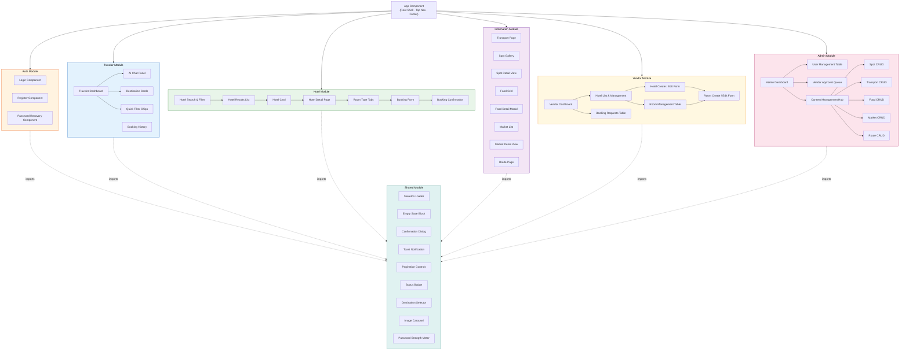
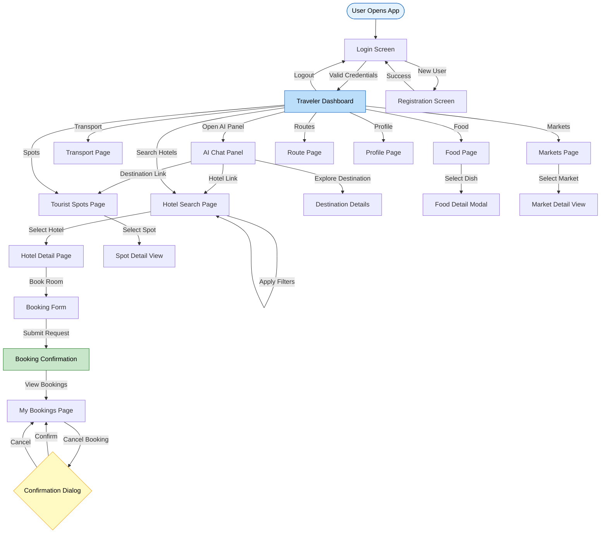
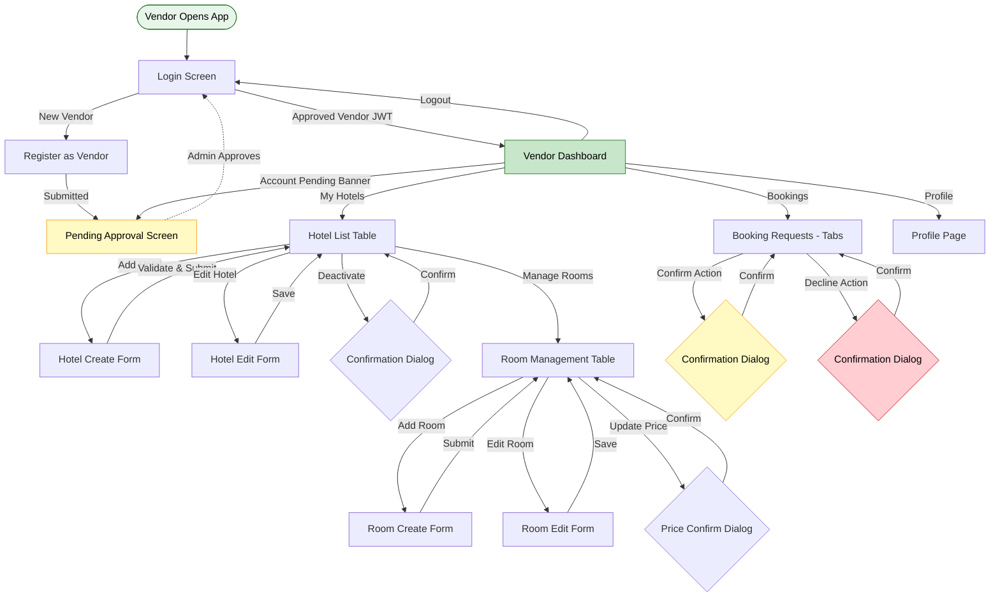
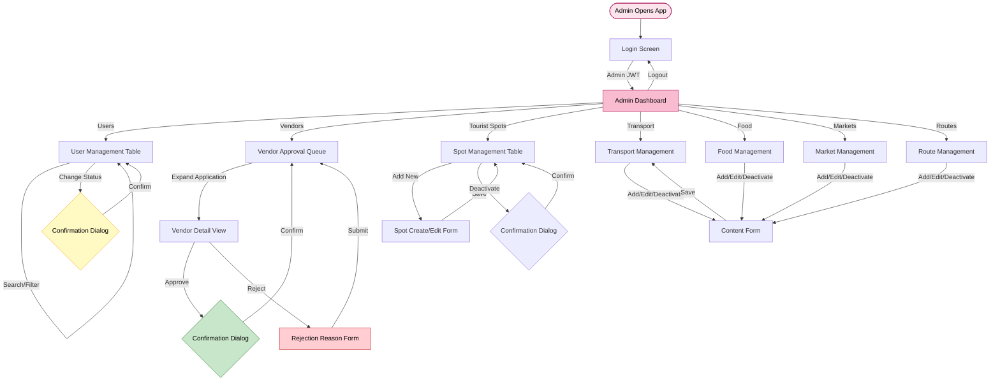

# Frontend Software Requirements Specification (SRS)
# AI Powered Traveling Management System

---

| **Document Information**     |                                                              |
|-----------------------------|--------------------------------------------------------------|
| **Project Title**           | AI Powered Traveling Management System                       |
| **Document Type**           | Frontend Software Requirements Specification (SRS)           |
| **Standard**                | IEEE 830 / ISO 29148                                         |
| **Version**                 | 1.0                                                          |
| **Prepared By**             | Frontend Architecture & UX System Analysis Team              |
| **Document Status**         | Final                                                        |
| **Date**                    | February 28, 2026                                            |
| **Technology Stack**        | Angular · TypeScript · HTML5 · CSS3 · Tailwind CSS / Bootstrap · RxJS |

---

## Table of Contents

1. [Introduction](#1-introduction)
2. [Overall Description](#2-overall-description)
3. [Frontend Architecture](#3-frontend-architecture)
4. [Functional Requirements](#4-functional-requirements)
5. [User Interface Requirements](#5-user-interface-requirements)
6. [Navigation Design](#6-navigation-design)
7. [Screen Flow Diagrams](#7-screen-flow-diagrams)
8. [External Interface Requirements](#8-external-interface-requirements)
9. [Client-Side Validation Requirements](#9-client-side-validation-requirements)
10. [Non-Functional Requirements](#10-non-functional-requirements)
11. [Error Handling](#11-error-handling)
12. [Use Case Model](#12-use-case-model)
13. [Future Frontend Enhancements](#13-future-frontend-enhancements)

---

## 1. Introduction

### 1.1 Purpose

This Frontend Software Requirements Specification (SRS) defines the complete frontend system requirements for the **AI Powered Traveling Management System**. It is prepared in accordance with the IEEE 830 standard and ISO/IEC/IEEE 29148:2018 guidelines for systems and software engineering requirements.

The purpose of this document is to provide a clear, complete, and unambiguous specification of the frontend system's structural design, component architecture, user interface behavior, interaction patterns, client-side validation rules, navigation structure, and non-functional quality standards. It serves as the authoritative technical reference for frontend architects, Angular developers, UX designers, QA engineers, and academic reviewers involved with this project.

This document focuses exclusively on frontend architecture, UI behavior, user interaction, and client-side responsibilities. It does not address backend processing, database design, server infrastructure, or any API implementation details beyond how the frontend consumes and handles API responses.

### 1.2 Scope

The **AI Powered Traveling Management System** frontend is a web-based, mobile-responsive Angular Single-Page Application (SPA) that serves as the complete user interface of the platform. It communicates with the backend REST API over HTTPS to retrieve and submit data, renders that data through structured Angular components, and guides users through role-specific workflows.

The frontend serves three user roles — **Traveler**, **Vendor**, and **Admin** — each with distinct screens, workflows, and feature access. The application delivers the following primary capability domains:

- Secure authentication screens with client-side validation and JWT-based session management
- An AI-powered conversational travel planning interface for Travelers
- Hotel and accommodation browsing, filtering, detail viewing, and booking request submission
- Transport, tourist spot, traditional food, cultural market, and route information browsing by destination
- A Vendor management dashboard for hotel listing, room, and booking management
- A comprehensive Admin panel for user account management, vendor approval, and all content management

The application is built using Angular with TypeScript, styled with Tailwind CSS or Bootstrap 5, and targets modern desktop, tablet, and mobile web browsers across all three user roles.

### 1.3 Definitions and Acronyms

| **Term / Acronym** | **Definition** |
|---|---|
| SRS | Software Requirements Specification |
| UI | User Interface — the visual and interactive layer users engage with |
| UX | User Experience — the overall quality and feel of user interactions |
| SPA | Single-Page Application — a web app that dynamically updates content without full page reloads |
| Angular | A TypeScript-based, open-source frontend web framework by Google |
| TypeScript | A statically typed superset of JavaScript used throughout Angular |
| RxJS | Reactive Extensions for JavaScript — library for composing asynchronous event streams |
| Observable | An RxJS data stream representing asynchronous operations |
| Component | An Angular UI building block comprising an HTML template, TypeScript class, and CSS styles |
| Module | An Angular organizational unit grouping related components, services, and routes |
| Service | An Angular injectable class providing reusable logic such as API communication |
| Guard | An Angular router guard controlling route access based on authentication or role |
| Interceptor | An Angular HTTP middleware that processes outgoing requests and incoming responses globally |
| JWT | JSON Web Token — a signed token used for stateless user authentication |
| RBAC | Role-Based Access Control — restricting system access based on user roles |
| DTO | Data Transfer Object — a typed TypeScript interface representing API response or request shapes |
| API | Application Programming Interface |
| REST | Representational State Transfer |
| HTTP | HyperText Transfer Protocol |
| JSON | JavaScript Object Notation — the data format used for API communication |
| PWA | Progressive Web Application — a web app with native-like offline and device capabilities |
| WCAG | Web Content Accessibility Guidelines — accessibility standard for web content |
| FR | Functional Requirement |
| NFR | Non-Functional Requirement |
| FAB | Floating Action Button — a circular button overlaid on a mobile screen for primary actions |
| TTL | Time-To-Live — duration before cached data expires |

### 1.4 Document Overview

This document is organized into thirteen major sections following the IEEE 830 structure. Section 1 introduces the document. Section 2 describes the overall frontend system. Section 3 defines the architecture with Mermaid diagrams. Section 4 specifies functional requirements per module. Section 5 defines UI layout and behavior standards. Section 6 describes the navigation design with a diagram. Section 7 presents screen flow diagrams for all user roles. Section 8 covers API interaction responsibilities. Section 9 defines client-side validation rules. Section 10 specifies non-functional requirements. Section 11 addresses error handling. Section 12 presents the use case model. Section 13 outlines future enhancements.

---

## 2. Overall Description

### 2.1 Product Perspective

The frontend of the AI Powered Traveling Management System is the user-facing interface layer in a client-server architecture. It operates as an Angular SPA running entirely within the user's browser. The frontend communicates with a Spring Boot backend REST API over HTTPS to retrieve and submit data, but performs no business logic processing, data persistence, or authentication enforcement of its own.

The frontend's role is to present backend data in a clear, structured, and visually appropriate format for each user role; collect and validate user inputs before API submission; manage client-side routing with role-based access guards; maintain application session state; and deliver a consistent, accessible, responsive experience across all device types.

The frontend maintains a strict separation from backend concerns. It consumes well-defined API contracts, manages HTTP response handling (success, loading, and error states), and routes users through role-appropriate screen hierarchies. All business rules, authorization decisions, and data integrity enforcement remain exclusively in the backend. The frontend's route guards and conditional rendering are usability features, not security boundaries.

### 2.2 Product Functions

The frontend delivers the following major UI capability groups:

- **Authentication Screens:** Login, registration, and password recovery forms with real-time client-side validation, password strength indicators, and role-dynamic field expansion.
- **AI Chat Interface:** A conversational planning panel where Travelers input travel parameters (budget, destination, duration, interests) and receive AI-generated itinerary recommendations rendered as structured message bubbles with navigable content links.
- **Hotel Browsing and Booking:** Searchable, filterable hotel listing pages with image carousels, room type tabs, dynamic price calculators, and booking request forms with confirmation flows.
- **Transport Display:** Destination-filtered transport option listings presenting mode, cost, schedule, and local transport summaries.
- **Tourist Spot Browsing:** Responsive image-grid galleries of tourist attractions per destination, with detail views and structured entry fee tables.
- **Food and Market Browsing:** Traditional food cards and cultural market listings filtered by destination, with detail modals showing cultural context, price ranges, and location guidance.
- **Route Display:** Origin-destination route result cards showing distance, travel time, recommended route indication, and linked transport options.
- **Vendor Dashboard:** A form-driven management console for Vendors to create and update hotel listings, manage room types and pricing, and action incoming booking requests.
- **Admin Panel:** A data-dense management console for Admins to manage user accounts, approve or reject Vendors, and perform full CRUD management across all content categories.

### 2.3 User Classes and Characteristics

| **User Type** | **Device Usage Pattern** | **UI Sophistication** | **Primary UI Needs** |
|---|---|---|---|
| **Traveler** | Predominantly mobile; also desktop | Low to moderate — general public user | Visually engaging, minimal friction, intuitive navigation, fast content loading, conversational AI interface |
| **Vendor** | Primarily desktop and tablet | Moderate — business operator | Efficient forms, clear validation feedback, unambiguous booking status visibility, reliable data submission |
| **Admin** | Exclusively desktop | High — platform operator | Data-dense tables, strong filtering and search, bulk action controls, clear approval workflows |

### 2.4 Operating Environment

| **Environment Dimension** | **Specification** |
|---|---|
| Framework | Angular (latest LTS release) with Angular CLI |
| Language | TypeScript 5.x |
| Styling | Tailwind CSS 3.x or Bootstrap 5.x |
| Reactive Library | RxJS 7.x |
| Supported Desktop Browsers | Chrome 120+, Firefox 120+, Edge 120+, Safari 17+ |
| Supported Mobile Browsers | Chrome for Android (120+), Safari for iOS (17+) |
| Minimum Supported Viewport | 320px width (small mobile) |
| Maximum Supported Viewport | 2560px (large desktop / 4K) |
| JavaScript Target | ES2022+ transpiled by Angular CLI for browser compatibility |
| Network Requirement | Active HTTPS internet connection required for all operations |
| Device Types | Smartphone, Tablet, Laptop, Desktop |

### 2.5 Assumptions and Dependencies

**Assumptions:**
1. All users access the platform through a modern, JavaScript-enabled browser as listed in the operating environment table.
2. Users have a stable internet connection sufficient for loading Angular application assets and communicating with the backend API.
3. The backend REST API is available and returns responses conforming to the agreed API contract. The frontend treats API contracts as stable, versioned interfaces.
4. The JWT returned by the backend upon login contains the user's role claim, which the frontend uses for client-side route guards and conditional rendering decisions.
5. All media asset URLs (hotel images, spot photos) referenced within API responses are publicly accessible and return appropriate image data.
6. The backend is the authoritative enforcement layer for all business rules and security — the frontend's guards are a usability and UX enhancement only.

**Dependencies:**
1. The Angular CLI toolchain is required for building, testing, and serving the frontend application.
2. The Tailwind CSS or Bootstrap framework must be correctly installed and configured within the Angular workspace.
3. RxJS is a core Angular dependency for all asynchronous HTTP operations and reactive state management.
4. The backend REST API must be reachable from the browser at the configured base URL (`environment.apiBaseUrl`) during all runtime operations.

---

## 3. Frontend Architecture

### 3.1 Layered Frontend Structure

The Angular frontend is organized into four architectural layers with clearly scoped responsibilities and no cross-layer bypassing.

#### Presentation Layer — Feature Module Components
All Angular components are organized into lazy-loaded feature modules. Each module corresponds to a functional area: Auth, Traveler, Hotel, Information (Transport / Spots / Food / Markets / Routes), Vendor, Admin, and Shared. Components render HTML templates, respond to user events, subscribe to service Observables, and delegate all data operations to the Service Layer. Components contain no direct HTTP logic.

#### Service Layer — API Communication and State
Injectable Angular services handle all outbound HTTP requests via `HttpClient`, returning typed `Observable<T>` streams. Each service maps to a backend API group: `AuthService`, `HotelService`, `BookingService`, `AIService`, etc. Two cross-cutting services — `TokenService` (JWT read/write from session storage) and `AuthStateService` (reactive user session state via `BehaviorSubject`) — are available application-wide.

#### HTTP Interceptor Layer
Two global interceptors operate between the Service Layer and the network. The `AuthInterceptor` automatically attaches the `Authorization: Bearer {token}` header to all outgoing requests. The `ErrorInterceptor` catches all HTTP error responses, maps them to structured error models, and re-throws them as typed errors for component-level handling.

#### Routing Module — Navigation and Guards
The Angular Router manages all client-side navigation. The `AuthGuard` redirects unauthenticated users attempting to access protected routes back to `/auth/login`. The `RoleGuard` verifies the authenticated user's role matches the route's required role, redirecting mismatched users to their appropriate dashboard. All feature modules are lazy-loaded, downloading their JavaScript bundle only on first navigation to that module's routes.

---

### 3.2 Frontend Architecture Diagram

```mermaid
graph TB
    subgraph BROWSER["Browser — Angular SPA Runtime"]
        subgraph ROUTING["Routing & Guard Layer"]
            ROUTER[Angular Router]
            AUTHG[Auth Guard\nRedirects unauthenticated]
            ROLEG[Role Guard\nEnforces role access]
            LAZY[Lazy Module Loader]
        end

        subgraph INTERCEPT["HTTP Interceptor Pipeline"]
            AUTHINT[Auth Interceptor\nAttaches JWT Bearer Token]
            ERRINT[Error Interceptor\nMaps HTTP errors to typed models]
        end

        subgraph MODULES["Feature Modules — Presentation Layer"]
            AUTHMOD[Auth Module\nLogin . Register . Recovery]
            TRAVMOD[Traveler Module\nDashboard . AI Chat . Booking History]
            HOTELMOD[Hotel Module\nSearch . Details . Booking Form]
            INFOMOD[Info Module\nTransport . Spots . Food . Markets . Routes]
            VENDMOD[Vendor Module\nDashboard . Hotels . Rooms . Bookings]
            ADMINMOD[Admin Module\nUsers . Vendors . Content . Reports]
            SHAREDMOD[Shared Module\nReusable Components . Pipes . Directives]
        end

        subgraph SERVICES["Service Layer"]
            AUTHSVC[Auth Service\nPOST /auth/login . /register]
            USERSVC[User Service\nGET/PUT /users/me]
            HOTELSVC[Hotel Service\nGET/POST/PUT /hotels]
            ROOMSVC[Room Service\nGET/POST/PUT /rooms]
            BOOKSVC[Booking Service\nPOST/GET/PATCH /bookings]
            TRANSVC[Transport Service\nGET /transport]
            SPOTSVC[Spot Service\nGET /spots]
            FOODSVC[Food Service\nGET /foods]
            MKTSVC[Market Service\nGET /markets]
            ROUTESVC[Route Service\nGET /routes]
            AISVC[AI Service\nPOST /ai/chat . GET /ai/history]
            ADMINSVC[Admin Service\nAll admin endpoints]
            TOKENSVC[Token Service\nSessionStorage JWT I/O]
            AUTHSTATE[Auth State Service\nBehaviorSubject - session state]
        end
    end

    subgraph BACKEND["Backend REST API"]
        API[Spring Boot API\nHTTPS]
    end

    USER([fa:fa-user Browser User]) --> ROUTER
    ROUTER --> AUTHG --> ROLEG --> LAZY
    LAZY --> AUTHMOD & TRAVMOD & HOTELMOD & INFOMOD & VENDMOD & ADMINMOD

    AUTHMOD & TRAVMOD & HOTELMOD & INFOMOD & VENDMOD & ADMINMOD --> AUTHSVC & USERSVC & HOTELSVC & ROOMSVC & BOOKSVC & TRANSVC & SPOTSVC & FOODSVC & MKTSVC & ROUTESVC & AISVC & ADMINSVC

    AUTHSVC & USERSVC & HOTELSVC & ROOMSVC & BOOKSVC & TRANSVC & SPOTSVC & FOODSVC & MKTSVC & ROUTESVC & AISVC & ADMINSVC --> AUTHINT --> ERRINT --> API

    TOKENSVC -.->|reads JWT| AUTHINT
    AUTHSVC -.->|writes JWT| TOKENSVC
    AUTHSTATE -.->|session Observable| MODULES
    SHAREDMOD -.->|imported by| AUTHMOD & TRAVMOD & HOTELMOD & INFOMOD & VENDMOD & ADMINMOD

    style BROWSER fill:#E8F4FD,stroke:#1565C0,color:#000
    style ROUTING fill:#FFF9C4,stroke:#F9A825,color:#000
    style INTERCEPT fill:#FCE4EC,stroke:#AD1457,color:#000
    style MODULES fill:#E8F5E9,stroke:#2E7D32,color:#000
    style SERVICES fill:#F3E5F5,stroke:#7B1FA2,color:#000
    style BACKEND fill:#ECEFF1,stroke:#546E7A,color:#000
```



---

### 3.3 Component Architecture Diagram



---

## 4. Functional Requirements

Each requirement follows: **ID · Description · Actor · Preconditions · Main Flow · Alternative Flow · Postconditions.**

---

### 4.1 Authentication UI

---

**FR-FE-01 — Login Screen**

| Field | Detail |
|---|---|
| **Description** | The system shall render a fully responsive login screen for unauthenticated users with email, password, and submit controls. |
| **Actor** | Unauthenticated User |
| **Preconditions** | User is not authenticated and navigates to `/auth/login`. |
| **Main Flow** | 1. Router activates Login Component. 2. Card-style form renders with email field, password field, and "Log In" button. 3. Platform logo and tagline appear above the card. 4. Links to registration and password recovery display below. |
| **Alternative Flow** | A valid stored JWT causes AuthGuard to redirect the user to their role dashboard before Login Component renders. |
| **Postconditions** | Login form is visible and interactive with no loading state. |

---

**FR-FE-02 — Login Submission and JWT Storage**

| Field | Detail |
|---|---|
| **Description** | The system shall submit credentials, store the JWT, update session state, and navigate to the role-specific dashboard on success. |
| **Actor** | Unauthenticated User |
| **Preconditions** | Login form is visible; fields contain valid input. |
| **Main Flow** | 1. User fills fields and clicks "Log In." 2. Client validation runs; empty or invalid email blocks submission. 3. Button shows spinner; form locks. 4. AuthService posts to `/auth/login`. 5. On 200: TokenService stores JWT in sessionStorage; AuthStateService emits updated session. 6. Router navigates to role dashboard: Traveler → `/traveler/dashboard`, Vendor → `/vendor/dashboard`, Admin → `/admin/dashboard`. |
| **Alternative Flow** | 401 → error banner "Invalid email or password." 403 → banner shows account status message. Network error → "Unable to connect. Please try again." Button restores in all error cases. |
| **Postconditions** | JWT stored; user on role dashboard. |

---

**FR-FE-03 — Registration Screen**

| Field | Detail |
|---|---|
| **Description** | The system shall display a registration form with real-time validation, a password strength meter, and dynamic Vendor-specific fields. |
| **Actor** | Unauthenticated User |
| **Preconditions** | User navigates to `/auth/register`. |
| **Main Flow** | 1. Register Component renders fields: full name, email, password, confirm password, role selector. 2. Selecting Vendor reveals business name and address fields. 3. Password strength meter updates dynamically. 4. Submit button remains disabled until all validations pass and terms checkbox is checked. 5. On 201: success toast shown; redirect to login after 2 seconds. |
| **Alternative Flow** | 409 Conflict → inline error under email: "This email is already registered." Validation failures prevent submission with inline field-level messages. |
| **Postconditions** | Account created; user directed to login. |

---

**FR-FE-04 — Password Recovery Screen**

| Field | Detail |
|---|---|
| **Description** | The system shall display a single-field password recovery screen and show a generic success message on submission regardless of API outcome. |
| **Actor** | Unauthenticated User |
| **Preconditions** | User navigates to `/auth/recovery`. |
| **Main Flow** | 1. Recovery Component renders a single email input and "Send Recovery Link" button. 2. On submit: button shows spinner. 3. On any API response: success message displayed: "If this email is registered, a recovery link has been sent." 4. Link to return to login is displayed. |
| **Postconditions** | Recovery form submission acknowledged; email not confirmed as registered or unregistered. |

---

### 4.2 Traveler Dashboard

---

**FR-FE-05 — Dashboard Layout Render**

| Field | Detail |
|---|---|
| **Description** | The system shall render the Traveler Dashboard with an AI Chat Panel, destination cards, and quick filter chips. |
| **Actor** | Traveler |
| **Preconditions** | Traveler is authenticated and on `/traveler/dashboard`. |
| **Main Flow** | 1. UserService calls GET `/users/me`; display name rendered in greeting. 2. Skeleton loaders occupy all content zones during load. 3. Destination cards populate in a horizontally scrollable row (desktop) or vertical stack (mobile). 4. Quick filter chips render below the search bar. 5. AI Chat Panel visible as a sidebar (desktop) or via FAB (mobile). |
| **Alternative Flow** | API failure on user profile → greeting defaults to "Welcome back." Destination card API failure → empty state with retry button. |
| **Postconditions** | Dashboard fully rendered with personalized greeting and content. |

---

**FR-FE-06 — AI Chat Interaction**

| Field | Detail |
|---|---|
| **Description** | The system shall render an AI conversational panel accepting travel parameters and displaying structured AI recommendations. |
| **Actor** | Traveler |
| **Preconditions** | Traveler is authenticated; chat panel is open. |
| **Main Flow** | 1. Panel opens with welcome message and prompt chips (e.g., "Weekend trip under ৳5000"). 2. Traveler types or selects a prompt. 3. Message appended to history as user bubble. 4. Typing animation displays while AIService calls POST `/ai/chat`. 5. AI response rendered as assistant bubble with tappable destination, hotel, and spot links. 6. Conversation scrolled to latest message. |
| **Alternative Flow** | 503 from AI service → inline assistant bubble: "Travel suggestions are temporarily unavailable. Please try again shortly." Network error → same message. |
| **Postconditions** | Interaction recorded in chat history; recommendations displayed with navigable links. |

---

### 4.3 Hotel Search and Booking UI

---

**FR-FE-07 — Hotel Search and Filter**

| Field | Detail |
|---|---|
| **Description** | The system shall display a hotel search interface with destination, price range, room type, and guest count filters. |
| **Actor** | Traveler |
| **Preconditions** | Traveler navigates to `/hotels`. |
| **Main Flow** | 1. Hotel Search Component renders filter panel and results area. 2. HotelService calls GET `/hotels` with default parameters. 3. Skeleton cards display during load. 4. Results render as hotel cards with name, location, thumbnail, starting price, and "View Details" button. 5. Results count label updates: "Showing 24 hotels in Dhaka." 6. Filter changes trigger a new API call; skeleton cards replace results during reload. |
| **Alternative Flow** | No results → empty state: "No hotels match your filters. Try adjusting your search." |
| **Postconditions** | Hotel list reflects active filter state. |

---

**FR-FE-08 — Hotel Detail View**

| Field | Detail |
|---|---|
| **Description** | The system shall display a full hotel detail page with an image carousel, description, amenities, and a tabbed room type section. |
| **Actor** | Traveler |
| **Preconditions** | Traveler selects a hotel card and navigates to `/hotels/:id`. |
| **Main Flow** | 1. HotelService calls GET `/hotels/:id`. 2. Image Carousel renders at the top. 3. Hotel name, location, description, and amenity list render below. 4. Room types displayed in tabs or accordion: name, capacity, amenities, price per night, "Book This Room" button. |
| **Alternative Flow** | 404 response → error state: "This hotel could not be found." with a back navigation link. |
| **Postconditions** | Full hotel detail visible; booking entry point accessible. |

---

**FR-FE-09 — Booking Form and Confirmation**

| Field | Detail |
|---|---|
| **Description** | The system shall render a booking form with date pickers, guest count, a dynamic price summary, and a confirmation screen upon submission. |
| **Actor** | Traveler |
| **Preconditions** | Traveler clicks "Book This Room" on the hotel detail page. |
| **Main Flow** | 1. Booking Form renders as a modal or page section with check-in date, check-out date, guest count, and optional special requests. 2. Total price recalculates dynamically as dates are selected. 3. "Submit Booking Request" button submits via BookingService POST `/bookings`. 4. On 201: confirmation screen renders with booking summary and "View My Bookings" link. |
| **Alternative Flow** | 409 Room Not Available → inline message: "This room is no longer available for your selected dates." Date validation failure → inline field error. |
| **Postconditions** | Booking request submitted; confirmation displayed. |

---

### 4.4 Transport UI

**FR-FE-10 — Transport Search and Display**

| Field | Detail |
|---|---|
| **Description** | The system shall display transport options for a selected origin-destination pair with mode-type filtering. |
| **Actor** | Traveler |
| **Preconditions** | Traveler navigates to `/transport`. |
| **Main Flow** | 1. Origin and destination selectors render. 2. On "Find Transport" trigger, TransportService calls GET `/transport?origin=&destination=`. 3. Results render as transport cards with mode icon, operator, estimated cost, duration, and frequency. 4. Filter bar allows filtering by transport mode type. 5. Local transport section renders below intercity results. |
| **Alternative Flow** | No results → empty state: "No transport options found for this route." |
| **Postconditions** | Transport options displayed; filterable by mode. |

---

### 4.5 Tourist Spot UI

**FR-FE-11 — Tourist Spot Gallery and Detail**

| Field | Detail |
|---|---|
| **Description** | The system shall display tourist spots in an image grid filtered by destination, with a detail view showing visiting hours and entry fees. |
| **Actor** | Traveler |
| **Preconditions** | Traveler navigates to `/spots`. |
| **Main Flow** | 1. Destination selector triggers SpotService GET `/spots?destinationId=`. 2. Spots render in a responsive grid (3 cols desktop / 2 tablet / 1 mobile). 3. Selecting a spot opens a detail panel or page with full description, photo carousel, visiting hours, and entry fee table. |
| **Alternative Flow** | Empty destination selection → prompt: "Select a destination to view tourist spots." |
| **Postconditions** | Spots displayed; detail accessible on selection. |

---

### 4.6 Food UI

**FR-FE-12 — Traditional Food Browsing**

| Field | Detail |
|---|---|
| **Description** | The system shall display traditional food items per destination as image cards with a category filter and an expandable detail view. |
| **Actor** | Traveler |
| **Preconditions** | Traveler navigates to `/food`. |
| **Main Flow** | 1. Destination selector triggers FoodService GET `/foods?destinationId=`. 2. Food cards render with image, dish name, one-line description, and price range. 3. Category filter chips (Street Food, Main Dish, Dessert, Beverage) filter the visible cards. 4. Card tap opens a detail modal with full cultural description, taste profile, price range, and recommended location. |
| **Postconditions** | Food items displayed and filterable; detail accessible. |

---

### 4.7 Market UI

**FR-FE-13 — Cultural Market Browsing**

| Field | Detail |
|---|---|
| **Description** | The system shall display cultural markets per destination with a detail view showing operating schedule and traditional item categories. |
| **Actor** | Traveler |
| **Preconditions** | Traveler navigates to `/markets`. |
| **Main Flow** | 1. Destination selector triggers MarketService GET `/markets?destinationId=`. 2. Market cards render with cover image, name, operating schedule summary, and brief description. 3. Card selection opens a detail view with full market description, location, operating hours, and item category rows (name, description, price range). |
| **Postconditions** | Markets displayed; detail accessible on selection. |

---

### 4.8 Route Display UI

**FR-FE-14 — Route Search and Results**

| Field | Detail |
|---|---|
| **Description** | The system shall display route results for an origin-destination pair with distance, duration, and a recommended route indicator. |
| **Actor** | Traveler |
| **Preconditions** | Traveler navigates to `/routes`. |
| **Main Flow** | 1. Origin and destination selectors render. 2. "Find Route" triggers RouteService GET `/routes?origin=&destination=`. 3. Route result cards render with distance (km), estimated duration, route description, and recommended badge where applicable. 4. Linked transport options for the same pair display beneath route cards. 5. Map placeholder section with "Interactive map coming soon" renders at the bottom. |
| **Alternative Flow** | No routes found → empty state with suggestion to check origin and destination values. |
| **Postconditions** | Route options displayed with transport linkage. |

---

### 4.9 Vendor Dashboard

---

**FR-FE-15 — Vendor Dashboard Home**

| Field | Detail |
|---|---|
| **Description** | The system shall display the Vendor Dashboard with account status banner and summary metric cards. |
| **Actor** | Vendor |
| **Preconditions** | Vendor is authenticated and navigates to `/vendor/dashboard`. |
| **Main Flow** | 1. AuthStateService provides account status; status banner renders at top: Pending (amber), Active (green), Suspended (red). 2. AdminService / UserService calls populate summary cards: Active Listings, Pending Bookings, Confirmed This Month. 3. Quick access cards navigate to "My Hotels" and "Manage Bookings." |
| **Alternative Flow** | Pending vendor → all management features except profile update are disabled with a "Pending Approval" overlay message. |
| **Postconditions** | Vendor sees operational status and summary metrics. |

---

**FR-FE-16 — Hotel and Room Management**

| Field | Detail |
|---|---|
| **Description** | The system shall allow Vendors to create, edit, and deactivate hotel listings and manage associated room types through form-driven interfaces. |
| **Actor** | Vendor |
| **Preconditions** | Vendor is authenticated, approved, and on `/vendor/hotels`. |
| **Main Flow** | 1. HotelService GET `/hotels` returns vendor's listings in a management table. 2. "Add Hotel" opens hotel form with: name, destination selector, address, description, amenities checklist, and photo uploader. 3. Inline validation runs on all fields. 4. Save submits POST or PUT to HotelService. 5. Within a hotel, "Manage Rooms" opens room table. "Add Room" opens room form with: type name, capacity, amenities, available quantity, price. 6. Price update action opens confirmation modal showing old and new price. |
| **Alternative Flow** | Validation failure → submission blocked with inline field errors. 403 on submission → toast: "You are not authorized to modify this listing." |
| **Postconditions** | Hotel and room records created or updated; listing table reflects changes. |

---

**FR-FE-17 — Booking Request Management**

| Field | Detail |
|---|---|
| **Description** | The system shall display incoming booking requests in a tabbed interface allowing Vendors to confirm or decline with a confirmation dialog. |
| **Actor** | Vendor |
| **Preconditions** | Vendor is authenticated and on `/vendor/bookings`. |
| **Main Flow** | 1. BookingService GET `/bookings/vendor` loads requests into tabs: Pending, Confirmed, Declined. 2. Pending rows show: traveler name, hotel, room type, dates, total price, Confirm and Decline buttons. 3. Clicking Confirm or Decline opens a Confirmation Dialog: "Confirm booking for [traveler] from [dates]?" 4. Confirmed → BookingService PATCH `/bookings/:id/confirm`. Row moves to Confirmed tab. 5. Declined → PATCH `/bookings/:id/decline`. Row moves to Declined tab. |
| **Alternative Flow** | API error on action → toast: "Action could not be completed. Please try again." |
| **Postconditions** | Booking status updated; row moves to appropriate tab. |

---

### 4.10 Admin Panel

---

**FR-FE-18 — Admin Dashboard**

| Field | Detail |
|---|---|
| **Description** | The system shall display the Admin Dashboard with a persistent left navigation panel and summary metric cards linking to management screens. |
| **Actor** | Admin |
| **Preconditions** | Admin is authenticated and on `/admin/dashboard`. |
| **Main Flow** | 1. Admin Module loads with a fixed left sidebar: Dashboard, Users, Vendors, Hotels, Tourist Spots, Transport, Food, Markets, Routes. 2. Dashboard renders metric cards: Total Travelers, Total Vendors, Pending Approvals, Active Listings, Bookings This Month. 3. Each card is a navigable link to the corresponding management screen. |
| **Postconditions** | Admin has full navigational access to all management screens. |

---

**FR-FE-19 — User Account Management**

| Field | Detail |
|---|---|
| **Description** | The system shall display a searchable, paginated user table allowing Admins to view accounts and change their status. |
| **Actor** | Admin |
| **Preconditions** | Admin is on `/admin/users`. |
| **Main Flow** | 1. AdminService GET `/users` loads paginated table with columns: name, email, role, status, registration date. 2. Real-time search input filters by name or email. 3. Actions dropdown per row: View Profile, Change Status. 4. Status change opens Confirmation Dialog; AdminService PATCH `/users/:id/status` on confirm. 5. Toast confirms action. |
| **Alternative Flow** | 404 → toast: "User not found." Permission error → toast: "You do not have permission to perform this action." |
| **Postconditions** | User status updated; table row refreshes to reflect new status. |

---

**FR-FE-20 — Vendor Approval Workflow**

| Field | Detail |
|---|---|
| **Description** | The system shall display pending vendor applications in an expandable list with Approve and Reject action controls. |
| **Actor** | Admin |
| **Preconditions** | Admin is on `/admin/vendors`. |
| **Main Flow** | 1. AdminService loads pending vendor applications in an expandable list. 2. Expanding a row reveals full business details. 3. "Approve" triggers Confirmation Dialog; AdminService PATCH `/admin/vendors/:id/approve` on confirm. 4. "Reject" opens a dialog requiring a rejection reason text input; AdminService PATCH `/admin/vendors/:id/reject` with reason payload on confirm. 5. Processed application removed from the queue; success toast shown. |
| **Alternative Flow** | Empty queue → empty state: "All vendor applications have been reviewed." |
| **Postconditions** | Vendor approved or rejected; application removed from pending queue. |

---

**FR-FE-21 — Content Management Screens**

| Field | Detail |
|---|---|
| **Description** | The system shall provide consistent CRUD management screens for Tourist Spots, Transport, Food, Markets, and Routes. |
| **Actor** | Admin |
| **Preconditions** | Admin is on any content management route (e.g., `/admin/spots`). |
| **Main Flow** | 1. Content management screen renders: data table above, "Add New" button at top. 2. Table rows show key fields, Edit and Deactivate action controls. 3. "Add New" opens an inline form or modal for the content type. 4. "Edit" pre-populates the form with existing record data. 5. "Deactivate" opens a Confirmation Dialog; soft-delete applied on confirm. 6. "Show Inactive" toggle reveals soft-deleted records in the table. |
| **Alternative Flow** | Validation failure on form → submission blocked with inline errors. |
| **Postconditions** | Content record created, updated, or deactivated; table reflects changes. |

---

## 5. User Interface Requirements

### 5.1 Layout Standards

#### Global Header
A persistent header renders at the top of all authenticated screens. It contains the platform logo (left-aligned), the primary navigation links (center or right on desktop, collapsed to hamburger on mobile), a notification icon, and the user avatar with a dropdown menu (Profile, Logout). The header height is fixed at 64px. The header is sticky and remains visible on scroll.

#### Navigation Menu
- **Desktop:** Horizontal navigation bar within the header displaying all primary links for the user's role. Active route highlighted with the primary brand color.
- **Mobile / Tablet:** Hamburger icon in the header triggers a full-height side drawer sliding in from the left, displaying all navigation links in a vertical stack with adequate tap target sizing (minimum 48px height per item).

#### Footer
A minimal footer renders on public-facing screens (auth pages, browsing screens). It contains the platform name, a brief copyright notice, and links to Terms and Contact. The footer does not render inside the Vendor or Admin dashboard layouts, where screen real estate is prioritized for management content.

#### Page Layout Zones
All main content screens use a two-zone layout on desktop (optional sidebar + main content area) or a single-column layout on mobile. Maximum content width is constrained to 1280px and centered on large displays to prevent excessive line lengths and visual discomfort.

---

### 5.2 Responsive Design Requirements

#### Mobile (320px – 767px)
- All layouts use a single-column structure. Multi-column grids collapse to one column.
- Header collapses navigation to a hamburger menu icon triggering a side drawer.
- Hotel and destination cards stack vertically.
- Admin and Vendor data tables render as card-based list items, each card showing key fields with an actions menu.
- All touch targets meet a minimum size of 44×44px.
- The AI Chat Panel is accessed via a FAB (Floating Action Button) in the bottom-right corner; it opens as a full-screen overlay.
- Form fields are full-width with vertically stacked labels.

#### Tablet (768px – 1199px)
- Two-column grids for content cards (hotels, spots, food).
- Navigation bar collapses secondary links into a "More" dropdown if horizontal space is constrained.
- Vendor and Admin sidebars collapse to an icon-only rail, expanding on tap.
- Modal dialogs occupy 80% of viewport width, centered.
- AI Chat Panel renders as a collapsible side panel (~35% viewport width).

#### Desktop (1200px and above)
- Three- and four-column grids for content cards.
- Full navigation bar visible with all primary links.
- AI Chat Panel renders as a persistent sidebar.
- Admin and Vendor dashboards display a fixed left sidebar with full label navigation alongside the main content area.
- Modal dialogs are constrained to a maximum 640px width.
- Data tables display all columns without card-collapse.

---

### 5.3 UI Behavior Standards

#### Loading Indicators
- **Skeleton Screens:** Used for all initial page content loads. Skeleton blocks mirror the shape and approximate size of the actual content, providing immediate visual structure before data arrives.
- **Button Spinners:** Replace button labels during form submissions, preventing double-submission and providing instant in-action feedback. Buttons remain disabled during this state.
- **Inline Progress Bar:** Used for photo upload operations in the Vendor hotel form, displaying upload percentage.
- **Overlay Spinner:** Used for full-page transitions when navigating to a new module for the first time (lazy module load).

#### Error Messages
- **Inline Field Errors:** Displayed directly below the relevant form field in a red-accented helper text style. Triggered on field blur and form submission attempt.
- **Form-Level Banners:** A red alert banner at the top of a form for server-side rejection errors (e.g., duplicate email, 422 business rule violation).
- **Toast Notifications:** Transient 4-second pop-up notifications (bottom-right on desktop, bottom-center on mobile) for action outcomes: success (green), warning (amber), error (red). Used for operations that don't require form context (status changes, approvals, booking actions).
- **Page-Level Error States:** Full-content error blocks replacing the main content area when a critical API call fails (e.g., hotel detail 404). Includes an illustration, message, and a retry or back-navigation action.

#### Empty States
Every list, table, grid, or search result area has a defined empty state rendering when no content is available. Empty states include a simple SVG illustration, a concise explanatory message, and a contextual call-to-action button. Empty screens are never blank.

| **Screen** | **Empty State Message** |
|---|---|
| Hotel Search | "No hotels match your filters. Try widening your search." |
| Tourist Spots | "No spots found for this destination yet." |
| Vendor Bookings | "You have no pending booking requests." |
| Admin Vendor Queue | "All vendor applications have been reviewed." |
| AI Chat (before first message) | "Hi! Tell me your budget, destination, and how long you're traveling — I'll build your perfect plan." |

#### Confirmation Dialogs
All destructive or irreversible actions require a modal Confirmation Dialog before execution. The dialog must:
- Identify the action and the affected entity by name.
- Provide a clearly labeled action button (e.g., "Deactivate," "Reject," "Confirm Booking").
- Provide a "Cancel" button that closes the dialog without any action.
- Use red button styling for destructive actions (deactivate, reject, decline) and primary brand color for neutral confirmations.

---

## 6. Navigation Design

### 6.1 Navigation Structure

```mermaid
graph TD
    PUBLIC[Public / Unauthenticated]
    PUBLIC --> LOGIN[/auth/login]
    PUBLIC --> REGISTER[/auth/register]
    PUBLIC --> RECOVERY[/auth/recovery]

    subgraph TRAVELER_NAV["Traveler Navigation (role: TRAVELER)"]
        TDASH_R[/traveler/dashboard]
        HOTELS_R[/hotels]
        HOTELID_R[/hotels/:id]
        BOOKING_R[/hotels/:id/book]
        MYBOOKINGS_R[/traveler/bookings]
        TRANSPORT_R[/transport]
        SPOTS_R[/spots]
        FOOD_R[/food]
        MARKETS_R[/markets]
        ROUTES_R[/routes]
        PROFILE_R[/profile]
    end

    subgraph VENDOR_NAV["Vendor Navigation (role: VENDOR)"]
        VDASH_R[/vendor/dashboard]
        VHOTELS_R[/vendor/hotels]
        VHOTELFORM_R[/vendor/hotels/new]
        VHOTELID_R[/vendor/hotels/:id]
        VROOMS_R[/vendor/hotels/:id/rooms]
        VBOOKINGS_R[/vendor/bookings]
        VPROFILE_R[/profile]
    end

    subgraph ADMIN_NAV["Admin Navigation (role: ADMIN)"]
        ADASH_R[/admin/dashboard]
        AUSERS_R[/admin/users]
        AVENDORS_R[/admin/vendors]
        ASPOTS_R[/admin/spots]
        ATRANS_R[/admin/transport]
        AFOOD_R[/admin/food]
        AMKT_R[/admin/markets]
        AROUTES_R[/admin/routes]
        APROFILE_R[/profile]
    end

    LOGIN -->|Traveler JWT| TRAVELER_NAV
    LOGIN -->|Vendor JWT| VENDOR_NAV
    LOGIN -->|Admin JWT| ADMIN_NAV

    TDASH_R --> HOTELS_R --> HOTELID_R --> BOOKING_R
    HOTELID_R --> MYBOOKINGS_R
    TDASH_R --> TRANSPORT_R & SPOTS_R & FOOD_R & MARKETS_R & ROUTES_R

    VDASH_R --> VHOTELS_R --> VHOTELFORM_R
    VHOTELS_R --> VHOTELID_R --> VROOMS_R
    VDASH_R --> VBOOKINGS_R

    ADASH_R --> AUSERS_R & AVENDORS_R & ASPOTS_R & ATRANS_R & AFOOD_R & AMKT_R & AROUTES_R

    style PUBLIC fill:#ECEFF1,stroke:#607D8B,color:#000
    style TRAVELER_NAV fill:#E3F2FD,stroke:#1565C0,color:#000
    style VENDOR_NAV fill:#E8F5E9,stroke:#2E7D32,color:#000
    style ADMIN_NAV fill:#FCE4EC,stroke:#AD1457,color:#000
```

---

## 7. Screen Flow Diagrams

### 7.1 Traveler Screen Flow



---

### 7.2 Vendor Screen Flow



---

### 7.3 Admin Screen Flow



---

## 8. External Interface Requirements

### 8.1 API Interaction Groups

The frontend communicates with the backend REST API through Angular services. Each service group below describes the frontend's responsibilities when consuming each API group.

---

#### `/auth` — Authentication API
**Frontend Responsibilities:** AuthService posts login and registration requests. On 200 login response, `TokenService.store(token)` saves the JWT to sessionStorage. `AuthStateService.setSession(user)` updates the reactive session state, triggering route guards and role-specific UI rendering. On logout, `TokenService.clear()` removes the JWT and `AuthStateService.clearSession()` resets the state, followed by router navigation to `/auth/login`. The AuthInterceptor reads the stored JWT from TokenService and injects it into all subsequent HTTP request headers.

---

#### `/users` — User Management API
**Frontend Responsibilities:** UserService retrieves the authenticated user's profile for dashboard greeting and profile page rendering. Profile update forms submit PUT requests; success triggers a toast and refreshes the displayed profile data. Admin screens use paginated GET `/users` with query parameters for role and status filters, rendering results in a searchable data table.

---

#### `/hotels` — Hotel API
**Frontend Responsibilities:** HotelService calls GET `/hotels` with destination, minPrice, maxPrice, and roomType query parameters whenever the search filter state changes. Responses are rendered as hotel cards. A loading state (skeleton cards) is active during each call. GET `/hotels/:id` populates the Hotel Detail Component. POST and PUT `/hotels` are called from Vendor forms; success navigates back to the hotel list with a success toast.

---

#### `/rooms` — Room API
**Frontend Responsibilities:** RoomService retrieves rooms per hotel and populates the Room Type tabs on the Hotel Detail page and the Room Management table in the Vendor dashboard. POST and PUT `/rooms` are called from Vendor room forms. PATCH `/rooms/:id/price` is called from the price update confirmation flow.

---

#### `/bookings` — Booking API
**Frontend Responsibilities:** BookingService submits POST `/bookings` from the Booking Form. The response 201 triggers the Booking Confirmation Component to render with booking summary data. GET `/bookings/my` populates the Traveler's booking history. GET `/bookings/vendor` populates the Vendor's booking request tabs. PATCH calls for confirm, decline, and cancel are triggered by Confirmation Dialog confirmations. All booking status changes update the relevant table row without a full page reload.

---

#### `/transport` — Transport API
**Frontend Responsibilities:** TransportService calls GET `/transport?origin=&destination=&mode=` when the user submits the transport search form. Results populate the transport card list. A mode-type filter bar re-triggers the API call with an updated mode parameter. The local transport section is populated from a secondary call or from the same response filtered by the `is_local` flag.

---

#### `/spots` — Tourist Spots API
**Frontend Responsibilities:** SpotService calls GET `/spots?destinationId=` when the destination selector changes. Results populate the spot image grid using skeleton placeholders during load. GET `/spots/:id` populates the Spot Detail view. Admin CRUD operations call POST, PUT, and soft-delete endpoints; the content table refreshes after each successful operation.

---

#### `/foods` — Food API
**Frontend Responsibilities:** FoodService calls GET `/foods?destinationId=` on destination selection. Results render as food cards. Client-side filtering by category is applied to the loaded results without an additional API call. Detail modal data is sourced from the already-loaded record within the component state.

---

#### `/markets` — Market API
**Frontend Responsibilities:** MarketService calls GET `/markets?destinationId=` on destination selection. Results render as market cards. Market detail data is loaded either from the already-loaded list item (if detail data is embedded) or via GET `/markets/:id` on selection.

---

#### `/routes` — Route API
**Frontend Responsibilities:** RouteService calls GET `/routes?origin=&destination=` when the user submits the route search form. Results render as route result cards. Where multiple routes are returned, the one with `is_recommended: true` is visually distinguished with a "Best Option" badge.

---

#### `/ai` — AI Integration API
**Frontend Responsibilities:** AIService posts to POST `/ai/chat` with the traveler's input payload. During the API call, a typing animation renders in the chat panel. On 200 response, the AI response object is rendered as a structured assistant message bubble. Destination names and hotel names within the response are rendered as Angular `routerLink` elements. GET `/ai/history` populates chat history on panel open. 503 responses render an inline unavailability message bubble without disrupting the chat history view.

---

## 9. Client-Side Validation Requirements

All form validation is implemented using Angular's Reactive Forms module with `Validators` from `@angular/forms`. Validation messages are defined per control in the component class and rendered conditionally in the template on blur and on submission attempt.

### 9.1 Universal Required Field Rule

All controls marked as `Validators.required` display the message **"This field is required"** when the field is touched and empty. Required fields are marked with an asterisk (`*`) in their label. The form submit button is disabled while any required field is invalid.

### 9.2 Email Format Validation

All email fields apply `Validators.email`. Error message on invalid format: **"Please enter a valid email address."** Validation triggers on blur and on submission.

### 9.3 Password Validation Rules

| **Rule** | **Validator** | **Error Message** |
|---|---|---|
| Minimum 8 characters | `Validators.minLength(8)` | "Password must be at least 8 characters." |
| At least one uppercase letter | Custom pattern validator | "Password must contain at least one uppercase letter." |
| At least one lowercase letter | Custom pattern validator | "Password must contain at least one lowercase letter." |
| At least one numeric digit | Custom pattern validator | "Password must contain at least one number." |
| Passwords match | Cross-field custom validator | "Passwords do not match." |

Password strength meter component visually aggregates rules met (0 = None, 1–2 = Weak, 3 = Moderate, 4 = Strong).

### 9.4 Booking Date Validation

| **Rule** | **Validator** | **Error Message** |
|---|---|---|
| Check-in date is today or future | Custom date validator | "Check-in date must be today or a future date." |
| Check-out is after check-in | Cross-field date validator | "Check-out date must be after the check-in date." |
| Date format valid | `Validators.pattern` (ISO 8601) | "Please enter a valid date." |

### 9.5 Numeric Field Validation

| **Field** | **Rule** | **Error Message** |
|---|---|---|
| Room price | `Validators.min(1)`, number type | "Price must be greater than zero." |
| Guest count | `Validators.min(1)`, `Validators.max(20)` | "Guest count must be between 1 and 20." |
| Budget (AI chat) | `Validators.min(1)`, number type | "Please enter a valid budget amount." |
| Trip duration | `Validators.min(1)`, `Validators.max(365)` | "Duration must be between 1 and 365 days." |

### 9.6 Text Field Length Limits

| **Field Type** | **Maximum Characters** | **Behavior** |
|---|---|---|
| Single-line text inputs (names, titles) | 255 | Input blocked beyond limit; character counter shown near limit |
| Textarea fields (descriptions, notes) | 2000 | Character counter always visible below textarea |
| Special requests (booking form) | 500 | Character counter always visible |

### 9.7 File Upload Validation

Photo upload fields in the Vendor hotel form apply the following client-side validation before upload begins:

- **Accepted formats:** JPEG, JPG, PNG only. Error: "Only JPEG and PNG images are accepted."
- **Maximum file size:** 5MB per file. Error: "File size must not exceed 5MB."
- **Maximum file count:** 10 images per hotel. Error: "You may upload a maximum of 10 photos."

### 9.8 Role Selector Validation

The registration form's role selector is required. Selecting Vendor activates required validation on business name and address fields with messages: "Business name is required for vendor registration." and "Business address is required."

---

## 10. Non-Functional Requirements

### 10.1 Performance Requirements

| **NFR ID** | **Requirement** | **Target** |
|---|---|---|
| NFR-PERF-01 | Initial application load (First Contentful Paint) on broadband | ≤ 2.5 seconds |
| NFR-PERF-02 | Time to Interactive on initial load | ≤ 4 seconds |
| NFR-PERF-03 | Skeleton screen appears before data load | Within 300ms of navigation |
| NFR-PERF-04 | Lazy module load time (first navigation to a new module) | ≤ 1.5 seconds |
| NFR-PERF-05 | Hotel search results render after filter change | ≤ 2 seconds (includes API round-trip) |
| NFR-PERF-06 | AI chat response rendered | Within 10 seconds of submission (bounded by AI API timeout) |
| NFR-PERF-07 | Angular production bundle size (main chunk) | ≤ 500KB gzipped |

**Optimization Strategies:**
- Angular lazy loading applied to all feature modules.
- `trackBy` used on all `*ngFor` iterations to minimize DOM re-renders.
- Image assets use `loading="lazy"` attribute for deferred loading.
- Debounce (300ms) applied to all search input and filter controls to prevent excessive API calls.
- Virtual scrolling applied to Admin data tables rendering more than 50 rows.

### 10.2 Usability Requirements

| **NFR ID** | **Requirement** |
|---|---|
| NFR-USE-01 | A first-time Traveler user shall be able to complete the AI chat travel planning flow without external instruction within 3 minutes of first login. |
| NFR-USE-02 | All primary navigation destinations shall be reachable within 3 clicks or taps from any dashboard screen. |
| NFR-USE-03 | All form submission outcomes (success, validation failure, server error) shall be communicated to the user within 500ms of response receipt. |
| NFR-USE-04 | All interactive elements shall display a visual hover or focus state that clearly distinguishes them from non-interactive content. |
| NFR-USE-05 | All error messages shall be written in plain, non-technical language appropriate for the general public. |

### 10.3 Accessibility Requirements

| **NFR ID** | **Requirement** | **Standard / Target** |
|---|---|---|
| NFR-ACC-01 | Text-to-background color contrast ratio for normal body text | ≥ 4.5:1 (WCAG 2.1 Level AA) |
| NFR-ACC-02 | Text-to-background contrast for large text and UI component labels | ≥ 3:1 (WCAG 2.1 Level AA) |
| NFR-ACC-03 | All interactive elements must be keyboard-navigable via Tab key | Full keyboard operation without mouse |
| NFR-ACC-04 | Focused element must display a visible focus ring | Not suppressed by CSS outline: none |
| NFR-ACC-05 | Modal dialogs trap keyboard focus within the dialog while open | Focus returns to trigger element on close |
| NFR-ACC-06 | All images carry descriptive `alt` attributes; decorative images have empty `alt=""` | WCAG 1.1.1 |
| NFR-ACC-07 | Form inputs are associated with `<label>` elements or `aria-label` attributes | WCAG 1.3.1 |
| NFR-ACC-08 | Toast notifications and form validation messages are announced to screen readers | Via ARIA live regions |
| NFR-ACC-09 | Color is never used as the sole means of conveying information | Supplemented by icon or text label |
| NFR-ACC-10 | Minimum touch target size for all mobile interactive elements | 44×44px |

### 10.4 Cross-Browser Compatibility

| **Browser** | **Minimum Version** | **Required Support Level** |
|---|---|---|
| Google Chrome | 120 | Full support |
| Mozilla Firefox | 120 | Full support |
| Microsoft Edge | 120 | Full support |
| Apple Safari (macOS) | 17 | Full support |
| Chrome for Android | 120 | Full support |
| Safari for iOS | 17 | Full support |

The Angular CLI transpiles TypeScript to JavaScript targeting the browser compatibility matrix above. CSS features used must be verified against the same browser support matrix. No Internet Explorer support is required or targeted.

### 10.5 Responsiveness Requirements

| **NFR ID** | **Requirement** |
|---|---|
| NFR-RESP-01 | No horizontal scroll bar shall appear at any supported viewport width from 320px to 2560px. |
| NFR-RESP-02 | All content and interactive elements shall be fully usable without zooming on any supported viewport. |
| NFR-RESP-03 | All images shall scale proportionally within their containers and shall not overflow their parent elements. |
| NFR-RESP-04 | All form layouts shall adapt to single-column stacking at mobile viewport widths without truncation or overflow. |
| NFR-RESP-05 | Hover-state-dependent UI behavior shall have equivalent touch-compatible alternatives on mobile. |

---

## 11. Error Handling

### 11.1 API Failure Handling

The global `ErrorInterceptor` intercepts all HTTP error responses from the backend and maps them to structured `AppError` models consumed by components. The following handling strategy applies per HTTP status code:

| **Status** | **Frontend Handling Strategy** |
|---|---|
| 400 Bad Request | Field-level inline errors rendered from the response's `details` array. Form-level banner shown if no specific field is identified. |
| 401 Unauthorized | Token cleared from sessionStorage; `AuthStateService` session reset; user redirected to `/auth/login` with query parameter `reason=session_expired`. |
| 403 Forbidden | Toast notification: "You do not have permission to perform this action." No redirect. |
| 404 Not Found | Page-level error block: "The requested content could not be found." with back navigation. |
| 409 Conflict | Inline message displayed in the relevant form context (e.g., "This email is already registered", "Room is no longer available"). |
| 422 Unprocessable Entity | Form-level banner with the server's business rule violation message (e.g., "Cancellation window has expired"). |
| 500 Internal Server Error | Toast notification: "Something went wrong on our end. Please try again." No technical detail exposed. |
| 503 Service Unavailable | Context-specific message. For `/ai` endpoints: inline chat bubble. For other endpoints: toast with retry guidance. |

### 11.2 Network Error Handling

When an HTTP request fails due to a network connectivity issue (no internet, DNS failure, connection timeout), the `ErrorInterceptor` catches the `HttpErrorResponse` with status 0 and triggers the following behavior:

- A persistent amber alert banner renders at the top of the current screen: **"No internet connection. Please check your connection and try again."**
- The banner includes a "Retry" button that re-triggers the last failed request.
- Any in-progress loading states (skeleton screens, button spinners) are cleared and replaced with a retry state.
- The banner auto-dismisses if a subsequent successful network request is detected.

### 11.3 Session Expiration Handling

When the JWT stored in sessionStorage has expired and a subsequent API request returns 401, the `ErrorInterceptor` triggers the following session expiration flow:

1. `TokenService.clear()` removes the stored JWT.
2. `AuthStateService.clearSession()` emits null session state.
3. Angular Router navigates to `/auth/login?reason=session_expired`.
4. The Login Component detects the `reason=session_expired` query parameter and displays an amber informational banner: **"Your session has expired. Please log in again."**

This flow ensures users are never silently stuck in an authenticated-looking state with an invalid token, and they understand why they have been redirected to login.

### 11.4 Form Submission Error Recovery

When a form submission fails (4xx or 5xx response), the following recovery behaviors apply:

- The form submit button is restored to its active, non-loading state.
- All previously entered form data is preserved (the form is not reset on error).
- The relevant error message is displayed inline or as a banner.
- The user can correct the issue and resubmit without re-entering data.

---

## 12. Use Case Model

### 12.1 Actor List

| **Actor** | **Description** |
|---|---|
| **Traveler** | An authenticated user who browses travel content, interacts with the AI chatbot, searches for hotels, and submits booking requests |
| **Vendor** | An authenticated, approved business user who manages hotel listings, room inventory, pricing, and responds to booking requests |
| **Admin** | An authenticated platform operator who manages all users, vendors, content categories, and platform-level settings through the admin panel |

---

### 12.2 Use Case Diagram

```mermaid
graph TB
    subgraph ACTORS["Actors"]
        T((Traveler))
        V((Vendor))
        A((Admin))
    end

    subgraph AUTH_UC["Authentication Use Cases"]
        UC1[Register Account]
        UC2[Login to Platform]
        UC3[Recover Password]
        UC4[Logout]
    end

    subgraph TRAVELER_UC["Traveler Use Cases"]
        UC5[Interact with AI Chat]
        UC6[Browse Destinations]
        UC7[Search & Filter Hotels]
        UC8[View Hotel Details]
        UC9[Submit Booking Request]
        UC10[View & Cancel Bookings]
        UC11[Browse Tourist Spots]
        UC12[Browse Transport Options]
        UC13[Browse Traditional Food]
        UC14[Browse Cultural Markets]
        UC15[View Route Information]
        UC16[View & Update Profile]
    end

    subgraph VENDOR_UC["Vendor Use Cases"]
        UC17[View Dashboard & Metrics]
        UC18[Create Hotel Listing]
        UC19[Edit Hotel Listing]
        UC20[Deactivate Hotel Listing]
        UC21[Manage Room Types]
        UC22[Update Room Pricing]
        UC23[View Booking Requests]
        UC24[Confirm Booking]
        UC25[Decline Booking]
    end

    subgraph ADMIN_UC["Admin Use Cases"]
        UC26[View Platform Dashboard]
        UC27[Manage User Accounts]
        UC28[Approve Vendor Application]
        UC29[Reject Vendor Application]
        UC30[Manage Tourist Spot Content]
        UC31[Manage Transport Content]
        UC32[Manage Food Content]
        UC33[Manage Market Content]
        UC34[Manage Route Content]
    end

    T --> UC1 & UC2 & UC3 & UC4
    T --> UC5 & UC6 & UC7 & UC8 & UC9 & UC10
    T --> UC11 & UC12 & UC13 & UC14 & UC15 & UC16

    V --> UC1 & UC2 & UC3 & UC4
    V --> UC17 & UC18 & UC19 & UC20 & UC21 & UC22
    V --> UC23 & UC24 & UC25 & UC16

    A --> UC2 & UC4
    A --> UC26 & UC27 & UC28 & UC29
    A --> UC30 & UC31 & UC32 & UC33 & UC34

    style T fill:#BBDEFB,stroke:#1565C0,color:#000
    style V fill:#C8E6C9,stroke:#2E7D32,color:#000
    style A fill:#FFCDD2,stroke:#C62828,color:#000
    style AUTH_UC fill:#FFF9C4,stroke:#F9A825,color:#000
    style TRAVELER_UC fill:#E3F2FD,stroke:#1565C0,color:#000
    style VENDOR_UC fill:#E8F5E9,stroke:#2E7D32,color:#000
    style ADMIN_UC fill:#FCE4EC,stroke:#AD1457,color:#000
```



---

## 13. Future Frontend Enhancements

### 13.1 Dark Mode

A dark color theme will be introduced as an opt-in setting within the user profile. Implementation will use Angular's theming system with CSS custom property switching — a `data-theme="dark"` attribute on the document root will activate the dark palette, which will be persisted in the user's profile preferences. The dark theme will maintain full WCAG 2.1 Level AA contrast compliance and will apply across all modules including the AI chat panel.

### 13.2 Multi-Language Support

Angular's built-in internationalization (i18n) system or a third-party library such as `ngx-translate` will be used to deliver multi-language UI support. All static UI strings (labels, navigation items, error messages, empty states) will be extracted into translation JSON files. Language selection will be available in user profile settings and will persist across sessions. Content translations (destination descriptions, food guides) will be served by the backend and displayed in the user's preferred language when available.

### 13.3 Progressive Web Application (PWA)

The Angular frontend will be enhanced to meet PWA standards using Angular's `@angular/pwa` schematic. This includes a Web App Manifest for installability on mobile and desktop, a service worker for background caching of application shell assets, and an offline fallback screen for network-unavailable scenarios. PWA enhancement will enable users to install the platform as a home screen application on iOS and Android without requiring the App Store.

### 13.4 Native Mobile Application

A dedicated native mobile application for iOS and Android will be developed in a future phase. The Angular application's design system — component patterns, color tokens, typography scale, and interaction conventions — will serve as the design foundation for the native application, ensuring a consistent cross-platform brand experience while leveraging native device capabilities such as push notifications and camera access for photo uploads.

### 13.5 Interactive Map Integration

The route and destination browsing modules will be upgraded to incorporate an interactive embedded map view. Travelers will be able to visually explore destination geography, view the locations of hotels, tourist spots, markets, and food areas on a live map, and interact with map markers to access content detail panels directly. The map placeholder sections reserved in the current implementation will be replaced with the live integration when this enhancement is delivered.

### 13.6 Voice Input for AI Chat

The AI Chat Panel will support voice input via the Web Speech API, allowing Travelers to speak their travel planning queries instead of typing. A microphone icon in the chat input area will activate voice capture with real-time transcription displayed in the input field. The transcribed text will be editable before submission, preserving accuracy for the AI request.

### 13.7 Personalized Recommendation Feed

The Traveler Dashboard will be enhanced with a personalization layer driven by the backend's AI recommendation engine. Instead of a static or generic destination card list, the dashboard will surface destinations, hotels, and experiences that align with the traveler's documented interest history and past planning interactions, making each session feel uniquely relevant.

### 13.8 Itinerary Export to PDF

Travelers will be able to export their AI-generated travel plans as downloadable, formatted PDF documents directly from the AI Chat Panel. The PDF export will be generated client-side using a library such as `jsPDF` or `pdfmake`, formatted as a readable trip itinerary with destination summary, daily activities, accommodation details, and estimated budget breakdown.

---

## Document Approval

| **Role**                          | **Name** | **Signature** | **Date** |
|----------------------------------|----------|---------------|----------|
| Lead Frontend Architect           |          |               |          |
| Senior UX System Analyst          |          |               |          |
| Angular Technical Lead            |          |               |          |
| QA Lead — Frontend                |          |               |          |
| Project Sponsor / System Owner    |          |               |          |

---

## Document Revision History

| **Version** | **Date**          | **Author**                              | **Description of Changes**                                          |
|-------------|-------------------|-----------------------------------------|----------------------------------------------------------------------|
| 0.1         | February 10, 2026 | Frontend Architecture Team              | Initial draft — architecture, module structure, component hierarchy  |
| 0.5         | February 18, 2026 | Frontend Architecture Team              | Added functional requirements, navigation diagrams, screen flows      |
| 0.8         | February 24, 2026 | Frontend Architecture Team              | Added Mermaid diagrams, validation rules, NFRs, error handling        |
| 1.0         | February 28, 2026 | Frontend Architecture Team              | Final version — complete review, formatted for submission             |

---

*This document is prepared in accordance with IEEE 830 / ISO 29148 standards for software requirements specification. All frontend architecture decisions, UI requirements, and interaction specifications are subject to review and approval by designated technical and design stakeholders prior to implementation. This document is suitable for academic submission and professional portfolio use.*

---

**End of Document**
