# Business Requirements Document (BRD)
# AI Powered Traveling Management System

---

| **Document Information** | |
|---|---|
| **Project Title** | AI Powered Traveling Management System |
| **Document Version** | 1.0 |
| **Prepared By** | Business Analysis Team |
| **Document Status** | Final Draft |
| **Date** | February 28, 2026 |
| **Review Cycle** | Quarterly |

---

## Table of Contents

1. [Executive Summary](#1-executive-summary)
2. [Business Objectives](#2-business-objectives)
3. [Business Scope](#3-business-scope)
4. [Stakeholder Analysis](#4-stakeholder-analysis)
5. [Business Process Overview](#5-business-process-overview)
6. [Business Requirements](#6-business-requirements)
7. [Business Rules](#7-business-rules)
8. [User Roles and Permissions](#8-user-roles-and-permissions)
9. [Assumptions](#9-assumptions)
10. [Constraints](#10-constraints)
11. [Risk Analysis and Mitigation](#11-risk-analysis-and-mitigation)
12. [Success Metrics (KPIs)](#12-success-metrics-kpis)
13. [Future Business Enhancements](#13-future-business-enhancements)

---

## 1. Executive Summary

### 1.1 Business Problem

Travel planning in the modern era remains a fragmented, time-consuming, and often frustrating experience for the majority of travelers. Individuals who wish to explore new destinations — whether domestically or internationally — face a number of significant challenges:

- **Information overload:** Travelers must navigate dozens of websites, social media groups, and travel blogs to gather basic information about destinations, accommodation options, transport availability, entry fees, and local culture.
- **Budget uncertainty:** Without a centralized planning tool, travelers frequently underestimate or mismanage their travel budgets, leading to financial stress during or after the trip.
- **Lack of personalization:** Generic travel platforms provide one-size-fits-all recommendations that fail to account for individual preferences, travel styles, budget constraints, or cultural interests.
- **Vendor discovery gaps:** Local hotels, guesthouses, and service providers — particularly in smaller or emerging destinations — struggle to gain visibility among potential travelers due to the dominance of large international booking platforms.
- **Local knowledge inaccessibility:** Information about traditional food, cultural markets, local transport costs, and authentic experiences is rarely consolidated in a single, accessible platform.

These challenges collectively result in poor travel experiences, missed local opportunities, and economic losses for small-scale vendors who depend on tourism as their primary source of income.

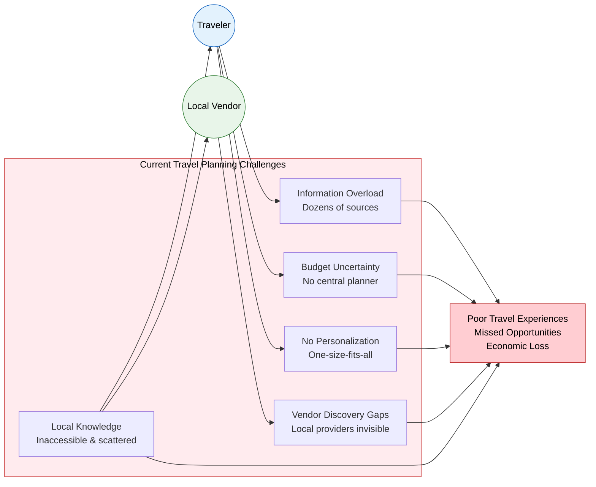

### 1.2 Opportunity

The global travel and tourism industry continues to rebound strongly, with digital travel planning becoming the dominant method for trip preparation across all age groups. There is a substantial and growing market opportunity for an intelligent, AI-assisted travel platform that:

- Consolidates all essential travel information into one accessible web-based destination.
- Leverages Artificial Intelligence to deliver personalized, budget-aware travel recommendations.
- Empowers local vendors and service providers to list and manage their offerings directly.
- Promotes cultural tourism and authentic local experiences that larger platforms consistently overlook.
- Serves travelers who are budget-conscious and seeking genuine cultural immersion rather than mass-market itineraries.

The rise of conversational AI technology presents a unique opportunity to create a travel assistant that interacts naturally with users, understands their needs, and delivers actionable recommendations in real time.

### 1.3 Proposed Solution

The **AI Powered Traveling Management System** is a comprehensive, web-based platform designed to simplify and enrich the travel planning experience. The system will provide travelers with an intelligent AI chatbot capable of understanding their budget, duration, destination preferences, and personal interests, and will return curated travel plans, accommodation options, transport information, and local experience guides.

The platform will also create a structured marketplace for vendors — including hotels, guesthouses, and local service providers — to register, list their services, and manage bookings. A robust administrative layer will ensure quality control, vendor verification, and content accuracy across the platform.

Key solution components include:

- An AI-powered travel planning chatbot for personalized destination and itinerary recommendations.
- A hotel and accommodation search and booking module.
- Transport availability and cost information for both intercity and local travel.
- Comprehensive tourist spot directories including entry fees and visiting hours.
- Traditional food and cultural market guides for authentic local experiences.
- Route planning tools with estimated distances and travel durations.
- Full user, vendor, and administrative management capabilities.

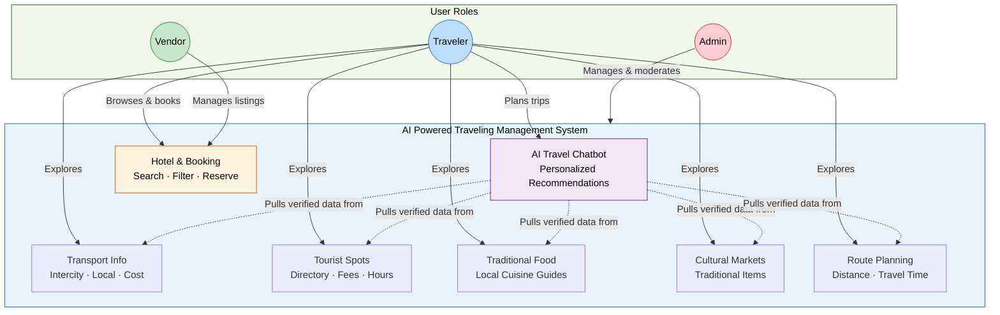

### 1.4 Expected Business Value

The AI Powered Traveling Management System is expected to deliver significant value across multiple dimensions:

- **For Travelers:** Reduced trip planning time, improved budget management, and access to authentic, personalized travel experiences that align with their preferences and financial capacity.
- **For Vendors:** A direct digital channel to reach a wider audience of potential customers, at low cost, without dependence on large international aggregators.
- **For the Tourism Sector:** Increased engagement with local and regional tourism destinations, boosting footfall to lesser-known but culturally rich locations.
- **For the Platform Owner:** A scalable business model with multiple revenue potential streams including vendor subscriptions, featured listings, and premium traveler services in future phases.
- **For Local Economies:** Improved visibility and bookings for small businesses, traditional markets, and cultural sites, contributing to sustainable community-based tourism.

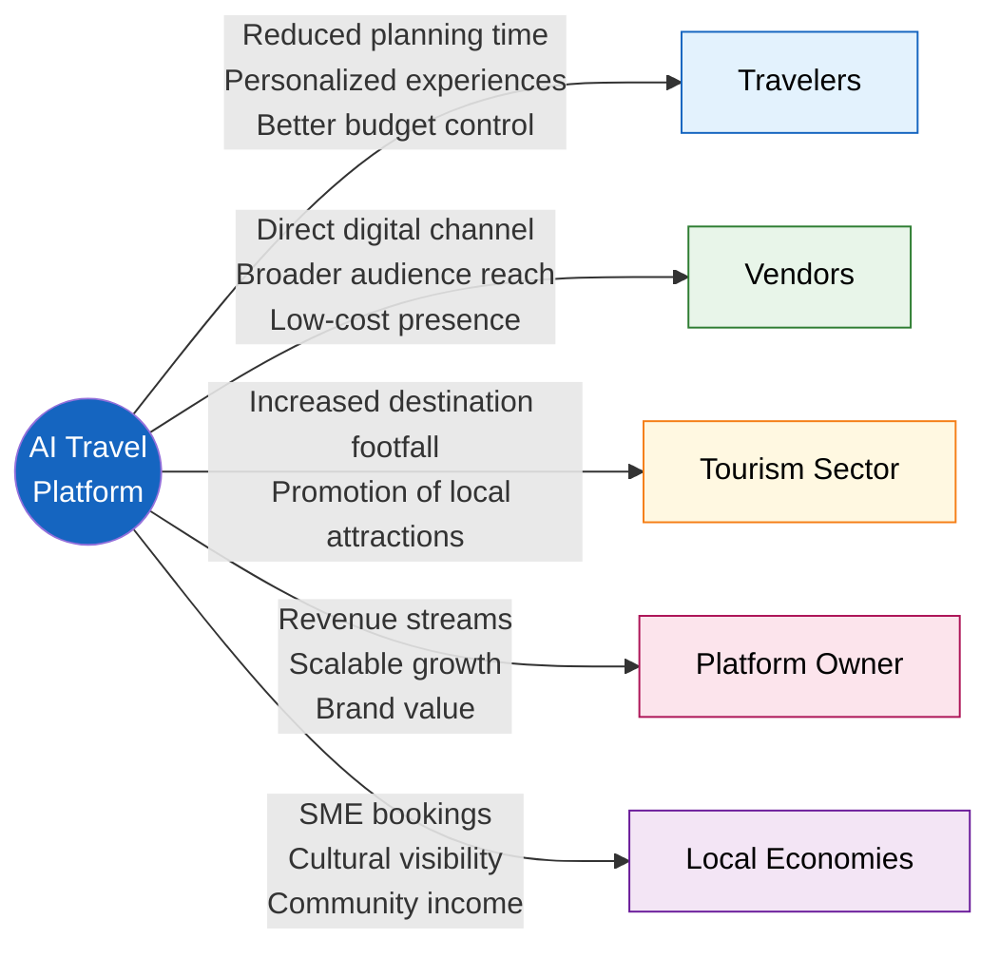

---

## 2. Business Objectives

The following measurable business objectives have been defined to guide the development and evaluation of the AI Powered Traveling Management System. Each objective is aligned with both user needs and broader tourism industry goals.

### 2.1 Improve Travel Planning Efficiency

**Objective:** Enable travelers to complete a comprehensive travel plan — including destination, accommodation, transport, and local activities — within a single platform session, reducing the need to consult multiple external sources.

**Target Measure:** At least 70% of registered travelers should be able to complete a basic travel plan within one platform visit.

### 2.2 Reduce Travel Planning Time

**Objective:** Significantly reduce the average time a traveler spends researching and organizing a trip by providing AI-generated, personalized suggestions upon input of basic parameters such as budget, destination, and travel duration.

**Target Measure:** Reduce average trip planning time from an estimated industry average of 5–7 hours to under 1.5 hours using the platform.

### 2.3 Increase Tourism Engagement

**Objective:** Drive greater awareness and visitation to local and regional tourist destinations, cultural markets, traditional food outlets, and lesser-known attractions by making them discoverable through the platform.

**Target Measure:** Achieve a minimum of 500 active tourist spot listings within the first six months of launch, with measurable user engagement on each.

### 2.4 Support Local Vendors

**Objective:** Provide a structured, accessible onboarding process for local hotels, guesthouses, and service providers to list and manage their offerings, increasing their digital presence and booking opportunities.

**Target Measure:** Onboard a minimum of 100 verified vendors within the first three months of platform launch.

### 2.5 Build a Reliable and Trustworthy Platform

**Objective:** Establish the platform as a credible and accurate source of travel information through rigorous vendor verification, content moderation, and AI recommendation accuracy.

**Target Measure:** Maintain a platform content accuracy rate of 90% or above, measured through periodic admin audits and user feedback.

### 2.6 Drive User Adoption and Retention

**Objective:** Attract a growing base of registered travelers who return to the platform for multiple trip planning cycles, building habitual platform usage.

**Target Measure:** Achieve 1,000 registered travelers within the first three months and maintain a 30-day return user rate of at least 25%.

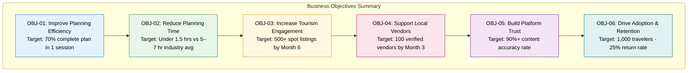

---

## 3. Business Scope

### 3.1 In Scope

The following functional areas and capabilities are included within the scope of the AI Powered Traveling Management System:

#### 3.1.1 AI Travel Planning
The platform will include an AI-powered conversational chatbot that accepts user inputs — such as travel budget, preferred destinations, trip duration, travel group size, and personal interests — and returns personalized travel suggestions, itinerary outlines, and recommendations.

#### 3.1.2 Hotel Listing and Booking
Vendors will be able to register and list hotels, guesthouses, and other accommodation options. Travelers will be able to search for available accommodations based on location, price range, and amenities, and submit booking requests through the platform.

#### 3.1.3 Transport Information
The platform will provide travelers with information about available transport modes between destinations, including estimated costs for intercity travel (bus, train, private car) and local in-city transport options.

#### 3.1.4 Tourist Spot Information
A curated directory of tourist attractions will be maintained within the platform, including entry fees, visiting hours, location details, and brief descriptions to assist travelers in planning their visits.

#### 3.1.5 Traditional Food Information
The platform will feature guides to traditional and local cuisine available at each destination, including information about popular dishes, recommended restaurants or street food locations, and approximate meal costs.

#### 3.1.6 Cultural Markets and Traditional Items
Information about local cultural markets, craft bazaars, and traditional item vendors will be listed on the platform to help travelers discover authentic shopping and cultural experiences.

#### 3.1.7 Route Planning
The platform will offer a route planning feature that displays recommended travel routes between destinations, along with estimated distances, travel durations, and suggested transport modes.

#### 3.1.8 User Management
The system will support the registration, authentication, and profile management of travelers. Users will be able to manage their preferences, view booking history, and update their profiles.

#### 3.1.9 Vendor Management
Hotels and service providers will be able to register as vendors, submit their details for admin approval, and manage their listings, room availability, and pricing through a dedicated vendor dashboard.

#### 3.1.10 Admin Management
Platform administrators will have access to a comprehensive management dashboard to oversee user accounts, approve or reject vendor registrations, manage content accuracy, and monitor platform activity.

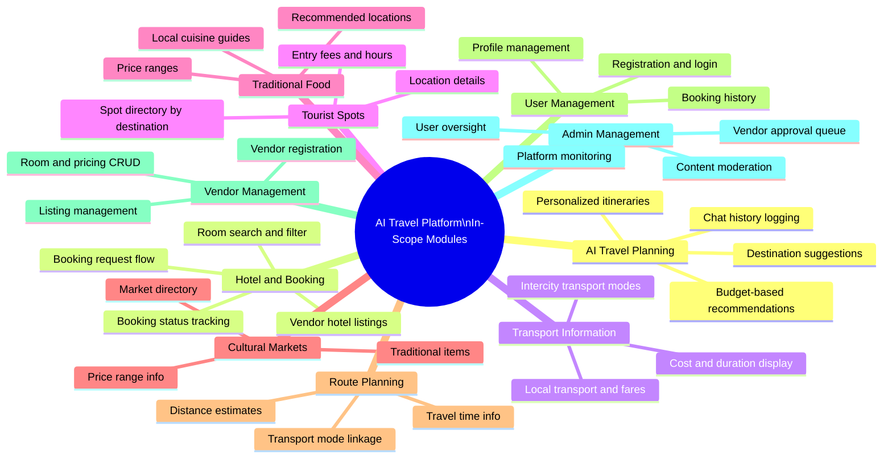

---

### 3.2 Out of Scope

The following capabilities and features are explicitly excluded from the current phase of the project:

| Item | Reason for Exclusion |
|---|---|
| Native Mobile Application (iOS / Android) | Web-based platform only; mobile app development is deferred to a future phase |
| Online Payment Processing | Payment gateway integration is outside the current project scope; booking requests will be managed offline or via vendor-confirmed methods |
| Offline Functionality | The platform requires active internet access; offline access is not supported |
| International Flight or Train Ticketing Integration | Third-party international ticketing APIs and integrations are beyond current scope |
| User Reviews and Ratings System | Planned for a future enhancement phase |
| Multi-language Support | Initial launch will be in English only; localization is deferred |
| Social Media Integration | Social sharing and login via social networks are excluded from this phase |
| Real-time Chat Between Users and Vendors | Live messaging is not included; booking inquiries are managed through structured request forms |

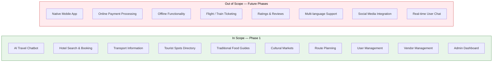

---

## 4. Stakeholder Analysis

The following stakeholders have been identified as having a direct or indirect interest in the AI Powered Traveling Management System. Their roles, interests, and levels of influence on the project have been assessed below.

| **Stakeholder** | **Role** | **Interest in the System** | **Influence Level** |
|---|---|---|---|
| **Travelers (Customers)** | Primary end-users of the platform | Access to accurate, personalized travel information; ease of trip planning; affordable options; reliable booking | High — Their adoption and satisfaction determine platform success |
| **Vendors (Hotel / Service Providers)** | Secondary end-users; content contributors | Increased visibility and bookings; easy-to-use listing management; fair platform policies | High — Content quality and availability depend on vendor engagement |
| **System Owner / Project Sponsor** | Business owner; decision-maker | Return on investment; platform growth; brand reputation; operational sustainability | Very High — Funding, direction, and strategic decisions |
| **Admin Team** | Platform operators and moderators | Manageable workload; effective tools for moderation; clear policies and escalation procedures | High — Responsible for content quality and operational integrity |
| **Tourism Partners** | Government tourism boards, local tourism associations | Promotion of regional destinations; increased tourist footfall; alignment with tourism development goals | Medium — Advisory and promotional influence; not operational |
| **Local Communities** | Indirect beneficiaries | Economic benefit from increased tourism; cultural preservation through visibility | Low-Medium — Not directly involved but are impacted by platform outcomes |

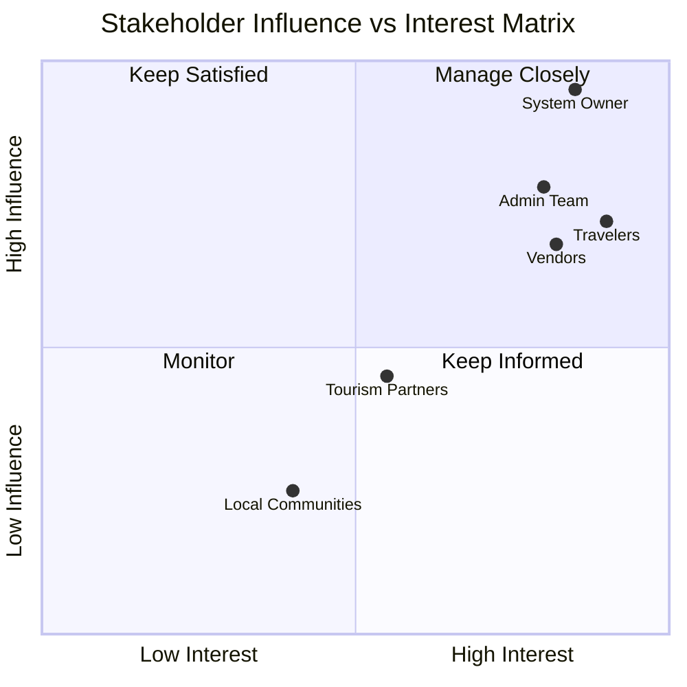

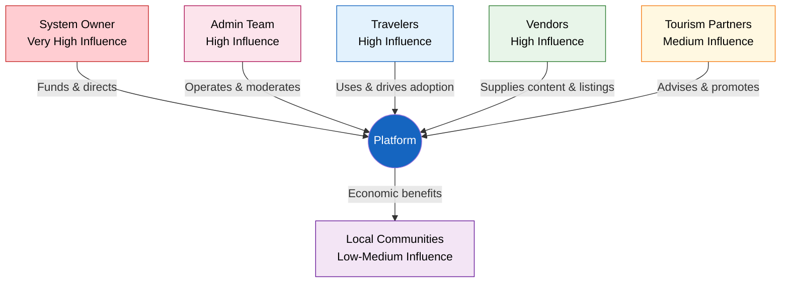

---

## 5. Business Process Overview

This section describes the high-level workflows for each of the three primary user types interacting with the AI Powered Traveling Management System.

### 5.1 Traveler Journey

The traveler journey encompasses the complete lifecycle of a user's experience with the platform, from initial registration through to completing a trip plan and making a booking.

#### Step 1: Registration and Profile Setup
A new traveler visits the platform and completes the self-registration process by providing their name, email address, and password. Upon successful registration, the traveler is prompted to set up a basic preference profile, including travel interests, preferred travel style (budget, mid-range, or premium), and preferred destinations or regions. Email verification may be required to activate the account.

#### Step 2: AI Chatbot Interaction
The traveler navigates to the AI Travel Planning section and initiates a conversation with the AI chatbot. The traveler inputs key parameters such as their available budget, intended travel dates, trip duration, number of travelers, and destination preferences or interests (e.g., cultural experiences, nature, adventure, food). The AI chatbot processes these inputs and generates a personalized travel suggestion, which may include recommended destinations, estimated itineraries, and key highlights.

#### Step 3: Destination Exploration and Selection
Based on the AI's recommendations, the traveler explores destination profiles that include detailed information about tourist spots, traditional food, cultural markets, and transport options. The traveler selects a destination and begins building their travel plan by browsing available accommodation options and local activities.

#### Step 4: Hotel Search and Booking Request
The traveler searches for available hotels or guesthouses at their chosen destination using filters such as price range, location, and available amenities. Upon selecting a preferred accommodation, the traveler submits a booking request through the platform. The system notifies the relevant vendor of the booking inquiry.

#### Step 5: Local Exploration Planning
With accommodation arranged, the traveler uses the platform to explore local transport options, plan routes between attractions, review entry fees for tourist spots, and discover traditional food and cultural market locations. The traveler can save or export their completed travel plan for reference during their trip.

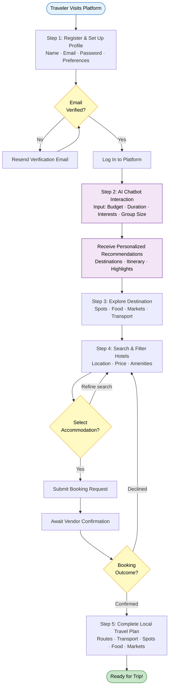

---

### 5.2 Vendor Journey

The vendor journey covers the process by which hotels and service providers register on the platform, gain approval, and manage their listings.

#### Step 1: Vendor Registration
A hotel or service provider visits the platform and accesses the vendor registration section. The vendor provides business information including business name, type of service, physical address, contact details, and supporting documentation (such as a business license or registration certificate). The registration request is submitted for administrative review.

#### Step 2: Admin Approval Process
The Admin Team reviews the vendor's submitted information and supporting documents. If the information is complete and satisfactory, the vendor account is approved and activated. The vendor receives a notification confirming their approval. If the application is incomplete or does not meet requirements, the vendor is notified with details of what corrections are needed.

#### Step 3: Hotel and Service Listing
Once approved, the vendor logs into their dedicated vendor dashboard and creates listings for their hotel rooms or services. Each listing includes property name, location, description, room types, amenities, pricing, availability, and photographs.

#### Step 4: Room and Inventory Management
The vendor maintains their listings by updating room availability on a regular basis, adjusting pricing based on seasons or promotions, and ensuring all listing information remains accurate and current.

#### Step 5: Booking Request Management
When a traveler submits a booking request, the vendor receives a notification through the platform. The vendor reviews the request and confirms or declines it based on availability. Confirmed bookings are tracked within the vendor dashboard.

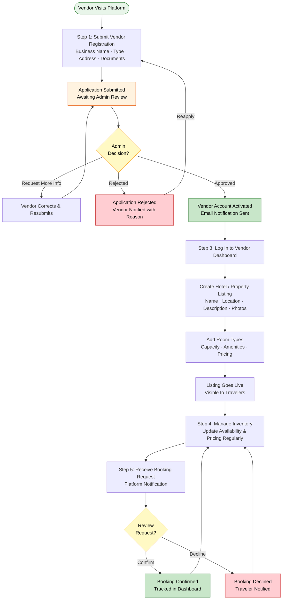

---

### 5.3 Admin Journey

The Admin Team manages the overall operation and integrity of the platform through the following key processes.

#### Step 1: User Account Management
Administrators can view, search, and manage all registered traveler and vendor accounts. This includes the ability to activate, deactivate, or remove accounts that violate platform policies.

#### Step 2: Vendor Approval and Verification
Administrators review all pending vendor registrations, validate submitted business information, and approve or reject applications. Rejected applications are returned with documented reasons to allow the vendor to reapply with corrected information.

#### Step 3: Content Management
Administrators oversee and manage the accuracy of all content published on the platform, including tourist spot listings, transport information, traditional food guides, and cultural market details. This includes the ability to add, edit, or remove content directly.

#### Step 4: System Monitoring and Reporting
Administrators monitor platform usage through a dashboard that provides key metrics such as the number of active users, vendor listings, booking requests, and AI chatbot interactions. Administrators can generate reports to assess platform health and identify areas requiring attention.

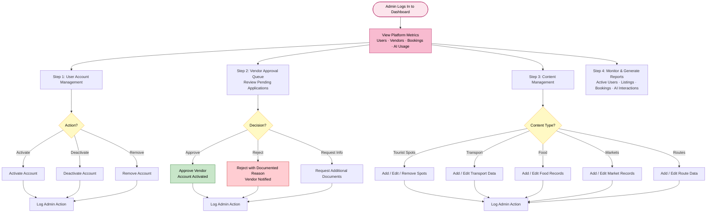

---

## 6. Business Requirements

This section defines the core business requirements of the AI Powered Traveling Management System. Each requirement is uniquely identified and written in clear business language to describe what the system must do to fulfill business needs.

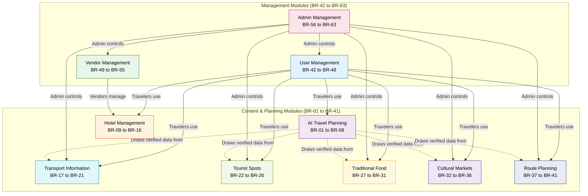

---

### 6.1 AI Travel Planning Module

| **Req. ID** | **Business Requirement** |
|---|---|
| BR-01 | The system shall provide an AI-powered chatbot interface accessible to all registered travelers for the purpose of travel planning. |
| BR-02 | The AI chatbot shall accept traveler inputs including travel budget, destination preferences, trip duration, group size, and personal interests. |
| BR-03 | The AI chatbot shall generate personalized destination recommendations based on the traveler's inputs and stated preferences. |
| BR-04 | The AI chatbot shall suggest a high-level travel itinerary, including suggested activities, accommodation options, and points of interest relevant to the selected destination. |
| BR-05 | The AI chatbot shall provide estimated cost breakdowns covering accommodation, transport, tourist spot entry fees, and food, based on the traveler's budget. |
| BR-06 | The system shall allow travelers to refine AI recommendations by updating their preferences or budget within the same planning session. |
| BR-07 | The AI chatbot shall present responses in a clear, conversational, and user-friendly format accessible to the general public. |
| BR-08 | The system shall log traveler interactions with the AI chatbot to allow the admin team to review and improve recommendation quality over time. |

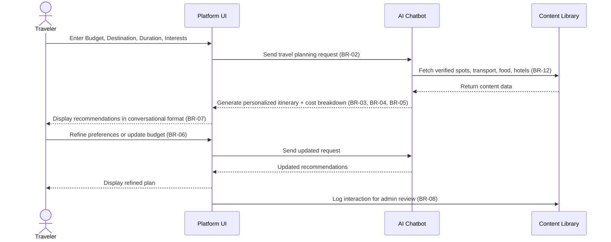

---

### 6.2 Hotel Management Module

| **Req. ID** | **Business Requirement** |
|---|---|
| BR-09 | The system shall allow approved vendors to create and manage hotel or accommodation listings within their vendor dashboard. |
| BR-10 | Each accommodation listing shall include, at a minimum, the property name, location, room types, pricing per night, available amenities, and a property description. |
| BR-11 | The system shall allow vendors to upload photographs for their property listings to enhance traveler decision-making. |
| BR-12 | The system shall enable travelers to search for available accommodations by filtering on destination, price range, room type, and dates. |
| BR-13 | The system shall display only active and approved accommodation listings to travelers. |
| BR-14 | The system shall allow travelers to submit a booking request for a selected accommodation, which will be directed to the relevant vendor for confirmation. |
| BR-15 | The system shall notify vendors of new booking requests through the platform and shall track the status of each booking request (pending, confirmed, declined). |
| BR-16 | Vendors shall be able to update room availability and pricing at any time through their dashboard to ensure listing accuracy. |

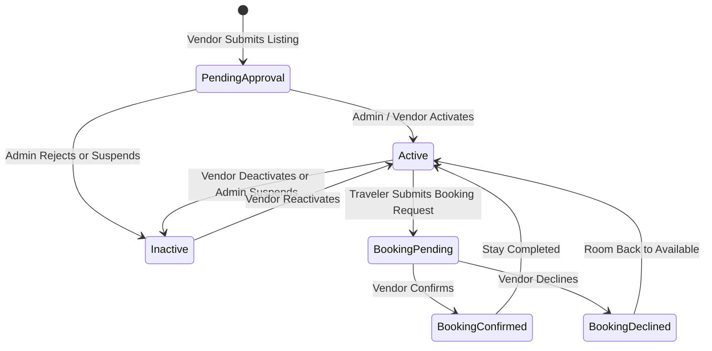

---

### 6.3 Transport Information Module

| **Req. ID** | **Business Requirement** |
|---|---|
| BR-17 | The system shall provide information about available transport modes between major destinations, including bus, train, and private vehicle options. |
| BR-18 | Transport listings shall include estimated travel costs, travel duration, and frequency of service where applicable. |
| BR-19 | The system shall provide information on local in-city transport options, including estimated fares for rickshaws, taxis, auto-rickshaws, and other common local transport modes. |
| BR-20 | Transport information shall be maintained and updated by the Admin Team to ensure accuracy and relevance. |
| BR-21 | The system shall display transport information in a format that is easy for travelers to compare and plan around. |

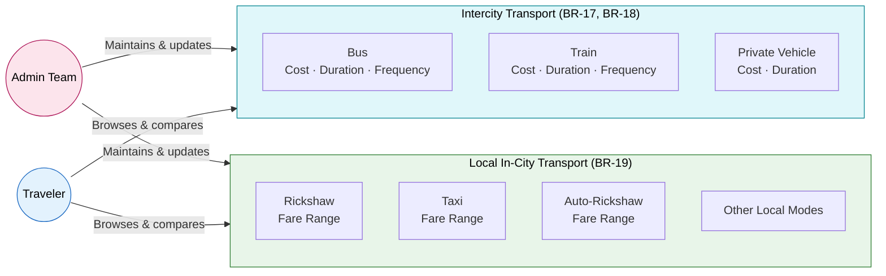

---

### 6.4 Tourist Spots Module

| **Req. ID** | **Business Requirement** |
|---|---|
| BR-22 | The system shall maintain a directory of tourist attractions and points of interest organized by destination. |
| BR-23 | Each tourist spot entry shall include the name of the attraction, location, a brief description, visiting hours, and entry fees where applicable. |
| BR-24 | The system shall allow administrators to add, update, and remove tourist spot listings as required. |
| BR-25 | Travelers shall be able to browse tourist spots by destination or search for specific attractions using keywords. |
| BR-26 | Tourist spot information provided by the AI chatbot shall be sourced from the same verified directory maintained by administrators. |

---

### 6.5 Traditional Food Module

| **Req. ID** | **Business Requirement** |
|---|---|
| BR-27 | The system shall include a traditional food information section for each destination, listing popular local dishes and food experiences. |
| BR-28 | Each food entry shall include the name of the dish, a brief description of its cultural significance or taste profile, and an approximate cost range. |
| BR-29 | The system shall indicate recommended locations or areas where travelers can find each traditional food item (e.g., specific markets, streets, or restaurants). |
| BR-30 | Administrators shall be responsible for creating and maintaining all traditional food content on the platform. |
| BR-31 | The AI chatbot shall be able to include traditional food recommendations as part of a destination travel plan when relevant to the traveler's preferences. |

---

### 6.6 Cultural Markets and Traditional Items Module

| **Req. ID** | **Business Requirement** |
|---|---|
| BR-32 | The system shall provide a directory of cultural markets, craft bazaars, and traditional item vendors for each destination. |
| BR-33 | Each market listing shall include the market name, location, operating days and hours, and a description of the types of items available. |
| BR-34 | The system shall indicate approximate price ranges for commonly purchased traditional items or crafts at each market where information is available. |
| BR-35 | Administrators shall manage all cultural market content, ensuring listings are accurate and up to date. |
| BR-36 | Travelers shall be able to browse cultural market listings as part of their destination exploration experience on the platform. |

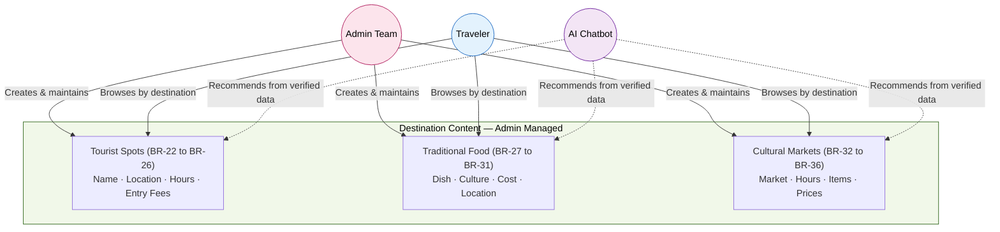

---

### 6.7 Route Planning Module

| **Req. ID** | **Business Requirement** |
|---|---|
| BR-37 | The system shall provide a route planning feature that allows travelers to input a starting point and destination to receive route information. |
| BR-38 | Route results shall display the estimated distance between the origin and destination. |
| BR-39 | Route results shall include an estimated travel time based on the suggested mode of transport. |
| BR-40 | The system shall suggest one or more recommended routes where multiple options exist, indicating the most practical or cost-effective option for the traveler. |
| BR-41 | Route planning information shall be integrated with transport cost data to provide travelers with an estimated journey cost alongside distance and time. |

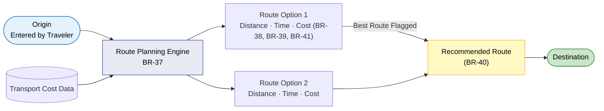

---

### 6.8 User Management Module

| **Req. ID** | **Business Requirement** |
|---|---|
| BR-42 | The system shall allow new travelers to self-register on the platform by providing their name, email address, and a secure password. |
| BR-43 | The system shall require email verification upon traveler registration to confirm account authenticity. |
| BR-44 | Registered travelers shall be able to log in to the platform using their registered email address and password. |
| BR-45 | Travelers shall be able to view and update their personal profile information, including name, contact details, and travel preferences. |
| BR-46 | The system shall maintain a history of each traveler's booking requests and AI chatbot interactions, accessible from their profile. |
| BR-47 | Travelers shall be able to reset their password through a secure, email-based password recovery process. |
| BR-48 | The system shall prevent unauthorized access to traveler accounts through appropriate session management and access controls. |

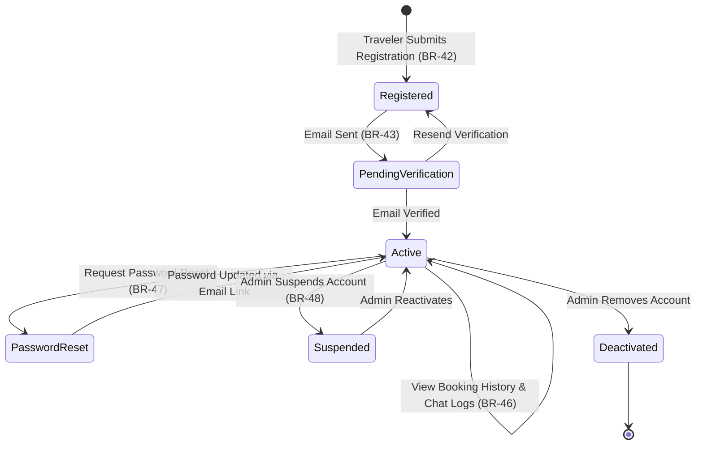

---

### 6.9 Vendor Management Module

| **Req. ID** | **Business Requirement** |
|---|---|
| BR-49 | The system shall allow hotels and service providers to submit a vendor registration application, including business name, type, location, contact details, and supporting documentation. |
| BR-50 | Vendor accounts shall remain inactive and invisible to travelers until formally approved by the Admin Team. |
| BR-51 | Approved vendors shall have access to a dedicated vendor dashboard from which they can manage all their listings, availability, and pricing. |
| BR-52 | Vendors shall be able to add multiple room types or service offerings under a single vendor account. |
| BR-53 | The system shall notify vendors by email when their registration is approved or rejected. |
| BR-54 | Vendors shall be able to update their business profile information and resubmit for admin review if changes are significant. |
| BR-55 | The system shall allow the Admin Team to suspend or deactivate a vendor account if the vendor violates platform policies or provides consistently inaccurate information. |

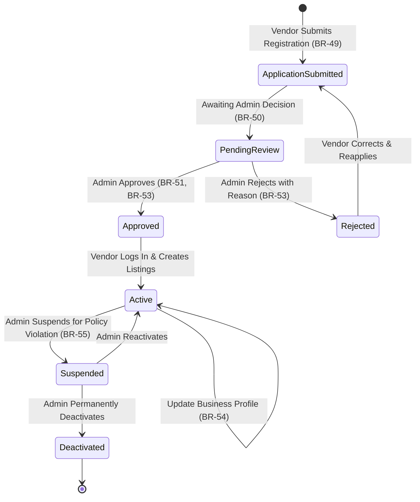

---

### 6.10 Admin Management Module

| **Req. ID** | **Business Requirement** |
|---|---|
| BR-56 | The system shall provide a dedicated administrator dashboard accessible only to authorized admin users. |
| BR-57 | Administrators shall be able to view, search, filter, and manage all registered traveler and vendor accounts. |
| BR-58 | The system shall present administrators with a queue of pending vendor registration applications for review and action. |
| BR-59 | Administrators shall be able to approve, reject, or request further information from vendors through the admin dashboard. |
| BR-60 | Administrators shall be able to create, edit, and remove all content categories on the platform, including tourist spots, transport information, traditional food, and cultural markets. |
| BR-61 | The system shall provide administrators with a summary dashboard displaying key usage metrics, including the number of active users, total listings, and booking request volumes. |
| BR-62 | Administrators shall be able to deactivate or permanently remove traveler or vendor accounts that breach platform terms of use. |
| BR-63 | The system shall maintain an activity log of all administrative actions for accountability and audit purposes. |

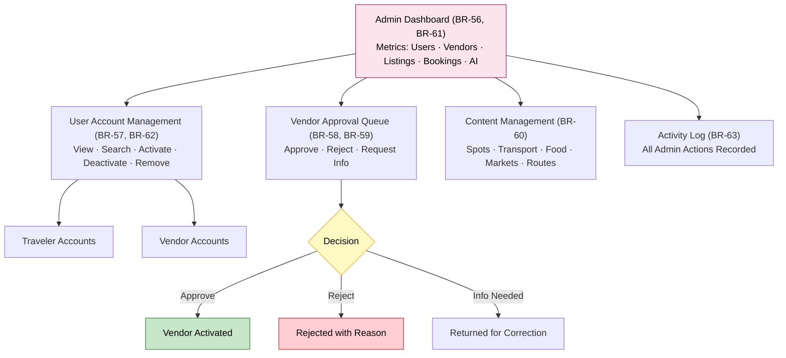

---

## 7. Business Rules

Business rules define the operational policies and constraints that govern how the AI Powered Traveling Management System must behave in specific situations. These rules are non-negotiable and must be enforced consistently throughout the platform.

### 7.1 Vendor and Listing Rules

- **BR-Rule-01:** A vendor account must receive explicit approval from an Administrator before any of its listings become visible to travelers on the platform.
- **BR-Rule-02:** Only listings marked as "Active" by the vendor or administrator shall be displayed to travelers. Inactive or suspended listings must be hidden from public view.
- **BR-Rule-03:** Vendors are required to maintain accurate and current information in all their listings. Listings found to contain significantly inaccurate information may be suspended pending correction.
- **BR-Rule-04:** A vendor may not operate more than one active account on the platform. Duplicate vendor registrations are subject to removal.
- **BR-Rule-05:** Pricing information displayed on accommodation listings must be in the platform's designated currency and must reflect the actual cost to the traveler without hidden charges.

### 7.2 Traveler and Booking Rules

- **BR-Rule-06:** A traveler must complete registration and verify their email address before they are permitted to submit booking requests or interact with the AI travel planning chatbot.
- **BR-Rule-07:** A booking request submitted by a traveler does not constitute a confirmed booking until the vendor explicitly accepts the request within the platform.
- **BR-Rule-08:** Travelers may not submit more than one pending booking request for the same property for overlapping dates.
- **BR-Rule-09:** Travelers are responsible for verifying accommodation details, pricing, and availability directly with the vendor prior to finalizing travel arrangements.

### 7.3 Content and Information Rules

- **BR-Rule-10:** All tourist spot, transport, traditional food, and cultural market content must be reviewed and approved by the Admin Team before it is published on the platform.
- **BR-Rule-11:** The platform must not display any content that has not been verified and approved by an administrator.
- **BR-Rule-12:** AI-generated travel suggestions must be based solely on data stored within the platform's verified content library and must not fabricate or assume information not present in the system.
- **BR-Rule-13:** Entry fees, transport costs, and pricing information must be reviewed for accuracy at least once every three months by the Admin Team.

### 7.4 Access and Security Rules

- **BR-Rule-14:** Administrative functions are accessible exclusively to accounts designated with the Administrator role. No traveler or vendor account may access administrative features.
- **BR-Rule-15:** All user passwords must meet a minimum security standard defined by the platform (minimum length, use of alphanumeric characters).
- **BR-Rule-16:** User sessions shall expire after a defined period of inactivity to prevent unauthorized access.

```mermaid
graph TD
    subgraph VLR["Vendor & Listing Rules"]
        VR1["Rule-01: Admin approval required\nbefore listing is visible"]
        VR2["Rule-02: Only 'Active' listings\nshown to travelers"]
        VR3["Rule-03: Accurate listing data\nmandatory at all times"]
        VR4["Rule-04: One active account\nper vendor only"]
        VR5["Rule-05: No hidden charges\nPricing must be transparent"]
    end

    subgraph TBR["Traveler & Booking Rules"]
        TR1["Rule-06: Email verified\nbefore booking or AI access"]
        TR2["Rule-07: Booking = PENDING\nuntil vendor explicitly confirms"]
        TR3["Rule-08: No duplicate pending\nbookings — same property & dates"]
        TR4["Rule-09: Traveler must verify\ndetails directly with vendor"]
    end

    subgraph CIR["Content & Information Rules"]
        CR1["Rule-10: All content admin-reviewed\nbefore publishing"]
        CR2["Rule-11: No unverified content\never displayed"]
        CR3["Rule-12: AI uses only\nplatform-verified data"]
        CR4["Rule-13: Fees & prices reviewed\nevery 3 months"]
    end

    subgraph ASR["Access & Security Rules"]
        AR1["Rule-14: Admin features\nAdmin role only"]
        AR2["Rule-15: Passwords must meet\nminimum security standard"]
        AR3["Rule-16: Sessions expire\nafter inactivity"]
    end

    style VLR fill:#FFF3E0,stroke:#E65100,color:#000
    style TBR fill:#E3F2FD,stroke:#1565C0,color:#000
    style CIR fill:#E8F5E9,stroke:#2E7D32,color:#000
    style ASR fill:#FCE4EC,stroke:#AD1457,color:#000
```

---

## 8. User Roles and Permissions

The platform defines three primary user roles, each with a distinct set of access rights and functional permissions.

```mermaid
graph LR
    subgraph ROLES["Role Hierarchy"]
        A[("Admin\nFull Platform Access")]
        V[("Vendor\nListing & Booking Scope")]
        T[("Traveler\nBrowsing & Booking Scope")]
    end

    A -->|Manages| V
    A -->|Manages| T
    V -->|Serves| T

    style A fill:#FFCDD2,stroke:#C62828,color:#000
    style V fill:#C8E6C9,stroke:#2E7D32,color:#000
    style T fill:#BBDEFB,stroke:#1565C0,color:#000
```

### 8.1 Traveler (Customer) Role

Travelers are general public users who access the platform to plan trips and make booking requests. The following permissions apply to the Traveler role:

| **Feature / Function** | **Access Level** |
|---|---|
| Self-registration and account creation | Permitted |
| Login and password management | Permitted |
| Personal profile management | Permitted — own profile only |
| AI chatbot interaction and travel planning | Permitted — registered users only |
| Destination browsing and exploration | Permitted |
| Hotel and accommodation search | Permitted |
| Booking request submission | Permitted — registered users only |
| Booking history view | Permitted — own bookings only |
| Tourist spot information viewing | Permitted |
| Transport information viewing | Permitted |
| Traditional food information viewing | Permitted |
| Cultural market information viewing | Permitted |
| Route planning tool usage | Permitted |
| Vendor account management | Not Permitted |
| Content creation or editing | Not Permitted |
| Admin dashboard access | Not Permitted |

---

### 8.2 Vendor (Hotel / Service Provider) Role

Vendors are registered business entities that list and manage accommodation and service offerings on the platform. The Vendor role is activated only upon Admin approval.

| **Feature / Function** | **Access Level** |
|---|---|
| Vendor registration application submission | Permitted |
| Vendor dashboard access | Permitted — approved vendors only |
| Business profile management | Permitted — own profile only |
| Accommodation and service listing creation | Permitted — approved vendors only |
| Room type and amenity management | Permitted — own listings only |
| Pricing and availability updates | Permitted — own listings only |
| Photograph uploads for listings | Permitted — own listings only |
| Booking request management (view / confirm / decline) | Permitted — own bookings only |
| Traveler account management | Not Permitted |
| Other vendors' listings management | Not Permitted |
| Content creation for public information sections | Not Permitted |
| Admin dashboard access | Not Permitted |

---

### 8.3 Administrator Role

Administrators are platform staff responsible for overseeing and managing all aspects of the AI Powered Traveling Management System.

| **Feature / Function** | **Access Level** |
|---|---|
| Admin dashboard access | Permitted |
| All traveler account management | Full Access |
| All vendor account management | Full Access |
| Vendor registration review and approval | Permitted |
| All accommodation and service listing management | Full Access |
| Tourist spot content creation, editing, and deletion | Permitted |
| Transport information management | Permitted |
| Traditional food content management | Permitted |
| Cultural market content management | Permitted |
| Route planning data management | Permitted |
| AI chatbot content and data management | Permitted |
| Platform usage metrics and reporting | Permitted |
| Admin activity log review | Permitted |
| System-wide policy enforcement | Permitted |

```mermaid
graph TD
    subgraph TRAVELER_P["Traveler Permissions"]
        TP1[Register & Login]
        TP2[Own Profile Only]
        TP3[AI Chatbot Access]
        TP4[Browse All Destinations]
        TP5[Search Hotels]
        TP6[Submit Booking Requests]
        TP7[View Own Bookings]
        TP8[View Spots · Food · Markets · Routes · Transport]
        TP9[Vendor Dashboard — NOT PERMITTED]
        TP10[Content Editing — NOT PERMITTED]
        TP11[Admin Panel — NOT PERMITTED]
    end

    subgraph VENDOR_P["Vendor Permissions"]
        VP1[Register & Login]
        VP2[Own Business Profile]
        VP3[Vendor Dashboard — Approved Only]
        VP4[Create & Edit Own Listings]
        VP5[Manage Own Room Types]
        VP6[Update Own Pricing & Availability]
        VP7[View & Action Own Bookings]
        VP8[Other Vendor Listings — NOT PERMITTED]
        VP9[Traveler Accounts — NOT PERMITTED]
        VP10[Admin Panel — NOT PERMITTED]
    end

    subgraph ADMIN_P["Admin Permissions"]
        AP1[Full Admin Dashboard]
        AP2[All User Accounts — Full Access]
        AP3[All Vendor Accounts — Full Access]
        AP4[Vendor Approval & Rejection]
        AP5[All Hotel Listings — Full Access]
        AP6[Tourist Spot Content CRUD]
        AP7[Transport Content CRUD]
        AP8[Food & Market Content CRUD]
        AP9[Route Data CRUD]
        AP10[AI Content & Chat Logs]
        AP11[Platform Metrics & Reports]
        AP12[Admin Activity Log]
    end

    style TRAVELER_P fill:#E3F2FD,stroke:#1565C0,color:#000
    style VENDOR_P fill:#E8F5E9,stroke:#2E7D32,color:#000
    style ADMIN_P fill:#FCE4EC,stroke:#AD1457,color:#000
```

---

## 9. Assumptions

The following assumptions have been made in defining the scope, requirements, and design of the AI Powered Traveling Management System. These assumptions underpin the project's planning and must be validated before or during the implementation phase.

1. **Internet Connectivity:** It is assumed that all targeted users — travelers, vendors, and administrators — have reliable access to the internet and standard web browsers compatible with a modern, responsive web application.

2. **Vendor Data Responsibility:** It is assumed that registered and approved vendors will take primary responsibility for maintaining the accuracy and currency of their listings, including pricing, room availability, and property information.

3. **Regional Launch Focus:** The initial launch of the platform will target a specific region or country. Full national or international expansion is outside the scope of the first release.

4. **Admin Capacity:** It is assumed that a dedicated team of administrators will be available from the point of launch to manage vendor approvals, content moderation, and day-to-day platform operations.

5. **Traveler Digital Literacy:** It is assumed that the majority of target travelers possess a basic level of digital literacy sufficient to navigate a web-based platform, complete a registration form, and interact with an AI chatbot interface.

6. **AI Recommendation Quality:** It is assumed that the AI chatbot will be trained and configured using quality travel data relevant to the target region prior to launch, and that its recommendations will reflect reasonable accuracy for the intended use cases.

7. **Vendor Willingness to Engage:** It is assumed that local hotels and service providers in the target region will see value in registering on the platform and will actively maintain their listings once onboarded.

8. **Legal and Regulatory Compliance:** It is assumed that the platform owner will ensure all business operations comply with applicable local laws and regulations, including those related to tourism, commerce, and consumer protection.

9. **Content Accuracy Baseline:** It is assumed that tourist spot information, transport costs, and cultural content will be researched and entered accurately by the Admin Team during the platform setup phase before launch.

10. **Single Language Operation:** The platform will operate exclusively in English during the initial launch phase. Content will be authored and maintained in English.

```mermaid
graph TD
    subgraph ASSUMPTIONS["Key Assumptions — Must be Validated"]
        A1["A1: Internet connectivity\navailable for all users"]
        A2["A2: Vendors own\ndata accuracy"]
        A3["A3: Regional launch\nfocus only"]
        A4["A4: Admin team\nready at launch"]
        A5["A5: Travelers have\nbasic digital literacy"]
        A6["A6: AI trained on\nquality regional data"]
        A7["A7: Vendors willing\nto engage actively"]
        A8["A8: Legal compliance\nby platform owner"]
        A9["A9: Content library\npopulated pre-launch"]
        A10["A10: English-only\ninitial operation"]
    end

    A1 & A2 & A3 & A4 & A5 --> LAUNCH_RISK{Launch Risk\nif Not Validated}
    A6 & A7 & A8 & A9 & A10 --> LAUNCH_RISK

    style ASSUMPTIONS fill:#E8F4FD,stroke:#1565C0,color:#000
    style LAUNCH_RISK fill:#FFCDD2,stroke:#C62828,color:#000
```

---

## 10. Constraints

The following constraints define the limitations within which the AI Powered Traveling Management System must be developed and operated. These constraints are inherent to the current phase of the project and must be respected in all planning and decision-making.

1. **Web-Based Delivery Only:** The platform will be developed and delivered exclusively as a web-based application. Native mobile applications for iOS or Android are not included in this phase.

2. **No Online Payment Processing:** The system will not include an integrated payment gateway. Booking requests will be managed through the platform, but financial transactions between travelers and vendors will be handled outside the platform through mutually agreed methods.

3. **Manual Vendor Verification:** Vendor registration approval will be conducted manually by the Admin Team. There is no automated verification system in this phase, which means vendor onboarding timelines will depend on admin availability and workload.

4. **Limited Initial Resource Availability:** The project is subject to constraints on budget and personnel during the initial build and launch phase. Feature prioritization will reflect these resource limitations.

5. **Content Population Dependency:** The usefulness of the platform — particularly the AI travel planning function — is contingent on a sufficiently populated content library. The quality of the launch experience will depend on the volume and accuracy of data entered before go-live.

6. **No Real-Time Data Feeds:** The platform will not integrate with external real-time data sources such as live transport schedules or dynamic pricing APIs in this phase. All information will be manually entered and periodically updated by administrators.

7. **AI Chatbot Scope Limitation:** The AI chatbot will provide travel planning guidance and recommendations based on data within the platform. It is not designed to perform complex financial analysis, legal advice, or handle sensitive personal matters.

8. **Single Region Content:** The initial content library — including tourist spots, food guides, cultural markets, and transport information — will cover a defined geographic region only. Expansion to additional regions will require additional content development efforts.

```mermaid
graph LR
    subgraph CONSTRAINTS["Phase 1 Constraints"]
        C1["Web-Based Only\nNo native mobile app"]
        C2["No Payment Gateway\nOffline transactions only"]
        C3["Manual Vendor Verification\nAdmin-dependent timeline"]
        C4["Limited Resources\nBudget & personnel constraints"]
        C5["Content Dependency\nPre-launch population required"]
        C6["No Real-Time Feeds\nManually updated data"]
        C7["AI Scope Limited\nPlatform data only"]
        C8["Single Region\nNo multi-region at launch"]
    end

    C1 & C2 & C3 & C4 --> IMPACT1[Scope & Timeline Impact]
    C5 & C6 & C7 & C8 --> IMPACT2[Feature & Quality Impact]

    IMPACT1 & IMPACT2 --> FUTURE[Future Phases Address\nThese Constraints]

    style CONSTRAINTS fill:#FFF3E0,stroke:#E65100,color:#000
    style IMPACT1 fill:#FFCDD2,stroke:#C62828,color:#000
    style IMPACT2 fill:#FFCDD2,stroke:#C62828,color:#000
    style FUTURE fill:#C8E6C9,stroke:#2E7D32,color:#000
```

---

## 11. Risk Analysis and Mitigation

The following risks have been identified in relation to the AI Powered Traveling Management System. Each risk is assessed for likelihood and impact, and a mitigation strategy is proposed.

### 11.1 Risk Register

| **Risk ID** | **Risk Description** | **Likelihood** | **Impact** | **Mitigation Strategy** |
|---|---|---|---|---|
| R-01 | Inaccurate or outdated vendor data (wrong pricing, availability) | High | High | Require vendors to review and confirm listing accuracy on a monthly basis; Admin Team to conduct periodic spot-checks; implement a mechanism for travelers to flag inaccurate information |
| R-02 | Low user adoption due to limited awareness | Medium | High | Develop a pre-launch marketing and outreach campaign targeting traveler communities; partner with local tourism boards; offer early adopter incentives |
| R-03 | AI chatbot providing inaccurate or misleading travel suggestions | Medium | High | Ensure AI is trained on verified, high-quality content prior to launch; implement admin review of chatbot outputs during initial operation; provide a feedback mechanism for travelers to report poor recommendations |
| R-04 | Low vendor participation and insufficient listing volume | Medium | High | Proactively conduct vendor outreach campaigns; provide a simple and guided onboarding process; assign dedicated admin support for vendor onboarding in the first 60 days |
| R-05 | Slow admin approval turnaround causing vendor dissatisfaction | Medium | Medium | Define and publish clear SLA targets for vendor application reviews; ensure adequate admin staffing; implement automated acknowledgment emails to vendors upon application receipt |
| R-06 | Platform content becoming stale or outdated over time | High | Medium | Establish a content review schedule; assign content ownership to admin team members; notify vendors periodically to review and update their listings |
| R-07 | Security vulnerabilities leading to unauthorized data access | Low | Very High | Implement industry-standard security practices; conduct security assessments prior to launch; define and enforce strict access control policies |
| R-08 | Traveler dissatisfaction due to unconfirmed or miscommunicated bookings | Medium | High | Ensure clear communication of the booking request process to travelers; send automated status updates to travelers for each stage of the booking request lifecycle |
| R-09 | Admin team workload becoming unmanageable as platform scales | Medium | Medium | Monitor admin workload metrics from launch; plan for team expansion based on platform growth; identify tasks that can be streamlined through process improvement |
| R-10 | Dependency on a single region limiting platform growth | Low | Medium | Design the content management system to be extensible to new regions from the outset; plan a phased geographic expansion roadmap for subsequent releases |

```mermaid
quadrantChart
    title Risk Matrix — Likelihood vs Impact
    x-axis Low Likelihood --> High Likelihood
    y-axis Low Impact --> Very High Impact
    quadrant-1 Critical — Immediate Action Required
    quadrant-2 High Priority — Monitor & Mitigate
    quadrant-3 Low Priority — Watch
    quadrant-4 Moderate — Plan Mitigation
    R-07 Security Vulnerabilities: [0.15, 0.95]
    R-01 Inaccurate Vendor Data: [0.80, 0.85]
    R-03 Inaccurate AI Suggestions: [0.52, 0.82]
    R-08 Booking Miscommunication: [0.55, 0.78]
    R-02 Low User Adoption: [0.50, 0.75]
    R-04 Low Vendor Participation: [0.55, 0.72]
    R-06 Stale Platform Content: [0.75, 0.55]
    R-05 Slow Admin Approval: [0.55, 0.50]
    R-09 Admin Workload Scale: [0.50, 0.48]
    R-10 Single Region Dependency: [0.25, 0.45]
```

```mermaid
graph TD
    subgraph CRITICAL["Critical Risks — Immediate Mitigation"]
        R07["R-07: Security Vulnerabilities\nLow Likelihood · Very High Impact\nMitigation: Security assessments · Access controls"]
        R01["R-01: Inaccurate Vendor Data\nHigh Likelihood · High Impact\nMitigation: Monthly reviews · Admin spot-checks"]
    end

    subgraph HIGH["High Priority Risks"]
        R02["R-02: Low User Adoption\nMitigation: Marketing · Tourism board partnerships"]
        R03["R-03: AI Inaccuracy\nMitigation: Quality training data · Admin review"]
        R04["R-04: Low Vendor Participation\nMitigation: Outreach · Guided onboarding"]
        R08["R-08: Booking Miscommunication\nMitigation: Automated status updates"]
    end

    subgraph MODERATE["Moderate Risks — Plan & Monitor"]
        R05["R-05: Slow Admin Approval\nMitigation: SLA targets · Staffing"]
        R06["R-06: Stale Content\nMitigation: Review schedule · Content ownership"]
        R09["R-09: Admin Workload\nMitigation: Expansion planning"]
        R10["R-10: Single Region Limit\nMitigation: Extensible CMS design"]
    end

    style CRITICAL fill:#FFEBEE,stroke:#C62828,color:#000
    style HIGH fill:#FFF3E0,stroke:#E65100,color:#000
    style MODERATE fill:#FFF9C4,stroke:#F9A825,color:#000
```

---

## 12. Success Metrics (KPIs)

The following Key Performance Indicators (KPIs) will be used to measure the success and health of the AI Powered Traveling Management System following launch. KPIs will be reviewed on a monthly basis by the platform owner and admin team.

### 12.1 User Acquisition and Engagement

| **KPI** | **Description** | **Target (3 Months Post-Launch)** | **Target (6 Months Post-Launch)** |
|---|---|---|---|
| Registered Travelers | Total number of verified, active traveler accounts | 1,000 | 3,000 |
| Monthly Active Users (MAU) | Number of registered travelers who use the platform at least once per month | 500 | 1,500 |
| 30-Day User Return Rate | Percentage of users who return within 30 days of registration | 25% | 35% |
| AI Chatbot Engagement Rate | Percentage of registered users who interact with the AI chatbot | 60% | 70% |

### 12.2 Vendor Performance

| **KPI** | **Description** | **Target (3 Months Post-Launch)** | **Target (6 Months Post-Launch)** |
|---|---|---|---|
| Registered Vendors | Total number of approved and active vendors | 100 | 250 |
| Active Listings | Total number of live accommodation listings on the platform | 300 | 750 |
| Vendor Retention Rate | Percentage of vendors who maintain active listings after 3 months | 70% | 80% |
| Average Vendor Response Time | Average time for vendors to respond to booking requests | ≤ 48 hours | ≤ 24 hours |

### 12.3 Booking Performance

| **KPI** | **Description** | **Target (3 Months Post-Launch)** | **Target (6 Months Post-Launch)** |
|---|---|---|---|
| Booking Requests Submitted | Total number of booking requests submitted by travelers | 200 | 700 |
| Booking Confirmation Rate | Percentage of submitted booking requests confirmed by vendors | 65% | 75% |
| Booking Conversion Rate | Percentage of travelers who view a listing and proceed to submit a booking request | 10% | 15% |

### 12.4 Content and Platform Quality

| **KPI** | **Description** | **Target** |
|---|---|---|
| Tourist Spot Listings | Number of verified tourist spot entries in the directory | 500 at launch |
| Content Accuracy Rate | Percentage of listings passing periodic admin accuracy audits | ≥ 90% at all times |
| Vendor Approval Turnaround | Average time from vendor application submission to admin decision | ≤ 5 business days |
| Admin Review Completion Rate | Percentage of vendor applications reviewed within the defined SLA | ≥ 95% |

### 12.5 Traveler Satisfaction

| **KPI** | **Description** | **Target** |
|---|---|---|
| Traveler Satisfaction Score | Periodic traveler survey measuring overall platform satisfaction (scale of 1–5) | ≥ 4.0 out of 5.0 |
| Support Issue Resolution Time | Average time to resolve traveler-reported issues or complaints | ≤ 3 business days |
| AI Recommendation Relevance | Percentage of travelers who rate AI suggestions as useful or very useful (post-interaction survey) | ≥ 70% |

```mermaid
graph TD
    subgraph KPI_USER["User Acquisition & Engagement"]
        U1["Registered Travelers\n1,000 @ M3 → 3,000 @ M6"]
        U2["Monthly Active Users\n500 @ M3 → 1,500 @ M6"]
        U3["30-Day Return Rate\n25% @ M3 → 35% @ M6"]
        U4["AI Chatbot Engagement\n60% @ M3 → 70% @ M6"]
    end

    subgraph KPI_VENDOR["Vendor Performance"]
        V1["Registered Vendors\n100 @ M3 → 250 @ M6"]
        V2["Active Listings\n300 @ M3 → 750 @ M6"]
        V3["Vendor Retention\n70% @ M3 → 80% @ M6"]
        V4["Avg Response Time\n≤ 48 hrs → ≤ 24 hrs"]
    end

    subgraph KPI_BOOKING["Booking Performance"]
        B1["Booking Requests\n200 @ M3 → 700 @ M6"]
        B2["Confirmation Rate\n65% @ M3 → 75% @ M6"]
        B3["Conversion Rate\n10% → 15%"]
    end

    subgraph KPI_QUALITY["Quality & Satisfaction"]
        Q1["Tourist Spot Listings\n500 at Launch"]
        Q2["Content Accuracy\n≥ 90% Always"]
        Q3["Vendor Approval SLA\n≤ 5 Business Days"]
        Q4["Traveler Satisfaction\n≥ 4.0 / 5.0"]
        Q5["AI Relevance Rating\n≥ 70% Positive"]
    end

    style KPI_USER fill:#E3F2FD,stroke:#1565C0,color:#000
    style KPI_VENDOR fill:#E8F5E9,stroke:#2E7D32,color:#000
    style KPI_BOOKING fill:#FFF3E0,stroke:#E65100,color:#000
    style KPI_QUALITY fill:#F3E5F5,stroke:#6A1B9A,color:#000
```

```mermaid
xychart-beta
    title "KPI Growth Targets — Month 3 vs Month 6"
    x-axis ["Travelers", "MAU", "Vendors", "Listings", "Bookings"]
    y-axis "Count" 0 --> 3000
    bar [1000, 500, 100, 300, 200]
    bar [3000, 1500, 250, 750, 700]
```

---

## 13. Future Business Enhancements

The following enhancements have been identified as valuable additions to the AI Powered Traveling Management System for consideration in future development phases. These items are explicitly out of scope for the initial release but represent a strategic roadmap for the platform's growth and evolution.

### 13.1 Native Mobile Application

Developing native iOS and Android mobile applications will significantly extend the platform's reach, particularly among younger, mobile-first traveler demographics. A mobile app would enable push notifications for booking updates, offline saved itineraries, and a more seamless on-the-go travel experience.

### 13.2 Online Payment Processing

Integrating a secure payment gateway will allow travelers to pay for accommodations and services directly through the platform, eliminating the friction of offline payment coordination. This will increase trust, reduce booking abandonment, and open a platform-level revenue stream through transaction fees.

### 13.3 Traveler Ratings and Reviews System

Introducing a structured ratings and reviews system will enable travelers to share their experiences with accommodations, tourist spots, and vendors. This user-generated content will build platform credibility, assist future travelers in decision-making, and incentivize vendors to maintain high service standards.

### 13.4 Multi-Language Support

Expanding the platform to support multiple languages will open the service to a significantly larger audience, including domestic travelers who are not comfortable in English and international visitors seeking information about local destinations in their native language. Priority languages should be determined based on the primary user demographics of the target region.

### 13.5 Advanced Personalized Recommendations

Enhancing the AI recommendation engine to learn from individual traveler behavior — such as past bookings, browsing patterns, and stated preferences — will enable highly personalized travel suggestions that improve with each interaction. This will increase user satisfaction and platform loyalty over time.

### 13.6 Vendor Subscription and Featured Listing Plans

Introducing tiered vendor subscription models — including options for featured placement in search results, priority support, and enhanced analytics — will create a sustainable recurring revenue model for the platform while giving vendors commercial incentives to participate actively.

### 13.7 Real-Time Transport Data Integration

Connecting the transport information module to real-time data sources — such as official transport authority schedules, live fare updates, and route changes — will ensure travelers always have access to the most accurate and current transport information available.

### 13.8 Interactive Maps and Visual Itinerary Builder

Adding an interactive map interface will allow travelers to visually explore destinations, view the locations of tourist spots, hotels, markets, and food locations, and drag-and-drop points of interest into a visual itinerary. This will significantly enhance the travel planning experience and differentiate the platform from text-heavy alternatives.

### 13.9 Group Travel Planning Features

Introducing tools designed for group travel — such as shared itinerary building, collaborative planning between multiple traveler accounts, and group booking requests — will address the needs of families, friends, and organized tour groups who represent a significant market segment.

### 13.10 Loyalty and Rewards Program

A traveler loyalty program that rewards repeat usage, bookings, and platform engagement with redeemable points or discounts will incentivize long-term user retention and drive higher frequency of platform visits.

```mermaid
gantt
    title Future Enhancement Roadmap — Phased Delivery Plan
    dateFormat  YYYY-MM
    axisFormat  %b %Y
    section Phase 1 — Launch
        Core Platform (Current Scope)         :done, p0, 2026-01, 2026-06
    section Phase 2 — Growth
        Online Payment Processing             :p1, 2026-07, 3M
        Ratings & Reviews System              :p2, 2026-07, 3M
        Real-Time Transport Data              :p3, 2026-09, 2M
    section Phase 3 — Expansion
        Native Mobile Application             :p4, 2026-10, 5M
        Multi-Language Support                :p5, 2026-10, 3M
        Interactive Maps & Itinerary Builder  :p6, 2026-11, 3M
    section Phase 4 — Intelligence
        Advanced Personalized Recommendations :p7, 2027-02, 3M
        Group Travel Planning Features        :p8, 2027-02, 2M
        Vendor Subscription Plans             :p9, 2027-03, 2M
        Loyalty & Rewards Program             :p10, 2027-04, 2M
```

```mermaid
graph LR
    CURRENT["Phase 1\nCore Platform\nLaunch 2026"]

    subgraph P2["Phase 2 — Growth"]
        E1[Online Payment]
        E2[Ratings & Reviews]
        E3[Real-Time Transport]
    end

    subgraph P3["Phase 3 — Expansion"]
        E4[Native Mobile App]
        E5[Multi-Language]
        E6[Interactive Maps]
    end

    subgraph P4["Phase 4 — Intelligence"]
        E7[AI Personalization]
        E8[Group Travel Tools]
        E9[Vendor Subscriptions]
        E10[Loyalty Program]
    end

    CURRENT --> P2 --> P3 --> P4

    style CURRENT fill:#1565C0,color:#fff
    style P2 fill:#E8F5E9,stroke:#2E7D32,color:#000
    style P3 fill:#FFF3E0,stroke:#E65100,color:#000
    style P4 fill:#F3E5F5,stroke:#6A1B9A,color:#000
```

---

## Document Approval

| **Role** | **Name** | **Signature** | **Date** |
|---|---|---|---|
| Project Sponsor / System Owner | | | |
| Lead Business Analyst | | | |
| Admin Team Representative | | | |
| Tourism Partner Representative | | | |

---

## Document Revision History

| **Version** | **Date** | **Author** | **Description of Changes** |
|---|---|---|---|
| 0.1 | February 10, 2026 | Business Analysis Team | Initial draft for internal review |
| 0.5 | February 20, 2026 | Business Analysis Team | Incorporated stakeholder feedback; expanded business requirements section |
| 1.0 | February 28, 2026 | Business Analysis Team | Final version prepared for submission |
| 1.1 | February 28, 2026 | Business Analysis Team | Added Mermaid diagrams throughout all sections |

---

*This document is prepared for business and academic reference purposes. All requirements and specifications contained herein are subject to review and approval by the designated project stakeholders prior to implementation.*

---

**End of Document**