# Backend Business Requirements Document (Backend BRD)
# AI Powered Traveling Management System

---

| **Document Information**       |                                               |
|-------------------------------|-----------------------------------------------|
| **Project Title**             | AI Powered Traveling Management System        |
| **Document Type**             | Backend Business Requirements Document        |
| **Version**                   | 1.0                                           |
| **Prepared By**               | Backend Business Analysis & System Planning Team |
| **Document Status**           | Final Draft                                   |
| **Date**                      | February 28, 2026                             |
| **Backend Technology Stack**  | Java · Spring Boot · Spring Security · JPA/Hibernate · PostgreSQL · Redis · JWT |

---

## Table of Contents

1. [Executive Overview](#1-executive-overview)
2. [Backend Scope](#2-backend-scope)
3. [Backend Stakeholders](#3-backend-stakeholders)
4. [Core Backend Services](#4-core-backend-services)
5. [Backend Business Requirements](#5-backend-business-requirements)
6. [Data Management Requirements](#6-data-management-requirements)
7. [API Responsibility Overview](#7-api-responsibility-overview)
8. [Caching Requirements](#8-caching-requirements)
9. [Security Requirements](#9-security-requirements)
10. [Error Handling and Logging](#10-error-handling-and-logging)
11. [Assumptions](#11-assumptions)
12. [Constraints](#12-constraints)
13. [Risks and Mitigation](#13-risks-and-mitigation)
14. [Future Backend Enhancements](#14-future-backend-enhancements)

---

## 1. Executive Overview

### 1.1 Purpose of the Backend System

The backend system of the **AI Powered Traveling Management System** serves as the central engine responsible for all data processing, business logic execution, service orchestration, and secure communication between the platform's users and its underlying data infrastructure. It is a RESTful, service-oriented backend built on Java and Spring Boot, designed to be reliable, maintainable, and capable of scaling as the platform's user base and content library grow.

The backend does not concern itself with how data is presented to the user — that responsibility belongs entirely to the frontend client. Instead, the backend is solely responsible for ensuring that the correct data is retrieved, validated, transformed, stored, and returned in response to authorized requests. Every piece of business logic — from determining whether a room is available for booking, to processing an AI travel planning request, to enforcing that only approved vendors can publish listings — is owned and enforced by the backend.

### 1.2 Role of the Backend in the Platform

The backend occupies the authoritative middle layer of the platform architecture, sitting between the web client and the data stores. Its responsibilities span the following key domains:

- **Identity and Access Management:** Registering users, validating credentials, generating and verifying JWT tokens, and enforcing role-based access across every protected endpoint.
- **Business Logic Processing:** Executing all rules that govern how the platform operates — from vendor approval requirements to booking eligibility checks to AI query handling.
- **Data Persistence and Retrieval:** Managing all interactions with the PostgreSQL relational database through JPA/Hibernate, ensuring data integrity, consistency, and correctness at all times.
- **Performance Optimization:** Leveraging Redis as a caching layer to reduce database load for frequently requested data such as hotel listings, destination information, and tourist spot directories.
- **AI Service Integration:** Acting as the intermediary between the traveler's travel planning inputs and the external AI provider, managing request formatting, response handling, and conversation history persistence.
- **Booking Lifecycle Management:** Orchestrating the full lifecycle of a booking request — from availability verification through confirmation or rejection — and maintaining an accurate, auditable record of all booking activity.

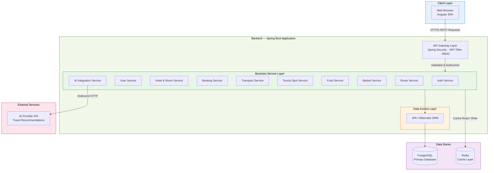
```mermaid
graph TD
    subgraph CLIENT["Client Layer"]
        WEB["Web Browser\nAngular SPA"]
    end

    subgraph BACKEND["Backend — Spring Boot Application"]
        direction TB
        API_GW["API Gateway Layer\nSpring Security · JWT Filter · RBAC"]

        subgraph SERVICES["Business Service Layer"]
            AUTH_S["Auth Service"]
            USER_S["User Service"]
            HOTEL_S["Hotel & Room Service"]
            BOOK_S["Booking Service"]
            TRANS_S["Transport Service"]
            SPOT_S["Tourist Spot Service"]
            FOOD_S["Food Service"]
            MKT_S["Market Service"]
            ROUTE_S["Route Service"]
            AI_S["AI Integration Service"]
        end

        subgraph DATA["Data Access Layer"]
            JPA["JPA / Hibernate ORM"]
        end
    end

    subgraph STORES["Data Stores"]
        PG[("PostgreSQL\nPrimary Database")]
        REDIS[("Redis\nCache Layer")]
    end

    subgraph EXTERNAL["External Services"]
        AI_PROV["AI Provider API\nTravel Recommendations"]
    end

    WEB -->|HTTPS REST Requests| API_GW
    API_GW -->|Validated & Authorized| SERVICES
    SERVICES --> JPA --> PG
    SERVICES -->|Cache Read / Write| REDIS
    AI_S -->|Outbound HTTP| AI_PROV

    style CLIENT fill:#E3F2FD,stroke:#1565C0,color:#000
    style BACKEND fill:#F1F8E9,stroke:#33691E,color:#000
    style SERVICES fill:#E8F5E9,stroke:#2E7D32,color:#000
    style DATA fill:#FFF3E0,stroke:#E65100,color:#000
    style STORES fill:#F3E5F5,stroke:#6A1B9A,color:#000
    style EXTERNAL fill:#FCE4EC,stroke:#AD1457,color:#000
```

### 1.3 Business Value of Backend Services

The backend delivers its business value by being the single source of truth for all platform operations. The correctness, security, and performance of the backend directly determine the quality of the user experience, the trustworthiness of the platform's data, and the commercial viability of the business.

Specifically, the backend creates business value by:

- Ensuring that travelers receive accurate, personalized, and timely travel recommendations, hotel listings, and destination information.
- Protecting vendors by enforcing that only their authorized accounts can manage their own listings and booking requests.
- Providing administrators with reliable, real-time visibility into platform activity so they can make informed operational decisions.
- Reducing platform operational costs through intelligent caching that minimizes redundant database queries for commonly accessed content.
- Building user trust through rigorous input validation, secure token-based authentication, and consistent, transparent error handling.

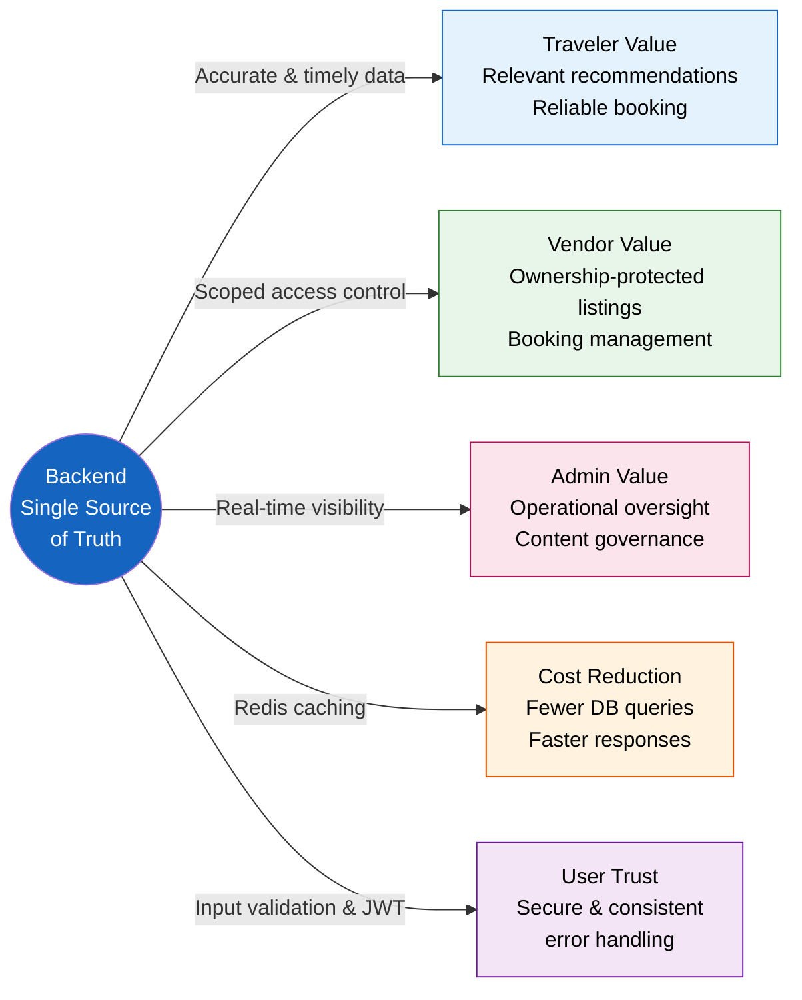
```mermaid
graph LR
    BACKEND(("Backend\nSingle Source\nof Truth"))

    BACKEND -->|Accurate & timely data| TRAVELER["Traveler Value\nRelevant recommendations\nReliable booking"]
    BACKEND -->|Scoped access control| VENDOR["Vendor Value\nOwnership-protected listings\nBooking management"]
    BACKEND -->|Real-time visibility| ADMIN["Admin Value\nOperational oversight\nContent governance"]
    BACKEND -->|Redis caching| COST["Cost Reduction\nFewer DB queries\nFaster responses"]
    BACKEND -->|Input validation & JWT| TRUST["User Trust\nSecure & consistent\nerror handling"]

    style BACKEND fill:#1565C0,color:#fff
    style TRAVELER fill:#E3F2FD,stroke:#1565C0,color:#000
    style VENDOR fill:#E8F5E9,stroke:#2E7D32,color:#000
    style ADMIN fill:#FCE4EC,stroke:#AD1457,color:#000
    style COST fill:#FFF3E0,stroke:#E65100,color:#000
    style TRUST fill:#F3E5F5,stroke:#6A1B9A,color:#000
```

---

## 2. Backend Scope

### 2.1 In Scope

The following backend responsibilities and service categories are within the scope of this document and the current implementation phase.

**API Services:** The backend exposes a comprehensive set of RESTful API endpoints covering all platform functions — authentication, user management, hotel and room management, booking, transport, tourist spots, traditional food, cultural markets, route planning, and AI interaction.

**Authentication and Authorization (JWT):** The backend is responsible for user registration, login, JWT token generation, token validation on every protected request, and role-based enforcement ensuring each user type (Traveler, Vendor, Admin) can only access their permitted endpoints.

**Business Logic Processing:** All business rules — including vendor approval requirements, booking eligibility, listing visibility policies, and AI request validation — are implemented and enforced exclusively within the backend service layer.

**Data Management:** The backend manages all reads, writes, updates, and soft deletions against the PostgreSQL database through JPA/Hibernate. This includes audit field management (creation timestamps, update timestamps, created-by references) and data consistency enforcement across all entities.

**Caching with Redis:** Frequently accessed, relatively static data — including hotel search results, destination information, tourist spot listings, and transport data — is cached in Redis to improve response performance and reduce unnecessary database load.

**AI Request Handling:** The backend receives structured travel planning inputs from authenticated travelers, formats and forwards these to the configured external AI provider, stores the interaction history in the database, and returns the AI-generated recommendations to the requesting client.

**Booking Management:** The backend manages the complete booking lifecycle, including real-time room availability verification, booking record creation, status management (pending, confirmed, declined, cancelled), and historical record retention.

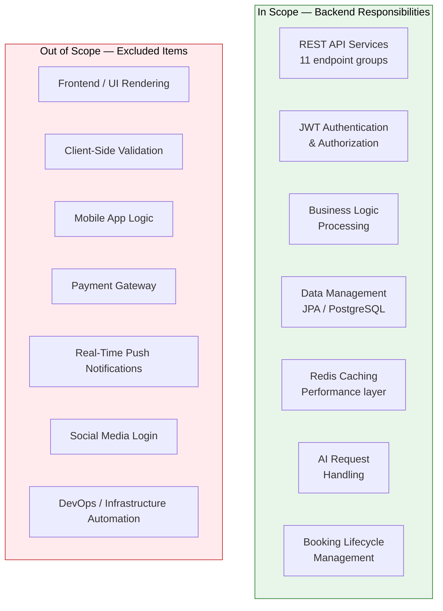
```mermaid
graph TD
    subgraph IN_SCOPE["In Scope — Backend Responsibilities"]
        IS1["REST API Services\n11 endpoint groups"]
        IS2["JWT Authentication\n& Authorization"]
        IS3["Business Logic\nProcessing"]
        IS4["Data Management\nJPA / PostgreSQL"]
        IS5["Redis Caching\nPerformance layer"]
        IS6["AI Request\nHandling"]
        IS7["Booking Lifecycle\nManagement"]
    end

    subgraph OUT_SCOPE["Out of Scope — Excluded Items"]
        OS1["Frontend / UI Rendering"]
        OS2["Client-Side Validation"]
        OS3["Mobile App Logic"]
        OS4["Payment Gateway"]
        OS5["Real-Time Push Notifications"]
        OS6["Social Media Login"]
        OS7["DevOps / Infrastructure Automation"]
    end

    style IN_SCOPE fill:#E8F5E9,stroke:#2E7D32,color:#000
    style OUT_SCOPE fill:#FFEBEE,stroke:#C62828,color:#000
```

---

### 2.2 Out of Scope

The following areas are explicitly outside the scope of the backend system as defined in this document.

| Out of Scope Item | Reason |
|---|---|
| Frontend / UI rendering | Handled entirely by the web client; backend returns data only |
| Client-side input validation | UI responsibility; backend performs its own server-side validation independently |
| Mobile application logic | No native mobile app in current scope; backend serves web clients only |
| UI component design and styling | Not a backend concern |
| Third-party payment gateway processing | Deferred to a future enhancement phase |
| Real-time notification push services | Planned for future phases; not included in current backend scope |
| Social media login integrations | Explicitly excluded; JWT-based authentication only |
| Advanced infrastructure automation | DevOps and deployment automation are outside this document's scope |

---

## 3. Backend Stakeholders

The following stakeholders have a direct interest in or dependency on the backend system's design, behavior, and output.

| **Stakeholder**       | **Interest in Backend System**                                                                                          | **Backend Responsibility**                                                                                    |
|-----------------------|--------------------------------------------------------------------------------------------------------------------------|---------------------------------------------------------------------------------------------------------------|
| **Travelers**         | Expect accurate, fast, and personalized data responses for travel planning, hotel search, and booking management         | Consuming authenticated API endpoints for travel recommendations, hotel search, booking submission, and AI chat |
| **Vendors**           | Depend on the backend to accurately manage their hotel listings, room inventory, pricing, and booking notifications       | Managing their own hotel and room data through vendor-scoped API access; receiving and responding to bookings  |
| **Admin Team**        | Require full visibility and control over all platform data including users, vendors, content, and booking activity        | Managing all entities through admin-privileged API endpoints; approving vendors; managing platform content     |
| **System Owner**      | Expects a reliable, secure, and performant backend that supports platform growth and protects business data integrity     | Defining business rules; reviewing system health; ensuring the backend meets performance and security standards |
| **AI Service Provider** | External party whose API the backend calls to fulfill AI travel planning requests                                       | Providing structured travel recommendation responses based on inputs forwarded by the backend                  |
| **Database (PostgreSQL)** | Stores all persistent platform data; its integrity is the responsibility of the backend service layer                 | Reliable, consistent data storage and retrieval managed through JPA/Hibernate ORM                              |
| **Cache Layer (Redis)** | Provides performance optimization through in-memory data storage for frequently accessed content                       | Reducing database read load; serving cached responses for hotel search, destinations, and transport data       |

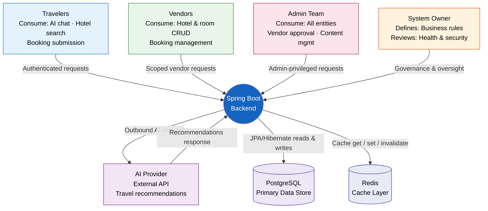
```mermaid
graph TD
    BACKEND(("Spring Boot\nBackend"))

    TRAVELER["Travelers\nConsume: AI chat · Hotel search\nBooking submission"]
    VENDOR["Vendors\nConsume: Hotel & room CRUD\nBooking management"]
    ADMIN["Admin Team\nConsume: All entities\nVendor approval · Content mgmt"]
    OWNER["System Owner\nDefines: Business rules\nReviews: Health & security"]
    AI_P["AI Provider\nExternal API\nTravel recommendations"]
    PG_DB[("PostgreSQL\nPrimary Data Store")]
    REDIS_DB[("Redis\nCache Layer")]

    TRAVELER -->|Authenticated requests| BACKEND
    VENDOR -->|Scoped vendor requests| BACKEND
    ADMIN -->|Admin-privileged requests| BACKEND
    OWNER -->|Governance & oversight| BACKEND
    BACKEND -->|Outbound AI request| AI_P
    AI_P -->|Recommendations response| BACKEND
    BACKEND -->|JPA/Hibernate reads & writes| PG_DB
    BACKEND -->|Cache get / set / invalidate| REDIS_DB

    style BACKEND fill:#1565C0,color:#fff
    style TRAVELER fill:#E3F2FD,stroke:#1565C0,color:#000
    style VENDOR fill:#E8F5E9,stroke:#2E7D32,color:#000
    style ADMIN fill:#FCE4EC,stroke:#AD1457,color:#000
    style OWNER fill:#FFF3E0,stroke:#E65100,color:#000
    style AI_P fill:#F3E5F5,stroke:#6A1B9A,color:#000
    style PG_DB fill:#EDE7F6,stroke:#4527A0,color:#000
    style REDIS_DB fill:#E8EAF6,stroke:#283593,color:#000
```

---

## 4. Core Backend Services

The backend is organized into a set of distinct, responsibility-aligned services. Each service owns its domain's data and business logic and exposes its functionality through clearly defined API endpoints.

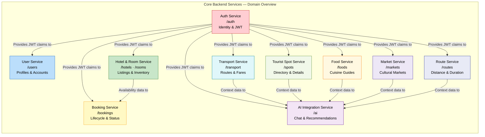
```mermaid
graph LR
    subgraph BACKEND_SERVICES["Core Backend Services — Domain Overview"]
        S1["Auth Service\n/auth\nIdentity & JWT"]
        S2["User Service\n/users\nProfiles & Accounts"]
        S3["Hotel & Room Service\n/hotels · /rooms\nListings & Inventory"]
        S4["Booking Service\n/bookings\nLifecycle & Status"]
        S5["Transport Service\n/transport\nRoutes & Fares"]
        S6["Tourist Spot Service\n/spots\nDirectory & Details"]
        S7["Food Service\n/foods\nCuisine Guides"]
        S8["Market Service\n/markets\nCultural Markets"]
        S9["Route Service\n/routes\nDistance & Duration"]
        S10["AI Integration Service\n/ai\nChat & Recommendations"]
    end

    S1 -->|Provides JWT claims to| S2 & S3 & S4 & S5 & S6 & S7 & S8 & S9 & S10
    S3 -->|Availability data to| S4
    S5 & S6 & S7 & S8 & S9 -->|Context data to| S10

    style S1 fill:#FFCDD2,stroke:#C62828,color:#000
    style S2 fill:#BBDEFB,stroke:#1565C0,color:#000
    style S3 fill:#C8E6C9,stroke:#2E7D32,color:#000
    style S4 fill:#FFF9C4,stroke:#F9A825,color:#000
    style S5 fill:#E0F7FA,stroke:#00838F,color:#000
    style S6 fill:#F1F8E9,stroke:#558B2F,color:#000
    style S7 fill:#FFF8E1,stroke:#F57F17,color:#000
    style S8 fill:#EDE7F6,stroke:#4527A0,color:#000
    style S9 fill:#E8EAF6,stroke:#283593,color:#000
    style S10 fill:#F3E5F5,stroke:#6A1B9A,color:#000
```

---

### 4.1 Authentication Service

The Authentication Service is the entry point for all users into the platform. It is responsible for all identity-related operations and must be fully secured and operational before any other service can be meaningfully accessed.

**User Registration:** The service accepts a registration request containing the user's full name, email address, password, and intended role (Traveler or Vendor). It validates that the email address is unique within the system, applies password strength requirements, hashes the password using a secure algorithm (BCrypt), and persists the new user record. Vendor accounts created through registration are assigned a pending approval status.

**Login and Credential Validation:** Upon receiving a login request, the service retrieves the user record associated with the provided email address, validates the submitted password against the stored hash, confirms that the account is in an active or approved status, and proceeds to token generation if all checks pass.

**JWT Token Generation:** On successful login, the service generates a signed JWT access token containing the user's identifier, assigned role, and token expiry timestamp. This token is returned to the client and must be included in the Authorization header of all subsequent requests to protected endpoints. The backend validates this token on every incoming request without requiring a database lookup, using the token's cryptographic signature.

**Role Validation and Enforcement:** The service maintains the mapping between user accounts and their assigned roles (TRAVELER, VENDOR, ADMIN). Role information embedded in the JWT is validated against the expected role for each endpoint, ensuring that no user can access functionality outside their designated permission set.

**Token Expiry and Refresh Logic:** Access tokens are issued with a defined expiry period. The service supports a token refresh mechanism that allows authenticated clients to obtain a new access token without requiring the user to log in again, provided their existing token has not yet expired beyond the defined refresh window.

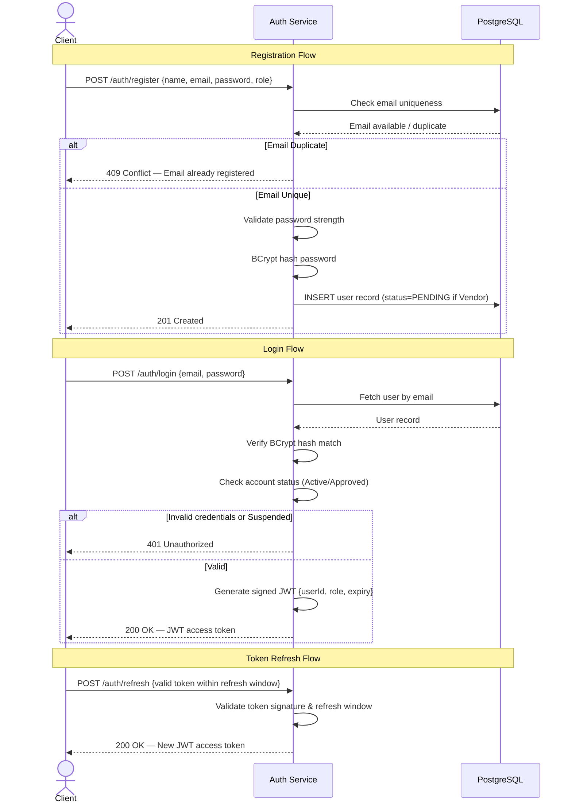
```mermaid
sequenceDiagram
    actor C as Client
    participant AS as Auth Service
    participant DB as PostgreSQL

    Note over C,DB: Registration Flow
    C->>AS: POST /auth/register {name, email, password, role}
    AS->>DB: Check email uniqueness
    DB-->>AS: Email available / duplicate
    alt Email Duplicate
        AS-->>C: 409 Conflict — Email already registered
    else Email Unique
        AS->>AS: Validate password strength
        AS->>AS: BCrypt hash password
        AS->>DB: INSERT user record (status=PENDING if Vendor)
        AS-->>C: 201 Created
    end

    Note over C,DB: Login Flow
    C->>AS: POST /auth/login {email, password}
    AS->>DB: Fetch user by email
    DB-->>AS: User record
    AS->>AS: Verify BCrypt hash match
    AS->>AS: Check account status (Active/Approved)
    alt Invalid credentials or Suspended
        AS-->>C: 401 Unauthorized
    else Valid
        AS->>AS: Generate signed JWT {userId, role, expiry}
        AS-->>C: 200 OK — JWT access token
    end

    Note over C,DB: Token Refresh Flow
    C->>AS: POST /auth/refresh {valid token within refresh window}
    AS->>AS: Validate token signature & refresh window
    AS-->>C: 200 OK — New JWT access token
```

---

### 4.2 User Management Service

The User Management Service handles all operations related to user accounts after authentication, including profile maintenance, role-based account management, and account lifecycle control.

**Profile Management:** Registered users can retrieve and update their profile information through this service. Travelers may update their name, contact details, and travel preferences. Vendors may update their business contact information. The service enforces that users can only modify their own profiles unless they hold the Admin role.

**Role Handling:** The service maintains user role assignments and provides the Admin with the ability to view role assignments across all accounts. Role changes — such as promoting a user to Admin — are restricted to Admin-privileged requests only.

**Account Status Control:** The service manages account status transitions — Active, Inactive, Suspended. Administrators can activate, suspend, or deactivate any user or vendor account through this service. Suspended or deactivated accounts are denied access at the Authentication Service level.

**Admin User Overview:** Administrators can retrieve paginated lists of all registered users, filtered by role or account status, to support platform oversight and moderation activities.

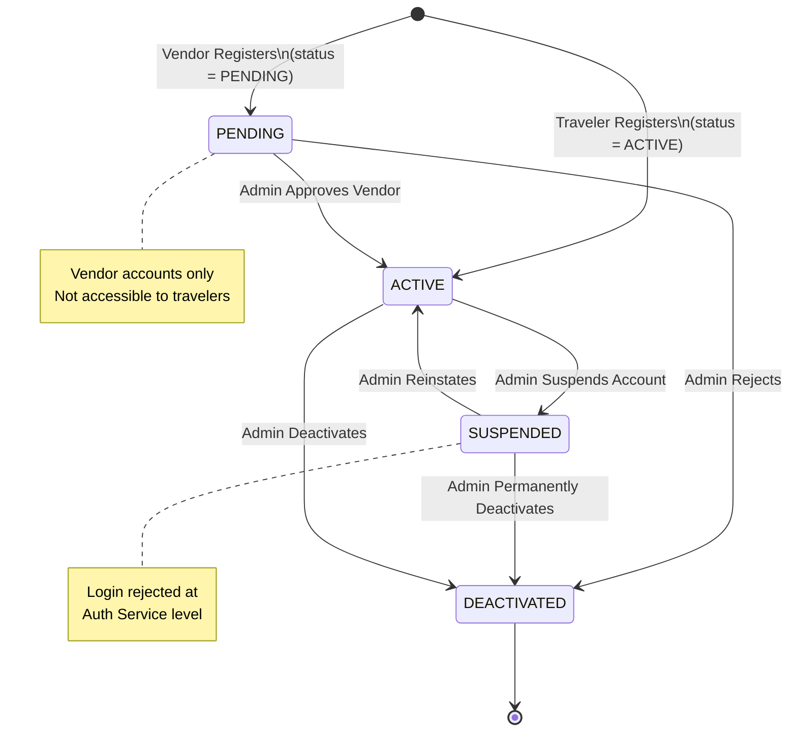
```mermaid
stateDiagram-v2
    [*] --> PENDING : Vendor Registers\n(status = PENDING)
    [*] --> ACTIVE : Traveler Registers\n(status = ACTIVE)
    PENDING --> ACTIVE : Admin Approves Vendor
    PENDING --> DEACTIVATED : Admin Rejects
    ACTIVE --> SUSPENDED : Admin Suspends Account
    SUSPENDED --> ACTIVE : Admin Reinstates
    SUSPENDED --> DEACTIVATED : Admin Permanently Deactivates
    ACTIVE --> DEACTIVATED : Admin Deactivates
    DEACTIVATED --> [*]

    note right of PENDING
        Vendor accounts only
        Not accessible to travelers
    end note
    note right of SUSPENDED
        Login rejected at
        Auth Service level
    end note
```

---

### 4.3 Hotel and Room Service

The Hotel and Room Service manages all data and business logic related to hotel properties and their room inventory, serving both vendors (who manage the data) and travelers (who consume it).

**Hotel CRUD Operations:** Approved vendors can create, update, and deactivate their hotel listings through this service. Each hotel entity includes a name, location, description, contact information, and a reference to the owning vendor. Administrators can manage hotel records across all vendors.

**Vendor Ownership Validation:** Every write operation on a hotel or room record is subject to an ownership check confirming that the requesting vendor is the registered owner of that property. A vendor cannot modify another vendor's listing. This rule is enforced at the service layer, not just at the API gateway.

**Room Management:** Within each hotel, vendors manage individual room type records. Each room record includes room type name, capacity, pricing, amenity descriptions, and available quantity. Vendors can add, update, or deactivate room records at any time.

**Room Availability Management:** The service tracks the available quantity of each room type and updates availability in response to confirmed bookings and cancellations. Availability data is a critical input to the Booking Service and must be accurate at all times.

**Price Management:** Vendors may update room pricing through this service. All price updates are timestamped and the previous price is retained in the audit record for reference. Pricing data is validated to ensure it is a positive non-zero value in the defined currency.

**Listing Visibility Control:** Hotels are only surfaced to travelers when they are in an Active status and belong to an Approved vendor. The service filters out any listings that fail either of these conditions before returning search results.

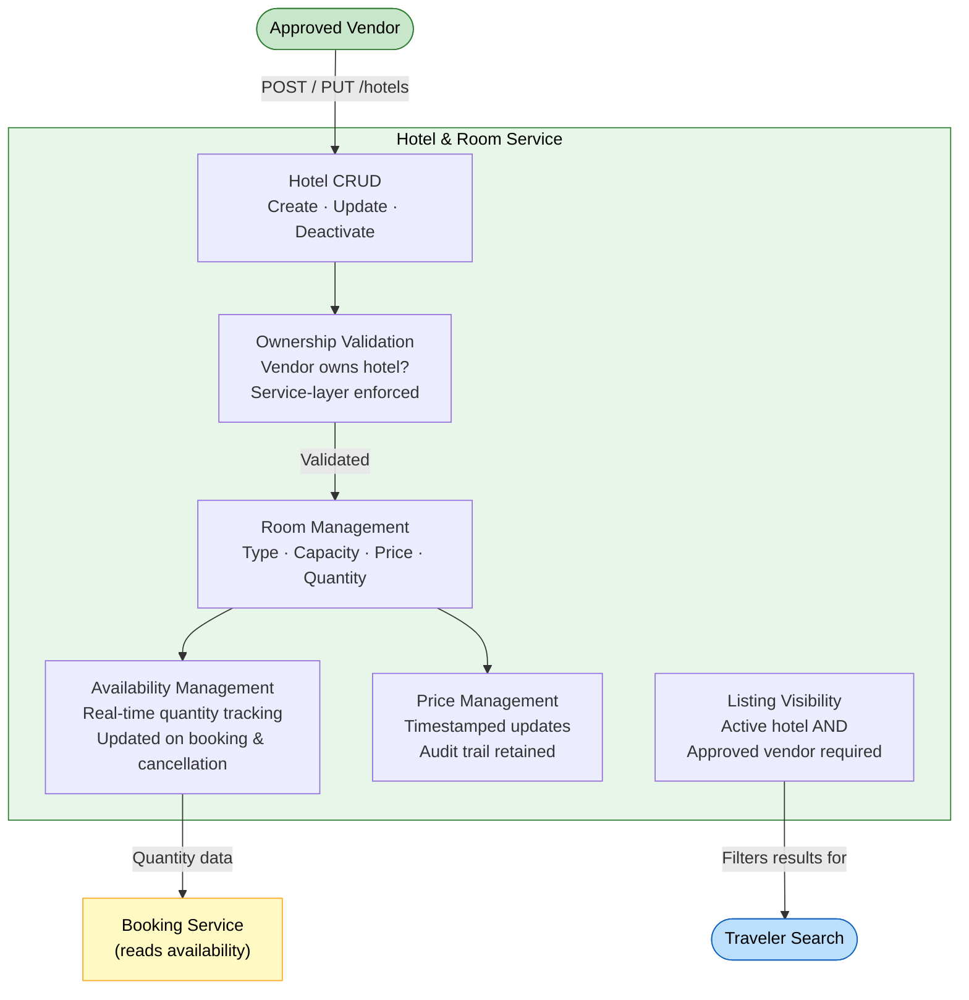
```mermaid
graph TD
    subgraph HOTEL_SERVICE["Hotel & Room Service"]
        HOTEL_CRUD["Hotel CRUD\nCreate · Update · Deactivate"]
        OWN_CHECK["Ownership Validation\nVendor owns hotel?\nService-layer enforced"]
        ROOM_MGMT["Room Management\nType · Capacity · Price · Quantity"]
        AVAIL["Availability Management\nReal-time quantity tracking\nUpdated on booking & cancellation"]
        PRICE_MGMT["Price Management\nTimestamped updates\nAudit trail retained"]
        VISIBILITY["Listing Visibility\nActive hotel AND\nApproved vendor required"]
    end

    VENDOR([Approved Vendor]) -->|POST / PUT /hotels| HOTEL_CRUD
    HOTEL_CRUD --> OWN_CHECK
    OWN_CHECK -->|Validated| ROOM_MGMT
    ROOM_MGMT --> AVAIL & PRICE_MGMT
    AVAIL -->|Quantity data| BOOKING_SVC["Booking Service\n(reads availability)"]
    VISIBILITY -->|Filters results for| TRAVELER([Traveler Search])

    style HOTEL_SERVICE fill:#E8F5E9,stroke:#2E7D32,color:#000
    style VENDOR fill:#C8E6C9,stroke:#2E7D32,color:#000
    style TRAVELER fill:#BBDEFB,stroke:#1565C0,color:#000
    style BOOKING_SVC fill:#FFF9C4,stroke:#F9A825,color:#000
```

---

### 4.4 Booking Service

The Booking Service orchestrates the full lifecycle of a room booking request, from initial availability check through final status resolution. It represents one of the most business-critical services in the system, as it governs the primary commercial interaction between travelers and vendors.

**Room Availability Check:** Before a booking record is created, the service verifies in real time that the requested room type has sufficient available quantity for the requested dates. If availability cannot be confirmed, the booking request is rejected with an appropriate response.

**Booking Record Creation:** Upon successful availability verification, the service creates a booking record containing the traveler's identifier, the hotel and room type reference, the requested check-in and check-out dates, the calculated total price based on current room pricing, and an initial status of Pending.

**Booking Status Management:** The Booking Service manages the status lifecycle of each booking record. Status transitions are: Pending → Confirmed (by vendor), Pending → Declined (by vendor), Confirmed → Cancelled (by traveler within defined cancellation rules). Each status transition is timestamped and recorded.

**Vendor Booking Management:** Vendors access their incoming booking requests through this service. They can view all bookings associated with their properties, confirm availability and accept a booking, or decline a request with a recorded reason. The service ensures vendors can only manage bookings for their own properties.

**Booking Cancellation:** Travelers may request cancellation of a confirmed booking through this service. The service validates the cancellation request against defined business rules (such as a minimum notice period). Upon successful cancellation, the relevant room availability count is restored.

**Booking History:** Both travelers and vendors can retrieve their historical booking records through this service. Travelers see bookings they have submitted; vendors see bookings received for their properties. Administrators have access to the full booking history across all accounts.

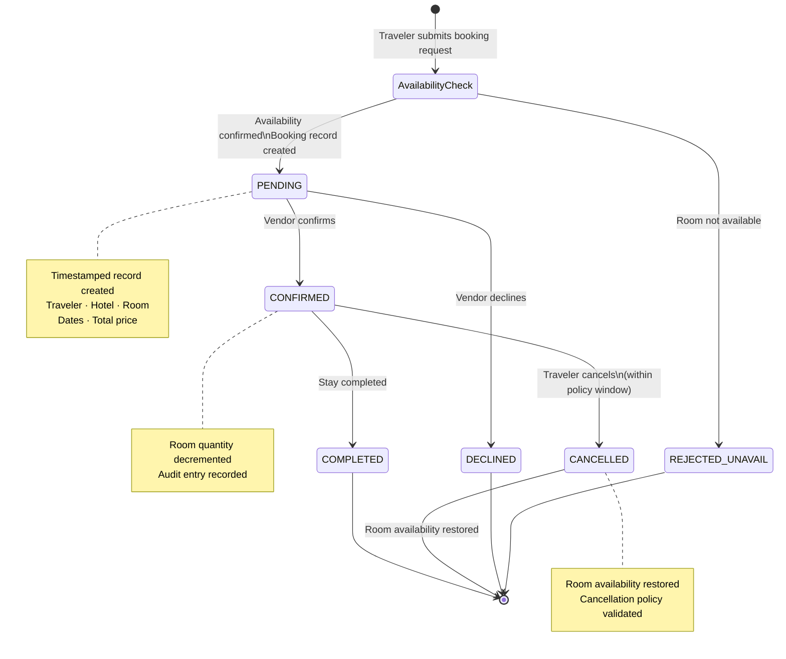
```mermaid
stateDiagram-v2
    [*] --> AvailabilityCheck : Traveler submits booking request
    AvailabilityCheck --> REJECTED_UNAVAIL : Room not available
    REJECTED_UNAVAIL --> [*]
    AvailabilityCheck --> PENDING : Availability confirmed\nBooking record created
    PENDING --> CONFIRMED : Vendor confirms
    PENDING --> DECLINED : Vendor declines
    DECLINED --> [*]
    CONFIRMED --> CANCELLED : Traveler cancels\n(within policy window)
    CONFIRMED --> COMPLETED : Stay completed
    CANCELLED --> [*] : Room availability restored
    COMPLETED --> [*]

    note right of PENDING
        Timestamped record created
        Traveler · Hotel · Room
        Dates · Total price
    end note
    note right of CONFIRMED
        Room quantity decremented
        Audit entry recorded
    end note
    note right of CANCELLED
        Room availability restored
        Cancellation policy validated
    end note
```

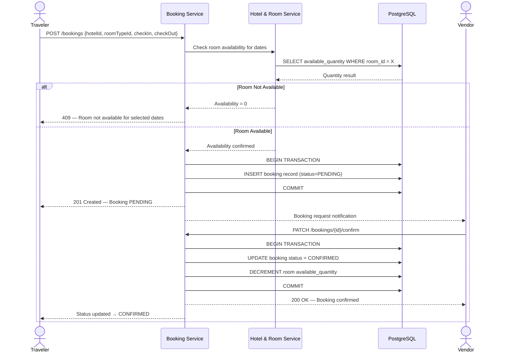
```mermaid
sequenceDiagram
    actor T as Traveler
    participant BS as Booking Service
    participant HS as Hotel & Room Service
    participant DB as PostgreSQL
    actor V as Vendor

    T->>BS: POST /bookings {hotelId, roomTypeId, checkIn, checkOut}
    BS->>HS: Check room availability for dates
    HS->>DB: SELECT available_quantity WHERE room_id = X
    DB-->>HS: Quantity result
    alt Room Not Available
        HS-->>BS: Availability = 0
        BS-->>T: 409 — Room not available for selected dates
    else Room Available
        HS-->>BS: Availability confirmed
        BS->>DB: BEGIN TRANSACTION
        BS->>DB: INSERT booking record (status=PENDING)
        BS->>DB: COMMIT
        BS-->>T: 201 Created — Booking PENDING
        BS-->>V: Booking request notification
        V->>BS: PATCH /bookings/{id}/confirm
        BS->>DB: BEGIN TRANSACTION
        BS->>DB: UPDATE booking status = CONFIRMED
        BS->>DB: DECREMENT room available_quantity
        BS->>DB: COMMIT
        BS-->>V: 200 OK — Booking confirmed
        BS-->>T: Status updated → CONFIRMED
    end
```

---

### 4.5 Transport Service

The Transport Service manages and serves all data related to transport options available to travelers between and within destinations.

**Transport Data Retrieval:** The service provides travelers with information about available intercity transport modes (bus, train, private car) for a given origin-destination pair. Each transport record includes the mode of transport, operator name (where applicable), estimated journey duration, estimated cost, and departure frequency information.

**Local Transport Information:** The service also maintains records for local in-city transport options at each destination, including mode type (auto-rickshaw, taxi, cycle-rickshaw, etc.), typical fare ranges, and availability notes.

**Price and Schedule Storage:** All transport pricing and scheduling data is stored as admin-managed records. The service exposes these records for read access to travelers and provides write access exclusively to Admin accounts for content management.

**Transport Data Filtering:** The service supports filtering of transport records by origin, destination, and transport mode type, enabling the API to return only relevant results for a given traveler query.

---

### 4.6 Tourist Spot Service

The Tourist Spot Service manages the directory of tourist attractions and points of interest, making this content available to travelers as part of their destination exploration experience.

**Spot Management:** Administrators can create, update, and soft-delete tourist spot records through this service. Each record includes the spot name, destination reference, location description, a detailed description of the attraction, visiting hours, and the spot's active status.

**Entry Fee Data:** Each tourist spot record includes structured entry fee information, covering the standard adult fee, any concessionary rates (children, seniors, students), and a currency reference. This data is maintained by the Admin Team and returned to travelers as part of the spot detail response.

**Status Control:** Tourist spots can be marked Active or Inactive by administrators. Only Active spots are returned in traveler-facing queries. Inactive spots remain in the database for record-keeping purposes but are excluded from API responses to travelers.

**Destination-Based Filtering:** The service supports retrieval of tourist spots filtered by destination identifier, enabling destination pages to display all relevant attractions for a given location.

---

### 4.7 Traditional Food Service

The Traditional Food Service manages information about traditional and local cuisine associated with each destination, providing travelers with authentic food discovery content.

**Location-Based Food Data:** Food records are associated with a destination reference, allowing the service to retrieve all traditional food items relevant to a traveler's selected destination. Each record includes the dish name, a cultural description, taste profile, and the location or area where it is most commonly found.

**Price Information:** Each food record includes an approximate meal cost range, expressed in the platform's reference currency. This information helps travelers budget for food as part of their overall trip planning.

**Food Content Management:** All traditional food content is created and maintained by the Admin Team. The service provides full CRUD capability for Admin accounts and read-only access for Traveler accounts.

**Soft Delete:** Food records that are no longer accurate or relevant are soft-deleted rather than permanently removed, preserving the historical record while ensuring they do not appear in traveler-facing responses.

---

### 4.8 Market and Cultural Item Service

The Market and Cultural Item Service manages data about local cultural markets, craft bazaars, and traditional item vendors available at each destination.

**Market Information:** The service maintains records for cultural markets including market name, destination reference, physical address or area, operating days and hours, a description of the market's character and atmosphere, and the types of goods available.

**Traditional Item Data:** Within or alongside market records, the service manages information about specific categories of traditional items available for purchase, including typical price ranges and cultural context for each item type.

**Admin Content Management:** All market and item data is managed by Admin accounts. The service enforces that only Admin roles can create, update, or deactivate market and item records.

**Destination-Based Retrieval:** As with tourist spots and food records, the service supports destination-scoped queries that return all markets and cultural item information relevant to a traveler's chosen destination.

---

### 4.9 Route Service

The Route Service manages and serves data about travel routes between destinations, providing travelers with distance and journey time information to support their trip planning.

**Distance and Travel Time Storage:** Route records are stored as admin-managed entries, each defining an origin point, a destination point, the estimated road or travel distance (in kilometers), the estimated travel duration (in hours and minutes) for one or more transport modes, and a recommended route description.

**Route Data Retrieval:** The service returns route information based on an origin-destination query from a traveler or the AI Integration Service. Where multiple route options exist between two points, all options are returned with their respective distance and time estimates.

**Integration with Transport Service:** Route records reference the relevant transport options available between origin and destination points, allowing the API response to combine route details with transport availability and cost information in a single cohesive response.

**Admin-Managed Content:** Route data is created and maintained exclusively by Admin accounts. The service validates that origin and destination references correspond to valid, active destination records before persisting new route entries.

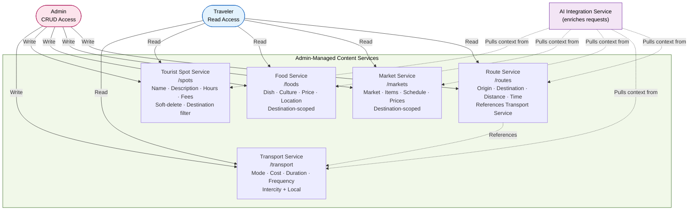
```mermaid
graph TD
    subgraph CONTENT_SERVICES["Admin-Managed Content Services"]
        direction LR
        TRANS_SVC["Transport Service\n/transport\nMode · Cost · Duration · Frequency\nIntercity + Local"]
        SPOT_SVC["Tourist Spot Service\n/spots\nName · Description · Hours · Fees\nSoft-delete · Destination filter"]
        FOOD_SVC["Food Service\n/foods\nDish · Culture · Price · Location\nDestination-scoped"]
        MKT_SVC["Market Service\n/markets\nMarket · Items · Schedule · Prices\nDestination-scoped"]
        ROUTE_SVC["Route Service\n/routes\nOrigin · Destination · Distance · Time\nReferences Transport Service"]
    end

    ADMIN_ROLE(["Admin\nCRUD Access"]) -->|Write| TRANS_SVC & SPOT_SVC & FOOD_SVC & MKT_SVC & ROUTE_SVC
    TRAVELER_ROLE(["Traveler\nRead Access"]) -->|Read| TRANS_SVC & SPOT_SVC & FOOD_SVC & MKT_SVC & ROUTE_SVC
    AI_SVC_REF["AI Integration Service\n(enriches requests)"] -.->|Pulls context from| SPOT_SVC & FOOD_SVC & MKT_SVC & TRANS_SVC & ROUTE_SVC

    ROUTE_SVC -.->|References| TRANS_SVC

    style CONTENT_SERVICES fill:#F1F8E9,stroke:#33691E,color:#000
    style ADMIN_ROLE fill:#FCE4EC,stroke:#AD1457,color:#000
    style TRAVELER_ROLE fill:#E3F2FD,stroke:#1565C0,color:#000
    style AI_SVC_REF fill:#F3E5F5,stroke:#6A1B9A,color:#000
```

---

### 4.10 AI Integration Service

The AI Integration Service is the backend's interface with the external AI provider that powers the platform's travel planning chatbot. It manages the complete lifecycle of an AI travel planning interaction, from receiving the traveler's input to persisting and returning the AI's response.

**Receiving User Travel Input:** The service accepts a structured request from an authenticated Traveler that includes their travel budget, preferred destination or region, trip duration, group size, and any stated personal preferences or interests. The service validates that all required fields are present and within acceptable value ranges before proceeding.

**Request Formatting and Forwarding:** The service formats the validated traveler input into the structure required by the configured external AI provider's API. It appends relevant contextual data from the platform's own content library — such as available destinations, tourist spots, and transport options — to enrich the AI's context before sending the request.

**AI Provider Communication:** The service makes an outbound HTTP request to the external AI provider's endpoint, including the formatted payload and the required API credentials. The service enforces a defined timeout policy on this outbound request to prevent AI response delays from degrading the overall platform experience.

**Response Handling and Storage:** Upon receiving the AI provider's response, the service parses and validates the returned recommendation content. The interaction — including the original traveler input and the AI's response — is persisted as a chat history record associated with the traveler's account, enabling the traveler to review past AI interactions.

**Returning Recommendations:** The validated AI response is returned to the requesting client through the standard API response structure. If the AI provider returns an error or times out, the service returns a meaningful business-level error response to the client, clearly indicating that the travel planning service is temporarily unavailable.

**Chat History Management:** The service provides a retrieval endpoint allowing authenticated travelers to access their historical AI chat interactions. Administrators can access AI interaction logs for quality monitoring purposes.

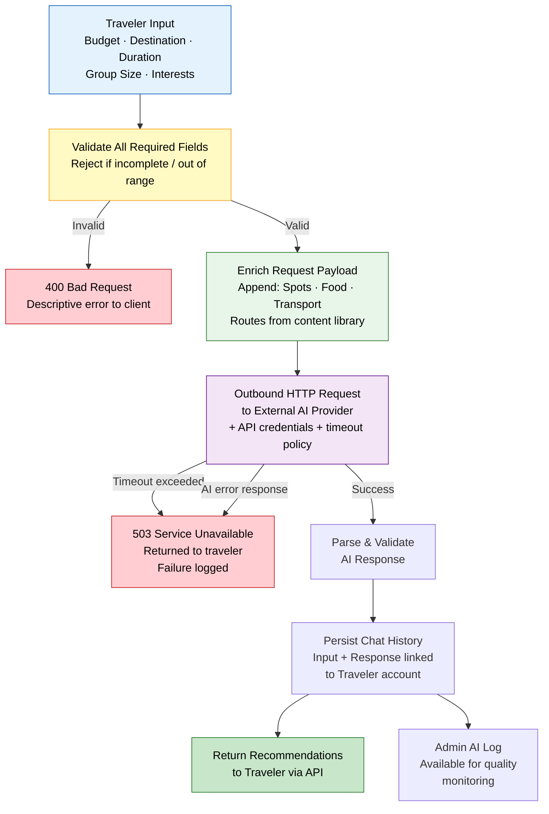
```mermaid
flowchart TD
    T_INPUT["Traveler Input\nBudget · Destination · Duration\nGroup Size · Interests"] --> VALIDATE["Validate All Required Fields\nReject if incomplete / out of range"]

    VALIDATE -->|Invalid| ERR1["400 Bad Request\nDescriptive error to client"]
    VALIDATE -->|Valid| ENRICH["Enrich Request Payload\nAppend: Spots · Food · Transport\nRoutes from content library"]

    ENRICH --> OUTBOUND["Outbound HTTP Request\nto External AI Provider\n+ API credentials + timeout policy"]

    OUTBOUND -->|Timeout exceeded| ERR2["503 Service Unavailable\nReturned to traveler\nFailure logged"]
    OUTBOUND -->|AI error response| ERR2
    OUTBOUND -->|Success| PARSE["Parse & Validate\nAI Response"]

    PARSE --> PERSIST["Persist Chat History\nInput + Response linked\nto Traveler account"]
    PERSIST --> RETURN["Return Recommendations\nto Traveler via API"]

    PERSIST --> ADMIN_LOG["Admin AI Log\nAvailable for quality\nmonitoring"]

    style T_INPUT fill:#E3F2FD,stroke:#1565C0,color:#000
    style VALIDATE fill:#FFF9C4,stroke:#F9A825,color:#000
    style ENRICH fill:#E8F5E9,stroke:#2E7D32,color:#000
    style OUTBOUND fill:#F3E5F5,stroke:#6A1B9A,color:#000
    style RETURN fill:#C8E6C9,stroke:#2E7D32,color:#000
    style ERR1 fill:#FFCDD2,stroke:#C62828,color:#000
    style ERR2 fill:#FFCDD2,stroke:#C62828,color:#000
```

---

## 5. Backend Business Requirements

The following backend business requirements define what the system must do at the service and data processing level. Requirements are grouped by service and uniquely identified for traceability.

```mermaid
graph LR
    subgraph REQ_MAP["Backend Requirements — Service Groupings"]
        R1["Auth Service\nBR-BE-01 to BR-BE-09\n9 requirements"]
        R2["User Management\nBR-BE-10 to BR-BE-14\n5 requirements"]
        R3["Hotel & Room\nBR-BE-15 to BR-BE-21\n7 requirements"]
        R4["Booking\nBR-BE-22 to BR-BE-29\n8 requirements"]
        R5["Transport\nBR-BE-30 to BR-BE-33\n4 requirements"]
        R6["Tourist Spots\nBR-BE-34 to BR-BE-37\n4 requirements"]
        R7["Food\nBR-BE-38 to BR-BE-40\n3 requirements"]
        R8["Markets\nBR-BE-41 to BR-BE-44\n4 requirements"]
        R9["Routes\nBR-BE-45 to BR-BE-48\n4 requirements"]
        R10["AI Integration\nBR-BE-49 to BR-BE-55\n7 requirements"]
    end

    style R1 fill:#FFCDD2,stroke:#C62828,color:#000
    style R2 fill:#BBDEFB,stroke:#1565C0,color:#000
    style R3 fill:#C8E6C9,stroke:#2E7D32,color:#000
    style R4 fill:#FFF9C4,stroke:#F9A825,color:#000
    style R5 fill:#E0F7FA,stroke:#00838F,color:#000
    style R6 fill:#F1F8E9,stroke:#558B2F,color:#000
    style R7 fill:#FFF8E1,stroke:#F57F17,color:#000
    style R8 fill:#EDE7F6,stroke:#4527A0,color:#000
    style R9 fill:#E8EAF6,stroke:#283593,color:#000
    style R10 fill:#F3E5F5,stroke:#6A1B9A,color:#000
```

---

### 5.1 Authentication Service Requirements

| **Req. ID** | **Requirement** |
|---|---|
| BR-BE-01 | The system shall allow new users to register by providing a unique email address, full name, password, and intended role (Traveler or Vendor). |
| BR-BE-02 | The system shall reject registration requests where the provided email address already exists in the user database. |
| BR-BE-03 | The system shall hash all user passwords using BCrypt before persisting them to the database. Plaintext passwords shall never be stored. |
| BR-BE-04 | The system shall generate and return a signed JWT access token upon successful user login. |
| BR-BE-05 | The JWT token shall contain the user's unique identifier, assigned role, and a defined expiry timestamp. |
| BR-BE-06 | The system shall validate the JWT token on every request to a protected endpoint and reject requests with missing, malformed, or expired tokens. |
| BR-BE-07 | Vendor accounts created through registration shall be assigned a Pending Approval status and shall not receive full access until approved by an administrator. |
| BR-BE-08 | The system shall support a token refresh mechanism allowing authenticated users to obtain a renewed access token without re-entering their credentials, within the defined refresh window. |
| BR-BE-09 | The system shall lock or reject login attempts for accounts that are in a Suspended or Deactivated status. |

---

### 5.2 User Management Service Requirements

| **Req. ID** | **Requirement** |
|---|---|
| BR-BE-10 | The system shall allow authenticated users to retrieve their own profile information. |
| BR-BE-11 | The system shall allow authenticated users to update their own profile information (name, contact details, preferences). Users shall not be permitted to modify another user's profile. |
| BR-BE-12 | The system shall allow administrators to retrieve a paginated list of all registered user accounts, filterable by role and account status. |
| BR-BE-13 | The system shall allow administrators to update the account status (Active, Suspended, Deactivated) of any user or vendor account. |
| BR-BE-14 | The system shall ensure that role assignments can only be created or modified by an authenticated Admin account. |

---

### 5.3 Hotel and Room Service Requirements

| **Req. ID** | **Requirement** |
|---|---|
| BR-BE-15 | The system shall allow approved vendors to create hotel listings associated with their vendor account. |
| BR-BE-16 | The system shall validate that any hotel write operation (create, update, deactivate) is initiated by the vendor account that owns that hotel record. |
| BR-BE-17 | The system shall allow vendors to add, update, and deactivate individual room type records under their hotel listings. |
| BR-BE-18 | The system shall validate all room pricing values to ensure they are positive, non-zero numeric values before persisting them. |
| BR-BE-19 | The system shall return hotel search results containing only listings where both the hotel status is Active and the owning vendor account is Approved. |
| BR-BE-20 | The system shall track the available quantity of each room type and update this figure automatically in response to confirmed bookings and cancellations. |
| BR-BE-21 | The system shall allow administrators to view and manage hotel listings across all vendor accounts. |

---

### 5.4 Booking Service Requirements

| **Req. ID** | **Requirement** |
|---|---|
| BR-BE-22 | The system shall verify room availability in real time before creating a booking record. If the requested room type has insufficient availability for the requested dates, the booking request shall be rejected. |
| BR-BE-23 | The system shall create a booking record with an initial status of Pending upon successful availability verification. |
| BR-BE-24 | The booking record shall capture the traveler identifier, hotel identifier, room type identifier, requested check-in date, requested check-out date, total calculated price, and booking status. |
| BR-BE-25 | The system shall allow vendors to confirm or decline booking requests for their properties. Vendors shall not be permitted to manage bookings for properties they do not own. |
| BR-BE-26 | The system shall update the room's available quantity upon booking confirmation and restore the available quantity upon booking cancellation. |
| BR-BE-27 | The system shall allow travelers to cancel a confirmed booking, subject to the platform's defined cancellation policy rules. |
| BR-BE-28 | The system shall maintain a complete and auditable booking history for each traveler and each vendor property. |
| BR-BE-29 | All booking status transitions shall be timestamped and recorded in the booking audit history. |

---

### 5.5 Transport Service Requirements

| **Req. ID** | **Requirement** |
|---|---|
| BR-BE-30 | The system shall store transport records containing the origin, destination, transport mode, operator name, estimated cost, estimated duration, and service frequency. |
| BR-BE-31 | The system shall return transport options filtered by origin-destination pair and/or transport mode type upon request. |
| BR-BE-32 | The system shall restrict all transport data creation and modification operations to authenticated Admin accounts. |
| BR-BE-33 | The system shall store and serve local in-city transport data for each destination, including mode type and typical fare ranges. |

---

### 5.6 Tourist Spot Service Requirements

| **Req. ID** | **Requirement** |
|---|---|
| BR-BE-34 | The system shall allow administrators to create, update, and soft-delete tourist spot records. |
| BR-BE-35 | Each tourist spot record shall include a name, destination reference, description, visiting hours, entry fee details, and active status. |
| BR-BE-36 | The system shall return only Active tourist spot records in traveler-facing API responses. |
| BR-BE-37 | The system shall support retrieval of tourist spots filtered by destination identifier. |

---

### 5.7 Traditional Food Service Requirements

| **Req. ID** | **Requirement** |
|---|---|
| BR-BE-38 | The system shall allow administrators to create, update, and soft-delete traditional food records associated with specific destinations. |
| BR-BE-39 | Each food record shall include the dish name, description, cultural context, approximate price range, and recommended location for finding it. |
| BR-BE-40 | The system shall return food records filtered by destination identifier in traveler-facing responses. |

---

### 5.8 Market and Cultural Item Service Requirements

| **Req. ID** | **Requirement** |
|---|---|
| BR-BE-41 | The system shall allow administrators to create, update, and soft-delete cultural market records. |
| BR-BE-42 | Each market record shall include the market name, destination reference, location, operating schedule, description, and item categories available. |
| BR-BE-43 | The system shall store traditional item data including item category name, price range, and cultural significance description. |
| BR-BE-44 | The system shall return market and item records filtered by destination identifier. |

---

### 5.9 Route Service Requirements

| **Req. ID** | **Requirement** |
|---|---|
| BR-BE-45 | The system shall store route records defining an origin point, a destination point, estimated distance in kilometers, estimated travel duration, and recommended route description. |
| BR-BE-46 | The system shall return route records matching a given origin-destination query, including all available route options where multiple routes exist. |
| BR-BE-47 | The system shall restrict all route data creation and modification to authenticated Admin accounts. |
| BR-BE-48 | Route records shall reference valid, active destination entities. The system shall reject route creation requests referencing invalid or inactive destinations. |

---

### 5.10 AI Integration Service Requirements

| **Req. ID** | **Requirement** |
|---|---|
| BR-BE-49 | The system shall accept a structured travel planning request from an authenticated Traveler containing budget, destination preference, trip duration, group size, and personal interests. |
| BR-BE-50 | The system shall validate all required fields in the AI travel planning request before forwarding it to the external AI provider. Incomplete or invalid requests shall be rejected with a descriptive error response. |
| BR-BE-51 | The system shall enrich the AI request payload with relevant contextual data from the platform's content library before forwarding it to the AI provider. |
| BR-BE-52 | The system shall enforce a configurable timeout on all outbound AI provider requests. If the provider does not respond within the timeout period, the system shall return a service unavailability response to the traveler. |
| BR-BE-53 | The system shall persist each AI interaction — comprising the traveler's input and the AI's response — as a chat history record linked to the traveler's account. |
| BR-BE-54 | The system shall allow authenticated travelers to retrieve their AI chat interaction history. |
| BR-BE-55 | The system shall allow administrators to access AI interaction logs for quality assurance and content accuracy monitoring purposes. |

---

## 6. Data Management Requirements

### 6.1 Data Validation Rules

The backend system shall enforce server-side data validation on all incoming requests, independent of any client-side validation. The following rules apply across all services.

- **Email addresses** must conform to a standard email format pattern and must be unique within the user entity table.
- **Passwords** must meet a minimum length requirement and must contain at least one uppercase letter, one lowercase letter, and one numeric digit. Passwords are never returned in any API response.
- **Monetary values** (room prices, transport costs, food price ranges, market item prices) must be positive, non-zero numeric values.
- **Date fields** used in booking requests must be valid calendar dates. Check-out dates must be strictly later than check-in dates.
- **Foreign key references** (such as destination identifiers on tourist spots, room identifiers on booking records) must reference existing, active records. The system shall reject requests with invalid references.
- **Text fields** (names, descriptions, etc.) shall have defined maximum character lengths enforced at the database and service layers to prevent oversized data from being persisted.
- **Status fields** shall only accept values within the defined enumerated set for each entity (e.g., booking status: PENDING, CONFIRMED, DECLINED, CANCELLED).

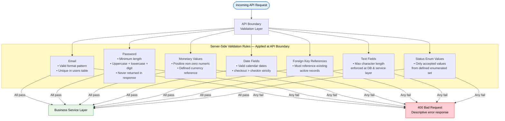
```mermaid
graph TD
    subgraph VALIDATION["Server-Side Validation Rules — Applied at API Boundary"]
        V1["Email\n• Valid format pattern\n• Unique in users table"]
        V2["Password\n• Minimum length\n• Uppercase + lowercase + digit\n• Never returned in response"]
        V3["Monetary Values\n• Positive non-zero numeric\n• Defined currency reference"]
        V4["Date Fields\n• Valid calendar dates\n• checkout > checkin strictly"]
        V5["Foreign Key References\n• Must reference existing\nactive records"]
        V6["Text Fields\n• Max character length\nenforced at DB & service layer"]
        V7["Status Enum Values\n• Only accepted values\nfrom defined enumerated set"]
    end

    REQ([Incoming API Request]) --> BOUNDARY["API Boundary\nValidation Layer"]
    BOUNDARY --> V1 & V2 & V3 & V4 & V5 & V6 & V7
    V1 & V2 & V3 & V4 & V5 & V6 & V7 -->|All pass| SERVICE["Business Service Layer"]
    V1 & V2 & V3 & V4 & V5 & V6 & V7 -->|Any fail| ERR["400 Bad Request\nDescriptive error response"]

    style VALIDATION fill:#FFF9C4,stroke:#F9A825,color:#000
    style REQ fill:#E3F2FD,stroke:#1565C0,color:#000
    style SERVICE fill:#E8F5E9,stroke:#2E7D32,color:#000
    style ERR fill:#FFCDD2,stroke:#C62828,color:#000
```

### 6.2 Data Consistency

The backend shall ensure data consistency across all service operations, particularly in scenarios involving multiple entity updates.

- **Booking and availability atomicity:** When a booking is confirmed, the corresponding room availability decrement must occur in the same transactional operation. Partial updates — where a booking is confirmed but availability is not decremented, or vice versa — shall not be permitted.
- **Vendor account and listing status coherence:** When a vendor account is suspended or deactivated, all associated hotel listings shall be automatically transitioned to an Inactive status, removing them from traveler-facing search results without deleting the underlying data.
- **User status and access coherence:** When an admin modifies a user's account status to Suspended or Deactivated, the change shall take effect immediately, and any subsequent authenticated requests from that account shall be rejected at the authorization layer.

```mermaid
graph TD
    subgraph ATOMIC["Atomic Transaction — Booking Confirmation"]
        A1["Step 1: UPDATE booking\nstatus = CONFIRMED"]
        A2["Step 2: DECREMENT room\navailable_quantity"]
        A3{"Both\nsucceed?"}
        A1 & A2 --> A3
        A3 -->|Yes| COMMIT["COMMIT\nBoth changes persist"]
        A3 -->|Any failure| ROLLBACK["ROLLBACK\nNeither change persists"]
    end

    subgraph CASCADE["Cascade Status Rules"]
        B1["Vendor Account\nSuspended / Deactivated"]
        B2["All associated hotel listings\nautomatically → INACTIVE"]
        B3["Removed from traveler\nsearch results immediately"]
        B1 --> B2 --> B3
    end

    subgraph IMMEDIATE["Immediate Access Effect"]
        C1["Admin updates user\nstatus → SUSPENDED"]
        C2["Change applied\nimmediately"]
        C3["Next authenticated request\nrejected at Auth layer"]
        C1 --> C2 --> C3
    end

    style ATOMIC fill:#FFF3E0,stroke:#E65100,color:#000
    style CASCADE fill:#FCE4EC,stroke:#AD1457,color:#000
    style IMMEDIATE fill:#E3F2FD,stroke:#1565C0,color:#000
    style COMMIT fill:#C8E6C9,stroke:#2E7D32,color:#000
    style ROLLBACK fill:#FFCDD2,stroke:#C62828,color:#000
```

### 6.3 Soft Delete Policy

The backend shall implement soft deletion for all primary content entities rather than permanent record deletion. A soft delete operation sets a boolean `is_deleted` flag to true and records a `deleted_at` timestamp on the affected record. Soft-deleted records are excluded from all standard API query results but remain in the database for audit and recovery purposes.

Entities subject to soft deletion include: hotel listings, room records, tourist spots, traditional food records, cultural market records, traditional item records, and route records. User accounts are subject to status deactivation rather than soft deletion.

### 6.4 Audit Fields

Every primary entity table in the database shall include the following standard audit fields, managed automatically by the backend service layer.

| **Audit Field**    | **Type**          | **Description**                                              |
|--------------------|-------------------|--------------------------------------------------------------|
| `created_at`       | Timestamp         | The date and time when the record was first created          |
| `updated_at`       | Timestamp         | The date and time of the most recent update to the record    |
| `created_by`       | User reference    | The identifier of the user account that created the record   |
| `updated_by`       | User reference    | The identifier of the user account that last modified the record |
| `is_deleted`       | Boolean           | Soft delete flag; true if the record has been logically deleted |
| `deleted_at`       | Timestamp (null)  | The date and time of soft deletion; null if not deleted      |

These fields are populated and maintained by the backend and are never accepted as user-supplied input.

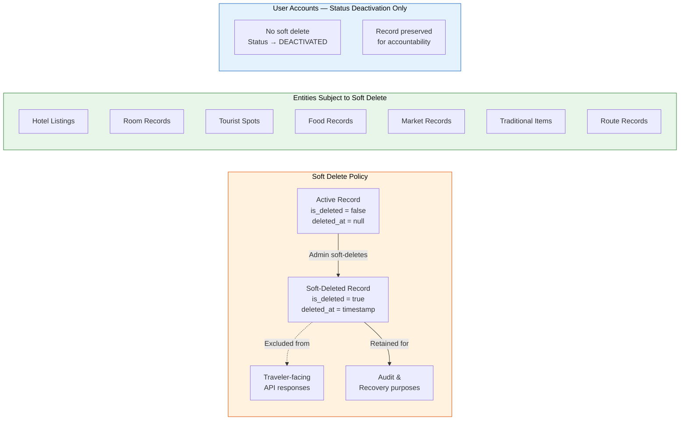
```mermaid
graph LR
    subgraph SOFT_DELETE["Soft Delete Policy"]
        ACTIVE_REC["Active Record\nis_deleted = false\ndeleted_at = null"]
        SOFT_DEL_REC["Soft-Deleted Record\nis_deleted = true\ndeleted_at = timestamp"]
        ACTIVE_REC -->|Admin soft-deletes| SOFT_DEL_REC
        SOFT_DEL_REC -.->|Excluded from| TRAVELER_RESP["Traveler-facing\nAPI responses"]
        SOFT_DEL_REC -->|Retained for| AUDIT["Audit &\nRecovery purposes"]
    end

    subgraph ENTITIES["Entities Subject to Soft Delete"]
        E1[Hotel Listings]
        E2[Room Records]
        E3[Tourist Spots]
        E4[Food Records]
        E5[Market Records]
        E6[Traditional Items]
        E7[Route Records]
    end

    subgraph USER_STATUS["User Accounts — Status Deactivation Only"]
        U1["No soft delete\nStatus → DEACTIVATED"]
        U2["Record preserved\nfor accountability"]
    end

    style SOFT_DELETE fill:#FFF3E0,stroke:#E65100,color:#000
    style ENTITIES fill:#E8F5E9,stroke:#2E7D32,color:#000
    style USER_STATUS fill:#E3F2FD,stroke:#1565C0,color:#000
```

---

## 7. API Responsibility Overview

The following table defines the high-level responsibilities of each API group. This is a business-level overview and does not include specific request/response schemas.

| **API Group**  | **Base Path**   | **Primary Responsibilities**                                                                                              | **Accessible By**              |
|----------------|-----------------|---------------------------------------------------------------------------------------------------------------------------|--------------------------------|
| Authentication | `/auth`         | User registration, login, JWT token generation, and token refresh                                                         | Public (unauthenticated)       |
| Users          | `/users`        | Profile retrieval and update, account status management, admin user listing                                               | Traveler (own), Vendor (own), Admin (all) |
| Hotels         | `/hotels`       | Hotel listing creation, retrieval, update, and deactivation; hotel search for travelers                                   | Vendor (own), Admin (all), Traveler (read) |
| Rooms          | `/rooms`        | Room type management under hotels; availability and pricing management                                                    | Vendor (own), Admin (all), Traveler (read) |
| Bookings       | `/bookings`     | Booking request creation, status management, cancellation, and history retrieval                                           | Traveler (own), Vendor (own properties), Admin (all) |
| Transport      | `/transport`    | Transport option retrieval by origin and destination; local transport data access                                          | Admin (write), Traveler (read), Vendor (read) |
| Tourist Spots  | `/spots`        | Tourist spot retrieval by destination; spot content creation and management                                               | Admin (write), Traveler (read), Vendor (read) |
| Traditional Food | `/foods`      | Traditional food data retrieval by destination; food content creation and management                                      | Admin (write), Traveler (read), Vendor (read) |
| Markets        | `/markets`      | Cultural market and traditional item data retrieval; market content management                                            | Admin (write), Traveler (read), Vendor (read) |
| Routes         | `/routes`       | Route retrieval by origin-destination query; route data creation and management                                           | Admin (write), Traveler (read), Vendor (read) |
| AI             | `/ai`           | Travel planning request submission to AI provider; AI chat history retrieval and management                               | Traveler (submit/own history), Admin (all logs) |

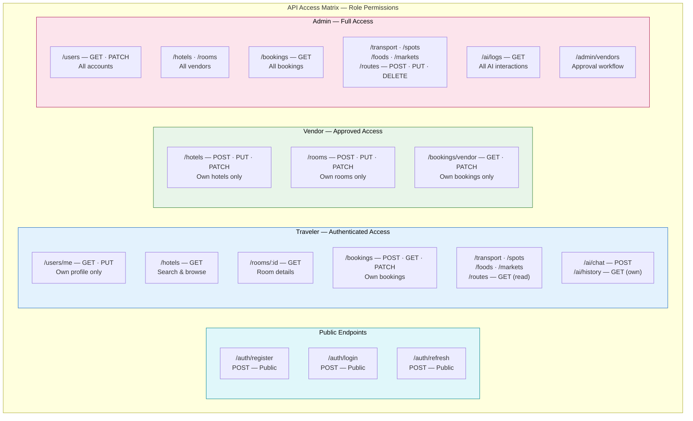
```mermaid
graph TD
    subgraph ACCESS_MATRIX["API Access Matrix — Role Permissions"]
        subgraph PUBLIC_EP["Public Endpoints"]
            A1["/auth/register\nPOST — Public"]
            A2["/auth/login\nPOST — Public"]
            A3["/auth/refresh\nPOST — Public"]
        end

        subgraph TRAVELER_EP["Traveler — Authenticated Access"]
            T1["/users/me — GET · PUT\nOwn profile only"]
            T2["/hotels — GET\nSearch & browse"]
            T3["/rooms/:id — GET\nRoom details"]
            T4["/bookings — POST · GET · PATCH\nOwn bookings"]
            T5["/transport · /spots\n/foods · /markets\n/routes — GET (read)"]
            T6["/ai/chat — POST\n/ai/history — GET (own)"]
        end

        subgraph VENDOR_EP["Vendor — Approved Access"]
            V1["/hotels — POST · PUT · PATCH\nOwn hotels only"]
            V2["/rooms — POST · PUT · PATCH\nOwn rooms only"]
            V3["/bookings/vendor — GET · PATCH\nOwn bookings only"]
        end

        subgraph ADMIN_EP["Admin — Full Access"]
            AD1["/users — GET · PATCH\nAll accounts"]
            AD2["/hotels · /rooms\nAll vendors"]
            AD3["/bookings — GET\nAll bookings"]
            AD4["/transport · /spots\n/foods · /markets\n/routes — POST · PUT · DELETE"]
            AD5["/ai/logs — GET\nAll AI interactions"]
            AD6["/admin/vendors\nApproval workflow"]
        end
    end

    style PUBLIC_EP fill:#E0F7FA,stroke:#00838F,color:#000
    style TRAVELER_EP fill:#E3F2FD,stroke:#1565C0,color:#000
    style VENDOR_EP fill:#E8F5E9,stroke:#2E7D32,color:#000
    style ADMIN_EP fill:#FCE4EC,stroke:#AD1457,color:#000
```

---

## 8. Caching Requirements

The backend utilizes Redis as an in-memory caching layer to improve API response performance and reduce the volume of repetitive read queries directed at the PostgreSQL database. The following caching requirements govern how the Redis layer is used.

### 8.1 Hotel Search Caching

Hotel search results for commonly queried destination and price range combinations shall be cached in Redis with a defined Time-To-Live (TTL). Cached search results shall be invalidated automatically when a hotel listing in the cached result set is updated, deactivated, or has its pricing changed by the owning vendor. This ensures that travelers are never served stale pricing or availability data from the cache.

### 8.2 Destination Data Caching

Static destination reference data — including destination names, identifiers, and associated metadata — changes infrequently and represents a high-volume read target. This data shall be cached in Redis and refreshed on a defined schedule or whenever an administrator makes a change to destination records.

### 8.3 Tourist Spot, Food, Market, and Route Data Caching

Content data in the tourist spot, traditional food, cultural market, and route service domains is managed exclusively by administrators and changes infrequently relative to the frequency of read requests. This data shall be cached per destination identifier and invalidated whenever the Admin Team updates, creates, or soft-deletes a record in any of these categories.

### 8.4 Transport Data Caching

Transport records for frequently queried origin-destination pairs shall be cached to reduce database load during peak platform usage periods. Transport cache entries shall be invalidated whenever an admin updates a transport record.

### 8.5 Cache Invalidation Policy

The backend shall implement a cache invalidation strategy that ensures cached data is never more than one administrative update cycle out of date. All service operations that modify data in a cached category are responsible for triggering the appropriate cache invalidation before or immediately after the database write is committed.

### 8.6 AI Response Caching Exclusion

AI travel planning responses shall not be cached, as each response is personalized to a specific traveler's unique combination of inputs. Caching AI responses would risk returning another traveler's itinerary to a different user, which is both commercially and ethically unacceptable.

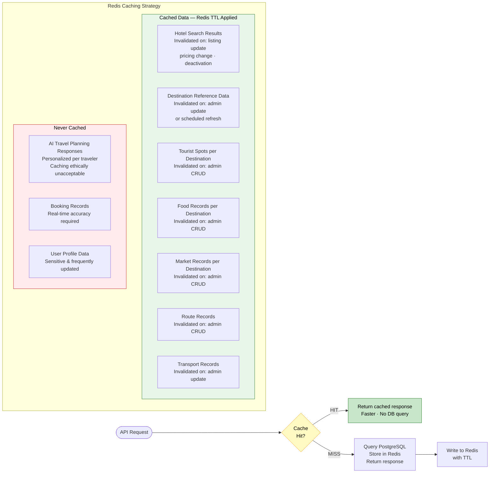
```mermaid
graph LR
    subgraph CACHE_STRATEGY["Redis Caching Strategy"]
        direction TB
        subgraph CACHED["Cached Data — Redis TTL Applied"]
            C1["Hotel Search Results\nInvalidated on: listing update\npricing change · deactivation"]
            C2["Destination Reference Data\nInvalidated on: admin update\nor scheduled refresh"]
            C3["Tourist Spots per Destination\nInvalidated on: admin CRUD"]
            C4["Food Records per Destination\nInvalidated on: admin CRUD"]
            C5["Market Records per Destination\nInvalidated on: admin CRUD"]
            C6["Route Records\nInvalidated on: admin CRUD"]
            C7["Transport Records\nInvalidated on: admin update"]
        end

        subgraph NOT_CACHED["Never Cached"]
            NC1["AI Travel Planning Responses\nPersonalized per traveler\nCaching ethically unacceptable"]
            NC2["Booking Records\nReal-time accuracy required"]
            NC3["User Profile Data\nSensitive & frequently updated"]
        end
    end

    CLIENT_REQ([API Request]) --> REDIS_CHECK{Cache\nHit?}
    REDIS_CHECK -->|HIT| CACHED_RESP["Return cached response\nFaster · No DB query"]
    REDIS_CHECK -->|MISS| DB_QUERY["Query PostgreSQL\nStore in Redis\nReturn response"]
    DB_QUERY --> REDIS_WRITE["Write to Redis\nwith TTL"]

    style CACHED fill:#E8F5E9,stroke:#2E7D32,color:#000
    style NOT_CACHED fill:#FFEBEE,stroke:#C62828,color:#000
    style CACHED_RESP fill:#C8E6C9,stroke:#2E7D32,color:#000
    style REDIS_CHECK fill:#FFF9C4,stroke:#F9A825,color:#000
```

---

## 9. Security Requirements

### 9.1 JWT Validation

Every request to a protected backend endpoint shall be validated against the following JWT security checks before any business logic is executed.

- The Authorization header must be present and must conform to the Bearer token format.
- The JWT signature must be valid and must have been produced using the platform's configured signing secret.
- The token's expiry timestamp must be in the future at the time of the request. Expired tokens shall be rejected with a 401 Unauthorized response.
- The user identifier contained within the token must correspond to an existing, active user account in the database.

### 9.2 Role-Based Access Control

The backend shall enforce role-based access control (RBAC) at the service layer for every protected operation. The three defined roles are TRAVELER, VENDOR, and ADMIN.

- Endpoints designated for Admin use shall reject requests from Traveler or Vendor tokens.
- Endpoints for Vendor operations shall reject requests from Traveler tokens.
- Ownership-scoped operations (e.g., a vendor modifying their own hotel) shall verify that the requesting user's identifier matches the ownership reference on the target entity, in addition to role validation.

### 9.3 Input Validation and Sanitization

All data received by the backend through API requests shall be validated and sanitized before it is processed or persisted. The backend shall reject requests containing values that violate defined data rules (see Section 6.1) and shall ensure that no unsanitized user input is passed directly into database queries, thereby preventing injection-class vulnerabilities.

### 9.4 Unauthorized Access Prevention

The backend shall return a standardized 403 Forbidden response when an authenticated user attempts to access a resource or perform an operation that their role does not permit. The response shall not include details about why the access was denied beyond the standard error code, to prevent information leakage.

### 9.5 Sensitive Data Handling

Passwords shall never appear in any API response, log entry, or error message. JWT tokens shall be treated as sensitive credentials and shall not be logged in their full form. Internal system identifiers used for audit purposes shall not be exposed in traveler-facing API responses unless they serve a direct functional purpose.

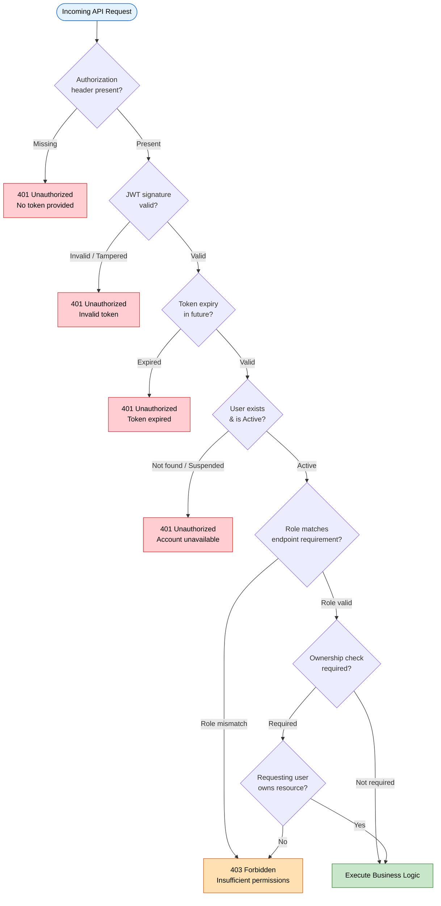
```mermaid
flowchart TD
    REQUEST(["Incoming API Request"]) --> HEADER_CHECK{"Authorization\nheader present?"}
    HEADER_CHECK -->|Missing| R401A["401 Unauthorized\nNo token provided"]
    HEADER_CHECK -->|Present| SIG_CHECK{"JWT signature\nvalid?"}
    SIG_CHECK -->|Invalid / Tampered| R401B["401 Unauthorized\nInvalid token"]
    SIG_CHECK -->|Valid| EXPIRY_CHECK{"Token expiry\nin future?"}
    EXPIRY_CHECK -->|Expired| R401C["401 Unauthorized\nToken expired"]
    EXPIRY_CHECK -->|Valid| USER_CHECK{"User exists\n& is Active?"}
    USER_CHECK -->|Not found / Suspended| R401D["401 Unauthorized\nAccount unavailable"]
    USER_CHECK -->|Active| ROLE_CHECK{"Role matches\nendpoint requirement?"}
    ROLE_CHECK -->|Role mismatch| R403["403 Forbidden\nInsufficient permissions"]
    ROLE_CHECK -->|Role valid| OWN_CHECK{"Ownership check\nrequired?"}
    OWN_CHECK -->|Not required| BUSINESS["Execute Business Logic"]
    OWN_CHECK -->|Required| OWN_VALID{"Requesting user\nowns resource?"}
    OWN_VALID -->|No| R403
    OWN_VALID -->|Yes| BUSINESS

    style REQUEST fill:#E3F2FD,stroke:#1565C0,color:#000
    style BUSINESS fill:#C8E6C9,stroke:#2E7D32,color:#000
    style R401A fill:#FFCDD2,stroke:#C62828,color:#000
    style R401B fill:#FFCDD2,stroke:#C62828,color:#000
    style R401C fill:#FFCDD2,stroke:#C62828,color:#000
    style R401D fill:#FFCDD2,stroke:#C62828,color:#000
    style R403 fill:#FFE0B2,stroke:#E65100,color:#000
```

---

## 10. Error Handling and Logging

### 10.1 Standard Error Response Structure

The backend shall return all error conditions using a consistent, structured error response format. Every error response shall include a machine-readable error code, a human-readable message suitable for display to the end user, an HTTP status code appropriate to the error category, and a timestamp indicating when the error occurred.

The following standard HTTP status codes and their corresponding business meanings shall be used consistently across all services.

| **HTTP Status Code** | **Business Meaning** |
|---|---|
| 200 OK | Request processed successfully |
| 201 Created | New resource created successfully |
| 400 Bad Request | Request data failed validation |
| 401 Unauthorized | JWT token missing, invalid, or expired |
| 403 Forbidden | Authenticated user lacks permission for this operation |
| 404 Not Found | Requested resource does not exist or is not accessible to the requesting user |
| 409 Conflict | Request conflicts with existing data (e.g., duplicate email registration) |
| 503 Service Unavailable | Dependent external service (e.g., AI provider) is temporarily unavailable |

### 10.2 Business Exception Handling

The backend service layer shall define and manage a set of business exceptions that correspond to violations of business rules. These exceptions shall be caught by a centralized exception handling mechanism and translated into the standard error response structure before being returned to the client. Service layer code shall not expose raw database errors or stack traces to the API consumer under any circumstances.

Examples of business exceptions include: `RoomNotAvailableException`, `VendorNotApprovedException`, `DuplicateEmailException`, `BookingCancellationWindowExpiredException`, and `AIProviderTimeoutException`.

### 10.3 Activity Logging

The backend shall maintain structured application logs for all significant system events. Logs shall be written to a defined logging output (file or logging service) and shall include a timestamp, log severity level, the relevant service name, a description of the event, and where applicable, the user identifier associated with the request.

Events that shall always generate log entries include user registrations and logins, JWT validation failures, booking status changes, vendor approval and rejection decisions, admin content modifications, AI request submissions and responses, and all error conditions at severity Warning or above.

Logs shall not contain sensitive authentication data, full JWT tokens, or user passwords.

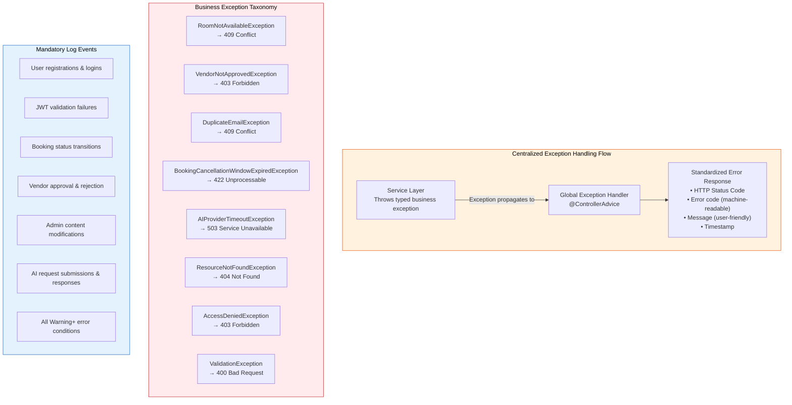
```mermaid
graph TD
    subgraph EXC_FLOW["Centralized Exception Handling Flow"]
        SVC["Service Layer\nThrows typed business exception"]
        HANDLER["Global Exception Handler\n@ControllerAdvice"]
        RESP["Standardized Error Response\n• HTTP Status Code\n• Error code (machine-readable)\n• Message (user-friendly)\n• Timestamp"]
    end

    SVC -->|Exception propagates to| HANDLER --> RESP

    subgraph EXCEPTIONS["Business Exception Taxonomy"]
        E1["RoomNotAvailableException\n→ 409 Conflict"]
        E2["VendorNotApprovedException\n→ 403 Forbidden"]
        E3["DuplicateEmailException\n→ 409 Conflict"]
        E4["BookingCancellationWindowExpiredException\n→ 422 Unprocessable"]
        E5["AIProviderTimeoutException\n→ 503 Service Unavailable"]
        E6["ResourceNotFoundException\n→ 404 Not Found"]
        E7["AccessDeniedException\n→ 403 Forbidden"]
        E8["ValidationException\n→ 400 Bad Request"]
    end

    subgraph LOG_EVENTS["Mandatory Log Events"]
        L1["User registrations & logins"]
        L2["JWT validation failures"]
        L3["Booking status transitions"]
        L4["Vendor approval & rejection"]
        L5["Admin content modifications"]
        L6["AI request submissions & responses"]
        L7["All Warning+ error conditions"]
    end

    style EXC_FLOW fill:#FFF3E0,stroke:#E65100,color:#000
    style EXCEPTIONS fill:#FFEBEE,stroke:#C62828,color:#000
    style LOG_EVENTS fill:#E3F2FD,stroke:#1565C0,color:#000
```

---

## 11. Assumptions

The following assumptions underpin the design and requirements defined in this document and must be validated before or during implementation.

1. **Web Client Communication:** All API consumers are web-based clients. The backend is designed to serve HTTP/HTTPS requests from browser-based applications. No mobile-native application protocols are considered in this phase.

2. **Single-Region Deployment:** The initial deployment of the backend serves a single geographic region. Multi-region data replication and latency optimization strategies are not required in this phase.

3. **External AI Provider Availability:** It is assumed that the configured external AI provider maintains a publicly accessible and commercially supported API endpoint. The platform's AI travel planning feature is dependent on this provider's availability and performance.

4. **Admin Content Accuracy:** It is assumed that the Admin Team will maintain the accuracy and currency of all content managed through admin-only endpoints, including transport data, tourist spot information, traditional food records, and cultural market data.

5. **Vendor Data Responsibility:** Registered vendors are assumed to take active responsibility for maintaining the accuracy of their hotel listing details, room availability, and pricing information.

6. **PostgreSQL as the Single Source of Truth:** The PostgreSQL database is the authoritative data store for all persistent platform data. Redis serves exclusively as a performance caching layer and does not store any data that is not already present in PostgreSQL.

7. **JWT Secret Security:** It is assumed that the JWT signing secret is stored securely in the backend's environment configuration and is not accessible through any public-facing interface or included in version control repositories.

8. **Sufficient Initial Data Population:** It is assumed that a baseline content library — including initial destination data, tourist spots, transport records, food guides, and market information — will be populated by the Admin Team before the platform is opened to travelers.

```mermaid
graph TD
    subgraph ASSUMPTIONS["Key Backend Assumptions — Must Be Validated"]
        A1["A1: Web clients only\nHTTP/HTTPS · No mobile protocols"]
        A2["A2: Single-region deployment\nNo multi-region replication needed"]
        A3["A3: AI provider available\nPublic · Commercial API · Stable"]
        A4["A4: Admin maintains\ncontent accuracy"]
        A5["A5: Vendors maintain\nlisting accuracy"]
        A6["A6: PostgreSQL = source of truth\nRedis is cache only"]
        A7["A7: JWT secret secured\nEnv config · Not in version control"]
        A8["A8: Content pre-populated\nbefore traveler access"]
    end

    A3 & A8 --> LAUNCH_RISK{If Not Validated\n→ Launch Risk}
    A7 --> SECURITY_RISK{If Not Validated\n→ Security Risk}
    A4 & A5 --> QUALITY_RISK{If Not Validated\n→ Data Quality Risk}

    style ASSUMPTIONS fill:#E8F4FD,stroke:#1565C0,color:#000
    style LAUNCH_RISK fill:#FFCDD2,stroke:#C62828,color:#000
    style SECURITY_RISK fill:#FFCDD2,stroke:#C62828,color:#000
    style QUALITY_RISK fill:#FFF9C4,stroke:#F9A825,color:#000
```

---

## 12. Constraints

The following constraints define the limitations within which the backend system must operate during the current implementation phase.

1. **Web-Based Backend Only:** The backend is designed to serve web application clients exclusively. No native mobile application backend protocols, push notification services, or mobile-specific API adaptations are included in this phase.

2. **No Payment Processing:** The backend does not include any payment gateway integration. Booking requests are managed as information exchanges between travelers and vendors; financial transactions occur outside the platform.

3. **Manual Vendor Verification:** Vendor approval is a manual administrative process. The backend supports the approval workflow but does not include automated business verification or document validation capabilities.

4. **Single AI Provider Dependency:** The backend is configured to communicate with a single external AI provider. There is no built-in failover to an alternative provider in this phase.

5. **English Language Data Only:** All content stored and served by the backend in this phase is in English. Multi-language content structures are not implemented in the initial data schema.

6. **Limited Initial Scale:** The backend is designed for the projected load of the initial regional launch. The caching strategy and database configuration are sized for this initial scale and will require review prior to significant expansion.

7. **No Real-Time Messaging:** The backend does not implement WebSocket connections or any real-time bidirectional communication. All interactions are request-response based.

```mermaid
graph LR
    subgraph CONSTRAINTS["Current Phase Constraints"]
        C1["Web-Based Only\nNo mobile protocols"]
        C2["No Payment Gateway\nOffline transactions only"]
        C3["Manual Vendor Verification\nNo automated document check"]
        C4["Single AI Provider\nNo failover to alternative"]
        C5["English Only\nNo multi-language schema"]
        C6["Initial Scale Only\nSized for regional launch"]
        C7["No Real-Time Messaging\nRequest-response only"]
    end

    subgraph FUTURE["Addressed in Future Phases"]
        F1["Payment Service\nPhase 3+"]
        F2["AI Failover\nPhase 3+"]
        F3["Multi-language\nPhase 3+"]
        F4["WebSocket / Notifications\nPhase 3+"]
    end

    C2 --> F1
    C4 --> F2
    C5 --> F3
    C7 --> F4

    style CONSTRAINTS fill:#FFEBEE,stroke:#C62828,color:#000
    style FUTURE fill:#E8F5E9,stroke:#2E7D32,color:#000
```

---

## 13. Risks and Mitigation

| **Risk ID** | **Risk Description** | **Likelihood** | **Impact** | **Mitigation Strategy** |
|---|---|---|---|---|
| R-BE-01 | **High database read load during peak usage** — Heavy concurrent traveler activity generates a large volume of read queries against the PostgreSQL database, degrading response times | Medium | High | Implement Redis caching for all high-frequency read targets (hotel search, destination data, spots, food, markets, transport). Monitor cache hit rates and expand cached data sets based on real usage patterns |
| R-BE-02 | **Invalid or outdated vendor data** — Vendors fail to update room availability, pricing, or listing details, resulting in inaccurate data being served to travelers | High | High | Implement data freshness timestamps on listings; alert admin when listings have not been updated beyond a defined threshold; enforce availability accuracy through booking transaction logic |
| R-BE-03 | **AI provider response delays or unavailability** — The external AI provider experiences downtime or slow response times, causing traveler-facing AI chatbot requests to fail or timeout | Medium | High | Implement a configurable request timeout; return a clear service unavailability response to the traveler; log all AI provider failures for monitoring; evaluate secondary provider options in Phase 3 |
| R-BE-04 | **JWT token security compromise** — The JWT signing secret is exposed or a token is intercepted, allowing unauthorized access to protected endpoints | Low | Very High | Store the JWT secret in secured environment configuration only; implement short token expiry windows; enforce HTTPS for all API communication; monitor for abnormal authentication patterns |
| R-BE-05 | **Booking race condition** — Two travelers simultaneously submit booking requests for the last available room of a given type, potentially resulting in both bookings being confirmed | Medium | High | Implement database-level transaction locking on room availability records during the booking creation process; verify availability within the transaction boundary before committing the booking record |
| R-BE-06 | **Data inconsistency from partial transaction failures** — A service operation that requires multiple database writes (e.g., booking confirmation + availability update) fails midway, leaving data in an inconsistent state | Low | Very High | Wrap all multi-write operations in database transactions with rollback on failure; implement comprehensive exception handling that guarantees atomicity for all compound operations |
| R-BE-07 | **Unvalidated input causing data corruption** — Malformed or malicious input reaches the database due to insufficient server-side validation | Medium | High | Enforce strict input validation at the API boundary for all incoming requests; use parameterized database queries exclusively; implement a centralized validation layer in the service architecture |
| R-BE-08 | **Cache staleness serving outdated data** — A content update by an admin is not reflected in cached API responses, causing travelers to receive outdated information | Medium | Medium | Implement cache invalidation triggers on all admin write operations; define appropriate TTL values for each cached data category; provide an admin-triggered manual cache refresh option |

```mermaid
quadrantChart
    title Backend Risk Matrix — Likelihood vs Impact
    x-axis Low Likelihood --> High Likelihood
    y-axis Low Impact --> Very High Impact
    quadrant-1 Critical — Immediate Mitigation Required
    quadrant-2 High Priority — Monitor Closely
    quadrant-3 Low Priority — Watch
    quadrant-4 Moderate — Plan & Mitigate
    R-BE-04 JWT Security Compromise: [0.15, 0.95]
    R-BE-06 Partial Transaction Failure: [0.20, 0.92]
    R-BE-02 Outdated Vendor Data: [0.78, 0.83]
    R-BE-05 Booking Race Condition: [0.52, 0.82]
    R-BE-07 Unvalidated Input: [0.50, 0.80]
    R-BE-01 High DB Read Load: [0.55, 0.75]
    R-BE-03 AI Provider Timeout: [0.48, 0.72]
    R-BE-08 Cache Staleness: [0.55, 0.50]
```

```mermaid
graph TD
    subgraph CRITICAL_R["Critical Risks — Immediate Controls Required"]
        RC1["R-BE-04: JWT Compromise\nLikelihood: Low · Impact: Very High\nMitigation: Env-secured secret · HTTPS · Short expiry · Monitoring"]
        RC2["R-BE-06: Partial Transaction Failure\nLikelihood: Low · Impact: Very High\nMitigation: DB transactions · Rollback · Atomicity guaranteed"]
    end

    subgraph HIGH_R["High Priority Risks"]
        RH1["R-BE-02: Stale Vendor Data\nMitigation: Freshness timestamps · Admin alerts · Booking logic"]
        RH2["R-BE-05: Booking Race Condition\nMitigation: DB-level transaction locking · Availability within transaction"]
        RH3["R-BE-07: Unvalidated Input\nMitigation: API boundary validation · Parameterized queries"]
        RH4["R-BE-01: High DB Load\nMitigation: Redis caching · Cache hit monitoring"]
        RH5["R-BE-03: AI Provider Timeout\nMitigation: Configurable timeout · Fallback response · Failure logging"]
    end

    subgraph MOD_R["Moderate Risks"]
        RM1["R-BE-08: Cache Staleness\nMitigation: Invalidation on admin write · TTL policy · Manual refresh"]
    end

    style CRITICAL_R fill:#FFEBEE,stroke:#C62828,color:#000
    style HIGH_R fill:#FFF3E0,stroke:#E65100,color:#000
    style MOD_R fill:#FFF9C4,stroke:#F9A825,color:#000
```

---

## 14. Future Backend Enhancements

The following backend capabilities have been identified as high-value additions for future development phases. They are outside the scope of the current implementation but are documented here to ensure the current backend architecture does not create obstacles to their future adoption.

### 14.1 Payment Gateway Integration

A future backend payment service will manage the integration with one or more payment gateway providers, enabling travelers to complete financial transactions for hotel bookings directly within the platform. This service will be responsible for initiating payment requests, handling gateway callbacks, recording payment records against booking entities, managing refund workflows for cancellations, and providing vendors with settlement reporting.

### 14.2 Notification Service

A dedicated notification service will manage the delivery of event-driven communications to platform users. Triggered by booking status changes, vendor approval decisions, and other platform events, this service will handle the formatting and dispatch of email notifications. The service will be designed to process notifications asynchronously, ensuring that notification delivery does not affect the response time of the primary business operation that triggers it.

### 14.3 AI Recommendation Optimization

The AI Integration Service will be enhanced to incorporate machine learning based on accumulated traveler interaction data. Rather than forwarding raw user inputs to the external AI provider, the optimized service will apply a traveler preference model — built from historical chat data, browsing patterns, and booking behavior — to enrich and personalize each AI request before it is sent, resulting in progressively more accurate and relevant recommendations.

### 14.4 Analytics and Reporting Service

A backend analytics service will aggregate platform activity data — including user registrations, booking volumes, AI interaction rates, most-viewed destinations, and vendor performance metrics — and make this data available through admin-facing reporting API endpoints. This service will operate on aggregated, anonymized data sets and will provide the business with the operational intelligence required to make informed platform development and marketing decisions.

### 14.5 Review and Rating Data Management

A future review service will manage traveler-submitted ratings and written reviews for hotels, tourist spots, and destinations. This service will include submission validation, moderation status management, aggregate rating calculation, and vendor response recording — providing the data backend required to power the community trust features planned for Phase 3 of the platform roadmap.

### 14.6 Multi-Language Content Management

A future content localization service will extend the backend data schema and API structure to support multi-language content records for all content categories. This service will manage language variants for destination descriptions, food guides, cultural market information, and tourist spot details, and will return content in the traveler's preferred language based on their profile settings or request headers.

```mermaid
graph TD
    CURRENT["Current Backend\n10 Core Services\nPhase 1 & 2 Scope"]

    subgraph FUTURE_SERVICES["Future Backend Enhancements"]
        F1["14.1 Payment Service\nGateway integration · Callbacks\nRefunds · Vendor settlement"]
        F2["14.2 Notification Service\nEvent-driven · Async dispatch\nEmail · Status change triggers"]
        F3["14.3 AI Optimization\nPreference model · ML enrichment\nPersonalized AI requests"]
        F4["14.4 Analytics Service\nAggregated data · Admin reports\nAnonymized · Business intelligence"]
        F5["14.5 Review Service\nRatings · Moderation\nAggregate scores · Vendor responses"]
        F6["14.6 Multi-Language Service\nSchema extension · Language variants\nProfile-based content language"]
    end

    CURRENT -->|Phase 3+| F1 & F2 & F3
    CURRENT -->|Phase 3+| F4 & F5 & F6

    F3 -.->|Depends on| F4
    F5 -.->|Feeds| F4

    style CURRENT fill:#1565C0,color:#fff
    style F1 fill:#E8F5E9,stroke:#2E7D32,color:#000
    style F2 fill:#E3F2FD,stroke:#1565C0,color:#000
    style F3 fill:#F3E5F5,stroke:#6A1B9A,color:#000
    style F4 fill:#FFF3E0,stroke:#E65100,color:#000
    style F5 fill:#FCE4EC,stroke:#AD1457,color:#000
    style F6 fill:#E0F7FA,stroke:#00838F,color:#000
```

---

## Document Approval

| **Role**                            | **Name** | **Signature** | **Date** |
|------------------------------------|----------|---------------|----------|
| Lead Backend Business Analyst       |          |               |          |
| System Architect / Technical Lead   |          |               |          |
| Project Sponsor / System Owner      |          |               |          |
| Admin Team Representative           |          |               |          |

---

## Document Revision History

| **Version** | **Date**          | **Author**                          | **Description of Changes**                        |
|-------------|-------------------|-------------------------------------|----------------------------------------------------|
| 0.1         | February 14, 2026 | Backend Analysis Team               | Initial draft — core services and requirements     |
| 0.5         | February 21, 2026 | Backend Analysis Team               | Added data management, caching, and security sections |
| 1.0         | February 28, 2026 | Backend Analysis Team               | Final version prepared for review and submission   |
| 1.1         | February 28, 2026 | Backend Analysis Team               | Added Mermaid diagrams throughout all sections     |

---

*This document is prepared for backend system planning, academic reference, and portfolio use. All requirements and specifications are subject to review and approval by designated technical and business stakeholders prior to implementation.*

---

**End of Document**