# Frontend Business Requirements Document (Frontend BRD)
# AI Powered Traveling Management System

---

| **Document Information**     |                                                        |
|-----------------------------|--------------------------------------------------------|
| **Project Title**           | AI Powered Traveling Management System                 |
| **Document Type**           | Frontend Business Requirements Document                |
| **Version**                 | 1.0                                                    |
| **Prepared By**             | Frontend Business Analysis & UX Planning Team          |
| **Document Status**         | Final Draft                                            |
| **Date**                    | February 28, 2026                                      |
| **Frontend Technology**     | Angular · Responsive Web · Mobile-First Design         |

---

## Table of Contents

1. [Frontend Overview](#1-frontend-overview)
2. [Frontend Scope](#2-frontend-scope)
3. [User Types and UI Needs](#3-user-types-and-ui-needs)
4. [Screen Modules](#4-screen-modules)
5. [Frontend Business Requirements](#5-frontend-business-requirements)
6. [Navigation and User Flow](#6-navigation-and-user-flow)
7. [Responsive Design Requirements](#7-responsive-design-requirements)
8. [UI/UX Standards](#8-uiux-standards)
9. [Accessibility Requirements](#9-accessibility-requirements)
10. [Client-Side Validation Rules](#10-client-side-validation-rules)
11. [Performance Requirements](#11-performance-requirements)
12. [Assumptions](#12-assumptions)
13. [Constraints](#13-constraints)
14. [Future Frontend Enhancements](#14-future-frontend-enhancements)

---

## 1. Frontend Overview

### 1.1 Purpose of the Frontend

The frontend of the **AI Powered Traveling Management System** is the complete visual and interactive face of the platform. It is the layer through which every user — traveler, vendor, or administrator — perceives, navigates, and interacts with the system. Its purpose is to translate the platform's powerful backend capabilities into an experience that is intuitive, visually clear, and genuinely useful to users who may have no technical background.

The frontend is not simply a collection of screens. It is a purposefully designed interaction environment that guides users through complex planning tasks — such as defining a travel budget, interacting with an AI chatbot, browsing hotel listings, or managing vendor inventory — in a way that feels effortless, logical, and rewarding.

### 1.2 Role in the Overall System

The frontend occupies the user-facing layer of the platform, operating as the primary communication channel between the user and the system's data and services. It presents information retrieved from the backend in a structured, readable, and visually engaging format, and collects user inputs through validated forms and interactive controls, which it then forwards to the backend for processing.

The frontend is responsible for all visual rendering, client-side routing, state management, user interaction handling, real-time form validation, loading state communication, and error display. It works in close coordination with the backend API but maintains a clean separation of concerns — the frontend presents and interacts; the backend processes and stores.

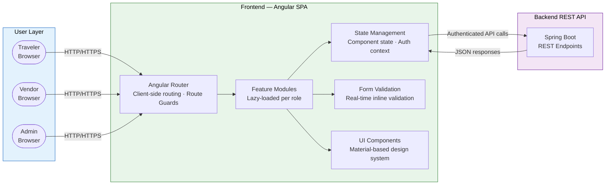
```mermaid
graph LR
    subgraph USER["User Layer"]
        T(["Traveler\nBrowser"])
        V(["Vendor\nBrowser"])
        A(["Admin\nBrowser"])
    end

    subgraph FRONTEND["Frontend — Angular SPA"]
        direction TB
        ROUTER["Angular Router\nClient-side routing · Route Guards"]
        STATE["State Management\nComponent state · Auth context"]
        MODULES["Feature Modules\nLazy-loaded per role"]
        VALID["Form Validation\nReal-time inline validation"]
        UI["UI Components\nMaterial-based design system"]
    end

    subgraph BACKEND_API["Backend REST API"]
        BE["Spring Boot\nREST Endpoints"]
    end

    T & V & A -->|HTTP/HTTPS| ROUTER
    ROUTER --> MODULES
    MODULES --> STATE & VALID & UI
    STATE -->|Authenticated API calls| BE
    BE -->|JSON responses| STATE

    style USER fill:#E3F2FD,stroke:#1565C0,color:#000
    style FRONTEND fill:#E8F5E9,stroke:#2E7D32,color:#000
    style BACKEND_API fill:#F3E5F5,stroke:#6A1B9A,color:#000
```

### 1.3 User Experience Goals

The frontend is designed to achieve the following core user experience objectives across all user types.

**Clarity:** Every screen, form, and action on the platform must be immediately understandable without requiring a user manual. Labels, instructions, and feedback messages shall be written in plain, accessible language.

**Efficiency:** Users should be able to complete their primary tasks — planning a trip, searching for a hotel, managing a listing, approving a vendor — with the minimum number of steps and interactions required.

**Confidence:** The frontend shall always communicate clearly what is happening, what has happened, and what the user should do next. Loading indicators, success confirmations, and error messages eliminate ambiguity and build user trust.

**Consistency:** Across every screen and module, the interface shall maintain a unified visual language — the same color palette, typography, component styles, interaction patterns, and navigation structure — so that users never feel disoriented when moving between different areas of the platform.

**Inclusivity:** The platform is designed for the general public. This means the interface must be accessible to users of different technical ability levels, screen sizes, and assistive technology preferences.

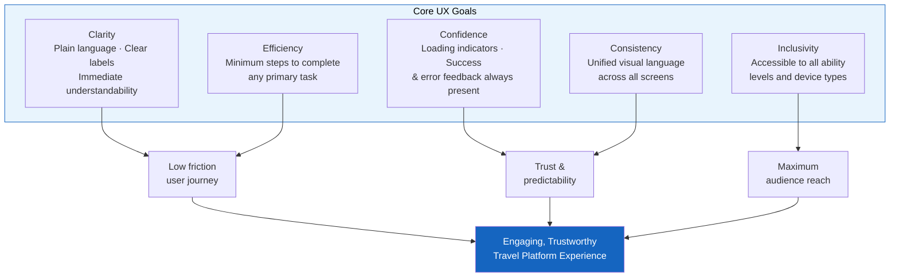
```mermaid
graph TD
    subgraph UX_GOALS["Core UX Goals"]
        G1["Clarity\nPlain language · Clear labels\nImmediate understandability"]
        G2["Efficiency\nMinimum steps to complete\nany primary task"]
        G3["Confidence\nLoading indicators · Success\n& error feedback always present"]
        G4["Consistency\nUnified visual language\nacross all screens"]
        G5["Inclusivity\nAccessible to all ability\nlevels and device types"]
    end

    G1 & G2 --> OUTCOME1["Low friction\nuser journey"]
    G3 & G4 --> OUTCOME2["Trust &\npredictability"]
    G5 --> OUTCOME3["Maximum\naudience reach"]

    OUTCOME1 & OUTCOME2 & OUTCOME3 --> RESULT["Engaging, Trustworthy\nTravel Platform Experience"]

    style UX_GOALS fill:#E8F4FD,stroke:#1565C0,color:#000
    style RESULT fill:#1565C0,color:#fff
```

### 1.4 Design Philosophy

The frontend design is guided by four foundational principles.

**Simplicity First:** The interface avoids unnecessary complexity. Each screen presents only the information and controls that are relevant to the user's current task, reducing cognitive load and making every interaction feel manageable.

**Mobile Responsiveness:** Given that a substantial proportion of travel planning activity occurs on mobile devices, the frontend is designed mobile-first and scales gracefully to tablet and desktop viewports. Every layout, component, and interaction pattern is tested and optimized for small screens before being adapted for larger ones.

**Accessibility by Design:** Accessibility is not an afterthought. It is embedded in every design decision — from color contrast ratios and font sizes to keyboard navigation support and screen reader-compatible markup.

**Progressive Disclosure:** Complex features and detailed information are revealed progressively as the user needs them, rather than being presented all at once. A traveler browsing hotels, for example, sees a clean summary list before optionally drilling into the full details of a specific property.

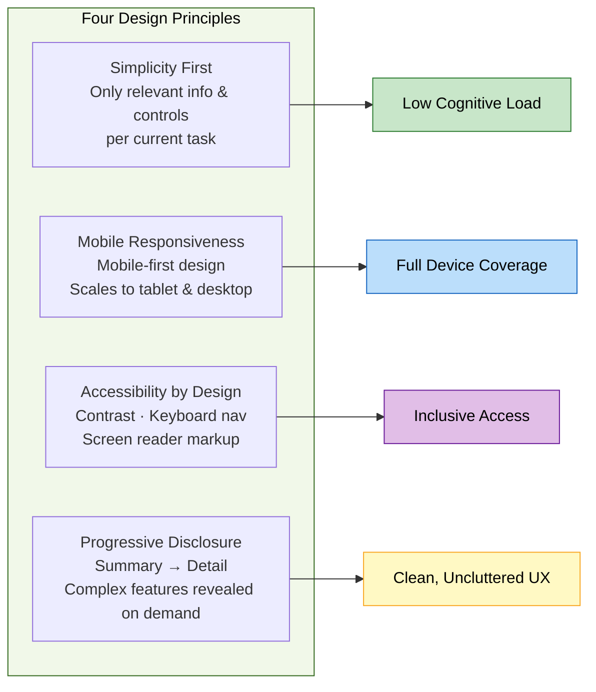
```mermaid
graph LR
    subgraph PRINCIPLES["Four Design Principles"]
        P1["Simplicity First\nOnly relevant info & controls\nper current task"]
        P2["Mobile Responsiveness\nMobile-first design\nScales to tablet & desktop"]
        P3["Accessibility by Design\nContrast · Keyboard nav\nScreen reader markup"]
        P4["Progressive Disclosure\nSummary → Detail\nComplex features revealed on demand"]
    end

    P1 --> LOW_COG["Low Cognitive Load"]
    P2 --> DEVICE_REACH["Full Device Coverage"]
    P3 --> INCLUSIVE["Inclusive Access"]
    P4 --> CLEAN_UX["Clean, Uncluttered UX"]

    style PRINCIPLES fill:#F1F8E9,stroke:#33691E,color:#000
    style LOW_COG fill:#C8E6C9,stroke:#2E7D32,color:#000
    style DEVICE_REACH fill:#BBDEFB,stroke:#1565C0,color:#000
    style INCLUSIVE fill:#E1BEE7,stroke:#6A1B9A,color:#000
    style CLEAN_UX fill:#FFF9C4,stroke:#F9A825,color:#000
```

---

## 2. Frontend Scope

### 2.1 In Scope

The following frontend responsibilities are included within the scope of this document and the current implementation phase.

**Web UI Screens:** The frontend encompasses all screens required to support the complete user journeys of the Traveler, Vendor, and Admin user types — from authentication through to task completion. This includes all public-facing pages and all role-specific dashboards and management panels.

**Responsive Layouts:** All screens and components are designed and implemented to render correctly and usably across mobile, tablet, and desktop viewport sizes. Layout structures adapt fluidly to the available screen width without requiring separate codebases for each device type.

**Client-Side Form Validation:** All user input forms include real-time, client-side validation that provides immediate, inline feedback to the user before a request is submitted. This includes required field enforcement, format checking, and value range validation.

**Navigation and Routing:** The frontend manages all client-side routing through Angular's routing module, enabling single-page application navigation where pages transition without full browser reloads. Route guards enforce that unauthenticated or unauthorized users cannot access protected screens.

**User Interaction Flows:** The frontend implements all defined user interaction workflows — including the AI travel planning chat flow, the hotel search and booking request flow, the vendor listing management flow, and the admin approval flow — as cohesive, step-guided experiences.

**Loading and State Communication:** All asynchronous operations (API calls, data loading, form submissions) are accompanied by appropriate loading indicators. Success and error states are communicated clearly through visual feedback components.

---

### 2.2 Out of Scope

| Out of Scope Item | Reason for Exclusion |
|---|---|
| Server-side data processing and business logic | Handled entirely by the backend; frontend consumes API responses only |
| Database design and data storage logic | Backend responsibility; not relevant to frontend interaction design |
| API endpoint implementation details | Backend concern; frontend interacts with APIs as defined contracts |
| Server infrastructure, deployment, and DevOps | Not a frontend concern |
| Backend security implementation | Frontend enforces UI-level access control; backend enforces authority |
| Native mobile application (iOS / Android) | Web application only in current phase; native app is a future enhancement |
| Offline functionality | No offline or service worker support in this phase |

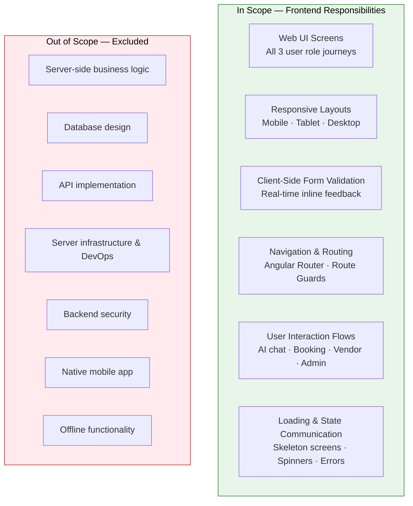
```mermaid
graph TD
    subgraph IN["In Scope — Frontend Responsibilities"]
        I1["Web UI Screens\nAll 3 user role journeys"]
        I2["Responsive Layouts\nMobile · Tablet · Desktop"]
        I3["Client-Side Form Validation\nReal-time inline feedback"]
        I4["Navigation & Routing\nAngular Router · Route Guards"]
        I5["User Interaction Flows\nAI chat · Booking · Vendor · Admin"]
        I6["Loading & State Communication\nSkeleton screens · Spinners · Errors"]
    end

    subgraph OUT["Out of Scope — Excluded"]
        O1["Server-side business logic"]
        O2["Database design"]
        O3["API implementation"]
        O4["Server infrastructure & DevOps"]
        O5["Backend security"]
        O6["Native mobile app"]
        O7["Offline functionality"]
    end

    style IN fill:#E8F5E9,stroke:#2E7D32,color:#000
    style OUT fill:#FFEBEE,stroke:#C62828,color:#000
```

---

## 3. User Types and UI Needs

Each of the three platform user types has distinct UI needs, primary tasks, and interaction patterns. The frontend is designed to serve each type with a tailored experience appropriate to their role and objectives.

| **User Type** | **UI Needs** | **Key Actions** | **Design Priority** |
|---|---|---|---|
| **Traveler** | Clean, visually engaging interface that makes travel inspiration and planning feel easy and exciting. Minimal friction between browsing and booking. AI chat interface that feels conversational and natural. | Register and log in; interact with AI travel chatbot; browse destination content; search and filter hotels; view tourist spots, food, markets, and routes; submit booking requests; view booking status | Discoverability, simplicity, visual richness, and responsive mobile experience |
| **Vendor** | A functional, form-driven dashboard that makes managing listings and booking requests straightforward. Clear feedback on form submissions and data updates. | Register as vendor; create and manage hotel listings; add and update room types and pricing; manage incoming booking requests; confirm or decline bookings; update business profile | Efficiency, form usability, data clarity, and booking status visibility |
| **Admin** | A data-dense management interface providing full visibility and control over all platform entities. Tabular views, filterable lists, and action-oriented controls for rapid decision-making. | Manage all user accounts; review and approve or reject vendor applications; create and update all content categories (spots, food, transport, markets, routes); monitor platform activity | Information density, control, filtering capability, and action confirmation clarity |

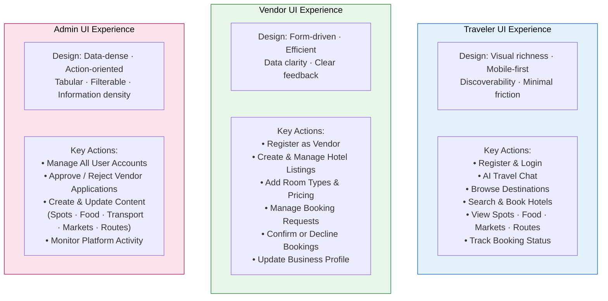
```mermaid
graph TD
    subgraph TRAVELER_UX["Traveler UI Experience"]
        TU["Design: Visual richness · Mobile-first\nDiscoverability · Minimal friction"]
        TA["Key Actions:\n• Register & Login\n• AI Travel Chat\n• Browse Destinations\n• Search & Book Hotels\n• View Spots · Food · Markets · Routes\n• Track Booking Status"]
    end

    subgraph VENDOR_UX["Vendor UI Experience"]
        VU["Design: Form-driven · Efficient\nData clarity · Clear feedback"]
        VA["Key Actions:\n• Register as Vendor\n• Create & Manage Hotel Listings\n• Add Room Types & Pricing\n• Manage Booking Requests\n• Confirm or Decline Bookings\n• Update Business Profile"]
    end

    subgraph ADMIN_UX["Admin UI Experience"]
        AU["Design: Data-dense · Action-oriented\nTabular · Filterable · Information density"]
        AA["Key Actions:\n• Manage All User Accounts\n• Approve / Reject Vendor Applications\n• Create & Update Content\n  (Spots · Food · Transport · Markets · Routes)\n• Monitor Platform Activity"]
    end

    style TRAVELER_UX fill:#E3F2FD,stroke:#1565C0,color:#000
    style VENDOR_UX fill:#E8F5E9,stroke:#2E7D32,color:#000
    style ADMIN_UX fill:#FCE4EC,stroke:#AD1457,color:#000
```

---

## 4. Screen Modules

This section defines the UI screens, layout structures, and interaction patterns for each major module of the platform.

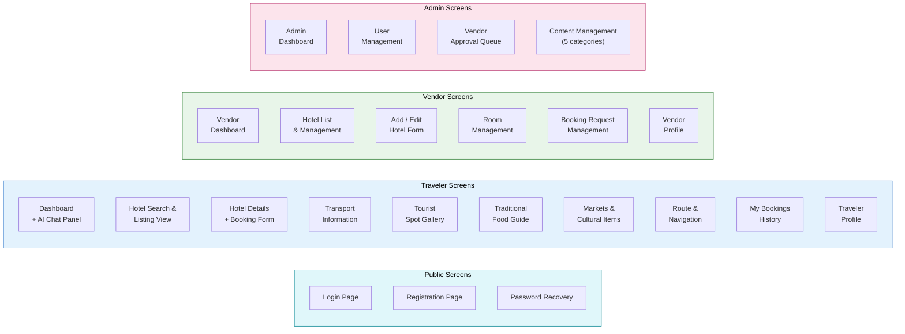
```mermaid
graph LR
    subgraph PUBLIC["Public Screens"]
        S0A["Login Page"]
        S0B["Registration Page"]
        S0C["Password Recovery"]
    end

    subgraph TRAVELER_SCREENS["Traveler Screens"]
        S1["Dashboard\n+ AI Chat Panel"]
        S2["Hotel Search &\nListing View"]
        S3["Hotel Details\n+ Booking Form"]
        S4["Transport\nInformation"]
        S5["Tourist\nSpot Gallery"]
        S6["Traditional\nFood Guide"]
        S7["Markets &\nCultural Items"]
        S8["Route &\nNavigation"]
        S9["My Bookings\nHistory"]
        S10["Traveler\nProfile"]
    end

    subgraph VENDOR_SCREENS["Vendor Screens"]
        V1["Vendor\nDashboard"]
        V2["Hotel List\n& Management"]
        V3["Add / Edit\nHotel Form"]
        V4["Room\nManagement"]
        V5["Booking Request\nManagement"]
        V6["Vendor\nProfile"]
    end

    subgraph ADMIN_SCREENS["Admin Screens"]
        A1["Admin\nDashboard"]
        A2["User\nManagement"]
        A3["Vendor\nApproval Queue"]
        A4["Content Management\n(5 categories)"]
    end

    style PUBLIC fill:#E0F7FA,stroke:#00838F,color:#000
    style TRAVELER_SCREENS fill:#E3F2FD,stroke:#1565C0,color:#000
    style VENDOR_SCREENS fill:#E8F5E9,stroke:#2E7D32,color:#000
    style ADMIN_SCREENS fill:#FCE4EC,stroke:#AD1457,color:#000
```

---

### 4.1 Authentication Screens

Authentication screens are the entry point for all users. They must be clean, trustworthy, and quick to complete — removing every barrier between the user and their first meaningful platform interaction.

#### 4.1.1 Login Page

The login page presents a centered, card-style form against a visually appealing background image or gradient evocative of travel. The form contains two input fields — email address and password — and a prominent primary action button labeled "Log In." A secondary link below the form directs users to the registration page, and a "Forgot Password?" link initiates the password recovery flow.

The page displays the platform logo and name prominently at the top of the card. An informational tagline reinforces the platform's value proposition. The layout is fully responsive: on mobile devices, the form occupies the full viewport width with appropriate padding; on tablets and desktops, it is centered within a fixed-width card.

On submission, the form is locked and a loading spinner replaces the submit button while the authentication request is in progress. If the login fails, an inline error banner is displayed above the form fields indicating that the credentials are incorrect, without specifying which field is wrong.

#### 4.1.2 Registration Page

The registration page presents a multi-field form for new user account creation. Fields include full name, email address, password, password confirmation, and a role selector (Traveler or Vendor). When "Vendor" is selected, the form expands to reveal additional fields for business name and business address.

Each field provides real-time inline validation feedback as the user types. Password strength is indicated by a visual strength meter directly beneath the password input field — progressing from "Weak" to "Moderate" to "Strong" as the user meets complexity requirements. Mismatched passwords trigger an immediate inline message below the confirmation field.

A clearly worded summary of platform terms is presented below the form with a required acknowledgment checkbox. The registration submit button remains disabled until all required fields are valid and the acknowledgment is checked.

#### 4.1.3 Password Recovery Flow

The password recovery screen presents a single email input field and a "Send Recovery Link" button. On submission, a success message is shown regardless of whether the email exists in the system, preventing email enumeration. A secondary link allows the user to return to the login page.

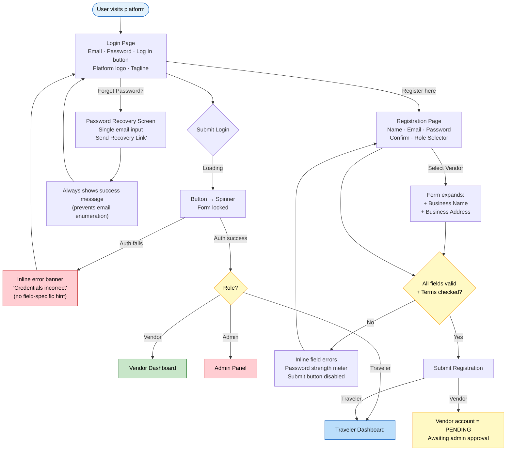
```mermaid
flowchart TD
    VISIT(["User visits platform"]) --> LOGIN_PAGE["Login Page\nEmail · Password · Log In button\nPlatform logo · Tagline"]

    LOGIN_PAGE --> SUBMIT_LOGIN{Submit Login}
    SUBMIT_LOGIN -->|Loading| SPINNER["Button → Spinner\nForm locked"]
    SPINNER -->|Auth fails| ERR_LOGIN["Inline error banner\n'Credentials incorrect'\n(no field-specific hint)"]
    ERR_LOGIN --> LOGIN_PAGE
    SPINNER -->|Auth success| ROLE_REDIRECT{Role?}
    ROLE_REDIRECT -->|Traveler| T_DASH["Traveler Dashboard"]
    ROLE_REDIRECT -->|Vendor| V_DASH["Vendor Dashboard"]
    ROLE_REDIRECT -->|Admin| A_DASH["Admin Panel"]

    LOGIN_PAGE -->|"Forgot Password?"| RECOVERY["Password Recovery Screen\nSingle email input\n'Send Recovery Link'"]
    RECOVERY --> SUBMIT_REC["Always shows success message\n(prevents email enumeration)"]
    SUBMIT_REC --> LOGIN_PAGE

    LOGIN_PAGE -->|"Register here"| REG_PAGE["Registration Page\nName · Email · Password\nConfirm · Role Selector"]
    REG_PAGE -->|Select Vendor| EXPAND["Form expands:\n+ Business Name\n+ Business Address"]
    EXPAND & REG_PAGE --> VALID_CHECK{All fields valid\n+ Terms checked?}
    VALID_CHECK -->|No| INLINE_ERR["Inline field errors\nPassword strength meter\nSubmit button disabled"]
    INLINE_ERR --> REG_PAGE
    VALID_CHECK -->|Yes| SUBMIT_REG["Submit Registration"]
    SUBMIT_REG -->|Traveler| T_DASH
    SUBMIT_REG -->|Vendor| PENDING["Vendor account = PENDING\nAwaiting admin approval"]

    style VISIT fill:#E3F2FD,stroke:#1565C0,color:#000
    style T_DASH fill:#BBDEFB,stroke:#1565C0,color:#000
    style V_DASH fill:#C8E6C9,stroke:#2E7D32,color:#000
    style A_DASH fill:#FFCDD2,stroke:#C62828,color:#000
    style ERR_LOGIN fill:#FFCDD2,stroke:#C62828,color:#000
    style PENDING fill:#FFF9C4,stroke:#F9A825,color:#000
    style VALID_CHECK fill:#FFF9C4,stroke:#F9A825,color:#000
    style ROLE_REDIRECT fill:#FFF9C4,stroke:#F9A825,color:#000
```

---

### 4.2 Traveler Dashboard

The Traveler Dashboard is the home screen for authenticated travelers. It is designed to be visually inspiring, immediately actionable, and personalized to the traveler's planning context.

#### 4.2.1 Layout and Structure

The dashboard is organized into three primary zones: the AI Chat Panel on one side (or prominently above on mobile), a central content area displaying Recommended Destinations, and a Quick Actions bar providing shortcut access to hotel search, tourist spots, food guides, and route planning.

A persistent top navigation bar carries the platform logo, primary navigation links (Hotels, Destinations, Transport, Food, Markets, Routes), a notification icon, and the user's profile avatar which expands to a dropdown menu on click.

#### 4.2.2 AI Chat Panel

The AI Chat Panel occupies a collapsible sidebar on desktop and a full-screen modal on mobile. It presents a conversational chat interface with a scrollable message history area at the top and a multi-line input field at the bottom. A "Send" button triggers the AI planning request.

Before the first interaction, the panel displays a welcoming prompt such as "Tell me your travel budget, destination preferences, and how long you're traveling — I'll create your perfect plan." Suggested prompt chips below the input field offer one-tap starting options such as "Weekend trip under $200" or "Cultural trip for two."

AI responses are rendered as structured message bubbles with clear visual differentiation between the user's messages and the AI's responses. Within AI responses, destination names, hotel suggestions, and tourist spots are rendered as tappable links that navigate directly to the relevant content pages.

A loading animation (animated typing indicator) is displayed while the AI response is being generated. If the AI service is unavailable, a friendly inline message indicates that travel planning suggestions are temporarily unavailable and invites the user to try again.

#### 4.2.3 Recommended Destinations

Below or beside the chat panel, a horizontally scrollable card row displays recommended destinations. Each destination card includes a high-quality background image, the destination name, a brief tagline, and a "Explore" button. On mobile, cards stack vertically in a single-column layout.

#### 4.2.4 Quick Search Options

A search bar at the top of the main content area allows travelers to type a destination name and immediately filter the destination cards. Quick filter chips below the search bar allow one-tap filtering by travel style (e.g., Cultural, Nature, Food, Budget).

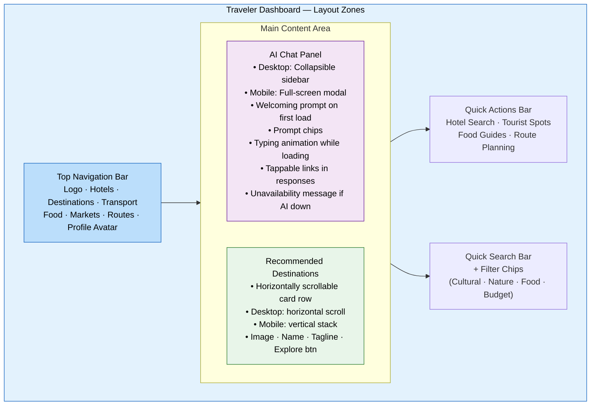
```mermaid
graph TD
    subgraph DASH_LAYOUT["Traveler Dashboard — Layout Zones"]
        TOPNAV["Top Navigation Bar\nLogo · Hotels · Destinations · Transport\nFood · Markets · Routes · Profile Avatar"]

        subgraph MAIN["Main Content Area"]
            direction LR
            AI_PANEL["AI Chat Panel\n• Desktop: Collapsible sidebar\n• Mobile: Full-screen modal\n• Welcoming prompt on first load\n• Prompt chips\n• Typing animation while loading\n• Tappable links in responses\n• Unavailability message if AI down"]
            DEST_SECTION["Recommended Destinations\n• Horizontally scrollable card row\n• Desktop: horizontal scroll\n• Mobile: vertical stack\n• Image · Name · Tagline · Explore btn"]
        end

        QUICK["Quick Actions Bar\nHotel Search · Tourist Spots\nFood Guides · Route Planning"]
        SEARCH["Quick Search Bar\n+ Filter Chips\n(Cultural · Nature · Food · Budget)"]
    end

    TOPNAV --> MAIN
    MAIN --> QUICK
    MAIN --> SEARCH

    style DASH_LAYOUT fill:#E3F2FD,stroke:#1565C0,color:#000
    style AI_PANEL fill:#F3E5F5,stroke:#6A1B9A,color:#000
    style DEST_SECTION fill:#E8F5E9,stroke:#2E7D32,color:#000
    style TOPNAV fill:#BBDEFB,stroke:#1565C0,color:#000
```

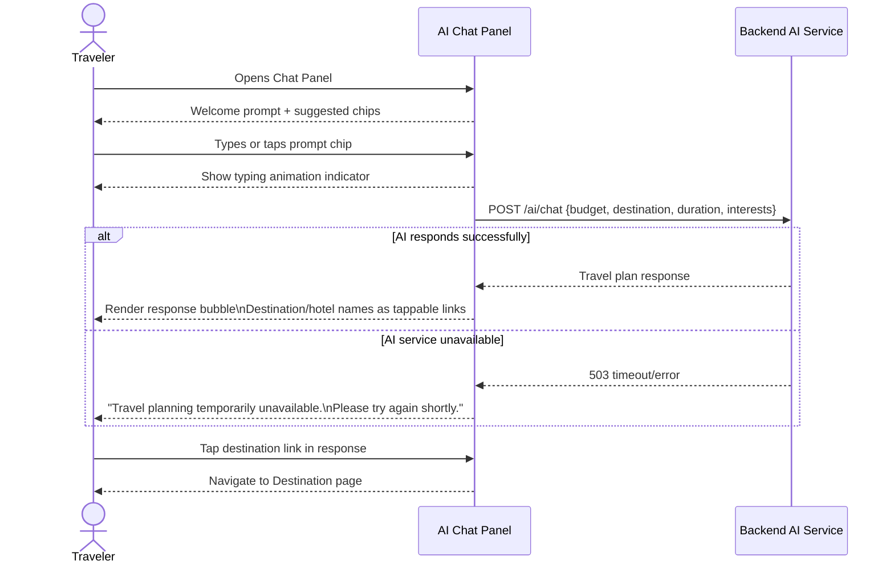
```mermaid
sequenceDiagram
    actor T as Traveler
    participant UI as AI Chat Panel
    participant API as Backend AI Service

    T->>UI: Opens Chat Panel
    UI-->>T: Welcome prompt + suggested chips
    T->>UI: Types or taps prompt chip
    UI-->>T: Show typing animation indicator
    UI->>API: POST /ai/chat {budget, destination, duration, interests}
    alt AI responds successfully
        API-->>UI: Travel plan response
        UI-->>T: Render response bubble\nDestination/hotel names as tappable links
    else AI service unavailable
        API-->>UI: 503 timeout/error
        UI-->>T: "Travel planning temporarily unavailable.\nPlease try again shortly."
    end
    T->>UI: Tap destination link in response
    UI-->>T: Navigate to Destination page
```

---

### 4.3 Hotel Search and Booking UI

#### 4.3.1 Hotel Search Screen

The hotel search screen presents a search bar with destination input, accompanied by a filter panel. Filters include location (or destination), price range (slider control with minimum and maximum handles), room type, and number of guests. A "Search" button triggers the results update.

Results are displayed as a vertically scrolling list of hotel cards. Each card shows the hotel name, location, a thumbnail image, a short description, the starting price per night, and a "View Details" button. A results count is shown above the list (e.g., "24 hotels found in Dhaka").

A sort control above the list allows travelers to sort results by price (low to high, high to low) or by name (A–Z). If no hotels match the current filters, an empty state illustration is displayed with the message "No hotels found for your search. Try adjusting your filters."

#### 4.3.2 Hotel Details Page

The hotel details page presents the full information for a selected property. The top of the page displays a photo gallery in a responsive image carousel, followed by the hotel name, location, a detailed description, and a listed breakdown of available amenities.

Below the description, a tabbed section organizes room types, each displaying the room name, capacity, included amenities, price per night, and an "Book This Room" button. Tapping this button opens the booking form.

#### 4.3.3 Booking Form

The booking form is presented as a modal dialog or a dedicated page section, containing fields for check-in date, check-out date, number of guests, and an optional special requests text area. A dynamic price summary updates in real time as the user selects dates, showing the total estimated cost based on the number of nights calculated from the selected dates.

A prominent "Submit Booking Request" button submits the form. On submission, a success confirmation screen or modal is displayed, informing the traveler that their request has been sent to the vendor and they will be notified of the vendor's response. A "View My Bookings" link is provided in the confirmation.

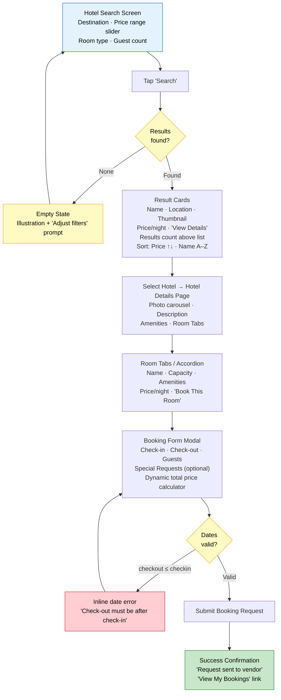
```mermaid
flowchart TD
    HOTEL_SEARCH["Hotel Search Screen\nDestination · Price range slider\nRoom type · Guest count"] --> SEARCH_BTN["Tap 'Search'"]
    SEARCH_BTN --> RESULTS{Results\nfound?}
    RESULTS -->|None| EMPTY["Empty State\nIllustration + 'Adjust filters' prompt"]
    EMPTY --> HOTEL_SEARCH
    RESULTS -->|Found| RESULT_LIST["Result Cards\nName · Location · Thumbnail\nPrice/night · 'View Details'\nResults count above list\nSort: Price ↑↓ · Name A–Z"]
    RESULT_LIST --> SELECT_HOTEL["Select Hotel → Hotel Details Page\nPhoto carousel · Description\nAmenities · Room Tabs"]
    SELECT_HOTEL --> ROOM_TAB["Room Tabs / Accordion\nName · Capacity · Amenities\nPrice/night · 'Book This Room'"]
    ROOM_TAB --> BOOK_FORM["Booking Form Modal\nCheck-in · Check-out · Guests\nSpecial Requests (optional)\nDynamic total price calculator"]
    BOOK_FORM --> DATE_CHECK{Dates\nvalid?}
    DATE_CHECK -->|checkout ≤ checkin| DATE_ERR["Inline date error\n'Check-out must be after check-in'"]
    DATE_ERR --> BOOK_FORM
    DATE_CHECK -->|Valid| SUBMIT_BOOK["Submit Booking Request"]
    SUBMIT_BOOK --> CONFIRM_SCREEN["Success Confirmation\n'Request sent to vendor'\n'View My Bookings' link"]

    style HOTEL_SEARCH fill:#E3F2FD,stroke:#1565C0,color:#000
    style EMPTY fill:#FFF9C4,stroke:#F9A825,color:#000
    style CONFIRM_SCREEN fill:#C8E6C9,stroke:#2E7D32,color:#000
    style DATE_ERR fill:#FFCDD2,stroke:#C62828,color:#000
    style DATE_CHECK fill:#FFF9C4,stroke:#F9A825,color:#000
    style RESULTS fill:#FFF9C4,stroke:#F9A825,color:#000
```

---

### 4.4 Transport Information UI

#### 4.4.1 Transport List Screen

The transport screen presents a search interface at the top with origin and destination dropdowns populated from the available destination list. A "Find Transport" button triggers the results display below.

Results are displayed in a clean, card-based list. Each transport card shows the mode of transport (with an icon — bus, train, car), operator name, estimated journey time, estimated cost, and departure frequency. A mode-type filter bar above the results allows the traveler to filter by transport type.

#### 4.4.2 Local Transport Section

A secondary section below the intercity results displays local in-city transport options for the selected destination. These are displayed as a simple, compact list with mode icon, mode name, and typical fare range. A brief explanatory header reads "Getting Around in [Destination Name]."

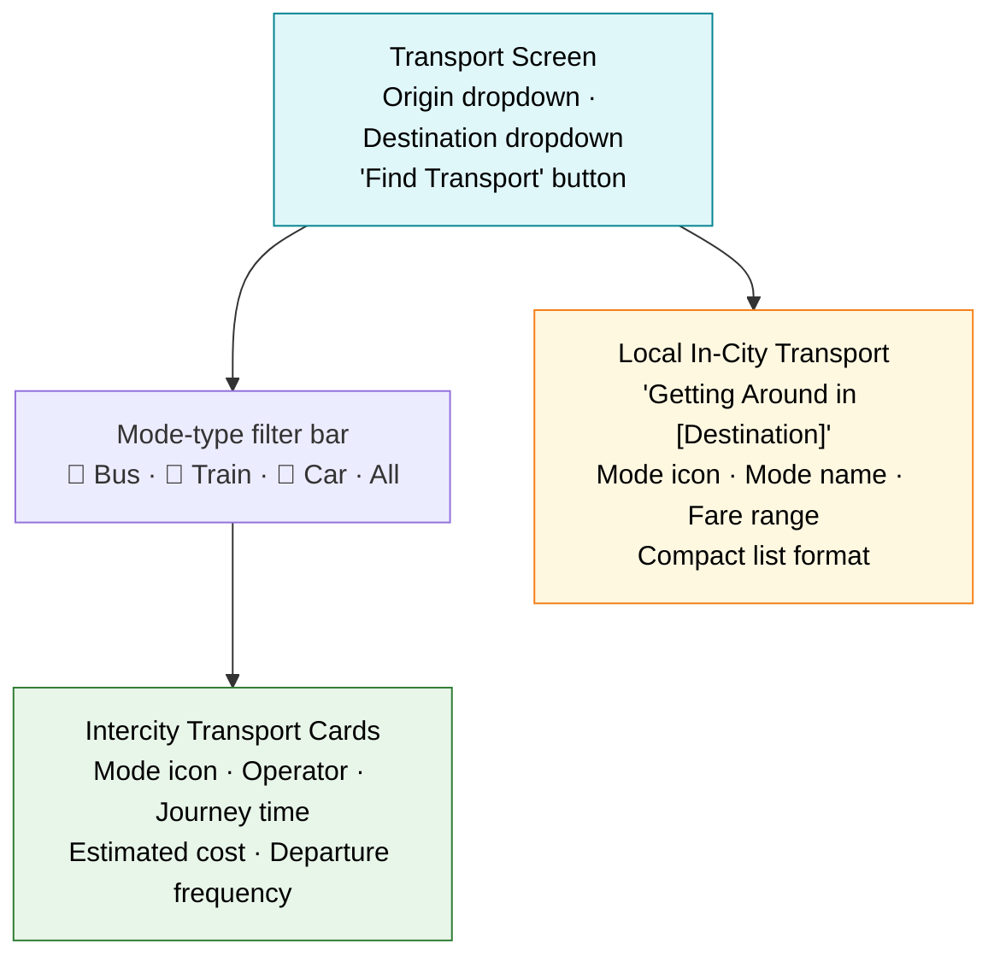
```mermaid
graph TD
    TRANS_SCREEN["Transport Screen\nOrigin dropdown · Destination dropdown\n'Find Transport' button"]
    TRANS_SCREEN --> MODE_FILTER["Mode-type filter bar\n🚌 Bus · 🚂 Train · 🚗 Car · All"]
    MODE_FILTER --> INTERCITY["Intercity Transport Cards\nMode icon · Operator · Journey time\nEstimated cost · Departure frequency"]
    TRANS_SCREEN --> LOCAL_SECTION["Local In-City Transport\n'Getting Around in [Destination]'\nMode icon · Mode name · Fare range\nCompact list format"]

    style TRANS_SCREEN fill:#E0F7FA,stroke:#00838F,color:#000
    style INTERCITY fill:#E8F5E9,stroke:#2E7D32,color:#000
    style LOCAL_SECTION fill:#FFF8E1,stroke:#F57F17,color:#000
```

---

### 4.5 Tourist Spot UI

#### 4.5.1 Spot Gallery View

The tourist spots screen opens with a destination selector dropdown at the top. Once a destination is selected, tourist spots for that destination are displayed in a responsive grid — three columns on desktop, two on tablet, one on mobile. Each card includes the spot's cover image, name, a short description, and visiting hours.

#### 4.5.2 Spot Details View

Tapping a spot card opens the spot detail view, either as a new page or an expandable side panel on desktop. The detail view presents the spot's full description, a photo carousel, visiting hours, a location description, and a clearly formatted entry fee section.

#### 4.5.3 Entry Fee Display

Entry fees are displayed in a structured table format with rows for Adult, Child, Senior/Student, and Free categories. Currency and amount are clearly labeled. A note below the table indicates that fees are subject to change and travelers should verify on arrival.

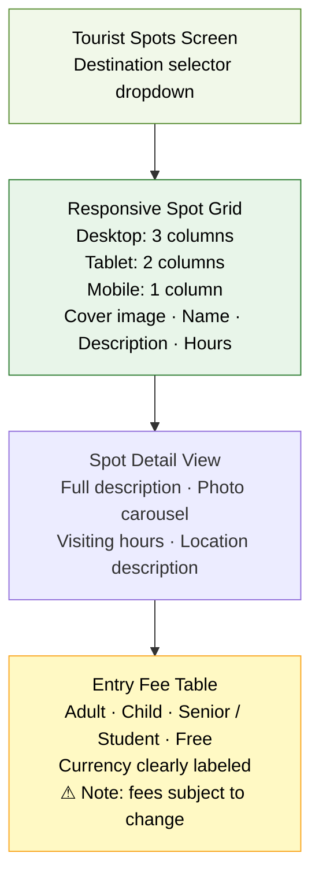
```mermaid
graph TD
    SPOT_SCREEN["Tourist Spots Screen\nDestination selector dropdown"]
    SPOT_SCREEN --> GRID["Responsive Spot Grid\nDesktop: 3 columns\nTablet: 2 columns\nMobile: 1 column\nCover image · Name · Description · Hours"]
    GRID --> SPOT_DETAIL["Spot Detail View\nFull description · Photo carousel\nVisiting hours · Location description"]
    SPOT_DETAIL --> FEE_TABLE["Entry Fee Table\nAdult · Child · Senior / Student · Free\nCurrency clearly labeled\n⚠ Note: fees subject to change"]

    style SPOT_SCREEN fill:#F1F8E9,stroke:#558B2F,color:#000
    style GRID fill:#E8F5E9,stroke:#2E7D32,color:#000
    style FEE_TABLE fill:#FFF9C4,stroke:#F9A825,color:#000
```

---

### 4.6 Traditional Food UI

#### 4.6.1 Location-Based Food List

The traditional food screen presents a destination selector at the top. Upon selection, a list of traditional dishes and food experiences for the chosen destination is displayed. The list is rendered as a grid of food cards, each showing a representative image, the dish name, a brief one-line description, and an approximate price range.

A category filter above the list allows travelers to filter by food type (e.g., Street Food, Main Dish, Dessert, Beverage).

#### 4.6.2 Food Detail View

Tapping a food card expands a detail modal or navigates to a detail page showing the dish name, a full cultural description, taste profile notes, approximate price range, and a recommended location or area where the dish can be found. A "Find on Map" placeholder button is displayed (linked to the route/map feature in a future phase).

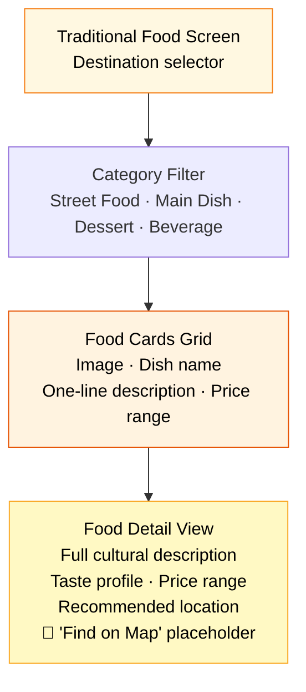
```mermaid
graph TD
    FOOD_SCREEN["Traditional Food Screen\nDestination selector"]
    FOOD_SCREEN --> FOOD_FILTER["Category Filter\nStreet Food · Main Dish · Dessert · Beverage"]
    FOOD_FILTER --> FOOD_GRID["Food Cards Grid\nImage · Dish name\nOne-line description · Price range"]
    FOOD_GRID --> FOOD_DETAIL["Food Detail View\nFull cultural description\nTaste profile · Price range\nRecommended location\n📍 'Find on Map' placeholder"]

    style FOOD_SCREEN fill:#FFF8E1,stroke:#F57F17,color:#000
    style FOOD_GRID fill:#FFF3E0,stroke:#E65100,color:#000
    style FOOD_DETAIL fill:#FFF9C4,stroke:#F9A825,color:#000
```

---

### 4.7 Markets and Cultural Items UI

#### 4.7.1 Market List View

The markets screen opens with a destination selector. Markets for the selected destination are displayed as a vertically scrolling list of market cards. Each card displays the market name, a cover image, operating days and hours, and a brief description of the types of goods available.

#### 4.7.2 Market Detail View

Selecting a market card opens a detail view presenting the market's full description, location information, operating schedule, and a list of traditional item categories available at the market. Each item category is displayed as a compact list row with the item category name, a short description, and an approximate price range.

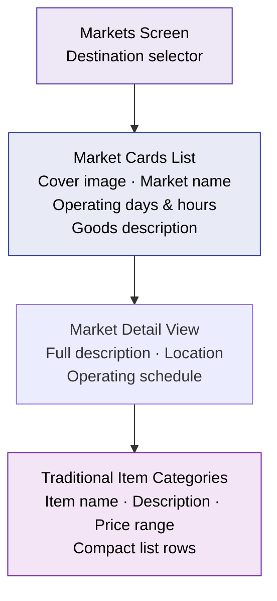
```mermaid
graph TD
    MKT_SCREEN["Markets Screen\nDestination selector"]
    MKT_SCREEN --> MKT_LIST["Market Cards List\nCover image · Market name\nOperating days & hours\nGoods description"]
    MKT_LIST --> MKT_DETAIL["Market Detail View\nFull description · Location\nOperating schedule"]
    MKT_DETAIL --> ITEMS_LIST["Traditional Item Categories\nItem name · Description · Price range\nCompact list rows"]

    style MKT_SCREEN fill:#EDE7F6,stroke:#4527A0,color:#000
    style MKT_LIST fill:#E8EAF6,stroke:#283593,color:#000
    style ITEMS_LIST fill:#F3E5F5,stroke:#6A1B9A,color:#000
```

---

### 4.8 Route and Navigation UI

#### 4.8.1 Route Search Interface

The route screen presents two input fields — "From" and "To" — each populated from the available destination list. A "Find Route" button triggers the route display below.

#### 4.8.2 Route Results Display

Route results are presented as one or more route option cards. Each card displays the origin, destination, estimated distance in kilometers, estimated travel duration, and a recommended route description. Where multiple route options exist, they are displayed as a numbered list and the most recommended option is visually highlighted with a "Best Option" badge.

Below the route cards, relevant transport options for the journey are displayed as a compact linked section, pulling in data from the transport module for the same origin-destination pair.

#### 4.8.3 Map View Placeholder

A clearly labeled placeholder section beneath the route results displays a static map area with a message reading "Interactive map coming soon." This reserves the visual space for the future interactive mapping integration and communicates the planned capability to users without misleading them.

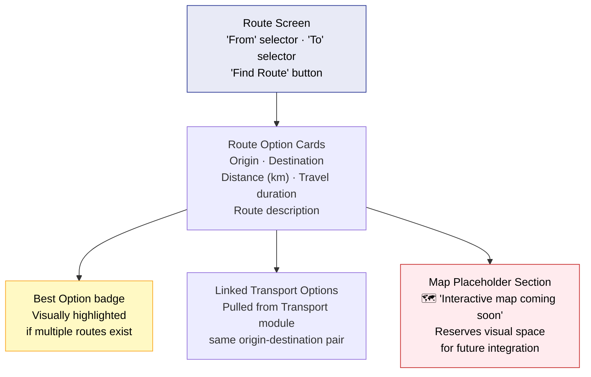
```mermaid
graph TD
    ROUTE_SCREEN["Route Screen\n'From' selector · 'To' selector\n'Find Route' button"]
    ROUTE_SCREEN --> ROUTE_RESULTS["Route Option Cards\nOrigin · Destination\nDistance (km) · Travel duration\nRoute description"]
    ROUTE_RESULTS --> BEST_BADGE["Best Option badge\nVisually highlighted\nif multiple routes exist"]
    ROUTE_RESULTS --> TRANSPORT_LINK["Linked Transport Options\nPulled from Transport module\nsame origin-destination pair"]
    ROUTE_RESULTS --> MAP_PLACEHOLDER["Map Placeholder Section\n🗺 'Interactive map coming soon'\nReserves visual space\nfor future integration"]

    style ROUTE_SCREEN fill:#E8EAF6,stroke:#283593,color:#000
    style BEST_BADGE fill:#FFF9C4,stroke:#F9A825,color:#000
    style MAP_PLACEHOLDER fill:#FFEBEE,stroke:#C62828,color:#000
```

---

### 4.9 Vendor Dashboard UI

The Vendor Dashboard is a management-focused interface designed for efficiency and clarity. It prioritizes task completion over visual decoration.

#### 4.9.1 Vendor Dashboard Home

The vendor dashboard home screen presents a summary panel at the top showing key metrics: total active listings, pending booking requests, and confirmed bookings this month. Below the summary, two primary action cards provide direct entry points: "Manage Hotels" and "Manage Bookings."

A status banner at the top of the dashboard displays the vendor's current account status — "Pending Approval," "Active," or "Suspended" — with an appropriate color indicator and a brief explanation of what each status means for the vendor.

#### 4.9.2 Add and Edit Hotel Screen

The hotel creation and editing screen presents a comprehensive form including hotel name, destination selector, address, description, contact information, and an amenities checklist. A photo upload section allows vendors to upload multiple property images, with a drag-and-drop interface on desktop and a standard file picker on mobile.

Form fields display real-time inline validation. A "Save as Draft" option preserves partial entries without submission. The "Submit Listing" button submits the completed form for admin review.

#### 4.9.3 Room Management Screen

Within a hotel's management view, a tabbed "Rooms" section lists all defined room types in a compact table view. Each row displays the room type name, capacity, current price, status (Active/Inactive), and action buttons for Edit and Deactivate.

An "Add Room Type" button at the top of the table opens an inline form or modal with fields for room type name, capacity, amenities, available quantity, and price per night. Inline form validation ensures no invalid room data is submitted.

#### 4.9.4 Price Update Form

A dedicated "Update Price" action on each room row opens a simple form modal presenting the current price and a new price input field. A confirmation step before submission displays both the old and new prices and asks the vendor to confirm the change.

#### 4.9.5 Booking Request Management Screen

The bookings screen presents a tabbed interface with tabs for Pending, Confirmed, and Declined booking requests. Each booking is displayed as a table row showing the traveler name, hotel name, room type, check-in and check-out dates, total price, and action buttons.

For Pending bookings, "Confirm" and "Decline" buttons are present. Clicking either triggers a confirmation dialog before the status is updated. Confirmed and Declined bookings are read-only rows with their status displayed as a colored badge.

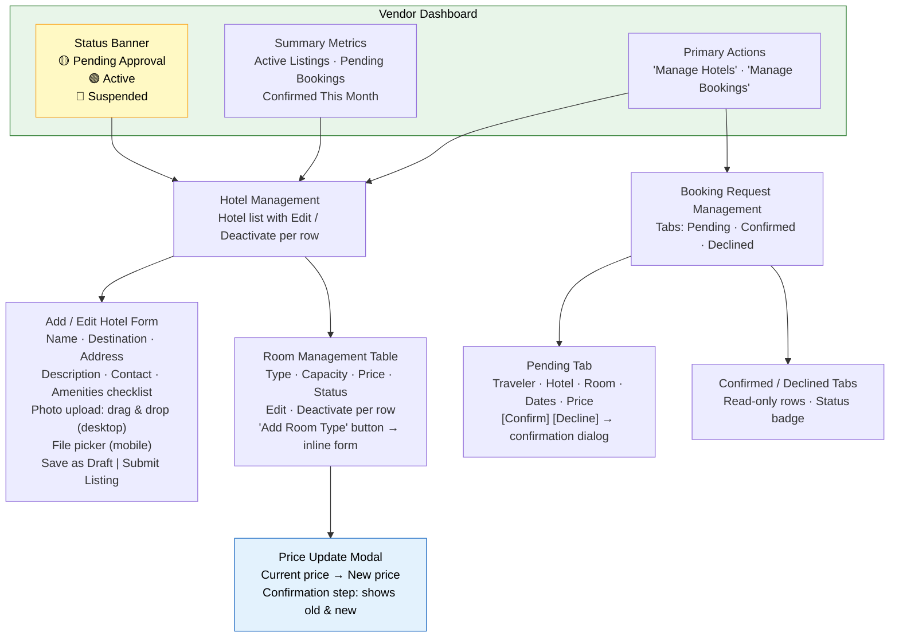
```mermaid
graph TD
    subgraph VENDOR_DASH["Vendor Dashboard"]
        STATUS_BANNER["Status Banner\n🟡 Pending Approval\n🟢 Active\n🔴 Suspended"]
        METRICS["Summary Metrics\nActive Listings · Pending Bookings\nConfirmed This Month"]
        NAV["Primary Actions\n'Manage Hotels' · 'Manage Bookings'"]
    end

    STATUS_BANNER & METRICS & NAV --> HOTEL_MGMT["Hotel Management\nHotel list with Edit / Deactivate per row"]
    HOTEL_MGMT --> ADD_HOTEL["Add / Edit Hotel Form\nName · Destination · Address\nDescription · Contact · Amenities checklist\nPhoto upload: drag & drop (desktop)\nFile picker (mobile)\nSave as Draft | Submit Listing"]
    HOTEL_MGMT --> ROOM_TABLE["Room Management Table\nType · Capacity · Price · Status\nEdit · Deactivate per row\n'Add Room Type' button → inline form"]
    ROOM_TABLE --> PRICE_UPDATE["Price Update Modal\nCurrent price → New price\nConfirmation step: shows old & new"]

    NAV --> BOOKINGS["Booking Request Management\nTabs: Pending · Confirmed · Declined"]
    BOOKINGS --> PENDING_ROWS["Pending Tab\nTraveler · Hotel · Room · Dates · Price\n[Confirm] [Decline] → confirmation dialog"]
    BOOKINGS --> OTHER_ROWS["Confirmed / Declined Tabs\nRead-only rows · Status badge"]

    style VENDOR_DASH fill:#E8F5E9,stroke:#2E7D32,color:#000
    style STATUS_BANNER fill:#FFF9C4,stroke:#F9A825,color:#000
    style PRICE_UPDATE fill:#E3F2FD,stroke:#1565C0,color:#000
```

---

### 4.10 Admin Panel UI

The Admin Panel is a comprehensive management console designed for operational efficiency. It uses a left-side navigation panel for primary section switching, with a content area occupying the remainder of the viewport.

#### 4.10.1 Admin Dashboard Home

The admin home screen displays a grid of summary metric cards: total registered travelers, total registered vendors, pending vendor applications, active hotel listings, total booking requests this month, and a content item count by category. Each card links to the corresponding management screen.

#### 4.10.2 User Management Screen

The user management screen presents a paginated, searchable data table of all registered user accounts. Columns include user ID, full name, email address, role, account status, and registration date. A search bar above the table allows real-time filtering by name or email.

Each table row includes an "Actions" dropdown with options to View Profile, Change Status (Active / Suspended / Deactivated), and — for admin-level actions — Change Role. Status changes trigger a confirmation dialog before being applied.

#### 4.10.3 Vendor Approval Screen

The vendor approval screen presents a focused queue of pending vendor applications. Each application is displayed as an expandable row showing business name, contact details, submitted documentation references, and submission date.

Expand buttons reveal the full application details inline. Two action buttons — "Approve" and "Reject" — are displayed for each application. Clicking "Reject" opens a dialog requiring the admin to provide a rejection reason, which is recorded against the application.

#### 4.10.4 Content Management Screens

A separate content management screen is provided for each content category: Tourist Spots, Transport, Traditional Food, Cultural Markets, and Routes. Each screen follows the same consistent layout pattern: a data table listing existing entries above, with an "Add New" button that opens an inline form or modal for creating a new entry. Each row includes Edit and Deactivate action controls.

Content editing screens present the same form layout as the creation screen, pre-populated with the existing record's data. Soft-deleted items are excluded from the default table view but can be revealed via a "Show Inactive" toggle.

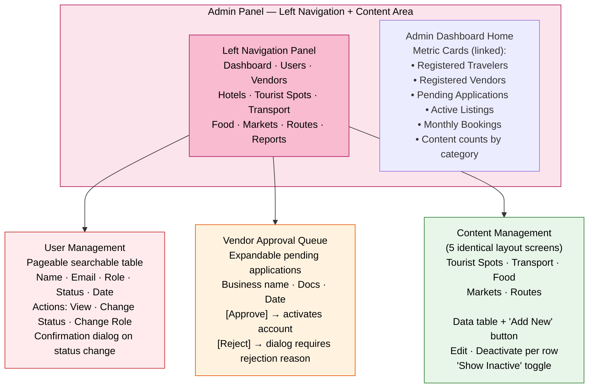
```mermaid
graph TD
    subgraph ADMIN_PANEL["Admin Panel — Left Navigation + Content Area"]
        LEFT_NAV["Left Navigation Panel\nDashboard · Users · Vendors\nHotels · Tourist Spots · Transport\nFood · Markets · Routes · Reports"]
        ADMIN_HOME["Admin Dashboard Home\nMetric Cards (linked):\n• Registered Travelers\n• Registered Vendors\n• Pending Applications\n• Active Listings\n• Monthly Bookings\n• Content counts by category"]
    end

    LEFT_NAV --> USER_MGMT["User Management\nPageable searchable table\nName · Email · Role · Status · Date\nActions: View · Change Status · Change Role\nConfirmation dialog on status change"]

    LEFT_NAV --> VENDOR_APPROVAL["Vendor Approval Queue\nExpandable pending applications\nBusiness name · Docs · Date\n[Approve] → activates account\n[Reject] → dialog requires rejection reason"]

    LEFT_NAV --> CONTENT_MGMT["Content Management\n(5 identical layout screens)\nTourist Spots · Transport · Food\nMarkets · Routes\n\nData table + 'Add New' button\nEdit · Deactivate per row\n'Show Inactive' toggle"]

    style ADMIN_PANEL fill:#FCE4EC,stroke:#AD1457,color:#000
    style LEFT_NAV fill:#F8BBD0,stroke:#AD1457,color:#000
    style USER_MGMT fill:#FFEBEE,stroke:#C62828,color:#000
    style VENDOR_APPROVAL fill:#FFF3E0,stroke:#E65100,color:#000
    style CONTENT_MGMT fill:#E8F5E9,stroke:#2E7D32,color:#000
```

---

## 5. Frontend Business Requirements

```mermaid
graph LR
    subgraph REQ_OVERVIEW["Frontend Requirements — Module Summary"]
        R1["Auth Module\nFR-FE-01 to FR-FE-10\n10 requirements"]
        R2["Traveler Dashboard\nFR-FE-11 to FR-FE-18\n8 requirements"]
        R3["Hotel & Booking\nFR-FE-19 to FR-FE-28\n10 requirements"]
        R4["Transport\nFR-FE-29 to FR-FE-32\n4 requirements"]
        R5["Tourist Spots\nFR-FE-33 to FR-FE-36\n4 requirements"]
        R6["Food\nFR-FE-37 to FR-FE-40\n4 requirements"]
        R7["Markets\nFR-FE-41 to FR-FE-43\n3 requirements"]
        R8["Routes\nFR-FE-44 to FR-FE-48\n5 requirements"]
        R9["Vendor Dashboard\nFR-FE-49 to FR-FE-56\n8 requirements"]
        R10["Admin Panel\nFR-FE-57 to FR-FE-65\n9 requirements"]
    end

    style R1 fill:#FFCDD2,stroke:#C62828,color:#000
    style R2 fill:#BBDEFB,stroke:#1565C0,color:#000
    style R3 fill:#C8E6C9,stroke:#2E7D32,color:#000
    style R4 fill:#E0F7FA,stroke:#00838F,color:#000
    style R5 fill:#F1F8E9,stroke:#558B2F,color:#000
    style R6 fill:#FFF8E1,stroke:#F57F17,color:#000
    style R7 fill:#EDE7F6,stroke:#4527A0,color:#000
    style R8 fill:#E8EAF6,stroke:#283593,color:#000
    style R9 fill:#E8F5E9,stroke:#2E7D32,color:#000
    style R10 fill:#FCE4EC,stroke:#AD1457,color:#000
```

### 5.1 Authentication Module Requirements

| **Req. ID** | **Frontend Requirement** |
|---|---|
| FR-FE-01 | The system shall display a fully responsive login page accessible on all screen sizes. |
| FR-FE-02 | The login form shall display an inline error message when credentials are incorrect, without indicating which specific field is wrong. |
| FR-FE-03 | The system shall display a loading indicator on the login button while the authentication request is in progress. |
| FR-FE-04 | The registration form shall display real-time inline validation feedback for each field as the user types. |
| FR-FE-05 | The registration form shall display a password strength meter that updates dynamically based on the entered password. |
| FR-FE-06 | The registration form shall display an inline error message when the password and password confirmation fields do not match. |
| FR-FE-07 | The registration form's submit button shall remain disabled until all required fields are valid and the terms acknowledgment checkbox is checked. |
| FR-FE-08 | When the Vendor role is selected during registration, the form shall dynamically reveal additional business information fields without requiring a page reload. |
| FR-FE-09 | The system shall redirect authenticated users to their role-specific dashboard immediately upon successful login. |
| FR-FE-10 | The password recovery screen shall display a success confirmation message upon form submission regardless of whether the email exists in the system. |

---

### 5.2 Traveler Dashboard Requirements

| **Req. ID** | **Frontend Requirement** |
|---|---|
| FR-FE-11 | The traveler dashboard shall display a prominent AI chat panel accessible immediately upon login. |
| FR-FE-12 | The AI chat panel shall display a welcoming prompt and suggested prompt chips before the user's first interaction. |
| FR-FE-13 | The AI chat panel shall display a typing animation indicator while an AI response is being generated. |
| FR-FE-14 | If the AI service is unavailable, the chat panel shall display a friendly inline message indicating temporary unavailability. |
| FR-FE-15 | Destination names, hotel suggestions, and tourist spots within AI responses shall be rendered as tappable navigation links. |
| FR-FE-16 | The recommended destinations section shall display visually rich destination cards in a horizontally scrollable row on desktop and a vertical stack on mobile. |
| FR-FE-17 | The dashboard shall include a quick search bar that filters destination cards in real time as the user types. |
| FR-FE-18 | Quick filter chips shall allow travelers to filter dashboard content by travel style category with a single tap. |

---

### 5.3 Hotel Search and Booking Requirements

| **Req. ID** | **Frontend Requirement** |
|---|---|
| FR-FE-19 | The hotel search screen shall display a filter panel with destination, price range slider, room type, and guest count controls. |
| FR-FE-20 | Hotel search results shall update dynamically when filters are applied without requiring a full page reload. |
| FR-FE-21 | The results list shall display a count of matching hotels above the result cards. |
| FR-FE-22 | If no hotels match the active search filters, the system shall display an empty state illustration with a prompt to adjust filters. |
| FR-FE-23 | Sort controls shall allow travelers to sort results by price (ascending and descending) and by name. |
| FR-FE-24 | The hotel details page shall display a responsive image carousel at the top of the page. |
| FR-FE-25 | Room types on the hotel details page shall be displayed in a tabbed or accordion layout with "Book This Room" controls. |
| FR-FE-26 | The booking form shall dynamically calculate and display the total estimated cost as the user selects check-in and check-out dates. |
| FR-FE-27 | The booking form shall validate that the check-out date is always later than the check-in date and display an inline error if not. |
| FR-FE-28 | Upon successful booking request submission, the system shall display a confirmation screen or modal with a link to the traveler's bookings page. |

---

### 5.4 Transport Information Requirements

| **Req. ID** | **Frontend Requirement** |
|---|---|
| FR-FE-29 | The transport screen shall display a search interface with origin and destination selectors. |
| FR-FE-30 | Transport results shall display mode-of-transport icons, operator names, journey time, cost, and frequency in a clear card format. |
| FR-FE-31 | A mode-type filter bar shall allow travelers to filter transport results by transport type. |
| FR-FE-32 | A clearly labeled secondary section shall display local in-city transport options for the selected destination. |

---

### 5.5 Tourist Spot Requirements

| **Req. ID** | **Frontend Requirement** |
|---|---|
| FR-FE-33 | Tourist spots shall be displayed in a responsive image grid — three columns on desktop, two on tablet, one on mobile. |
| FR-FE-34 | Selecting a spot card shall open a detail view displaying full description, photo carousel, visiting hours, and entry fee table. |
| FR-FE-35 | Entry fees shall be displayed in a structured table with clearly labeled categories (Adult, Child, Senior, Free). |
| FR-FE-36 | A note below the entry fee table shall inform travelers that fees are subject to change and should be verified on arrival. |

---

### 5.6 Traditional Food Requirements

| **Req. ID** | **Frontend Requirement** |
|---|---|
| FR-FE-37 | The food screen shall display a destination selector that triggers a food list update upon selection. |
| FR-FE-38 | Food items shall be displayed as image cards with dish name, one-line description, and price range. |
| FR-FE-39 | A category filter shall allow travelers to filter food items by type (Street Food, Main Dish, Dessert, Beverage). |
| FR-FE-40 | Selecting a food card shall open a detail view with full cultural description, taste profile, price range, and recommended location. |

---

### 5.7 Markets and Cultural Items Requirements

| **Req. ID** | **Frontend Requirement** |
|---|---|
| FR-FE-41 | The markets screen shall display market cards with cover image, name, operating schedule, and brief description. |
| FR-FE-42 | Selecting a market card shall open a detail view with full description, location, operating hours, and traditional item category list. |
| FR-FE-43 | Each traditional item category in the market detail view shall display the item name, brief description, and approximate price range. |

---

### 5.8 Route and Navigation Requirements

| **Req. ID** | **Frontend Requirement** |
|---|---|
| FR-FE-44 | The route screen shall provide "From" and "To" destination selectors and a "Find Route" trigger. |
| FR-FE-45 | Route results shall display distance, estimated travel duration, and a route description for each available option. |
| FR-FE-46 | Where multiple routes exist, the recommended option shall be visually distinguished with a "Best Option" badge. |
| FR-FE-47 | The route screen shall display a clearly labeled map placeholder section communicating the planned interactive map feature. |
| FR-FE-48 | Relevant transport options for the selected origin-destination pair shall be displayed beneath the route results. |

---

### 5.9 Vendor Dashboard Requirements

| **Req. ID** | **Frontend Requirement** |
|---|---|
| FR-FE-49 | The vendor dashboard shall display the vendor's current account status prominently at the top of the screen with a color-coded indicator. |
| FR-FE-50 | The vendor dashboard home shall display summary metric cards for active listings, pending bookings, and confirmed bookings. |
| FR-FE-51 | The hotel creation and editing form shall include a drag-and-drop photo upload interface on desktop and a standard file picker on mobile. |
| FR-FE-52 | Hotel forms shall display real-time inline validation for all required fields. |
| FR-FE-53 | Room types shall be displayed in a compact table with Edit and Deactivate controls on each row. |
| FR-FE-54 | Price update actions shall require a confirmation step displaying both the old and new price before submission. |
| FR-FE-55 | The bookings management screen shall organize bookings into Pending, Confirmed, and Declined tabs. |
| FR-FE-56 | Confirm and Decline actions on booking requests shall trigger a confirmation dialog before the status update is applied. |

---

### 5.10 Admin Panel Requirements

| **Req. ID** | **Frontend Requirement** |
|---|---|
| FR-FE-57 | The admin panel shall use a persistent left-side navigation panel for primary section switching. |
| FR-FE-58 | The admin home screen shall display summary metric cards linking to their respective management screens. |
| FR-FE-59 | The user management table shall be searchable in real time by user name and email address. |
| FR-FE-60 | User account status changes shall require a confirmation dialog before being applied. |
| FR-FE-61 | The vendor approval screen shall display all pending applications in an expandable list, with Approve and Reject action controls. |
| FR-FE-62 | Rejecting a vendor application shall open a dialog requiring the admin to enter and submit a rejection reason before the action is completed. |
| FR-FE-63 | All content management screens shall follow a consistent layout pattern: a data table above with an "Add New" button and per-row Edit and Deactivate controls. |
| FR-FE-64 | Content tables shall include a "Show Inactive" toggle to reveal soft-deleted records when needed. |
| FR-FE-65 | All admin create and edit forms shall display real-time inline validation and prevent submission when required fields are invalid. |

---

## 6. Navigation and User Flow

### 6.1 Main Menu Structure

The platform uses a role-aware navigation structure that adapts based on the authenticated user's role. Unauthenticated users see only public navigation options. Authenticated users see navigation options relevant to their role.

**Unauthenticated / Public Navigation:**
Home · Login · Register

**Traveler Navigation:**
Home · Plan My Trip (AI Chat) · Hotels · Destinations · Transport · Tourist Spots · Food · Markets · Routes · My Bookings · My Profile

**Vendor Navigation:**
Dashboard · My Hotels · My Rooms · Bookings · My Profile

**Admin Navigation:**
Dashboard · Users · Vendors · Hotels · Tourist Spots · Transport · Food · Markets · Routes · Reports

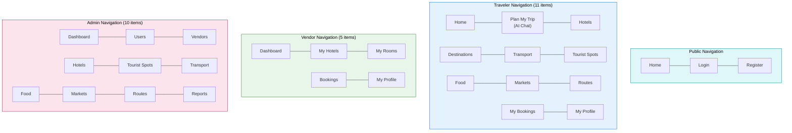
```mermaid
graph TD
    subgraph NAV_PUBLIC["Public Navigation"]
        N0A[Home] --- N0B[Login] --- N0C[Register]
    end

    subgraph NAV_TRAVELER["Traveler Navigation (11 items)"]
        NT1[Home] --- NT2["Plan My Trip\n(AI Chat)"] --- NT3[Hotels]
        NT4[Destinations] --- NT5[Transport] --- NT6[Tourist Spots]
        NT7[Food] --- NT8[Markets] --- NT9[Routes]
        NT10[My Bookings] --- NT11[My Profile]
    end

    subgraph NAV_VENDOR["Vendor Navigation (5 items)"]
        NV1[Dashboard] --- NV2[My Hotels] --- NV3[My Rooms]
        NV4[Bookings] --- NV5[My Profile]
    end

    subgraph NAV_ADMIN["Admin Navigation (10 items)"]
        NA1[Dashboard] --- NA2[Users] --- NA3[Vendors]
        NA4[Hotels] --- NA5[Tourist Spots] --- NA6[Transport]
        NA7[Food] --- NA8[Markets] --- NA9[Routes] --- NA10[Reports]
    end

    style NAV_PUBLIC fill:#E0F7FA,stroke:#00838F,color:#000
    style NAV_TRAVELER fill:#E3F2FD,stroke:#1565C0,color:#000
    style NAV_VENDOR fill:#E8F5E9,stroke:#2E7D32,color:#000
    style NAV_ADMIN fill:#FCE4EC,stroke:#AD1457,color:#000
```

---

### 6.2 Navigation Hierarchy

The navigation follows a three-level hierarchy designed to minimize the number of taps or clicks required to reach any content page.

**Level 1 — Primary Sections:** Accessed via the top navigation bar (desktop) or hamburger menu (mobile). These represent the major feature domains of the platform.

**Level 2 — Section Screens:** The primary list or search view within each feature domain (e.g., hotel search results, tourist spot gallery).

**Level 3 — Detail Views:** The full detail page or modal for a specific item (e.g., hotel details, tourist spot details, food detail).

No platform journey should require more than three clicks from the dashboard to any specific piece of content.

### 6.3 Breadcrumbs

Breadcrumb navigation is displayed on all Level 2 and Level 3 screens to provide users with a persistent sense of location within the platform hierarchy. Breadcrumbs are displayed as a horizontal, text-based trail at the top of the content area, above the page heading.

Example breadcrumb trails:

- Home › Hotels › Dhaka › Sheraton Dhaka › Book Room
- Admin › Content › Tourist Spots › Edit: Ahsan Manzil
- Vendor Dashboard › My Hotels › Hotel Sunrise › Rooms

On mobile devices, breadcrumbs collapse to show only the immediate parent level with a back arrow control to reduce horizontal space consumption.

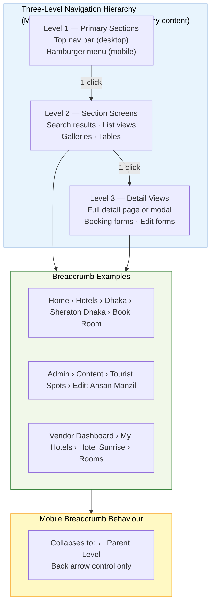
```mermaid
graph TD
    subgraph HIERARCHY["Three-Level Navigation Hierarchy\n(Max 3 clicks from any dashboard to any content)"]
        L1["Level 1 — Primary Sections\nTop nav bar (desktop)\nHamburger menu (mobile)"]
        L2["Level 2 — Section Screens\nSearch results · List views\nGalleries · Tables"]
        L3["Level 3 — Detail Views\nFull detail page or modal\nBooking forms · Edit forms"]
    end

    L1 -->|1 click| L2
    L2 -->|1 click| L3

    subgraph BREADCRUMBS["Breadcrumb Examples"]
        B1["Home › Hotels › Dhaka › Sheraton Dhaka › Book Room"]
        B2["Admin › Content › Tourist Spots › Edit: Ahsan Manzil"]
        B3["Vendor Dashboard › My Hotels › Hotel Sunrise › Rooms"]
    end

    subgraph MOBILE_BC["Mobile Breadcrumb Behaviour"]
        MB["Collapses to: ← Parent Level\nBack arrow control only"]
    end

    L2 & L3 --> BREADCRUMBS
    BREADCRUMBS --> MOBILE_BC

    style HIERARCHY fill:#E8F4FD,stroke:#1565C0,color:#000
    style BREADCRUMBS fill:#F1F8E9,stroke:#2E7D32,color:#000
    style MOBILE_BC fill:#FFF9C4,stroke:#F9A825,color:#000
```

---

### 6.4 Route Guards and Access Control

Angular route guards enforce that protected screens are inaccessible to unauthenticated or unauthorized users at the client-side routing level. If an unauthenticated user attempts to navigate directly to a protected route, they are redirected to the login page. If an authenticated user attempts to access a route outside their role permissions, they are redirected to their role-specific dashboard with a notification informing them that they do not have access to the requested page.

```mermaid
flowchart TD
    NAVIGATE(["User navigates to URL"]) --> AUTH_GUARD{Authenticated?}
    AUTH_GUARD -->|No| REDIRECT_LOGIN["Redirect → Login Page"]
    AUTH_GUARD -->|Yes| ROLE_GUARD{Role matches\nroute permission?}
    ROLE_GUARD -->|No| REDIRECT_DASH["Redirect → Role-specific dashboard\n+ Access denied notification"]
    ROLE_GUARD -->|Yes| RENDER["Render requested screen"]

    subgraph PROTECTED["Protected Route Examples"]
        PR1["/traveler/*\nRequires TRAVELER role"]
        PR2["/vendor/*\nRequires VENDOR + APPROVED"]
        PR3["/admin/*\nRequires ADMIN role"]
    end

    style NAVIGATE fill:#E3F2FD,stroke:#1565C0,color:#000
    style RENDER fill:#C8E6C9,stroke:#2E7D32,color:#000
    style REDIRECT_LOGIN fill:#FFCDD2,stroke:#C62828,color:#000
    style REDIRECT_DASH fill:#FFE0B2,stroke:#E65100,color:#000
    style AUTH_GUARD fill:#FFF9C4,stroke:#F9A825,color:#000
    style ROLE_GUARD fill:#FFF9C4,stroke:#F9A825,color:#000
```

---

## 7. Responsive Design Requirements

### 7.1 Mobile Layout (320px – 767px)

- All layouts use a single-column structure. Multi-column grids collapse to a single column.
- The top navigation bar collapses to a hamburger menu icon. Tapping the icon slides out a full-screen navigation drawer from the left.
- Card carousels (destinations, hotels) switch to vertically stacked card lists.
- Data tables (admin panel, vendor bookings) switch to a card-based row layout where each record is presented as a summary card with key fields visible.
- All touch targets (buttons, links, form controls) maintain a minimum tap target size of 44x44 pixels.
- The AI chat panel occupies the full viewport when opened on mobile via a floating action button.
- Form fields stack vertically with full-width inputs.

### 7.2 Tablet Layout (768px – 1199px)

- Two-column grid layouts are used for content cards (hotel listings, tourist spots, food cards).
- The top navigation bar remains visible but collapses secondary navigation items into a "More" dropdown if horizontal space is constrained.
- The vendor dashboard and admin panel sidebar transitions to an icon-only mode that expands on hover or tap.
- Modal dialogs occupy 80% of the viewport width, centered horizontally.
- The AI chat panel is displayed as a collapsible side panel occupying approximately 35% of the viewport width.

### 7.3 Desktop Layout (1200px and above)

- Three- and four-column grid layouts are used for content cards where appropriate.
- The full navigation bar is visible with all primary navigation links displayed.
- The AI chat panel is displayed as a persistent sidebar on the traveler dashboard.
- Admin and vendor dashboard layouts use a fixed left-side navigation panel alongside a main content area.
- Modal dialogs are constrained to a maximum width of 640px and centered within the viewport.
- Data tables display all columns without collapsing to card view.

### 7.4 Fluid Layout Principle

All layout containers use fluid, percentage-based widths within defined minimum and maximum breakpoint ranges. Fixed-pixel widths are used only for specific components (such as icons and avatar images) where a fixed size is intentional. No horizontal scroll bars shall appear on any screen at any supported viewport width.

```mermaid
graph LR
    subgraph MOBILE["📱 Mobile (320–767px)"]
        M1["Single-column layout"]
        M2["Hamburger nav → drawer"]
        M3["Cards: vertical stack"]
        M4["Tables → card rows"]
        M5["44×44px tap targets min"]
        M6["AI chat: full viewport modal"]
        M7["Forms: full-width stacked"]
    end

    subgraph TABLET["📲 Tablet (768–1199px)"]
        T1["2-column grid for cards"]
        T2["Nav bar + 'More' dropdown"]
        T3["Sidebar: icon-only mode"]
        T4["Modals: 80% viewport width"]
        T5["AI chat: 35% side panel"]
    end

    subgraph DESKTOP["🖥 Desktop (1200px+)"]
        D1["3–4 column grids"]
        D2["Full navigation bar"]
        D3["AI chat: persistent sidebar"]
        D4["Fixed left nav panel"]
        D5["Modals max 640px wide"]
        D6["Full-column data tables"]
    end

    MOBILE -->|Scales up| TABLET -->|Scales up| DESKTOP

    style MOBILE fill:#FFEBEE,stroke:#C62828,color:#000
    style TABLET fill:#FFF3E0,stroke:#E65100,color:#000
    style DESKTOP fill:#E8F5E9,stroke:#2E7D32,color:#000
```

---

## 8. UI/UX Standards

### 8.1 Color Scheme

The platform employs a defined color palette applied consistently across all screens and components. The palette includes a primary brand color (used for primary buttons, active navigation states, and key interactive elements), a secondary accent color (used for highlights and secondary actions), a neutral gray scale (used for backgrounds, borders, and body text), a success green, a warning amber, and an error red.

Color is never used as the only means of conveying information — it is always accompanied by an icon or text label to ensure colorblind users receive the same informational content.

### 8.2 Typography

A single, modern sans-serif typeface family is used throughout the platform. Heading levels (H1 through H4) are clearly differentiated through size and weight. Body text is set at a minimum of 16px for comfortable readability on mobile screens. Line height is set to a minimum of 1.5x the font size for all body text.

### 8.3 Loading Indicators

Every asynchronous action that requires waiting — API calls, form submissions, data loading — displays an appropriate loading indicator. The following loading patterns are used:

- **Skeleton screens** are displayed during the initial load of content-heavy pages (hotel search results, dashboard content sections), providing an instant visual structure while data loads.
- **Button spinners** replace button labels during form submissions, preventing double-submission and providing immediate feedback that the action is in progress.
- **Inline progress bars** are used for file upload operations in the vendor hotel form.

### 8.4 Error Messages

All error messages are displayed in clear, plain language that explains what went wrong and, where possible, what the user should do to resolve it. Technical error codes are never shown to end users. Error messages are presented in the following contexts:

- **Inline field validation errors** appear directly below the relevant form field in a red-accented text label.
- **Form-level error banners** appear at the top of a form when a submission fails due to a server-side business rule violation (e.g., "A hotel with this name already exists in this location").
- **Page-level error states** are displayed when a data request fails entirely, with a friendly message and a "Try Again" button.

### 8.5 Empty State Screens

Every list, table, or gallery on the platform has a defined empty state design displayed when no content is available. Empty states include a simple illustration, a concise explanatory message, and — where appropriate — a call-to-action button. Empty states are never blank white screens.

Examples of empty state messages:
- Hotel Search: "No hotels match your filters. Try widening your search."
- Vendor Bookings: "You have no pending booking requests at this time."
- Admin Vendor Queue: "All vendor applications have been reviewed. Great work!"

### 8.6 Confirmation Dialogs

All destructive or irreversible actions — such as deactivating a listing, declining a booking, rejecting a vendor, or changing an account status — require a confirmation dialog before the action is executed. Confirmation dialogs are modal overlays that:

- Display a clear, plain-language description of the action about to be taken.
- Identify the affected entity by name where applicable.
- Offer a clearly labeled "Confirm" (or action-specific verb such as "Deactivate") button and a "Cancel" button.
- Use visual differentiation (red button for destructive actions, standard button for neutral confirmations) to communicate the nature of the action.

```mermaid
graph TD
    subgraph UI_STANDARDS["UI/UX Standards Summary"]
        subgraph COLORS["Color Scheme"]
            C1["Primary brand color\nButtons · Active nav · CTAs"]
            C2["Accent color\nHighlights · Secondary actions"]
            C3["Semantic colors\n✅ Success green\n⚠ Warning amber\n❌ Error red"]
            C4["Color never sole\ninfo carrier — always\n+ icon or label"]
        end

        subgraph LOADING["Loading Indicators"]
            L1["Skeleton screens\nContent-heavy pages"]
            L2["Button spinners\nForm submission in progress"]
            L3["Inline progress bars\nFile upload operations"]
        end

        subgraph ERRORS["Error Patterns"]
            E1["Inline field errors\nBelow field in red"]
            E2["Form-level banners\nTop of form on server error"]
            E3["Page-level errors\nFull-page with 'Try Again'"]
        end

        subgraph CONFIRM["Confirmation Dialogs — Required For"]
            D1["Deactivate listing"]
            D2["Decline booking"]
            D3["Reject vendor application"]
            D4["Change user account status"]
        end
    end

    style COLORS fill:#E3F2FD,stroke:#1565C0,color:#000
    style LOADING fill:#E8F5E9,stroke:#2E7D32,color:#000
    style ERRORS fill:#FFEBEE,stroke:#C62828,color:#000
    style CONFIRM fill:#FFF3E0,stroke:#E65100,color:#000
```

---

## 9. Accessibility Requirements

### 9.1 Font Readability

All body text must meet a minimum font size of 16px. Heading text must be set at sizes that create a clear visual hierarchy relative to body text. Bold weight is used for emphasis rather than italic, which can be difficult to read for users with certain reading difficulties.

### 9.2 Color Contrast

All text-to-background color combinations used on the platform must meet a minimum contrast ratio of 4.5:1 for normal text and 3:1 for large text, in compliance with WCAG 2.1 Level AA standards. Interactive elements such as buttons and links must be visually distinguishable from non-interactive content through means other than color alone (such as underline for links and border or shape for buttons).

### 9.3 Keyboard Navigation

The platform must be fully navigable using a keyboard alone, without requiring a mouse or touch input. This includes:

- All interactive elements (buttons, links, form fields, dropdown menus, modal dialogs) must be reachable via the Tab key in a logical, predictable order.
- The currently focused element must display a clearly visible focus ring or highlight.
- Modal dialogs must trap keyboard focus within the dialog while open, and return focus to the triggering element when closed.
- Custom dropdown and select components must respond to arrow key navigation for option selection.

### 9.4 Screen Reader Compatibility

All images must include descriptive alternative text. Decorative images that convey no informational content must be marked with an empty alt attribute so that screen readers skip them. Form inputs must be associated with descriptive label elements. Status messages, validation errors, and confirmation alerts must be announced by screen readers through appropriate ARIA live region attributes.

### 9.5 Screen Size Adaptability

No platform functionality shall be exclusively available on a single screen size. All features accessible on desktop must also be accessible on mobile, adapted to the touch-based interaction model. Interactive elements do not rely on hover states as the only means of revealing information or actions, as hover states are not available on touch devices.

```mermaid
graph TD
    subgraph A11Y["Accessibility Requirements — WCAG 2.1 AA Compliance"]
        A1["Font Readability\nBody text ≥ 16px\nClear heading hierarchy\nBold for emphasis (not italic)"]
        A2["Color Contrast\nNormal text: ≥ 4.5:1 ratio\nLarge text: ≥ 3:1 ratio\nColor never sole info carrier"]
        A3["Keyboard Navigation\nAll elements Tab-reachable\nVisible focus ring\nModal focus trap\nArrow key dropdowns"]
        A4["Screen Reader\nDescriptive alt text\nLabel-input associations\nARIA live regions\nEmpty alt for decorative images"]
        A5["Screen Size Adaptability\nAll features on all screen sizes\nNo hover-only actions\nTouch-compatible throughout"]
    end

    A1 & A2 & A3 & A4 & A5 --> WCAG["WCAG 2.1 Level AA\nCompliant Platform"]

    style A11Y fill:#F3E5F5,stroke:#6A1B9A,color:#000
    style WCAG fill:#6A1B9A,color:#fff
```

---

## 10. Client-Side Validation Rules

Client-side validation is applied to all user input forms to provide immediate, inline feedback before form submission. The following validation rules apply across the platform.

### 10.1 Universal Required Field Rule

All fields marked as required must contain a non-empty value before form submission is permitted. Required fields are visually marked with an asterisk (*) adjacent to the field label. If a required field is left empty on form submission attempt, an inline error message reading "This field is required" is displayed directly below the field.

### 10.2 Email Format Validation

Email address fields must contain a value matching a standard email format pattern (local-part@domain.extension). The validation is applied on field blur (when the user moves focus away from the field) and on form submission. Error message: "Please enter a valid email address."

### 10.3 Password Validation

Password fields must meet the following rules, each surfaced as an individual inline condition on the password strength indicator:

- Minimum 8 characters in length.
- At least one uppercase letter.
- At least one lowercase letter.
- At least one numeric digit.

Password confirmation fields must match the primary password field exactly. Error message on mismatch: "Passwords do not match."

### 10.4 Date Validation — Booking Form

Check-in date must be today's date or a future date. Check-out date must be at least one day after the check-in date. If either condition is violated, an inline error message is displayed on the relevant date field. Error messages: "Check-in date must be today or in the future." and "Check-out date must be after the check-in date."

### 10.5 Numeric Field Validation

All price and numeric input fields (room price, guest count) must accept only positive, non-zero numeric values. Fields reject non-numeric input on keypress. Minimum and maximum value limits are enforced where defined, with inline error messages specifying the allowed range.

### 10.6 Text Field Length Limits

All text input and textarea fields enforce a maximum character length. A character counter is displayed below text area fields showing the remaining character allowance. If the maximum length is reached, further input is prevented and a warning message is displayed.

### 10.7 File Upload Validation

Photo upload fields in the vendor hotel form validate that uploaded files are image formats (JPEG, PNG) and do not exceed the defined maximum file size. An error message is displayed if an invalid file type or oversized file is selected: "Please upload a JPEG or PNG image under [size limit]."

```mermaid
graph TD
    subgraph VALIDATION["Client-Side Validation Rules"]
        V1["Required Fields\n• Marked with asterisk (*)\n• 'This field is required'\n• Blocks submission if empty"]
        V2["Email Format\n• pattern: local@domain.ext\n• Triggered on blur & submit\n• 'Please enter a valid email address'"]
        V3["Password Rules\n• Min 8 chars\n• 1 uppercase · 1 lowercase\n• 1 numeric digit\n• Strength meter: Weak → Strong\n• Confirm match or 'Passwords do not match'"]
        V4["Booking Dates\n• Check-in: today or future\n• Check-out: > check-in by ≥1 day\n• Inline error on each violation"]
        V5["Numeric Fields\n• Positive non-zero only\n• Rejects non-numeric on keypress\n• Min/max range enforced"]
        V6["Text Length Limits\n• Max char enforced at field level\n• Character counter below textarea\n• Further input blocked at limit"]
        V7["File Upload\n• JPEG or PNG only\n• Max file size enforced\n• 'Upload JPEG or PNG under [limit]'"]
    end

    subgraph TRIGGERS["Validation Trigger Points"]
        T1["On keystroke — real-time\n(password strength, length counter)"]
        T2["On blur — field focus lost\n(email format, required check)"]
        T3["On submit attempt\n(all rules re-evaluated)"]
    end

    VALIDATION --> TRIGGERS
    TRIGGERS -->|All pass| SUBMIT["Form submitted to API"]
    TRIGGERS -->|Any fail| BLOCK["Submit blocked\nInline errors shown"]

    style VALIDATION fill:#FFF9C4,stroke:#F9A825,color:#000
    style SUBMIT fill:#C8E6C9,stroke:#2E7D32,color:#000
    style BLOCK fill:#FFCDD2,stroke:#C62828,color:#000
```

---

## 11. Performance Requirements

### 11.1 Page Load Expectations

The platform's initial page load — the time from navigation request to the first meaningful, interactive content being visible to the user — must meet the following targets.

- **First Contentful Paint:** Under 2.5 seconds on a standard broadband connection.
- **Time to Interactive:** Under 4 seconds on a standard broadband connection.
- **Skeleton screens** are used to ensure users see a structured, non-blank page within 1 second of navigation, even while full content data is still loading.

### 11.2 Lazy Loading

Content that is not immediately visible within the initial viewport is loaded lazily — requested only when it approaches the visible area as the user scrolls. This applies to:

- Images in hotel listing cards, tourist spot galleries, food cards, and market cards.
- Content in accordion or tab panels that are not expanded by default.
- Content in secondary dashboard sections below the fold.

Angular's built-in lazy loading for feature modules is applied to ensure that JavaScript code for admin, vendor, and traveler-specific sections is only downloaded when a user with the relevant role navigates to those sections.

### 11.3 Optimized UI Rendering

- Lists and grids rendering large numbers of items (hotel search results, admin user tables) implement virtual scrolling or pagination to ensure that only the items visible in the current viewport are rendered in the DOM at any time.
- Image assets are served in appropriately sized dimensions for the viewport size, preventing the download of oversized images on mobile devices.
- Animations and transitions are kept minimal and purposeful, never decorative at the expense of perceived performance.

### 11.4 Form Responsiveness

All form interactions — typing in input fields, selecting dropdown options, toggling checkboxes — must respond instantaneously without detectable delay. Debouncing is applied to search inputs and real-time filtering controls to prevent excessive API calls on each keystroke.

```mermaid
graph TD
    subgraph PERF["Performance Requirements"]
        P1["Page Load Targets\n• First Contentful Paint < 2.5s\n• Time to Interactive < 4s\n• Skeleton screen within 1s"]
        P2["Lazy Loading\n• Images below viewport\n• Accordion/tab content\n• Angular feature modules\n  loaded per-role on demand"]
        P3["Optimised Rendering\n• Virtual scrolling / pagination\n  for large lists & tables\n• Viewport-sized images\n• Minimal purposeful animations only"]
        P4["Form Responsiveness\n• Instant input response\n• Debouncing on search inputs\n  to limit API call frequency"]
    end

    subgraph METRICS["Performance Targets"]
        M1["Skeleton screen\n< 1 second"]
        M2["First Contentful Paint\n< 2.5 seconds"]
        M3["Time to Interactive\n< 4 seconds"]
    end

    M1 --> M2 --> M3

    style PERF fill:#E8F4FD,stroke:#1565C0,color:#000
    style METRICS fill:#C8E6C9,stroke:#2E7D32,color:#000
```

---

## 12. Assumptions

The following assumptions underpin the frontend design and requirements defined in this document.

1. **Modern Browser Access:** All target users access the platform through a modern, up-to-date web browser (Chrome, Firefox, Safari, Edge) with JavaScript enabled. The platform does not need to support legacy browsers such as Internet Explorer.

2. **Active Internet Connection:** Users have an active internet connection when using the platform. No offline functionality or service worker caching is provided in this phase.

3. **Touch and Mouse Input:** Traveler users are assumed to frequently access the platform on touchscreen mobile devices. Vendor and Admin users are assumed to primarily use desktop or tablet devices with mouse or trackpad input. The interface must support both input modalities throughout.

4. **Standard Screen Sizes:** The platform is designed for screen widths between 320px (small mobile) and 2560px (large desktop). Extreme or non-standard screen sizes beyond this range are not prioritized.

5. **Content Completeness:** It is assumed that the backend API will provide sufficiently complete and accurate content — including images, descriptions, and pricing — for all platform content categories at launch, ensuring that no content area is launched in an empty state.

6. **Single Language (English):** All UI text, labels, form instructions, and content displayed on the platform are in English in this phase. Right-to-left language support is not required in this release.

7. **Image Availability:** It is assumed that all hotels, tourist spots, food items, and market listings will have at least one associated image available from the backend. Placeholder images are used as a fallback where images are absent, but this should be the exception rather than the norm.

```mermaid
graph TD
    subgraph ASSUMPTIONS["Frontend Assumptions — Must Be Validated"]
        A1["A1: Modern browser\nChrome · Firefox · Safari · Edge\nJavaScript enabled"]
        A2["A2: Active internet\nNo offline support in Phase 1"]
        A3["A3: Touch & mouse\nTravelers = mobile touch\nVendor/Admin = desktop mouse"]
        A4["A4: Standard screen sizes\n320px to 2560px\nExtremes not prioritized"]
        A5["A5: Content completeness\nAPI delivers complete data\nNo empty-state launch areas"]
        A6["A6: English only\nNo RTL · No localization\nin Phase 1"]
        A7["A7: Images available\nAll listings have ≥1 image\nPlaceholder as exception only"]
    end

    A5 --> CONTENT_RISK{Content risk\nif not validated}
    A3 --> UX_RISK{UX risk\nif not validated}
    A1 --> TECH_RISK{Technical risk\nif not validated}

    style ASSUMPTIONS fill:#FFF9C4,stroke:#F9A825,color:#000
    style CONTENT_RISK fill:#FFCDD2,stroke:#C62828,color:#000
    style UX_RISK fill:#FFE0B2,stroke:#E65100,color:#000
    style TECH_RISK fill:#FFCDD2,stroke:#C62828,color:#000
```

---

## 13. Constraints

The following constraints define the boundaries within which the frontend is designed and delivered in this phase.

1. **Web Application Only:** The platform is delivered exclusively as a web-based application. No native iOS or Android mobile application is included in this phase. The web application's mobile-responsive design serves mobile users in this phase.

2. **No Offline Support:** The frontend does not implement offline functionality, local data caching via service workers, or progressive web app (PWA) features in this release. An active internet connection is required for all platform interactions.

3. **Angular Framework:** The frontend is built using the Angular framework. All component design, routing, state management, and form handling decisions are made within the conventions and capabilities of the Angular platform.

4. **No Third-Party Map Integration:** The interactive mapping feature planned for the route and navigation module is not available in this phase. A clearly labeled placeholder section communicates the planned capability.

5. **No Payment UI:** The platform does not include a payment interface or payment gateway UI in this phase. Booking requests are the final user-facing step in the booking flow, and financial transactions occur outside the platform.

6. **No Real-Time Notifications:** Push notification UI, in-app notification panels, and WebSocket-based real-time updates are not included in this phase. Booking status updates are visible on the relevant booking history screens, but users must navigate to these screens to see updates.

7. **English Language Interface Only:** The entire platform UI — labels, instructions, error messages, navigation, and content — is delivered in English in this phase.

```mermaid
graph LR
    subgraph CONSTRAINTS["Current Phase Constraints"]
        C1["Web App Only\nNo native iOS / Android"]
        C2["No Offline Support\nNo service workers / PWA"]
        C3["Angular Framework\nAll frontend decisions within Angular"]
        C4["No Map Integration\nPlaceholder only in Routes module"]
        C5["No Payment UI\nBooking request is final step"]
        C6["No Real-Time Notifications\nStatus visible on booking screen only"]
        C7["English Only\nNo localization in Phase 1"]
    end

    subgraph FUTURE["Resolved in Future Phases"]
        F1["Native Mobile App\nPhase 3+"]
        F2["Offline / PWA\nPhase 3+"]
        F3["Interactive Maps\nPhase 2+"]
        F4["Payment Gateway UI\nPhase 3+"]
        F5["Real-Time Notifications\nPhase 3+"]
        F6["Multi-Language UI\nPhase 3+"]
    end

    C1 --> F1
    C2 --> F2
    C4 --> F3
    C5 --> F4
    C6 --> F5
    C7 --> F6

    style CONSTRAINTS fill:#FFEBEE,stroke:#C62828,color:#000
    style FUTURE fill:#E8F5E9,stroke:#2E7D32,color:#000
```

---

## 14. Future Frontend Enhancements

The following frontend enhancements have been identified for future development phases. They are documented here to ensure current design decisions do not create unnecessary obstacles to their future adoption.

### 14.1 Dark Mode

A dark color theme option will be introduced, activated by a toggle in the user profile settings. The dark mode theme will maintain full accessibility compliance and will persist across sessions through the user's profile preferences.

### 14.2 Native Mobile Application

A native mobile application for iOS and Android will be developed as a future phase deliverable. The Angular web application's design system, component library, and user flow logic will inform the native application design to ensure a consistent cross-platform experience.

### 14.3 Multi-Language Support

The platform UI will be localized to support additional languages beyond English, beginning with the primary regional language of the initial launch market. Language selection will be available as a persistent user preference and will apply to all UI labels, form instructions, error messages, and — where translated content is available — content pages.

### 14.4 Voice Interaction with AI Chat

The AI chat panel will be enhanced with a voice input mode, allowing travelers to speak their travel planning request rather than typing it. A microphone icon in the chat input area will activate voice capture, with real-time speech-to-text transcription displayed in the input field before submission.

### 14.5 Interactive Map Integration

The route and navigation module will be upgraded from its current placeholder state to a fully interactive embedded map, allowing travelers to visually explore routes between destinations, view the locations of tourist spots and hotels, and interact with map markers to access location details.

### 14.6 Ratings and Reviews UI

A review submission interface will be added to the hotel details page and tourist spot detail view, allowing travelers who have completed a booking or visit to submit a star rating and written review. Aggregate ratings will be displayed on hotel listing cards and spot gallery cards.

### 14.7 Personalized Home Dashboard

The traveler dashboard will be enhanced with a personalization layer, surfacing destination recommendations, hotel suggestions, and content highlights that align with the traveler's documented interests and past planning activity — making the dashboard feel uniquely tailored to each individual user.

### 14.8 Saved Itinerary Export

Travelers will be able to export their AI-generated travel plan as a downloadable PDF document, formatted as a readable trip itinerary for use during travel without requiring platform access.

```mermaid
graph TD
    CURRENT["Current Frontend\nAngular Web App\nPhase 1 Scope"]

    subgraph FUTURE_UX["Future Frontend Enhancements"]
        F1["14.1 Dark Mode\nProfile toggle · Accessible\nPersisted in preferences"]
        F2["14.2 Native Mobile App\nIOS + Android\nShared design system"]
        F3["14.3 Multi-Language UI\nLocalized labels & content\nPersistent language preference"]
        F4["14.4 Voice AI Input\nMicrophone in chat panel\nSpeech-to-text transcription"]
        F5["14.5 Interactive Maps\nEmbedded map in Routes\nSpot & hotel markers"]
        F6["14.6 Ratings & Reviews UI\nStar rating submission\nAggregate scores on cards"]
        F7["14.7 Personalised Dashboard\nBehaviour-based recommendations\nTailored destination cards"]
        F8["14.8 Itinerary PDF Export\nDownloadable travel plan\nFormatted for offline use"]
    end

    CURRENT -->|Phase 2+| F5 & F6
    CURRENT -->|Phase 3+| F1 & F2 & F3 & F4 & F7 & F8

    style CURRENT fill:#1565C0,color:#fff
    style F1 fill:#E3F2FD,stroke:#1565C0,color:#000
    style F2 fill:#C8E6C9,stroke:#2E7D32,color:#000
    style F3 fill:#E1BEE7,stroke:#6A1B9A,color:#000
    style F4 fill:#F3E5F5,stroke:#6A1B9A,color:#000
    style F5 fill:#E8EAF6,stroke:#283593,color:#000
    style F6 fill:#FFF3E0,stroke:#E65100,color:#000
    style F7 fill:#FCE4EC,stroke:#AD1457,color:#000
    style F8 fill:#E8F5E9,stroke:#2E7D32,color:#000
```

---

## Document Approval

| **Role**                            | **Name** | **Signature** | **Date** |
|------------------------------------|----------|---------------|----------|
| Lead Frontend Business Analyst     |          |               |          |
| UX/UI Design Lead                  |          |               |          |
| Project Sponsor / System Owner     |          |               |          |
| QA Representative                  |          |               |          |

---

## Document Revision History

| **Version** | **Date**          | **Author**                           | **Description of Changes**                               |
|-------------|-------------------|--------------------------------------|----------------------------------------------------------|
| 0.1         | February 12, 2026 | Frontend Analysis & UX Planning Team | Initial draft — screen modules and user type definitions |
| 0.5         | February 20, 2026 | Frontend Analysis & UX Planning Team | Added requirements, validation rules, and UX standards   |
| 1.0         | February 28, 2026 | Frontend Analysis & UX Planning Team | Final version prepared for review and submission         |
| 1.1         | February 28, 2026 | Frontend Analysis & UX Planning Team | Added Mermaid diagrams throughout all sections           |

---

*This document is prepared for frontend UX planning, academic reference, and portfolio use. All screen designs, interaction patterns, and requirements are subject to review and approval by designated business and design stakeholders prior to implementation.*

---

**End of Document**