# Phased Implementation Roadmap
# AI Powered Traveling Management System

---

| **Document Information** | |
|---|---|
| **Project Title** | AI Powered Traveling Management System |
| **Document Type** | Product Roadmap — Phased Feature Delivery Plan |
| **Version** | 1.0 |
| **Prepared By** | Business Analysis & Product Management Team |
| **Document Status** | Approved for Planning |
| **Date** | February 28, 2026 |

---

## Table of Contents

1. [Overview and Phase Strategy](#1-overview-and-phase-strategy)
2. [Phase 1 — Minimum Viable Product (MVP)](#2-phase-1--minimum-viable-product-mvp)
3. [Phase 2 — Business Expansion](#3-phase-2--business-expansion)
4. [Phase 3 — Advanced and Smart Features](#4-phase-3--advanced-and-smart-features)
5. [Feature Priority Table](#5-feature-priority-table)
6. [Development Timeline Suggestion](#6-development-timeline-suggestion)
7. [Business Value Summary](#7-business-value-summary)

---

## 1. Overview and Phase Strategy

### 1.1 Purpose of This Document

This document defines the phased implementation strategy for the **AI Powered Traveling Management System** — a web-based platform designed to help travelers plan trips based on their budget, duration, and personal preferences while enabling local vendors to promote and manage their hospitality services.

Rather than attempting to build and launch all features simultaneously, this roadmap organizes the full feature set into three clearly defined, sequentially delivered phases. Each phase is designed to deliver measurable business value independently, while also laying the foundation for the capabilities that follow.

This approach reflects best practices in product management and is aligned with modern agile and iterative delivery principles. It is intended to serve both as a strategic planning reference for business stakeholders and as a practical guide for the product team.

```mermaid
graph TD
    subgraph P1["Phase 1 — MVP (Months 1–4)"]
        MVP1[User Management]
        MVP2[Vendor Registration\n& Approval]
        MVP3[Hotel Search\n& Booking]
        MVP4[AI Chatbot Core]
        MVP5[Tourist Spots\nDirectory]
        MVP6[Admin Dashboard\nCore]
    end

    subgraph P2["Phase 2 — Expansion (Months 5–7)"]
        EXP1[Transport\nInformation]
        EXP2[Traditional Food\nGuide]
        EXP3[Cultural Markets]
        EXP4[Route Planning]
        EXP5[Enhanced Vendor\nTools]
        EXP6[Enhanced Traveler\nFeatures]
        EXP7[Extended AI\nChatbot]
    end

    subgraph P3["Phase 3 — Advanced (Months 8–13)"]
        ADV1[Personalized AI\nRecommendations]
        ADV2[Ratings &\nReviews]
        ADV3[Multi-Language\nSupport]
        ADV4[Loyalty Program]
        ADV5[Vendor\nSubscriptions]
        ADV6[Group Travel\nPlanning]
    end

    P1 -->|Establishes user base\n& validates concept| P2
    P2 -->|Expands content &\ndeepens engagement| P3

    style P1 fill:#E3F2FD,stroke:#1565C0,color:#000
    style P2 fill:#E8F5E9,stroke:#2E7D32,color:#000
    style P3 fill:#F3E5F5,stroke:#6A1B9A,color:#000
```

---

### 1.2 Prioritization Logic

Features have been assigned to phases based on a structured evaluation across five dimensions:

**Business Value** — How directly does this feature contribute to the core purpose of the platform and the revenue or adoption goals of the business?

**User Impact** — How significantly does this feature affect the experience of the platform's primary users — travelers, vendors, and administrators?

**Development Complexity** — How much effort, coordination, and dependency management does building this feature require? Higher-complexity features are sequenced later to avoid blocking early delivery.

**MVP Strategy** — Is this feature strictly necessary for the platform to function and deliver its minimum value proposition at launch? If yes, it belongs in Phase 1. If it improves upon an existing capability, it belongs in Phase 2. If it transforms or significantly extends the platform, it belongs in Phase 3.

**Feature Dependencies** — Some features cannot function without others being in place first. Dependency chains have been mapped to ensure that foundational capabilities are always delivered before the features that rely on them.

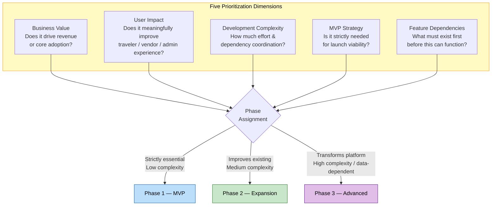

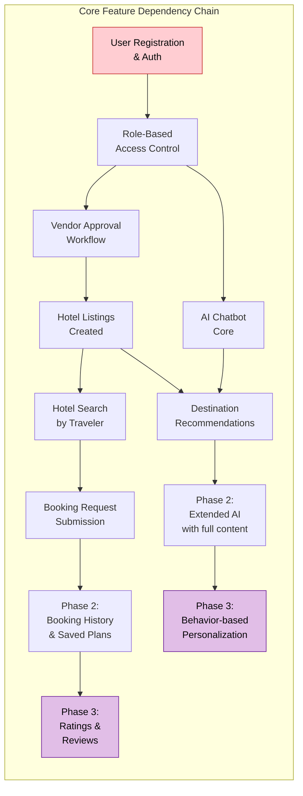

---

### 1.3 Summary of the Three Phases

| **Phase** | **Theme** | **Strategic Goal** |
|---|---|---|
| Phase 1 — MVP | Foundation and Core Launch | Build the minimum viable platform that delivers real value to travelers and vendors from day one |
| Phase 2 — Expansion | Enrichment and Growth | Expand platform capabilities to improve the traveler experience, increase vendor utility, and drive engagement |
| Phase 3 — Advanced | Intelligence and Differentiation | Introduce smart, data-driven, and advanced features that elevate the platform above competitors and create long-term loyalty |

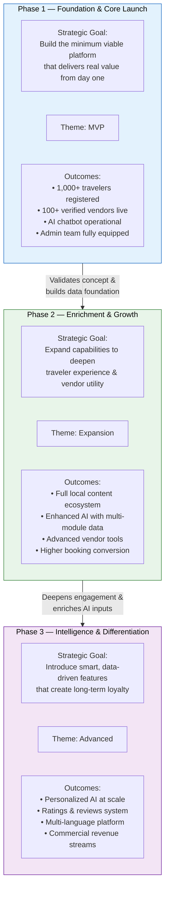

---

## 2. Phase 1 — Minimum Viable Product (MVP)

### 2.1 Objectives

The MVP phase focuses exclusively on the features required to make the platform operational and capable of delivering its core value proposition from launch. The objective is not to build everything — it is to build the right things in the right order so that real users can begin engaging with the platform as early as possible.

Phase 1 must achieve the following outcomes:

- Travelers can register, log in, and interact with an AI chatbot to receive basic travel suggestions.
- Vendors can register, gain admin approval, and list their hotel or accommodation offerings.
- Administrators can manage users, approve vendors, and maintain core content.
- The foundational content library — including destination information, tourist spots, and basic transport data — is in place and accessible to travelers.
- The platform is live, stable, and mobile-responsive.

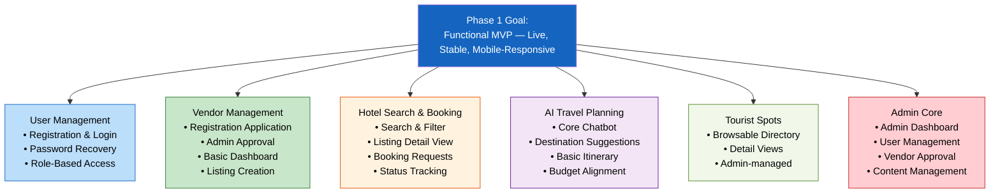

---

### 2.2 Included Features by Module

#### 2.2.1 User Management

The ability for users to create accounts, verify their identity, and access the platform according to their role is the most foundational requirement of the entire system. Without this, no other feature can function.

- **Traveler self-registration** — New travelers can register using their name, email address, and password. Email verification is required to activate the account.
- **Traveler login and logout** — Authenticated access to the platform using registered credentials.
- **Password recovery** — Travelers can reset their password via a secure email-based recovery flow.
- **Basic traveler profile** — Travelers can view and update their name, contact details, and basic travel preferences.
- **Role-based access control (Traveler / Vendor / Admin)** — The system enforces role-specific access across all platform areas from launch, ensuring that travelers, vendors, and administrators each see only the features and data relevant to their role.

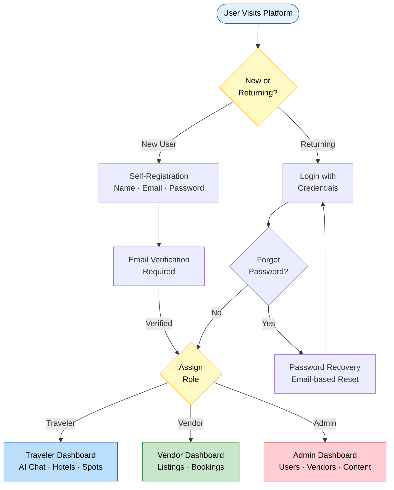

---

#### 2.2.2 Vendor Management

Local hotels and service providers must be able to register and begin listing their properties at launch. Without vendor content, the platform has no accommodations to show travelers.

- **Vendor registration application** — Service providers can submit a registration request including their business name, type, address, contact information, and supporting documentation.
- **Admin-controlled vendor approval** — Vendor accounts remain inactive until an administrator reviews and approves the application. Approved vendors receive a confirmation notification.
- **Vendor dashboard (basic)** — Approved vendors gain access to a simple dashboard where they can manage their listings and view booking requests.
- **Accommodation listing creation** — Vendors can create property listings that include the property name, location, room types, pricing, amenities, and a written description.
- **Listing activation and deactivation** — Vendors can mark listings as active (visible to travelers) or inactive (hidden from search results).

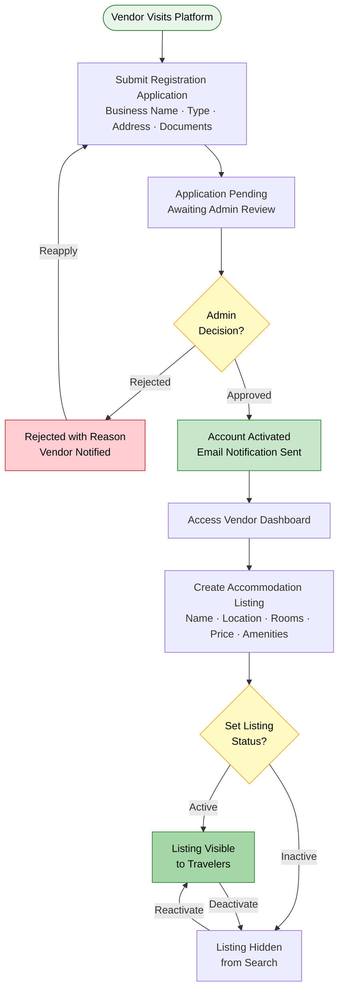

---

#### 2.2.3 Hotel Search and Basic Booking

Travelers must be able to discover accommodations and express interest in booking them. Full payment processing is not included in Phase 1 — the booking flow is a structured request that the vendor confirms manually.

- **Accommodation search** — Travelers can search for available properties by destination and price range.
- **Accommodation listing view** — Travelers can view the full details of a listing, including room types, pricing, amenities, and location.
- **Booking request submission** — Registered travelers can submit a booking request for a selected property. The request is sent to the vendor for review.
- **Booking request status tracking** — Travelers can view the status of their submitted booking requests (pending, confirmed, or declined) from their profile.
- **Vendor booking request management** — Vendors can view incoming booking requests and mark them as confirmed or declined within their dashboard.

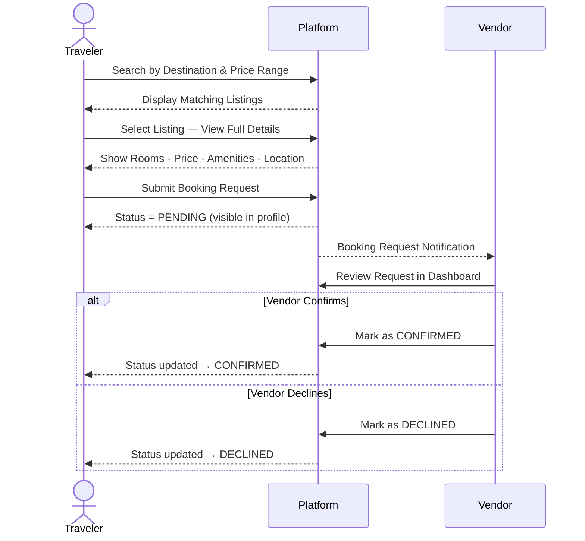

---

#### 2.2.4 Basic Travel Planning

The AI chatbot is the centerpiece of the platform's value proposition. At MVP, it must be functional enough to provide meaningful, personalized suggestions based on the inputs a traveler provides.

- **AI travel chatbot (core interaction)** — Registered travelers can interact with an AI-powered chatbot by providing their budget, travel destination or region, trip duration, and basic preferences. The chatbot returns destination suggestions and a basic travel outline.
- **Destination recommendations** — The chatbot suggests one or more destinations suited to the traveler's stated inputs, with brief descriptions of each.
- **Basic itinerary outline** — The chatbot provides a high-level day-by-day or activity-by-activity travel outline for the recommended destination.
- **Budget-aligned suggestions** — All AI-generated recommendations take the traveler's stated budget into account, providing realistic and achievable options.

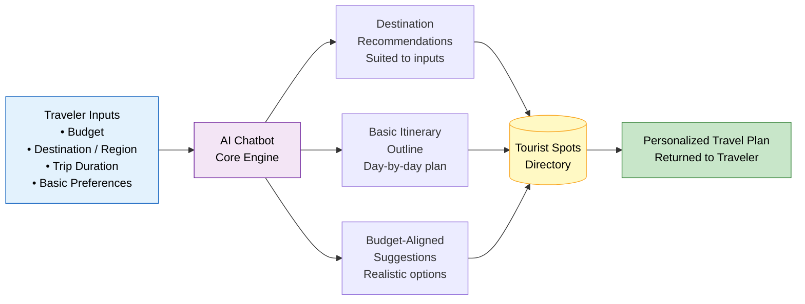

---

#### 2.2.5 Tourist Spot Information

A basic tourist spot directory gives travelers meaningful content to explore after selecting a destination, and makes the platform immediately useful even for travelers who are not yet ready to book.

- **Tourist spot directory** — A browsable list of verified tourist attractions organized by destination.
- **Tourist spot detail view** — Each attraction includes its name, location, a brief description, visiting hours, and entry fee information where applicable.
- **Admin-managed content** — All tourist spot entries are created and maintained by the Admin Team to ensure accuracy.

---

#### 2.2.6 Admin Management (Core)

The Admin Team must be fully equipped to operate the platform from day one. Core administrative functions are essential to the launch.

- **Admin dashboard** — A central interface for administrators to view platform activity, manage users, review vendor applications, and monitor key operational metrics.
- **User account management** — Administrators can view, search, activate, deactivate, and remove traveler and vendor accounts.
- **Vendor application review** — Administrators can view all pending vendor applications and approve or reject them with documented reasoning.
- **Tourist spot content management** — Administrators can create, edit, and remove tourist spot listings.
- **Basic platform activity overview** — The dashboard displays headline metrics such as total registered users, active vendors, total listings, and number of booking requests.

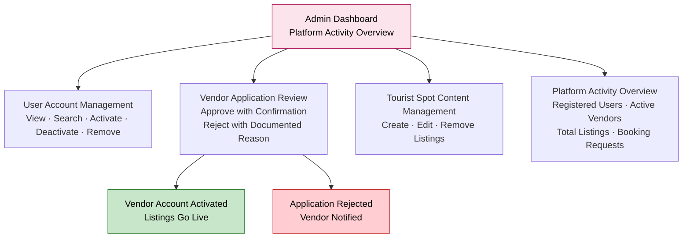

---

### 2.3 Key Business Value — Phase 1

- Establishes the platform as a functional, live product that travelers and vendors can begin using immediately.
- Validates the core concept — that travelers will engage with an AI chatbot for trip planning — before significant further investment is made.
- Generates an early base of vendor listings and traveler registrations that create momentum for Phase 2.
- Enables the business to begin gathering real user data and feedback that will inform subsequent development priorities.
- Delivers a credible, mobile-responsive web presence that positions the platform competitively in the travel technology space.

### 2.4 Expected Outcomes — Phase 1

Upon successful completion and launch of Phase 1, the following outcomes are expected:

- The platform is live and publicly accessible on the web.
- A minimum of 100 verified vendor accounts are active with property listings.
- A minimum of 1,000 travelers have registered and completed the onboarding flow.
- The AI chatbot is operational and capable of processing traveler inputs and returning relevant suggestions.
- The Admin Team has full operational control of the platform through the admin dashboard.
- A baseline tourist spot content library is in place covering the primary launch region.

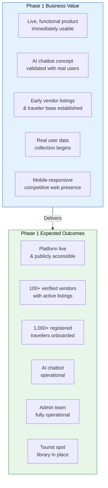

---

## 3. Phase 2 — Business Expansion

### 3.1 Objectives

Phase 2 builds on the established foundation of the MVP to significantly improve the breadth and depth of the platform's offering. Where Phase 1 focuses on getting the platform live and functional, Phase 2 focuses on making it genuinely compelling — both for travelers who want rich, contextual travel information and for vendors who want more powerful tools to manage and grow their business on the platform.

Phase 2 objectives include:

- Enriching the traveler experience with comprehensive local information including transport, food, cultural markets, and route planning.
- Giving vendors more sophisticated tools to manage their listings, pricing, and inventory.
- Enabling the AI chatbot to provide more detailed, contextually rich recommendations by drawing on the expanded content library.
- Improving the quality and completeness of the admin experience through enhanced content management capabilities.
- Driving higher traveler engagement, longer platform session times, and improved booking conversion rates.

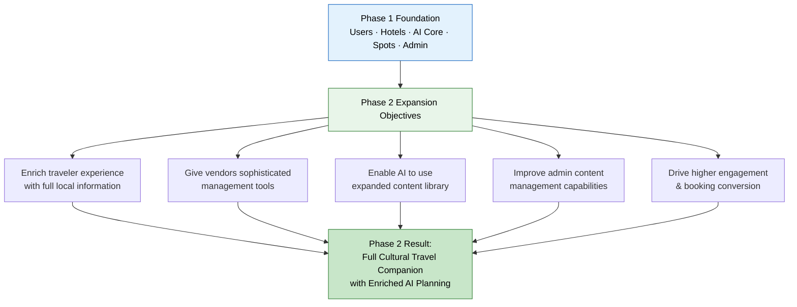

---

### 3.2 Included Features by Module

#### 3.2.1 Transport Information

Transport information is one of the most practical and frequently sought travel planning resources. Adding this module in Phase 2 significantly enhances the platform's utility as a complete trip planning destination.

- **Intercity transport directory** — Information about bus, train, and private vehicle options between major destinations in the target region, including estimated costs and travel durations.
- **Local in-city transport guide** — Details on local transport modes available at each destination (e.g., auto-rickshaw, taxi, bicycle rental), including typical fare ranges.
- **Transport cost estimator** — A feature allowing travelers to view estimated transport costs between two specified points as part of their overall trip budget.
- **Admin-managed transport content** — All transport information is created and maintained by the Admin Team.

---

#### 3.2.2 Traditional Food Information

Local cuisine is one of the most powerful motivators for cultural travel. A dedicated traditional food module positions the platform as a genuine cultural travel guide rather than a basic booking tool.

- **Traditional food directory by destination** — A curated list of traditional dishes, street food, and local dining experiences organized by destination.
- **Food detail view** — Each food entry includes the name of the dish, a description of its taste profile and cultural significance, approximate meal cost, and recommended locations to find it.
- **Food and destination pairing** — Travelers browsing a destination page can discover the traditional food associated with that location in context.
- **Admin-managed food content** — All food listings are created and verified by the Admin Team.

---

#### 3.2.3 Cultural Markets and Traditional Items

Cultural markets represent an authentic and economically impactful dimension of travel that is consistently underserved by mainstream booking platforms. Adding this module differentiates the platform meaningfully.

- **Cultural market directory** — A browsable listing of local markets, craft bazaars, and traditional item vendors organized by destination.
- **Market detail view** — Each market entry includes the market name, location, operating days and times, a description of available goods, and approximate price ranges for common items.
- **Traditional items guide** — Information about locally crafted or traditional goods that travelers can seek out as authentic souvenirs or cultural experiences.
- **Admin-managed market content** — All market listings are maintained by the Admin Team.

---

#### 3.2.4 Route Planning

Route planning adds a practical, actionable dimension to the travel planning process and ties together the destination, transport, and tourist spot modules into a unified journey planning experience.

- **Point-to-point route information** — Travelers can input an origin and destination and receive route information including recommended travel path, estimated distance, and travel duration.
- **Multi-mode route options** — Where more than one transport option exists between two points, the system presents alternatives and indicates the most practical or cost-effective choice.
- **Route and transport cost integration** — Route results are displayed alongside relevant transport cost estimates, giving travelers a combined view of journey logistics and budget impact.

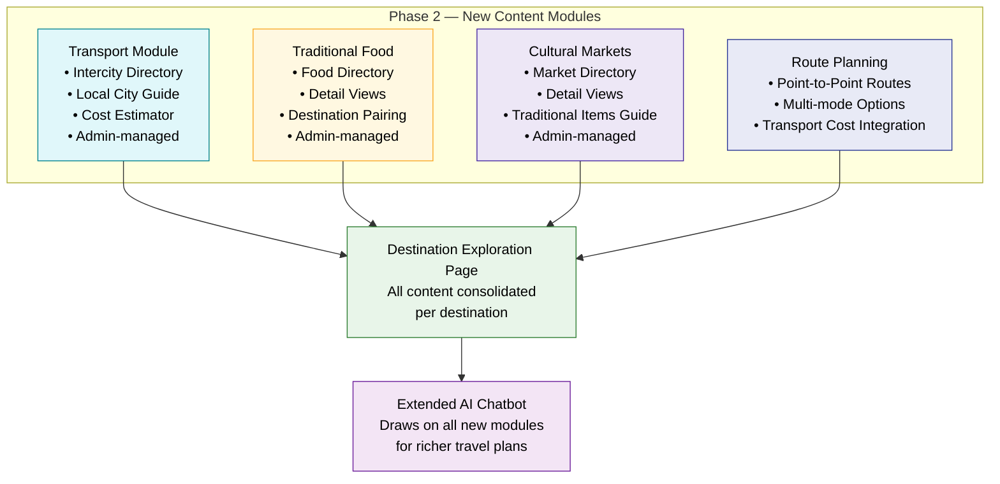

---

#### 3.2.5 Enhanced Vendor Management

Phase 2 gives vendors a richer toolkit for managing their presence on the platform, improving listing quality and reducing the administrative burden of keeping information current.

- **Room-level inventory management** — Vendors can manage availability and pricing at the individual room type level, rather than at the property level only.
- **Seasonal and promotional pricing** — Vendors can set date-specific pricing for peak seasons, holiday periods, or promotional offers.
- **Photo gallery management** — Vendors can upload, manage, and update multiple photographs for each property listing.
- **Vendor performance overview** — Vendors gain access to basic performance data within their dashboard, including the number of profile views and booking requests received.
- **Vendor profile update and resubmission** — Vendors can update their business details and resubmit for admin review when significant changes occur.

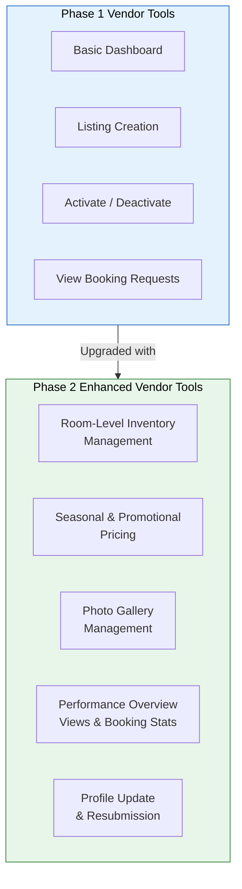

---

#### 3.2.6 Enhanced Traveler Features

Phase 2 enriches the traveler's interaction with the platform beyond the basic booking and chatbot experience.

- **Saved travel plans** — Travelers can save AI-generated travel plans within their profile for future reference.
- **Booking history** — Travelers can view a complete history of all booking requests, including their current status, from their profile dashboard.
- **Destination exploration pages** — Dedicated destination landing pages that consolidate tourist spots, transport options, food guides, cultural markets, and accommodation listings in a single, organized view for each destination.
- **Preference-based filtering** — Travelers can filter accommodation search results by additional attributes such as amenity type and distance from key attractions.

---

#### 3.2.7 Enhanced AI Chatbot Capabilities

With Phase 2's expanded content library now in place — covering transport, food, cultural markets, and route planning — the AI chatbot can be enhanced to draw on this richer data set and provide significantly more detailed and useful travel plans.

- **Extended AI travel planning** — The chatbot incorporates transport costs, local food options, cultural market recommendations, and route summaries into its travel plan output.
- **Multi-destination planning** — The chatbot supports travelers who wish to plan trips covering more than one destination within their budget and timeframe.
- **Refined preference input** — Travelers can provide additional preference inputs (e.g., preference for cultural experiences, nature, food, or markets) to further personalize chatbot recommendations.

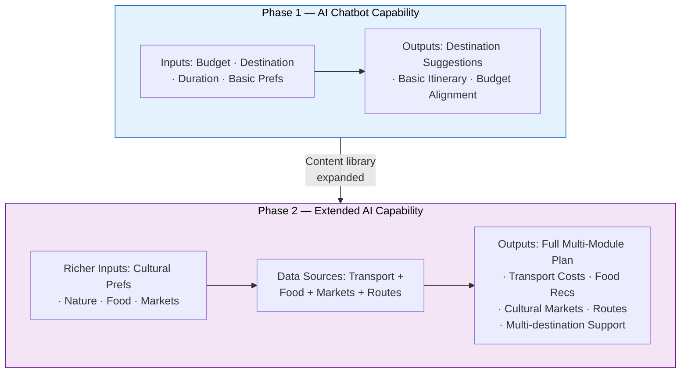

---

#### 3.2.8 Enhanced Admin Capabilities

Phase 2 expands the admin team's content management and oversight capabilities to match the expanded platform scope.

- **Transport content management** — Administrators can create, update, and remove all transport information listings.
- **Food content management** — Administrators can create, update, and remove all traditional food listings.
- **Cultural market content management** — Administrators can create, update, and remove all cultural market entries.
- **Enhanced reporting dashboard** — Administrators gain access to more detailed activity reports, including chatbot interaction volumes, booking request outcomes, and most-viewed destinations.
- **Content audit and review tools** — Administrators can schedule and record periodic content accuracy reviews across all content categories.

---

### 3.3 Business Benefits — Phase 2

- **Deeper traveler engagement:** A complete local information ecosystem — food, markets, transport, routes — transforms the platform from a booking tool into a full cultural travel companion, increasing session time and return visits.
- **Higher booking intent:** Travelers who can see the full picture of a destination — what to visit, what to eat, how to get around, and where to stay — are more likely to commit to a booking.
- **Vendor competitive advantage:** Enhanced inventory management and pricing tools give vendors greater control and enable them to optimize their revenue through the platform.
- **Broader content differentiation:** The cultural and local food modules create a category of content that large international travel platforms do not offer at the regional depth this platform will provide, establishing a clear point of differentiation.
- **AI credibility uplift:** A chatbot that can provide comprehensive, multi-dimensional travel plans including transport, food, and cultural recommendations is significantly more impressive and useful than a basic destination suggester, directly driving user trust and advocacy.

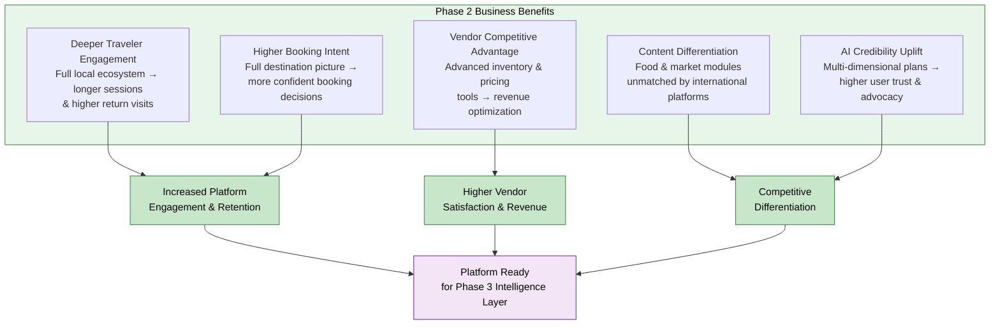

---

## 4. Phase 3 — Advanced and Smart Features

### 4.1 Objectives

Phase 3 introduces the intelligent, data-driven, and strategically advanced capabilities that will define the platform's long-term competitive position. These features are designed to be built once the platform has an established user base, a mature content library, and real-world engagement data to draw upon.

Phase 3 objectives include:

- Leveraging accumulated platform data to deliver personalized, learning-based travel recommendations.
- Introducing community-driven content through traveler ratings and reviews.
- Building toward multi-language support to expand the platform's accessible audience.
- Exploring loyalty mechanisms to drive long-term user retention.
- Enabling vendor growth through premium and subscription-based commercial models.
- Establishing the platform as an intelligent, future-ready travel companion rather than a static information resource.

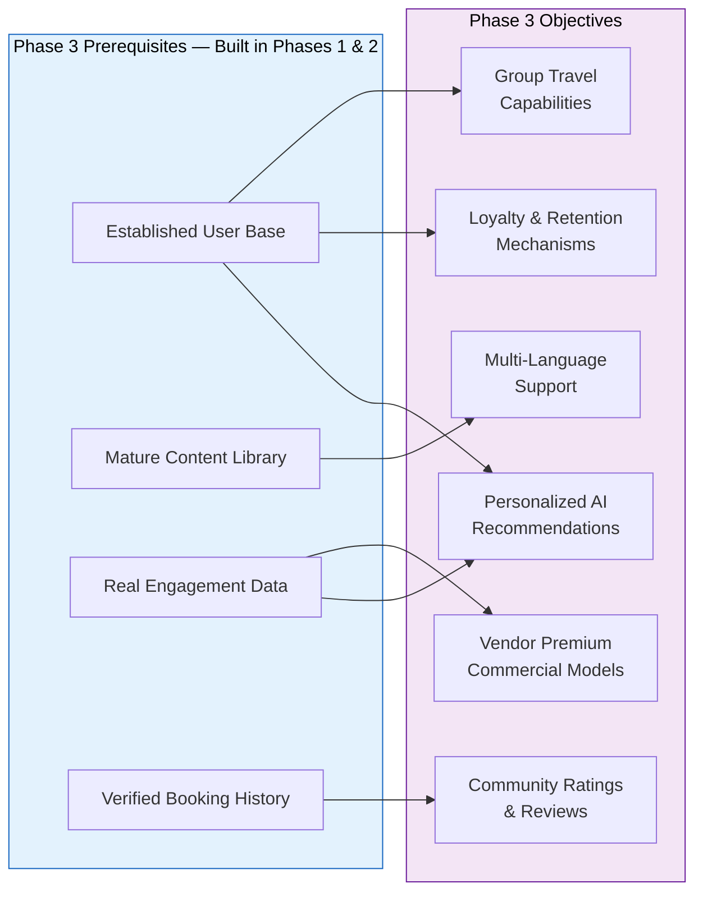

---

### 4.2 Included Features by Module

#### 4.2.1 Personalized AI Recommendations

- **Behavior-based recommendation engine** — The AI learns from each traveler's past interactions, booking history, and stated preferences to progressively refine and personalize the recommendations it offers in future planning sessions.
- **Personalized destination suggestions** — The platform proactively suggests destinations and experiences that align with a traveler's documented interest patterns, even before they initiate a chatbot session.
- **Budget learning** — The system tracks a traveler's historical budget inputs and booking behaviors to refine its understanding of their actual spending patterns, leading to more realistic and relevant financial recommendations over time.
- **Interest profile development** — Travelers accumulate an interest profile based on the types of destinations, food, markets, and activities they explore on the platform, which is used to tailor all future AI outputs.

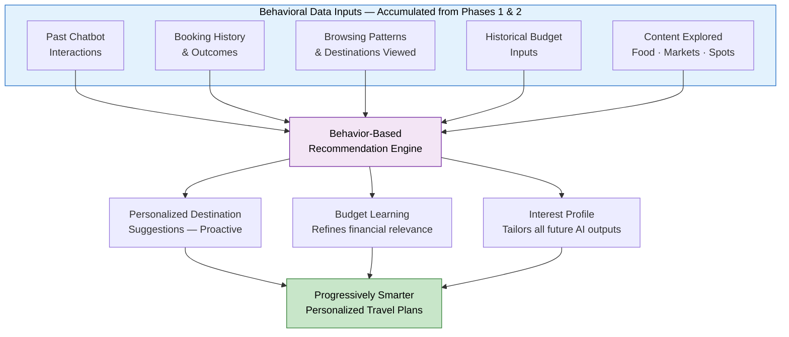

---

#### 4.2.2 Ratings and Reviews System

- **Traveler accommodation reviews** — Travelers who have completed a confirmed booking can submit a rating and written review for the property they stayed at.
- **Tourist spot ratings** — Travelers can rate tourist spots they have visited, providing community-sourced quality signals for future travelers.
- **Overall destination ratings** — Aggregate ratings for destinations based on traveler feedback across accommodations, attractions, food, and cultural experiences.
- **Vendor response to reviews** — Vendors can post a public, professional response to reviews submitted about their property.
- **Review moderation by admin** — Administrators can flag, edit, or remove reviews that violate platform community standards.

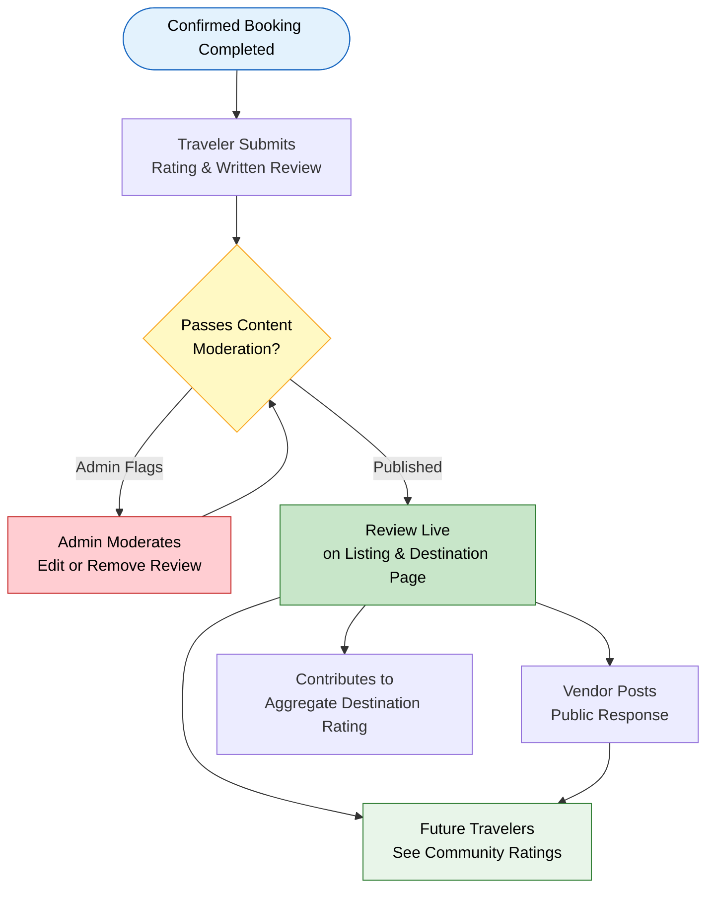

---

#### 4.2.3 Multi-Language Support

- **Platform interface localization** — The platform interface, including navigation, labels, and standard text, is made available in the primary regional language in addition to English.
- **Content translation** — Key content categories — including destination descriptions, food guides, and cultural market information — are made available in additional languages based on user demand data.
- **Language preference setting** — Registered travelers can set their preferred display language within their profile.

---

#### 4.2.4 Loyalty and Engagement Program

- **Traveler loyalty points** — Travelers earn points for platform engagement activities such as completing registrations, submitting booking requests, providing reviews, and returning to plan multiple trips.
- **Points redemption** — Accumulated loyalty points can be redeemed for platform benefits such as premium chatbot features or featured status in vendor-traveler interactions.
- **Engagement milestones** — The platform recognizes and rewards travelers who reach defined usage milestones, reinforcing habitual platform use.

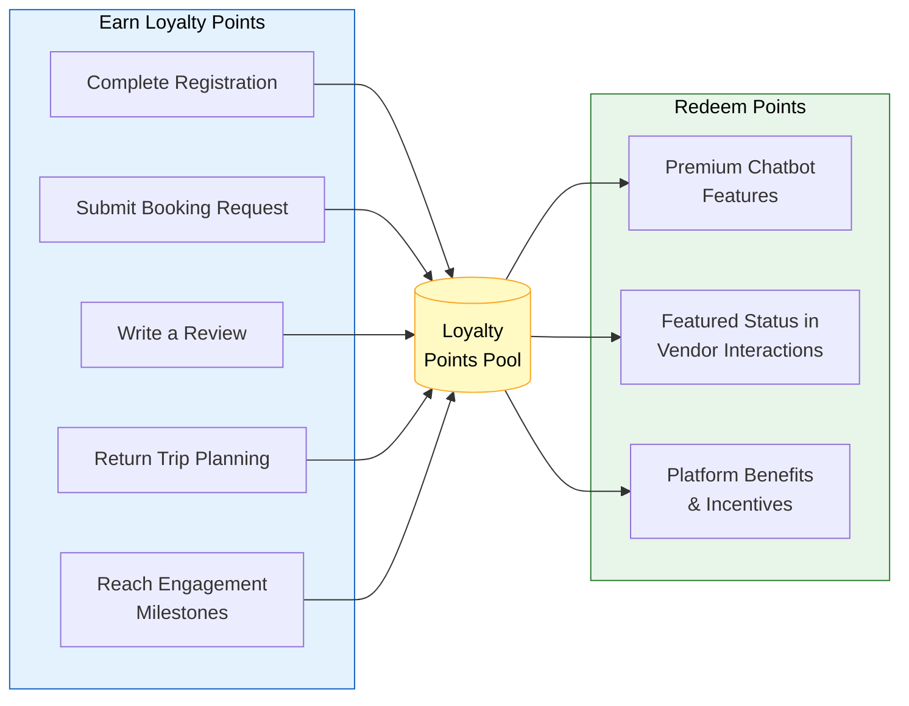

---

#### 4.2.5 Advanced Vendor Commercial Features

- **Tiered vendor subscription plans** — Vendors can opt into paid subscription tiers that offer enhanced visibility, priority placement in search results, advanced analytics, and dedicated support.
- **Featured listing placement** — Vendors on premium plans receive prominently featured placement on destination pages and in AI chatbot recommendations.
- **Advanced vendor analytics** — Vendors gain access to detailed performance dashboards showing listing view trends, booking request conversion rates, traveler demographic insights, and competitive benchmarking data.
- **Promotional campaign tools** — Vendors can create time-limited promotional offers within their dashboard, which are surfaced to relevant travelers through the platform's discovery features.

```mermaid
graph TD
    subgraph TIERS["Vendor Subscription Tiers"]
        FREE["Free Tier\nBasic Dashboard\nStandard Listing\nBasic Stats"]
        STANDARD["Standard Plan\nEnhanced Visibility\nAdvanced Analytics\nPerformance Dashboard"]
        PREMIUM["Premium Plan\nFeatured Listing Placement\nAI Chatbot Recommendations\nCompetitive Benchmarking\nDedicated Support\nPromotional Campaign Tools"]
    end

    FREE -->|Upgrade| STANDARD -->|Upgrade| PREMIUM

    PREMIUM --> REVENUE["Platform Revenue\nRecurring Subscription Income"]
    PREMIUM --> V_VALUE["Vendor Value\nHigher Bookings & Visibility"]

    style FREE fill:#E3F2FD,stroke:#1565C0,color:#000
    style STANDARD fill:#E8F5E9,stroke:#2E7D32,color:#000
    style PREMIUM fill:#FFF3E0,stroke:#E65100,color:#000
    style REVENUE fill:#FCE4EC,stroke:#AD1457,color:#000
```

---

#### 4.2.6 Smart Content and Discovery

- **Trending destinations** — The platform identifies and surfaces destinations experiencing high levels of traveler interest based on real-time engagement data, displayed prominently on the homepage and in the AI chatbot.
- **Curated collections** — Administrators can create themed content collections (e.g., "Best Cultural Markets," "Budget Weekend Trips," "Hidden Gems") that are surfaced to travelers based on their interest profiles.
- **AI-generated content summaries** — For high-traffic destinations, the platform uses its AI capability to generate and periodically refresh engaging destination summaries, reducing the manual content burden on the Admin Team.

---

#### 4.2.7 Group Travel Planning

- **Shared itinerary creation** — Travelers can create a group travel plan and invite other registered travelers to view and contribute to it collaboratively.
- **Group booking requests** — The system supports booking requests for groups, with the vendor receiving consolidated group size and date information.
- **Group budget planning** — The AI chatbot is extended to support group travel planning inputs, distributing total budget across multiple travelers and providing group-appropriate recommendations.

```mermaid
graph TD
    subgraph GROUP["Group Travel Planning Features"]
        G1["Shared Itinerary\nMultiple travelers collaborate\non one plan"]
        G2["Group Booking Requests\nConsolidated group size\n& dates sent to vendor"]
        G3["Group Budget Planning\nAI distributes total budget\nacross group members"]
    end

    LEAD_T([Lead Traveler]) --> G1
    G1 -->|Invite| COLLAB([Other Registered Travelers])
    COLLAB --> G1
    G1 --> G3 --> G2

    G2 --> VENDOR([Vendor Receives\nGroup Booking Request])

    style LEAD_T fill:#E3F2FD,stroke:#1565C0,color:#000
    style VENDOR fill:#E8F5E9,stroke:#2E7D32,color:#000
    style GROUP fill:#F3E5F5,stroke:#6A1B9A,color:#000
```

---

#### 4.2.8 Advanced Administrative Intelligence

- **Automated content accuracy alerts** — The system flags content items that have not been reviewed within a defined period or that show discrepancies with vendor-updated information, prompting the Admin Team to review.
- **Platform health dashboard** — An advanced admin dashboard that combines usage, engagement, booking, and content quality metrics into a unified view, enabling proactive operational management.
- **AI recommendation performance tracking** — Administrators can review aggregated data on which AI recommendations led to destination page views and booking requests, enabling ongoing AI improvement.

---

### 4.3 Business Benefits — Phase 3

- **Long-term user retention:** Personalization, loyalty programs, and ratings systems create reasons for travelers to return to the platform repeatedly rather than treating it as a one-time planning tool.
- **Community trust and credibility:** A mature, transparent review ecosystem builds trust among new travelers who rely on community validation when making travel decisions.
- **Revenue diversification:** Tiered vendor subscriptions, featured listings, and premium traveler features introduce sustainable revenue streams beyond basic platform operations.
- **Competitive differentiation:** Advanced AI personalization and group travel features place the platform well ahead of static travel information sites and meaningfully competitive with established regional travel platforms.
- **Audience expansion:** Multi-language support opens the platform to a significantly larger potential user base and positions it for regional or international growth.

```mermaid
graph TD
    subgraph BENEFITS3["Phase 3 Business Benefits"]
        B1["Long-term User Retention\nPersonalization + Loyalty Programs\n→ repeat platform visits"]
        B2["Community Trust\nMature ratings & reviews\n→ new traveler confidence"]
        B3["Revenue Diversification\nVendor subscriptions + premium features\n→ sustainable income streams"]
        B4["Competitive Differentiation\nAdvanced AI + group travel\n→ ahead of static competitors"]
        B5["Audience Expansion\nMulti-language support\n→ larger addressable market"]
    end

    B1 --> RETENTION["Higher Lifetime\nUser Value"]
    B2 --> TRUST["Platform Credibility\n& Brand Trust"]
    B3 --> REVENUE["Sustainable\nRevenue Model"]
    B4 & B5 --> MARKET["Market Leadership\n& Growth"]

    style BENEFITS3 fill:#F3E5F5,stroke:#6A1B9A,color:#000
    style RETENTION fill:#E1BEE7,stroke:#6A1B9A,color:#000
    style TRUST fill:#E1BEE7,stroke:#6A1B9A,color:#000
    style REVENUE fill:#E1BEE7,stroke:#6A1B9A,color:#000
    style MARKET fill:#E1BEE7,stroke:#6A1B9A,color:#000
```

---

## 5. Feature Priority Table

The following table consolidates all features across all three phases, indicating the assigned phase, business priority level, and the primary rationale for that assignment.

```mermaid
pie title Feature Distribution by Phase
    "Phase 1 — MVP (High Priority)" : 22
    "Phase 2 — Expansion (High + Medium)" : 25
    "Phase 3 — Advanced (High + Medium + Low)" : 22
```

```mermaid
graph LR
    subgraph P1F["Phase 1 — MVP Features (22 total, all HIGH priority)"]
        P1_UM["User Management\n5 features"]
        P1_VM["Vendor Management\n5 features"]
        P1_HB["Hotel Search & Booking\n5 features"]
        P1_AI["AI Travel Planning\n4 features"]
        P1_TS["Tourist Spots\n3 features"]
    end

    subgraph P2F["Phase 2 — Expansion Features (25 total)"]
        P2_TR["Transport\n4 features"]
        P2_FD["Traditional Food\n4 features"]
        P2_MK["Cultural Markets\n4 features"]
        P2_RT["Route Planning\n3 features"]
        P2_VE["Enhanced Vendor\n5 features"]
        P2_TE["Enhanced Traveler\n4 features"]
        P2_AE["Extended AI\n3 features"]
        P2_ADA["Enhanced Admin\n5 features"]
    end

    subgraph P3F["Phase 3 — Advanced Features (22 total)"]
        P3_AI["Personalized AI\n4 features"]
        P3_RR["Ratings & Reviews\n5 features"]
        P3_ML["Multi-Language\n3 features"]
        P3_LY["Loyalty Program\n3 features"]
        P3_VS["Vendor Subscriptions\n4 features"]
        P3_SC["Smart Content\n3 features"]
        P3_GT["Group Travel\n3 features"]
        P3_AD["Admin Intelligence\n3 features"]
    end

    style P1F fill:#E3F2FD,stroke:#1565C0,color:#000
    style P2F fill:#E8F5E9,stroke:#2E7D32,color:#000
    style P3F fill:#F3E5F5,stroke:#6A1B9A,color:#000
```

| **Feature** | **Phase** | **Priority** | **Rationale** |
|---|---|---|---|
| Traveler registration and login | 1 — MVP | High | Core access requirement; no other feature functions without it |
| Role-based access control | 1 — MVP | High | Essential security and functional separation from day one |
| Password recovery | 1 — MVP | High | Basic usability requirement for all registered users |
| Traveler profile (basic) | 1 — MVP | High | Required for personalization and booking association |
| Vendor registration and approval | 1 — MVP | High | No listings exist without vendor onboarding; business-critical |
| Vendor dashboard (basic) | 1 — MVP | High | Vendors need a functional interface to manage listings |
| Accommodation listing creation | 1 — MVP | High | Core content supply for the platform |
| Listing activation / deactivation | 1 — MVP | High | Required for content quality control |
| Hotel search by traveler | 1 — MVP | High | Core traveler journey step; links AI output to bookable content |
| Booking request submission | 1 — MVP | High | Enables the primary commercial interaction on the platform |
| Booking request status tracking | 1 — MVP | High | Essential for traveler transparency and trust |
| Vendor booking request management | 1 — MVP | High | Vendors must be able to respond to booking requests |
| AI chatbot — core travel planning | 1 — MVP | High | Flagship product feature; defines platform identity |
| Destination recommendations (AI) | 1 — MVP | High | Core output of the AI chatbot at MVP |
| Basic itinerary outline (AI) | 1 — MVP | High | Delivers the foundational value of AI-powered planning |
| Budget-aligned AI suggestions | 1 — MVP | High | Differentiates platform from generic travel sites |
| Tourist spot directory | 1 — MVP | High | Essential content for traveler exploration post-destination selection |
| Tourist spot detail view | 1 — MVP | High | Provides entry fee and visiting information travelers require |
| Admin dashboard (core) | 1 — MVP | High | Admin must be able to operate the platform from launch |
| User account management (admin) | 1 — MVP | High | Required for platform integrity and policy enforcement |
| Vendor approval workflow (admin) | 1 — MVP | High | Gatekeeping quality; no vendor goes live without admin approval |
| Tourist spot content management (admin) | 1 — MVP | High | Admins need to build and maintain the content library |
| Transport information directory | 2 — Expansion | High | High-value practical content; dependent on launch baseline |
| Local in-city transport guide | 2 — Expansion | High | Directly addresses traveler trip logistics needs |
| Transport cost estimator | 2 — Expansion | Medium | Useful enhancement to transport module; supports budget planning |
| Traditional food directory | 2 — Expansion | High | Strong differentiator; high traveler interest in authentic experiences |
| Food detail view | 2 — Expansion | High | Supports the cultural travel positioning of the platform |
| Cultural market directory | 2 — Expansion | High | Unique content category; strong local economy alignment |
| Market detail view | 2 — Expansion | Medium | Enhances market discovery; dependent on directory existing |
| Traditional items guide | 2 — Expansion | Medium | Supplements market listings with product context |
| Route planning (point-to-point) | 2 — Expansion | High | Practical and highly valued by travelers; links multiple modules |
| Multi-mode route options | 2 — Expansion | Medium | Enhances route planning usefulness; builds on base route feature |
| Route and transport cost integration | 2 — Expansion | Medium | Combines data for richer planning context |
| Room-level inventory management | 2 — Expansion | High | Significantly improves vendor listing quality and accuracy |
| Seasonal and promotional pricing | 2 — Expansion | Medium | Commercial tool for vendors; supports revenue optimization |
| Photo gallery management | 2 — Expansion | Medium | Improves listing quality and traveler conversion |
| Vendor performance overview (basic) | 2 — Expansion | Medium | Gives vendors insight; encourages continued engagement |
| Saved travel plans | 2 — Expansion | Medium | Improves traveler experience; supports return visits |
| Booking history view | 2 — Expansion | High | Essential for traveler account management transparency |
| Destination exploration pages | 2 — Expansion | High | Consolidates all content per destination; drives engagement |
| Preference-based filtering (hotel) | 2 — Expansion | Medium | Improves search relevance and user satisfaction |
| Extended AI chatbot — multi-module | 2 — Expansion | High | Unlocks full AI value with expanded content library |
| Multi-destination AI planning | 2 — Expansion | Medium | Addresses significant portion of traveler planning needs |
| Refined preference input (AI) | 2 — Expansion | Medium | Improves personalization accuracy |
| Transport content management (admin) | 2 — Expansion | High | Required for transport module operation |
| Food content management (admin) | 2 — Expansion | High | Required for food module operation |
| Market content management (admin) | 2 — Expansion | High | Required for market module operation |
| Enhanced admin reporting dashboard | 2 — Expansion | Medium | Supports operational decision-making |
| Content audit and review tools (admin) | 2 — Expansion | Medium | Systematic quality assurance for platform content |
| Behavior-based AI recommendations | 3 — Advanced | High | Requires accumulated user data; transforms long-term value |
| Personalized destination suggestions | 3 — Advanced | High | Drives repeat engagement; requires behavioral data foundation |
| Budget and interest profile learning | 3 — Advanced | Medium | Refines AI over time; dependent on interaction history |
| Traveler accommodation reviews | 3 — Advanced | High | Community trust feature; requires established booking history |
| Tourist spot ratings | 3 — Advanced | Medium | Enhances destination content; builds community |
| Vendor review responses | 3 — Advanced | Medium | Vendor engagement tool; supports reputation management |
| Review moderation (admin) | 3 — Advanced | Medium | Governance layer for community content |
| Multi-language platform support | 3 — Advanced | High | Major audience expansion; significant build effort |
| Content translation | 3 — Advanced | Medium | Supplements language support; phased by language priority |
| Loyalty points program | 3 — Advanced | Medium | Retention mechanism; requires user base to be meaningful |
| Points redemption system | 3 — Advanced | Low | Engagement incentive; complex to configure; lower early priority |
| Tiered vendor subscription plans | 3 — Advanced | High | Primary commercial revenue stream; requires proven platform value |
| Featured listing placement | 3 — Advanced | High | Vendor commercial tool; linked to subscription tiers |
| Advanced vendor analytics | 3 — Advanced | Medium | Value-add for premium vendors; data-dependent |
| Promotional campaign tools (vendor) | 3 — Advanced | Medium | Drives vendor engagement and platform traffic |
| Trending destinations feature | 3 — Advanced | Medium | Requires meaningful engagement data to be accurate |
| Curated content collections | 3 — Advanced | Medium | Editorial differentiation; admin-driven |
| AI-generated content summaries | 3 — Advanced | Low | Reduces admin workload at scale; future efficiency feature |
| Shared group itinerary creation | 3 — Advanced | Medium | Addresses group travel market segment |
| Group booking requests | 3 — Advanced | Medium | Commercial extension for group travel |
| Group budget planning (AI) | 3 — Advanced | Low | Complex AI extension; lower priority than individual planning |
| Automated content accuracy alerts | 3 — Advanced | Medium | Smart operations; dependent on admin workflow maturity |
| Platform health dashboard (advanced) | 3 — Advanced | Medium | Strategic oversight tool for platform owner |
| AI recommendation performance tracking | 3 — Advanced | Low | Continuous improvement tool; valuable at scale |

```mermaid
graph TD
    subgraph PRIORITY_BREAKDOWN["Priority Breakdown Across All Phases"]
        subgraph HIGH["High Priority Features"]
            H1["Phase 1: 22 features\nAll HIGH priority"]
            H2["Phase 2: 12 HIGH priority\n(Transport, Food, Markets,\nRoutes, Booking History,\nDestination Pages, Extended AI,\nAdmin Content Mgmt)"]
            H3["Phase 3: 6 HIGH priority\n(Personalized AI, Reviews,\nMulti-language, Vendor Subscriptions,\nFeatured Listings)"]
        end
        subgraph MED["Medium Priority Features"]
            M1["Phase 2: 13 MEDIUM priority\n(Cost estimator, pricing,\nphoto gallery, filtering, etc.)"]
            M2["Phase 3: 13 MEDIUM priority\n(Loyalty, analytics, trending,\ngroup travel, etc.)"]
        end
        subgraph LOW["Low Priority Features"]
            L1["Phase 3: 3 LOW priority\n(Points redemption, AI summaries,\nAI performance tracking)"]
        end
    end

    style HIGH fill:#FFCDD2,stroke:#C62828,color:#000
    style MED fill:#FFF9C4,stroke:#F9A825,color:#000
    style LOW fill:#E8F5E9,stroke:#2E7D32,color:#000
```

---

## 6. Development Timeline Suggestion

The following timeline provides a practical reference for planning the delivery of each phase. These estimates are based on the scope and complexity of each phase and assume a dedicated, appropriately sized product and delivery team working with focused priorities.

### Phase 1 — MVP: Estimated 3 to 4 Months

| **Month** | **Focus Area** |
|---|---|
| Month 1 | Platform foundation: User management, role-based access, vendor registration and approval workflow, and admin dashboard core |
| Month 2 | Core content and search: Tourist spot directory, accommodation listing, and hotel search functionality |
| Month 3 | AI chatbot integration, booking request flow, and basic travel planning capabilities |
| Month 4 (Buffer) | Quality assurance, content population, user acceptance testing, and launch preparation |

**Milestone:** Platform live with core traveler, vendor, and admin journeys functional.

---

### Phase 2 — Expansion: Estimated 2 to 3 Months

| **Month** | **Focus Area** |
|---|---|
| Month 1 | Transport module, traditional food module, and cultural markets module — content structure and admin tools |
| Month 2 | Route planning feature, enhanced vendor dashboard tools, destination exploration pages, and traveler saved plans |
| Month 3 | Extended AI chatbot capabilities, enhanced filtering, booking history, and enhanced admin reporting |

**Milestone:** Platform offers a full local information ecosystem; AI chatbot delivers comprehensive, multi-dimensional travel plans.

---

### Phase 3 — Advanced Features: Estimated 3 to 6 Months (or as strategic priorities dictate)

| **Period** | **Focus Area** |
|---|---|
| Initial (Month 1–2) | Ratings and reviews system, vendor subscription model foundations, and advanced vendor analytics |
| Mid (Month 3–4) | Behavior-based AI personalization engine, loyalty program, and trending destination features |
| Later (Month 5–6) | Multi-language support, group travel planning, curated content collections, and advanced admin intelligence tools |

**Milestone:** Platform operates as an intelligent, personalized, and commercially diversified travel ecosystem.

---

### Summary Timeline View

| **Phase** | **Estimated Duration** | **Key Milestone** |
|---|---|---|
| Phase 1 — MVP | 3–4 months | Platform live; core traveler, vendor, and admin journeys complete |
| Phase 2 — Expansion | 2–3 months | Full content ecosystem active; enriched AI planning available |
| Phase 3 — Advanced | 3–6 months | Personalized, commercially mature, multi-language smart platform |
| **Total Estimated Delivery** | **8–13 months** | **Fully featured platform as originally envisioned** |

```mermaid
gantt
    title AI Travel Management System — Full Delivery Gantt
    dateFormat  YYYY-MM
    axisFormat  Month %m

    section Phase 1 — MVP
    User Management & RBAC             :p1a, 2026-01, 1M
    Vendor Registration & Admin Core   :p1b, 2026-01, 1M
    Tourist Spots & Hotel Search       :p1c, 2026-02, 1M
    AI Chatbot Core & Booking Flow     :p1d, 2026-03, 1M
    QA · Content Population · UAT      :p1e, 2026-04, 1M
    MILESTONE Phase 1 LIVE             :milestone, m1, 2026-04, 0d

    section Phase 2 — Expansion
    Transport · Food · Market Modules  :p2a, 2026-05, 1M
    Route Planning · Enhanced Vendor   :p2b, 2026-06, 1M
    Extended AI · Admin Reporting      :p2c, 2026-07, 1M
    MILESTONE Phase 2 LIVE             :milestone, m2, 2026-07, 0d

    section Phase 3 — Advanced
    Ratings & Reviews · Vendor Subs    :p3a, 2026-08, 2M
    AI Personalization · Loyalty       :p3b, 2026-10, 2M
    Multi-language · Group Travel      :p3c, 2026-12, 2M
    MILESTONE Phase 3 LIVE             :milestone, m3, 2027-01, 0d
```

```mermaid
graph LR
    subgraph M1["Month 1"]
        M1A[User Management\nRBAC Setup]
        M1B[Vendor Registration\nAdmin Core]
    end

    subgraph M2["Month 2"]
        M2A[Tourist Spot\nDirectory]
        M2B[Hotel Listing\n& Search]
    end

    subgraph M3["Month 3"]
        M3A[AI Chatbot\nCore]
        M3B[Booking\nRequest Flow]
    end

    subgraph M4["Month 4"]
        M4A[QA & Content\nPopulation]
        M4B[UAT & Launch\nPreparation]
    end

    subgraph P1LIVE["MILESTONE\nPhase 1 Live"]
        LAUNCH["Platform Live\n100+ Vendors\n1,000+ Travelers"]
    end

    subgraph M5["Month 5"]
        M5A[Transport\nModule]
        M5B[Food &\nMarket Modules]
    end

    subgraph M6["Month 6"]
        M6A[Route Planning\nEnhanced Vendor]
        M6B[Destination\nExploration Pages]
    end

    subgraph M7["Month 7"]
        M7A[Extended AI\nChatbot]
        M7B[Enhanced Admin\nReporting]
    end

    subgraph P2LIVE["MILESTONE\nPhase 2 Live"]
        P2L["Full Content\nEcosystem Active"]
    end

    subgraph M8_9["Months 8–9"]
        M8A[Ratings &\nReviews]
        M8B[Vendor\nSubscriptions]
    end

    subgraph M10_11["Months 10–11"]
        M10A[AI\nPersonalization]
        M10B[Loyalty\nProgram]
    end

    subgraph M12_13["Months 12–13"]
        M12A[Multi-Language\nSupport]
        M12B[Group Travel\nPlanning]
    end

    subgraph P3LIVE["MILESTONE\nPhase 3 Live"]
        P3L["Intelligent\nCommercial Platform"]
    end

    M1 --> M2 --> M3 --> M4 --> P1LIVE
    P1LIVE --> M5 --> M6 --> M7 --> P2LIVE
    P2LIVE --> M8_9 --> M10_11 --> M12_13 --> P3LIVE

    style P1LIVE fill:#BBDEFB,stroke:#1565C0,color:#000
    style P2LIVE fill:#C8E6C9,stroke:#2E7D32,color:#000
    style P3LIVE fill:#E1BEE7,stroke:#6A1B9A,color:#000
```

---

## 7. Business Value Summary

### 7.1 How Phased Delivery Reduces Risk

One of the most significant risks in any large-scale platform development effort is investing significant time and resources in building a comprehensive system before receiving any real-world validation that users will engage with it. A phased delivery model fundamentally restructures this risk profile in several important ways.

By launching Phase 1 — the MVP — the business receives early, concrete feedback from real travelers, vendors, and administrators. If traveler behavior reveals that certain features are more or less valued than anticipated, the product roadmap for Phase 2 and Phase 3 can be adjusted accordingly without having wasted development resources on the wrong priorities. The phased approach converts what would otherwise be a high-stakes, single-point-of-failure launch into a series of progressively validated steps, each of which builds on proven learnings from the previous phase.

Additionally, phased delivery reduces the operational risk of launching with a platform that is too complex to manage effectively. A smaller, well-focused Phase 1 platform is significantly easier for the Admin Team to operate, moderate, and maintain to high quality standards than a full-featured platform launched all at once.

```mermaid
graph TD
    subgraph RISK_COMPARE["Risk Profile Comparison"]
        BIG_BANG["Single Big-Bang Launch\n• All 69 features at once\n• 8–13 months before any revenue\n• No real user validation\n• High operational complexity\n• Single failure point"]
        PHASED["Phased Delivery\n• Phase 1: 22 features live in 4 months\n• Real user feedback informs Phase 2\n• Each phase validated before next\n• Manageable admin complexity\n• Failure is contained and recoverable"]
    end

    BIG_BANG -->|Risk Level| HIGH_RISK["HIGH RISK\nHigh investment, zero validation"]
    PHASED -->|Risk Level| LOW_RISK["LOWER RISK\nProgressive validation at each step"]

    HIGH_RISK --> CONSEQUENCE["Potential: Major loss if\nmarket doesn't respond as expected"]
    LOW_RISK --> BENEFIT["Benefit: Pivot or adjust\nbefore significant investment is lost"]

    style BIG_BANG fill:#FFCDD2,stroke:#C62828,color:#000
    style PHASED fill:#C8E6C9,stroke:#2E7D32,color:#000
    style HIGH_RISK fill:#FFEBEE,stroke:#C62828,color:#000
    style LOW_RISK fill:#E8F5E9,stroke:#2E7D32,color:#000
```

---

### 7.2 How Phased Delivery Enables Early Launch

Speed to market is a critical competitive consideration in the travel technology sector. A phased strategy allows the platform to reach real users — and begin building a user base, generating brand awareness, and establishing vendor relationships — months earlier than a full-feature launch would permit.

The sooner travelers begin using the platform, the sooner the business accumulates the real-world engagement data, user preferences, and behavioral patterns that are essential inputs for Phase 3's intelligent, personalized features. Put simply, Phase 1 creates the conditions that make Phase 3 possible and effective.

An early launch also enables the business to begin building vendor trust and loyalty. Vendors who join the platform in Phase 1 and experience the platform growing and improving around them are far more likely to remain engaged, invest in premium features, and advocate for the platform within their networks.

```mermaid
graph LR
    P1_LAUNCH["Phase 1 Launch\nMonth 4\n22 features live"]

    P1_LAUNCH --> DATA["Real User Data\n& Behavioral Patterns\nAccumulated"]
    P1_LAUNCH --> BRAND["Brand Awareness\n& User Base\nBuilding"]
    P1_LAUNCH --> VENDOR_TRUST["Vendor Trust\n& Loyalty\nEstablished"]

    DATA --> P3_ENABLED["Phase 3 Personalization\nNow Possible & Effective"]
    VENDOR_TRUST --> P3_REVENUE["Phase 3 Vendor Subscriptions\nAccepted by Loyal Vendors"]
    BRAND --> GROWTH["Compounding\nGrowth Advantage"]

    style P1_LAUNCH fill:#BBDEFB,stroke:#1565C0,color:#000
    style P3_ENABLED fill:#E1BEE7,stroke:#6A1B9A,color:#000
    style P3_REVENUE fill:#E1BEE7,stroke:#6A1B9A,color:#000
    style GROWTH fill:#C8E6C9,stroke:#2E7D32,color:#000
```

---

### 7.3 How Phased Delivery Supports Gradual, Sustainable Growth

A phased roadmap is not simply a development convenience — it is a business growth strategy. Each phase of the AI Powered Traveling Management System is designed to deliver a complete, coherent user experience that stands on its own merits, while also creating the conditions for the next phase to succeed.

Phase 1 establishes the user base and validates the core value proposition. Phase 2 deepens engagement, increases the platform's unique content value, and improves commercial outcomes for vendors. Phase 3 leverages the accumulated data, relationships, and trust built across Phases 1 and 2 to deliver intelligent, personalized, and commercially sustainable advanced features.

This progression ensures that each investment in the platform is grounded in evidence from real usage, that the business never over-builds ahead of actual user demand, and that the platform grows in a direction that is genuinely aligned with what its users value most. The result is a more resilient, more adaptable, and ultimately more successful travel platform than any single-phase, all-at-once delivery strategy could produce.

```mermaid
graph TD
    subgraph GROWTH_MODEL["Phased Growth Model — Each Phase Enables the Next"]
        P1_BOX["Phase 1 — Foundation\n• Validates core AI travel planning concept\n• Builds traveler & vendor user base\n• Generates engagement data\n• Achieves early revenue signals"]

        P2_BOX["Phase 2 — Deepening\n• Expands content ecosystem\n• Increases session time & return visits\n• Improves booking conversion\n• Strengthens vendor commercial relationship"]

        P3_BOX["Phase 3 — Transformation\n• Leverages all accumulated data\n• Delivers personalized, intelligent platform\n• Introduces commercial revenue streams\n• Establishes long-term market position"]
    end

    P1_BOX -->|Evidence-based\nprioritization| P2_BOX
    P2_BOX -->|Richer data &\ndeeper engagement| P3_BOX
    P3_BOX --> FINAL["Resilient · Adaptable\nSuccessful Travel Platform\nAligned with Real User Value"]

    style P1_BOX fill:#E3F2FD,stroke:#1565C0,color:#000
    style P2_BOX fill:#E8F5E9,stroke:#2E7D32,color:#000
    style P3_BOX fill:#F3E5F5,stroke:#6A1B9A,color:#000
    style FINAL fill:#1565C0,color:#fff
```

```mermaid
xychart-beta
    title "Platform Capability Growth Across Phases"
    x-axis ["Phase 1 Launch", "Phase 2 Launch", "Phase 3 Launch"]
    y-axis "Cumulative Features Delivered" 0 --> 70
    line [22, 47, 69]
    bar [22, 25, 22]
```

---

*This document is prepared for business planning, academic reference, and product roadmap purposes. All phase assignments, timelines, and priorities are subject to review by designated business stakeholders prior to implementation commencement.*

---

**End of Document**